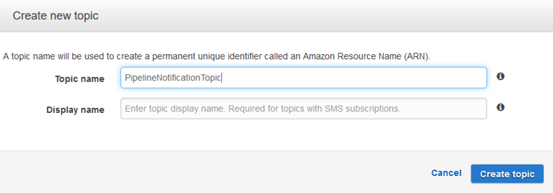

# Tutorial: Set up a CloudWatch Events rule to

receive email notifications for pipeline state changes

After you set up a pipeline in AWS CodePipeline, you can set up a CloudWatch Events rule to send notifications
whenever there are changes to the execution state of your pipelines, or in the stages or actions
in your pipelines. For more information on using CloudWatch Events to set up notifications for pipeline
state changes, see [Monitoring CodePipeline events](detect-state-changes-cloudwatch-events.md "detect-state-changes-cloudwatch-events.md").

In this tutorial, you configure a notification to send an email when a pipeline's state
changes to FAILED. This tutorial uses an input transformer method when creating the CloudWatch Events rule.
It transforms the message schema details to deliver the message in human-readable text.

###### Note

As you create the resources for this tutorial, such as the Amazon SNS notification and the
CloudWatch Events rule, make sure the resources are created in the same AWS Region as your
pipeline.

###### Topics

- [Step 1: Set up an email notification using
  Amazon SNS](#create-filter-for-target "#create-filter-for-target")
- [Step 2: Create a rule and add the SNS topic as the
  target](#create-notification-rule "#create-notification-rule")
- [Step 3: Clean up resources](#notifications-clean-up-resources "#notifications-clean-up-resources")

## Step 1: Set up an email notification using

Amazon SNS

Amazon SNS coordinates use of topics to deliver messages to subscribing endpoints or clients.
Use Amazon SNS to create a notification topic and then subscribe to the topic using your email
address. The Amazon SNS topic will be added as a target to your CloudWatch Events rule. For more information,
see the [Amazon Simple Notification Service Developer Guide](../../../sns/latest/dg.md "../../../sns/latest/dg.md") .

Create or identify a topic in Amazon SNS. CodePipeline will use CloudWatch Events to send notifications to this
topic through Amazon SNS. To create a topic:

1. Open the Amazon SNS console at [https://console.aws.amazon.com/sns](https://console.aws.amazon.com/sns "https://console.aws.amazon.com/sns").
2. Choose **Create topic**.
3. In the **Create new topic** dialog box, for **Topic
   name**, type a name for the topic (for example,
   `PipelineNotificationTopic`).

 4. Choose **Create topic**.

For more information, see [Create a
Topic](../../../sns/latest/dg/CreateTopic.md "../../../sns/latest/dg/CreateTopic.md") in the _Amazon SNS Developer Guide_.

Subscribe one or more recipients to the topic to receive email notifications. To
subscribe a recipient to a topic:

1. In the Amazon SNS console, from the **Topics** list, select the check box
   next to your new topic. Choose **Actions, Subscribe to topic**.
2. In the **Create subscription** dialog box, verify that an ARN appears
   in **Topic ARN**.
3. For **Protocol**, choose **Email**.
4. For **Endpoint**, type the recipient's full email address.
5. Choose **Create Subscription**.
6. Amazon SNS sends a subscription confirmation email to the recipient. To receive email
   notifications, the recipient must choose the **Confirm subscription**
   link in this email. After the recipient clicks the link, if successfully subscribed, Amazon SNS
   displays a confirmation message in the recipient's web browser.

For more information, see [Subscribe to a
Topic](../../../sns/latest/dg/SubscribeTopic.md "../../../sns/latest/dg/SubscribeTopic.md") in the _Amazon SNS Developer Guide_.

## Step 2: Create a rule and add the SNS topic as the

target

Create a CloudWatch Events notification rule with CodePipeline as the event source.

1. Open the CloudWatch console at
   [https://console.aws.amazon.com/cloudwatch/](https://console.aws.amazon.com/cloudwatch/ "https://console.aws.amazon.com/cloudwatch/").
2. In the navigation pane, choose **Events**.
3. Choose **Create rule**. Under **Event source**,
   choose **AWS CodePipeline**. For **Event Type**, choose
   **Pipeline Execution State Change**.
4. Choose **Specific state(s)**, and choose
   `FAILED`.
5. Choose **Edit** to open the JSON editor for the **Event
   Pattern Preview** pane. Add the `pipeline` parameter with
   the name of your pipeline as shown in the following example for a pipeline named
   "myPipeline."

You can copy the event pattern here and paste it into the console:

```
{
  "source": [
    "aws.codepipeline"
  ],
  "detail-type": [
    "CodePipeline Pipeline Execution State Change"
  ],
  "detail": {
    "state": [
      "FAILED"
    ],
    "pipeline": [
      "myPipeline"
    ]
  }
}
```

6. For **Targets**, choose **Add target**.
7. In the list of targets, choose **SNS topic**. For
   **Topic**, enter the topic you created.
8. Expand **Configure input**, and then choose **Input
   Transformer**.
9. In the **Input Path** box, type the following key-value pairs.

```
{ "pipeline" : "$.detail.pipeline" }
```

In the **Input Template** box, type the following:

```
"The Pipeline <pipeline> has failed."
```

10. Choose **Configure details**.
11. On the **Configure rule details** page, type a name and an optional
    description. For **State**, leave the **Enabled** box
    selected.
12. Choose **Create rule**.
13. Confirm that CodePipeline is now sending build notifications. For example, check to see if
    the build notification emails are now in your inbox.
14. To change a rule's behavior, in the CloudWatch console, choose the rule, and then choose
    **Actions**, **Edit**. Edit the rule, choose
    **Configure details**, and then choose **Update
    rule**.

To stop using a rule to send build notifications, in the CloudWatch console, choose the
rule, and then choose **Actions**, **Disable**.

To delete a rule, in the CloudWatch console, choose the rule, and then choose
**Actions**, **Delete**.

## Step 3: Clean up resources

After you complete this tutorial, you should delete the pipeline and the resources it uses
so you will not be charged for continued use of those resources.

For information about how to clean up the SNS notification and delete the Amazon CloudWatch Events rule,
see [Clean Up (Unsubscribe from an
Amazon SNS Topic)](../../../sns/latest/dg/CleanUp.md "../../../sns/latest/dg/CleanUp.md") and reference `DeleteRule` in the
[Amazon CloudWatch Events API Reference](../../../AmazonCloudWatchEvents/latest/APIReference.md "../../../AmazonCloudWatchEvents/latest/APIReference.md").
