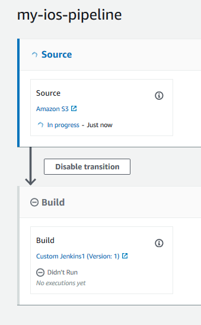

# Tutorial: Create a pipeline that tests your

iOS app with AWS Device Farm

You can use AWS CodePipeline to easily configure a continuous integration flow in which your app
is tested each time the source bucket changes. This tutorial shows you how to create and
configure a pipeline to test your built iOS app from an S3 bucket. The pipeline detects the
arrival of a saved change through Amazon CloudWatch Events, and then uses [Device Farm](../../../devicefarm/latest/developerguide/welcome.md "../../../devicefarm/latest/developerguide/welcome.md")
to test the built application.

###### Important

As part of creating a pipeline, an S3 artifact bucket provided by the customer will be
used by CodePipeline for artifacts. (This is different from the bucket used for an S3 source action.)
If the S3 artifact bucket is in a different account from the account for your pipeline, make
sure that the S3 artifact bucket is owned by AWS accounts that are safe and will be
dependable.

###### Important

Many of the actions you add to your pipeline in this procedure involve AWS resources that you need to create before you create the pipeline. AWS resources for your source actions must always be created in the same AWS Region
where you create your pipeline. For example, if you create your pipeline in the US East (Ohio)
Region, your CodeCommit repository must be in the US East (Ohio) Region.

You can add cross-region actions when you create your pipeline. AWS resources for cross-region actions must be in the same AWS Region where you plan to execute the action.
For more information, see [Add a cross-Region action in CodePipeline](actions-create-cross-region.md "actions-create-cross-region.md").

You can try this out using your existing iOS app, or you can use the [sample iOS app](samples/s3-ios-test-1.md "samples/s3-ios-test-1.md").

**Before you begin**

1. Sign in to the AWS Device Farm console and choose **Create a new
   project**.
2. Choose your project. In the browser, copy the URL of your new project. The URL contains
   the project ID.
3. Copy and retain this project ID. You use it when you create your pipeline in
   CodePipeline.

Here is an example URL for a project. To extract the project ID, copy the value after
`projects/`. In this example, the project ID is
`eec4905f-98f8-40aa-9afc-4c1cfexample`.

```
https://<region-URL>/devicefarm/home?region=us-west-2#/projects/eec4905f-98f8-40aa-9afc-4c1cfexample/runs
```

## Configure CodePipeline to use your Device Farm tests

(Amazon S3 example)

1. Create or use an S3 bucket with versioning enabled. Follow the instructions in [Step 1: Create an S3 source bucket for your
   application](tutorials-simple-s3.md#s3-create-s3-bucket "tutorials-simple-s3.md#s3-create-s3-bucket") to create an S3
   bucket.
2. In the Amazon S3 console for your bucket, choose **Upload**,
   and follow the instructions to upload your .zip file.

Your sample application must be packaged in a .zip file. 3. To create your pipeline and add a source stage, do the following:

    1. Sign in to the AWS Management Console and open the CodePipeline console at
     [https://console.aws.amazon.com/codepipeline/](https://console.aws.amazon.com/codepipeline/ "https://console.aws.amazon.com/codepipeline/").
    2. On the **Welcome** page, **Getting started**
     page, or the **Pipelines** page, choose **Create
     pipeline**.
    3. On the **Step 1: Choose creation option** page, under
     **Creation options**, choose the **Build custom
     pipeline** option. Choose **Next**.
    4. On the **Step 2: Choose pipeline settings** page, in
     **Pipeline name**, enter the name for your pipeline.
    5. CodePipeline provides V1 and V2 type pipelines, which differ in characteristics and
     price. The V2 type is the only type you can choose in the console. For more
     information, see [pipeline
     types](pipeline-types-planning.md "pipeline-types-planning.md"). For information about pricing for CodePipeline, see [Pricing](https://aws.amazon.com/codepipeline/pricing/ "https://aws.amazon.com/codepipeline/pricing/").
    6. In **Service role**, leave **New service role**
     selected, and leave **Role name** unchanged. You can also choose to
     use an existing service role, if you have one.


    ###### Note

    If you use a CodePipeline service role that was created before July 2018, you must add
     permissions for Device Farm. To do this, open the IAM console, find the role, and then
     add the following permissions to the role's policy. For more information, see [Add permissions to the CodePipeline
     service role](how-to-custom-role.md#how-to-update-role-new-services "how-to-custom-role.md#how-to-update-role-new-services").


    ```
    {
         "Effect": "Allow",
         "Action": [
            "devicefarm:ListProjects",
            "devicefarm:ListDevicePools",
            "devicefarm:GetRun",
            "devicefarm:GetUpload",
            "devicefarm:CreateUpload",
            "devicefarm:ScheduleRun"
         ],
         "Resource": "*"
    }
    ```
    7. Leave the settings under **Advanced settings** at their defaults,
     and then choose **Next**.
    8. On the **Step 3: Add source stage** page, in **Source
     provider**, choose **Amazon S3**.
    9. In **Amazon S3 location**, enter the bucket, such as
     `my-storage-bucket`, and object key, such as
     `s3-ios-test-1.zip` for your .zip file.
    10. Choose **Next**.

4.  In **Step 4: Add build stage**, create a placeholder build stage for
    your pipeline. This allows you to create the pipeline in the wizard. After you use the
    wizard to create your two-stage pipeline, you no longer need this placeholder build stage.
    After the pipeline is completed, this second stage is deleted and the new test stage is
    added in step 5.
    1. In **Build provider**, choose **Add Jenkins**.
       This build selection is a placeholder. It is not used.
    2. In **Provider name**, enter a name. The name is a placeholder. It
       is not used.
    3. In **Server URL**, enter text. The text is a placeholder. It is
       not used.
    4. In **Project name**, enter a name. The name is a placeholder. It
       is not used.
    5. Choose **Next**.
    6. In **Step 5: Add test stage**, choose **Skip test
       stage**, and then accept the warning message by choosing
       **Skip** again.

    Choose **Next**. 7. On the **Step 6: Add deploy stage** page, choose **Skip
    deploy stage**, and then accept the warning message by choosing
    **Skip** again. 8. On **Step 7: Review**, choose **Create
    pipeline**. You should see a diagram that shows the source and build
    stages.

    

5.  Add a Device Farm test action to your pipeline as follows:
    1. In the upper right, choose **Edit**.
    2. Choose **Edit stage**. Choose **Delete**. This
       deletes the placeholder stage now that you no longer need it for pipeline
       creation.
    3. At the bottom of the diagram, choose **+ Add stage**.
    4. In Stage name, enter a name for the stage, such as Test, and then choose
       **Add stage**.
    5. Choose **+ Add action group**.
    6. In **Action name**, enter a name, such as DeviceFarmTest.
    7. In **Action provider**, choose **AWS Device
       Farm**. Allow **Region** to default to the pipeline
       Region.
    8. In **Input artifacts**, choose the input artifact that matches
       the output artifact of the stage that comes before the test stage, such as
       `SourceArtifact`.

    In the AWS CodePipeline console, you can find the name of the output artifact for each
    stage by hovering over the information icon in the pipeline diagram. If your pipeline
    tests your app directly from the **Source** stage, choose
    **SourceArtifact**. If the pipeline includes a
    **Build** stage, choose **BuildArtifact**. 9. In **ProjectId**, choose your Device Farm project ID. Use the steps at
    the start of this tutorial to retrieve your project ID. 10. In **DevicePoolArn**, enter the ARN for the device pool. To get
    the available device pool ARNs for the project, including the ARN for Top Devices, use
    the AWS CLI to enter the following command:

    ```
    aws devicefarm list-device-pools --arn arn:aws:devicefarm:us-west-2:`account_ID`:project:`project_ID`
    ```

    11. In **AppType**, enter **iOS**.

    The following is a list of valid values for **AppType**:

        * **iOS**
        * **Android**
        * **Web**

    12. In **App**, enter the path of the compiled app package. The path
        is relative to the root of the input artifact for the test stage. Typically, this path
        is similar to `ios-test.ipa`.
    13. In **TestType**, enter your type of test, and then in
        **Test**, enter the path of the test definition file. The path is
        relative to the root of the input artifact for your test.

    If you're using one of the built-in Device Farm tests, enter the type of test configured
    in your Device Farm project, such as BUILTIN_FUZZ. In **FuzzEventCount**,
    enter a time in milliseconds, such as 6000. In **FuzzEventThrottle**,
    enter a time in milliseconds, such as 50.

    If you aren't using one of the built-in Device Farm tests, enter your type of test, and
    then in **Test**, enter the path of the test definition file. The
    path is relative to the root of the input artifact for your test.

    The following is a list of valid values for **TestType**:

        * **APPIUM\_JAVA\_JUNIT**
        * **APPIUM\_JAVA\_TESTNG**
        * **APPIUM\_NODE**
        * **APPIUM\_RUBY**
        * **APPIUM\_PYTHON**
        * **APPIUM\_WEB\_JAVA\_JUNIT**
        * **APPIUM\_WEB\_JAVA\_TESTNG**
        * **APPIUM\_WEB\_NODE**
        * **APPIUM\_WEB\_RUBY**
        * **APPIUM\_WEB\_PYTHON**
        * **BUILTIN\_FUZZ**
        * **INSTRUMENTATION**
        * **XCTEST**
        * **XCTEST\_UI**

    ###### Note

    Custom environment nodes are not supported. 14. In the remaining fields, provide the configuration that is appropriate for your
    test and application type. 15. (Optional) In **Advanced**, provide configuration information for
    your test run. 16. Choose **Save**. 17. On the stage you are editing, choose **Done**. In the AWS CodePipeline
    pane, choose **Save**, and then choose **Save** on
    the warning message. 18. To submit your changes and start a pipeline execution, choose **Release
    change**, and then choose **Release**.
