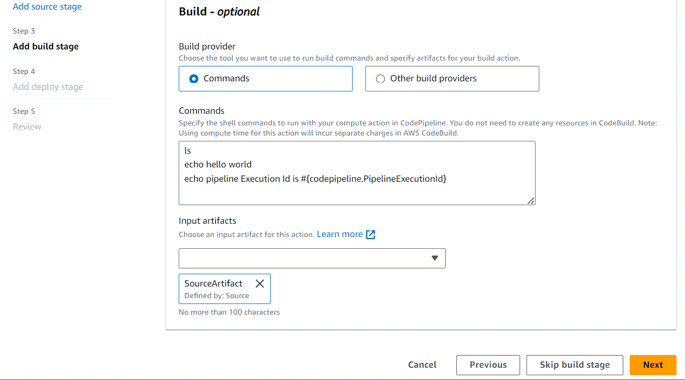
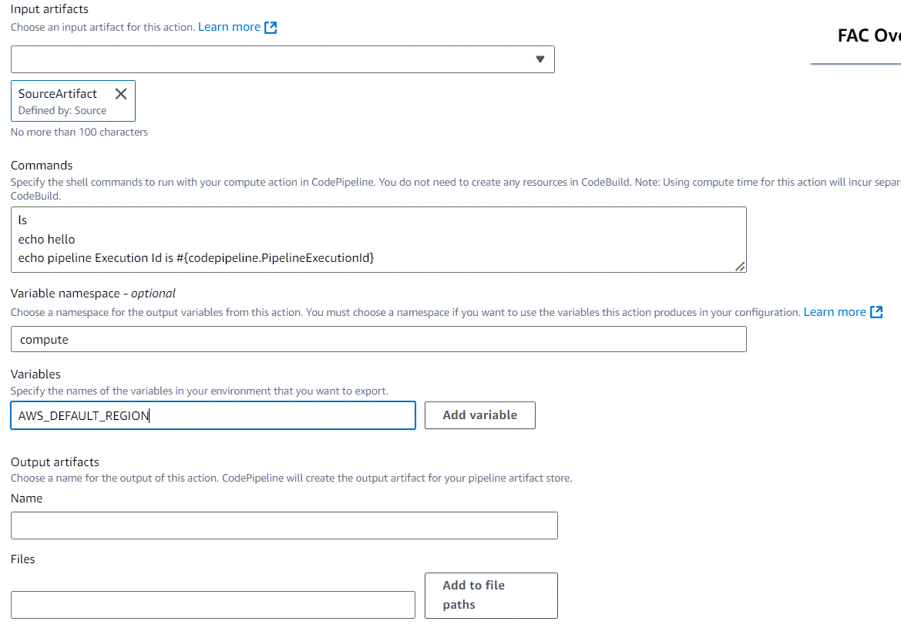
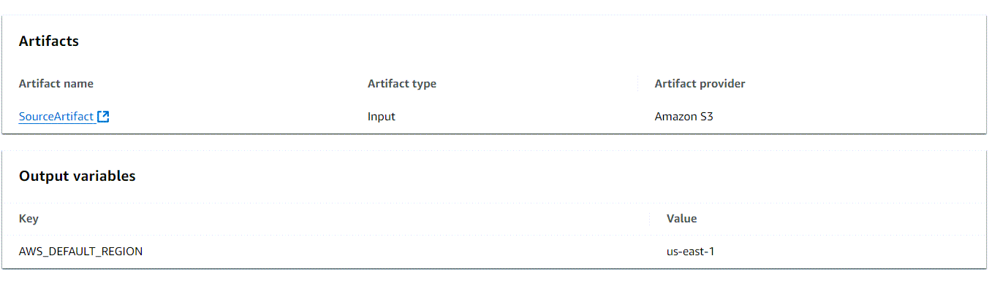
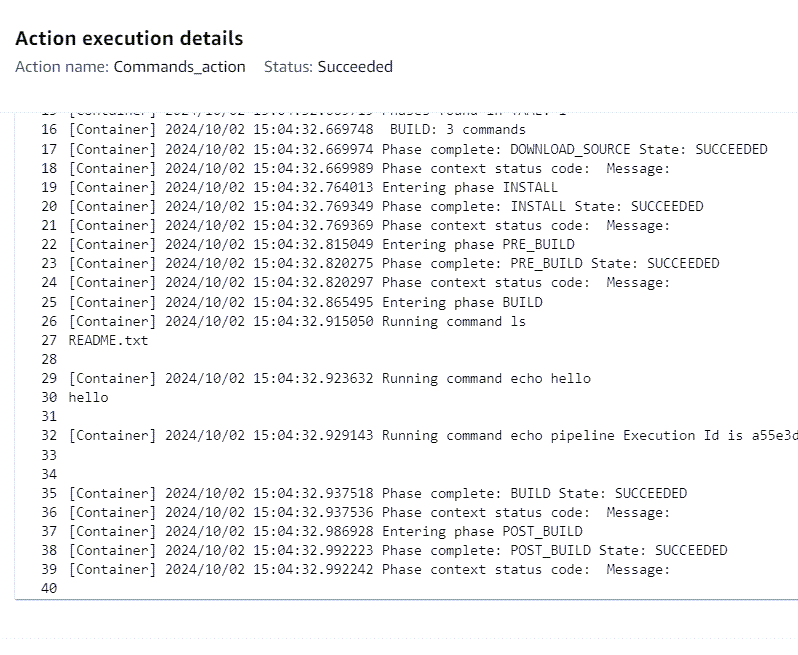

# Tutorial: Create a pipeline that runs commands with

compute (V2 type)

In this tutorial, you configure a pipeline that continuously runs provided build commands
using the Commands action in a build stage. For more information about the Commands action,
see [Commands action reference](action-reference-Commands.md "action-reference-Commands.md").

###### Important

As part of creating a pipeline, an S3 artifact bucket provided by the customer will be
used by CodePipeline for artifacts. (This is different from the bucket used for an S3 source
action.) If the S3 artifact bucket is in a different account from the account for your
pipeline, make sure that the S3 artifact bucket is owned by AWS accounts that are safe
and will be dependable.

## Prerequisites

You must already have the following:

- A GitHub repository. You can use the GitHub repository you created in [Tutorial: Use full clone with a GitHub pipeline
  source](tutorials-github-gitclone.md "tutorials-github-gitclone.md").

## Step 1: Create source files and push to your

GitHub repository

In this section, you create and push your example source files to the repository that
the pipeline uses for your source stage. For this example, you produce and push the
following:

- A `README.txt` file.

###### To create source files

1. Create a file with the following text:

```
Sample readme file
```

2. Save the file as `README.txt`.

###### To push files to your GitHub repository

1. Push or upload the files to your repository. These files are the source
   artifact created by the **Create Pipeline** wizard for your
   deployment action in AWS CodePipeline. Your files should look like this in your local
   directory:

```
README.txt
```

2. To use the Git command line from a cloned repository on your local
   computer:
   1. Run the following command to stage all of your files at once:

   ```
   git add -A
   ```

   2. Run the following command to commit the files with a commit
      message.

   ```
   git commit -m "Added source files"
   ```

   3. Run the following command to push the files from your local repo to
      your repository:

   ```
   git push
   ```

## Step 2: Create your pipeline

In this section, you create a pipeline with the following actions:

- A source stage with a GitHub (via GitHub App) action for the repository where the
  source files are stored.
- A build stage with the Commands action.

###### To create a pipeline with the wizard

1. Sign in to the AWS Management Console and open the CodePipeline console at [http://console.aws.amazon.com/codesuite/codepipeline/home](http://console.aws.amazon.com/codesuite/codepipeline/home "http://console.aws.amazon.com/codesuite/codepipeline/home").
2. On the **Welcome** page, **Getting started**
   page, or the **Pipelines** page, choose **Create
   pipeline**.
3. On the **Step 1: Choose creation option** page, under
   **Creation options**, choose the **Build custom
   pipeline** option. Choose **Next**.
4. In **Step 2: Choose pipeline settings**, in
   **Pipeline name**, enter
   `MyCommandsPipeline`.
5. CodePipeline provides V1 and V2 type pipelines, which differ in characteristics and
   price. The V2 type is the only type you can choose in the console. For more
   information, see [pipeline types](pipeline-types-planning.md "pipeline-types-planning.md"). For information about pricing for CodePipeline, see [Pricing](https://aws.amazon.com/codepipeline/pricing/ "https://aws.amazon.com/codepipeline/pricing/").
6. In **Service role**, choose **New service
   role** to allow CodePipeline to create a service role in IAM.

###### Note

If you are using an existing service role, to use the Commands action, you
will need to add the following permissions for the service role. Scope down
the permissions to the pipeline resource level by using resource-based
permissions in the service role policy statement. For more information, see
the policy example in [Service role policy
permissions](action-reference-Commands.md#action-reference-Commands-policy "action-reference-Commands.md#action-reference-Commands-policy").

    * logs:CreateLogGroup
    * logs:CreateLogStream
    * logs:PutLogEvents

7. Leave the settings under **Advanced settings** at their
   defaults, and then choose **Next**.
8. On the **Step 3: Add source stage** page, add a source
   stage:
   1. In **Source provider**, choose **GitHub (via
      GitHub App)**.
   2. Under **Connection**, choose an existing connection
      or create a new one. To create or manage a connection for your GitHub
      source action, see [GitHub connections](connections-github.md "connections-github.md").
   3. In **Repository name**, choose the name of your
      GitHub.com repository.
   4. In **Default branch**, choose the branch that you
      want to specify when the pipeline is started manually or with a source
      event that is not a Git tag. If the source of the change is not the
      trigger or if a pipeline execution was started manually, then the change
      used will be the HEAD commit from the default branch. Optionally, you
      can also specify webhooks with filtering (triggers). For more
      information, see [Automate starting pipelines using triggers and
      filtering](pipelines-triggers.md "pipelines-triggers.md").Choose **Next**.

9. In **Step 4: Add build stage**, choose
   **Commands**.

###### Note

Running the Commands action will incur separate charges in
AWS CodeBuild.

Enter the following commands:

```
ls
echo hello world
cat README.txt
echo pipeline Execution Id is #{codepipeline.PipelineExecutionId}
```

Choose **Next**.

 10. In **Step 5: Add test stage**, choose **Skip test
stage**, and then accept the warning message by choosing
**Skip** again.

Choose **Next**. 11. In **Step 6: Add deploy stage**, choose **Skip deploy
stage**, and then accept the warning message by choosing
**Skip** again.

Choose **Next**. 12. In **Step 7: Review**, review the information, and then
choose **Create pipeline**. 13. As a final step for creating your action, add an environment variable to the
action that will result in an output variable for the action. On the Commands
action, choose **Edit**. On the **Edit**
screen, specify a variable namespace for your action by entering
`compute` in the **Variable namespace**
field.

Add the CodeBuild output variable `AWS_Default_Region`, and then
choose **Add variable**.



## Step 3: Run your pipeline and verify build

commands

Release a change to run your pipeline. Verify that the build commands ran by viewing
the execution history, the build logs, and the output variables.

###### To view action logs and output variables

1. After the pipeline runs successfully, you can view the logs and output for the
   action.
2. To view the output variables for the action, choose
   **History**, and then choose **Timeline**.

View the output variable that was added to the action. The output for the
Commands action shows the output variable resolved to the action Region.

 3. To view the logs for the action, choose **View details** on
the successful Commands action. View the logs for the Commands action.


