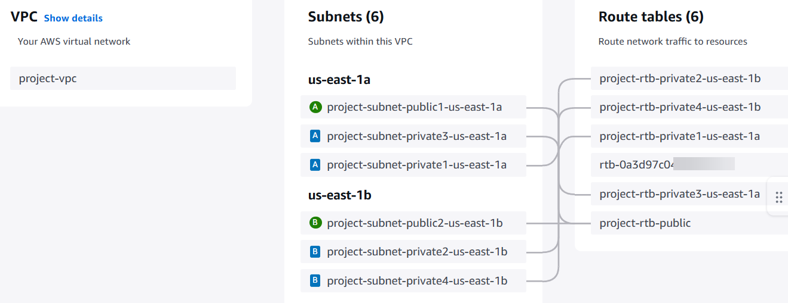
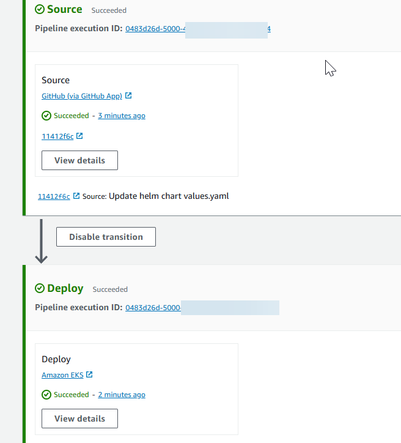

# Tutorial: Deploy to Amazon EKS with CodePipeline

This tutorial helps you to create a deploy action in CodePipeline that deploys your code
to a cluster you have configured in Amazon EKS.

The EKS action supports both public and private EKS clusters. Private clusters are the
type recommended by EKS; however, both types are supported.

###### Note

As part of creating a pipeline in the console, an S3 artifact bucket will be used by
CodePipeline for artifacts. (This is different from the bucket used for an S3 source action.)
If the S3 artifact bucket is in a different account from the account for your pipeline,
make sure that the S3 artifact bucket is owned by AWS accounts that are safe and will
be dependable.

###### Note

This action uses CodePipeline managed CodeBuild compute to run commands in a build environment.
Running the commands action will incur separate charges in AWS CodeBuild.

###### Note

The `EKS` deploy action is only available for V2 type pipelines.

## Prerequisites

There are a few resources that you must have in place before you can use this tutorial
to create your CD pipeline. Here are the things you need to get started:

###### Note

All of these resources should be created within the same AWS Region.

- A source control repository (this tutorial uses GitHub) where you will add a
  sample `deployment.yaml` file.
- You must use an existing CodePipeline service role that you will update with the
  permissions for this action using

[Step 3: Update the CodePipeline service role policy
in IAM](#tutorials-eks-deploy-role "#tutorials-eks-deploy-role") below. The
permissions needed are based on the type of cluster you create. For more
information, see [Service role policy
permissions](action-reference-EKS.md#action-reference-EKS-service-role "action-reference-EKS.md#action-reference-EKS-service-role").

- A working image and repository tag that you have pushed to ECR or your image
  repository.

After you have satisfied these prerequisites, you can proceed with the tutorial and
create your CD pipeline.

## Step 1: (Optional) Create a cluster in

Amazon EKS

You can choose to create an EKS cluster with a public or private endpoint.

In the following steps, you create a public or a private cluster in EKS. This step is
optional if you have already created your cluster.

### Create a public cluster in

Amazon EKS

In this step, you create a cluster in EKS.

###### Create a public cluster

1. Open the EKS console, and then choose **Create
   cluster**.
2. In **Name**, name your cluster. Choose
   **Next**.
3. Choose **Create**.

### Create a private cluster in

Amazon EKS

In case you choose to create a cluster with a private endpoint, make sure to
attach the private subnets only, and make sure they have internet connection.

Follow the next five sub-steps for creating a cluster with a private
endpoint.

###### Create a VPC in the console

1. Open the VPC console, and then choose **Create
   VPC**.
2. Under **VPC settings**, choose **VPC and
   more**.
3. Choose to create one public and 4 private subnets. Choose **Create
   VPC**.
4. On the subnets page, choose **Private**.

###### Determine the private subnets in your VPC

1. Navigate to your VPC and choose the VPC ID to open the VPC details
   page.
2. On the VPC details page, choose the **Resource map**
   tab.
3. View the diagram and make a note of your private subnets. The subnets
   display with labels to indicate public or private status, and each subnet is
   mapped to a route table.



Note that a private cluster will have all private subnets. 4. Create a public subnet to host the NAT gateway. You can attach only one
internet gateway to a VPC at a time.

###### Create a NAT gateway in the public subnet

1. In the public subnet, create a NAT gateway. Navigate to the VPC console,
   and then choose **Internet gateways**. Choose
   **Create internet gateway**.
2. In Name, enter a name for your internet gateway. Choose **Create
   internet gateway**.

Update the route table for the private subnet to direct traffic to the NAT
gateway.

###### Add the NAT gateway to your route tables for your private subnets

1. Navigate to the VPC console, and then choose
   **Subnets**.
2. For each private subnet, choose it and then choose the route table for
   that subnet on the details page, Choose **Edit route
   table**.
3. Update the route table for the private subnet to direct internet traffic
   to the NAT gateway. Choose **Add route**. Choose
   **NAT gateway** from the options to add. Choose the
   internet gateway you created.
4. For the public subnet, create a custom route table. Verify that the
   network access control list (ACL) for your public subnet allows inbound
   traffic from the private subnet.
5. Choose **Save changes**.

In this step, you create a cluster in EKS.

###### Create a private cluster

1. Open the EKS console, and then choose **Create
   cluster**.
2. In **Name**, name your cluster. Choose
   **Next**.
3. Specify your VPC and other configuration information. Choose
   **Create**.

Your EKS cluster can be a public or a private cluster. This step is for clusters
that have ONLY a private endpoint. Make sure that if your cluster is private.

## Step 2: Configure your

private cluster in Amazon EKS

This step is applicable only if you have created a private cluster. This step is for
clusters that have ONLY a private endpoint.

###### Configure your cluster

1. Attach private subnets only in the EKS cluster under the
   **Networking**
   tab.
   Attach the private subnets captured in the **Determine the
   private subnets in your VPC** section under [Step 1: (Optional) Create a cluster in
   Amazon EKS](#tutorials-eks-deploy-cluster "#tutorials-eks-deploy-cluster").
2. Make sure that the private subnets have access to the internet since CodePipeline
   stores and retrieves artifacts from the S3 artifact bucket for your
   pipeline.

## Step 3: Update the CodePipeline service role policy

in IAM

In this step, you will update an existing CodePipeline service role, such as `**cp-service-role**`, with permissions required by
CodePipeline to connect with your cluster. If you do not have existing role, create a
new one.

Update your CodePipeline service role with the following steps.

###### To update your CodePipeline service role policy

1. Open the IAM console at [https://console.aws.amazon.com/iam/](https://console.aws.amazon.com/iam/ "https://console.aws.amazon.com/iam/")).
2. From the console dashboard, choose **Roles**.
3. Look up your CodePipeline service role, such as `**cp-service-role**`.
4. Add a new inline policy.
5. In the **Policy editor**, enter the following.
   - For a public cluster, add the following permissions.

   JSON

   ```
   `{
    "Version":"2012-10-17",

    "Statement": [
    {
    "Sid": "EksClusterPolicy",
    "Effect": "Allow",
    "Action": "eks:DescribeCluster",
    "Resource": "arn:aws:eks:us-east-1:`111122223333`:cluster/my-cluster"
    },
    {
    "Sid": "EksVpcClusterPolicy",
    "Effect": "Allow",
    "Action": [
    "ec2:DescribeDhcpOptions",
    "ec2:DescribeNetworkInterfaces",
    "ec2:DescribeRouteTables",
    "ec2:DescribeSubnets",
    "ec2:DescribeSecurityGroups",
    "ec2:DescribeVpcs"
    ],
    "Resource": [
    "*"
    ]
    }
    ]
   }`

   ```

   - For a private cluster, add the following permissions. Private clusters
     will require additional permissions for your VPC, if applicable.

   JSON

   ```
   `{
    "Version":"2012-10-17",

    "Statement": [
    {
    "Sid": "EksClusterPolicy",
    "Effect": "Allow",
    "Action": "eks:DescribeCluster",
    "Resource": "arn:aws:eks:us-east-1:`111122223333`:cluster/my-cluster"
    },
    {
    "Sid": "EksVpcClusterPolicy",
    "Effect": "Allow",
    "Action": [
    "ec2:DescribeDhcpOptions",
    "ec2:DescribeNetworkInterfaces",
    "ec2:DescribeRouteTables",
    "ec2:DescribeSubnets",
    "ec2:DescribeSecurityGroups",
    "ec2:DescribeVpcs"
    ],
    "Resource": [
    "*"
    ]
    },
    {
    "Effect": "Allow",
    "Action": "ec2:CreateNetworkInterface",
    "Resource": "*",
    "Condition": {
    "StringEqualsIfExists": {
    "ec2:Subnet": [
    "arn:aws:ec2:us-east-1:`ACCOUNT-ID`:subnet/subnet-03ebd65daeEXAMPLE",
    "arn:aws:ec2:us-east-1:`ACCOUNT-ID`:subnet/subnet-0e377f6036EXAMPLE",
    "arn:aws:ec2:us-east-1:`ACCOUNT-ID`:subnet/subnet-0db658ba1cEXAMPLE",
    "arn:aws:ec2:us-east-1:`ACCOUNT-ID`:subnet/subnet-0db658ba1cEXAMPLE"
    ]
    }
    }
    },
    {
    "Effect": "Allow",
    "Action": "ec2:CreateNetworkInterfacePermission",
    "Resource": "*",
    "Condition": {
    "ArnEquals": {
    "ec2:Subnet": [
    "arn:aws:ec2:us-east-1:`111122223333`:subnet/subnet-03ebd65daeEXAMPLE",
    "arn:aws:ec2:us-east-1:`111122223333`:subnet/subnet-0e377f6036EXAMPLE",
    "arn:aws:ec2:us-east-1:`111122223333`:subnet/subnet-0db658ba1cEXAMPLE",
    "arn:aws:ec2:us-east-1:`111122223333`:subnet/subnet-0db658ba1cEXAMPLE"
    ]
    }
    }
    },
    {
    "Effect": "Allow",
    "Action": "ec2:DeleteNetworkInterface",
    "Resource": "*",
    "Condition": {
    "StringEqualsIfExists": {
    "ec2:Subnet": [
    "arn:aws:ec2:us-east-1:`ACCOUNT-ID`:subnet/subnet-03ebd65daeEXAMPLE",
    "arn:aws:ec2:us-east-1:`ACCOUNT-ID`:subnet/subnet-0e377f6036EXAMPLE",
    "arn:aws:ec2:us-east-1:`ACCOUNT-ID`:subnet/subnet-0db658ba1cEXAMPLE",
    "arn:aws:ec2:us-east-1:`ACCOUNT-ID`:subnet/subnet-0db658ba1cEXAMPLE"
    ]
    }
    }
    }
    ]
   }`

   ```

6. Choose **Update policy**.

## Step 4: Create an access entry for

the CodePipeline service role

In this step, you create an access entry on your cluster that will add the
CodePipeline service role you updated in Step 3, along with a managed access
policy.

1. Open the EKS console and navigate to your cluster.
2. Choose the **Access** tab.
3. Under **IAM access entries**, choose **Create access
   entry**.
4. In **IAM principal ARN**, enter the role you just updated for
   the action, such as `**cp-service-role**`. Choose **Next**.
5. On the **Step 2: Add access policy** page, in
   **Policy name**, choose the managed policy for access, such
   as `AmazonEKSClusterAdminPolicy`. Choose **Add
   policy**. Choose **Next**.

###### Note

This is the policy that the CodePipeline action uses to talk to
Kubernetes. As a best practice, to scope down permissions in your policy
with least privilege rather than the administrative policy, attach a custom
policy instead. 6. On the review page, choose **Create**.

## Step 5: Create a source repository and add

the `helm chart` config files

In this step, you create a config file that is appropriate for your action (Kubernetes
manifest files or Helm
chart)
and store the config file in your source repository. Use the appropriate file
for your
configuration.
For more information, see [https://kubernetes.io/docs/reference/kubectl/quick-reference/](https://kubernetes.io/docs/reference/kubectl/quick-reference/ "https://kubernetes.io/docs/reference/kubectl/quick-reference/") or [https://helm.sh/docs/topics/charts/](https://helm.sh/docs/topics/charts/ "https://helm.sh/docs/topics/charts/").

- For Kubernetes, use a manifest file.
- For Helm, use a Helm chart.

1. Create or use an existing GitHub repository.
2. Create a new structure in your repository for your helm chart files as shown
   in the example
   below.

````
mychart
|-- Chart.yaml
|-- charts
|-- templates
|   |-- NOTES.txt
|   |-- _helpers.tpl
|   |-- deployment.yaml
|   |-- ingress.yaml
|   `-- service.yaml `-- values.yaml ``` 3. Add the file to the root level of your repository. ## Step 6: Creating your pipeline Use the CodePipeline wizard to create your pipeline stages and connect your source repository. ###### To create your pipeline 1. Open the CodePipeline console at [https://console.aws.amazon.com/codepipeline/](https://console.aws.amazon.com/codepipeline/ "https://console.aws.amazon.com/codepipeline/"). 2. On the **Welcome** page, **Getting started** page, or the **Pipelines** page, choose **Create pipeline**. 3. On the **Step 1: Choose creation option** page, under **Creation options**, choose the **Build custom pipeline** option. Choose **Next**. 4. In **Step 2: Choose pipeline settings**, in **Pipeline name**, enter `MyEKSPipeline`. 5. CodePipeline provides V1 and V2 type pipelines, which differ in characteristics and price. The V2 type is the only type you can choose in the console. For more information, see [pipeline types](pipeline-types-planning.md "pipeline-types-planning.md"). For information about pricing for CodePipeline, see [Pricing](https://aws.amazon.com/codepipeline/pricing/ "https://aws.amazon.com/codepipeline/pricing/"). 6. In **Service role**, choose the service role that you updated in Step 3. 7. Leave the settings under **Advanced settings** at their defaults, and then choose **Next**. 8. On the **Step 3: Add source stage** page, for **Source provider**, choose **to create a connection to your GitHub repository**. 9. On the **Step 4: Add build stage** page, choose **Skip**. 10. On the **Step 5: Add deploy stage** page, choose **Amazon EKS**.  1. Under **Deploy configuration type**, choose **Helm**. 2. In **Helm chart location**, enter the release name, such as `my-release`. For **Helm chart location**, enter the path for your helm chart files, such as `mychart`. 3. Choose **Next**. 11. On the **Step 6: Review** page, review your pipeline configuration and choose **Create pipeline** to create the pipeline.  12. After the pipeline runs successfully, choose **View details** to view the logs on the action to view the action output.
````
