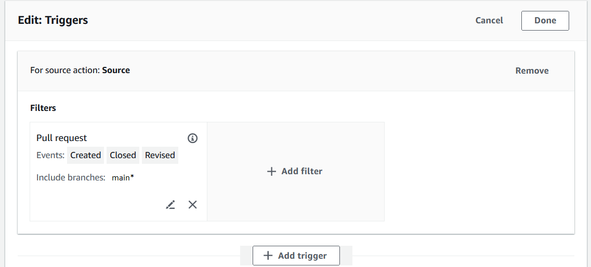
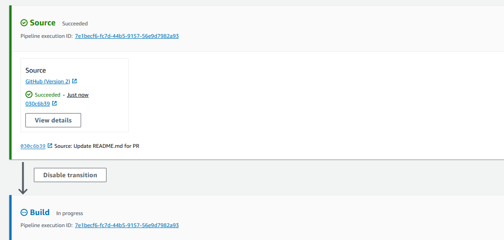
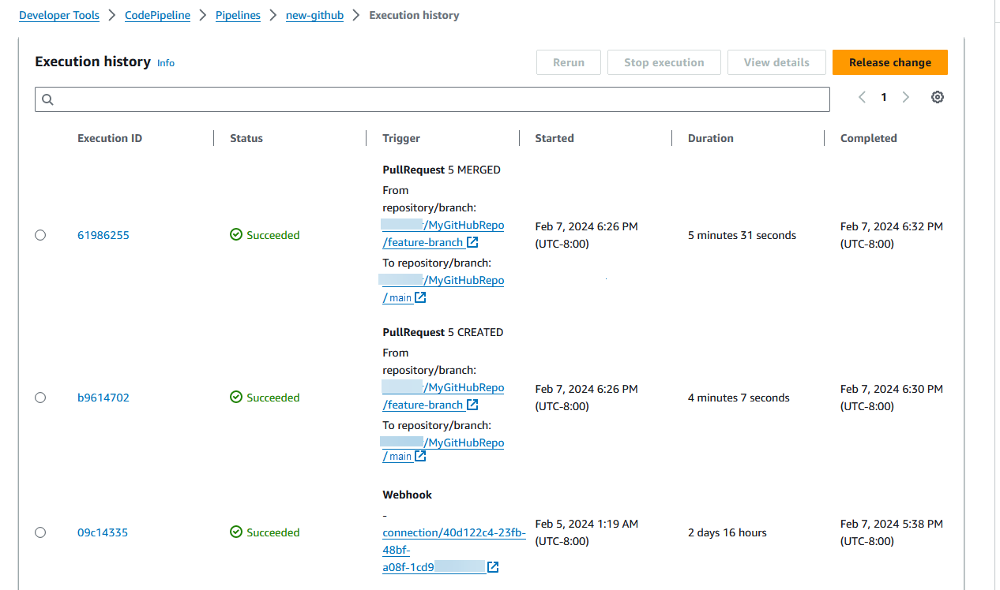

# Tutorial: Filter on branch names for pull

requests to start your pipeline (V2 type)

In this tutorial, you will create a pipeline that connects to your GitHub.com repository
where the source action is configured to start your pipeline with a trigger configuration that
filters on pull requests. When a specified pull request event occurs for a specified branch,
your pipeline starts. This example shows you how to create a pipeline that allows filtering for
branch names. For more information about working with triggers, see [Add filters for push and pull request event types
(CLI)](pipelines-filter.md#pipelines-filter-cli "pipelines-filter.md#pipelines-filter-cli"). For more information
about filtering with regex patterns in glob format, see [Working with glob patterns in syntax](syntax-glob.md "syntax-glob.md").

###### Important

As part of creating a pipeline, an S3 artifact bucket provided by the customer will be
used by CodePipeline for artifacts. (This is different from the bucket used for an S3 source action.)
If the S3 artifact bucket is in a different account from the account for your pipeline, make
sure that the S3 artifact bucket is owned by AWS accounts that are safe and will be
dependable.

This tutorial connects to GitHub.com through the `CodeStarSourceConnection`
action type.

###### Topics

- [Prerequisites](#tutorials-github-featurebranches-prereq "#tutorials-github-featurebranches-prereq")
- [Step 1: Create a pipeline to start
  on pull request for specified branches](#tutorials-github-featurebranches-pipeline "#tutorials-github-featurebranches-pipeline")
- [Step 2: Create and merge a pull request in GitHub.com to start your pipeline
  executions](#tutorials-github-featurebranches-pullrequest "#tutorials-github-featurebranches-pullrequest")

## Prerequisites

Before you begin, you must do the following:

- Create a GitHub.com repository with your GitHub.com account.
- Have your GitHub credentials ready. When you use the AWS Management Console to set up a connection,
  you are asked to sign in with your GitHub credentials.

## Step 1: Create a pipeline to start

on pull request for specified branches

In this section, you create a pipeline with the following actions:

- A source stage with a connection to your GitHub.com repository and action.
- A build stage with an AWS CodeBuild build action.

###### To create a pipeline with the wizard

1. Sign in to the CodePipeline console at [https://console.aws.amazon.com/codepipeline/](https://console.aws.amazon.com/codepipeline/ "https://console.aws.amazon.com/codepipeline/").
2. On the **Welcome** page, **Getting started** page,
   or **Pipelines** page, choose **Create
   pipeline**.
3. On the **Step 1: Choose creation option** page, under
   **Creation options**, choose the **Build custom
   pipeline** option. Choose **Next**.
4. In **Step 2: Choose pipeline settings**, in **Pipeline
   name**, enter `MyFilterBranchesPipeline`.
5. In **Pipeline type**, keep the default selection at
   **V2**. Pipeline types differ in characteristics and price. For more
   information, see [Pipeline types](pipeline-types.md "pipeline-types.md").
6. In **Service role**, choose **New service
   role**.

###### Note

If you choose instead to use your existing CodePipeline service role, make sure that you
have added the `codeconnections:UseConnection` IAM permission to your
service role policy. For instructions for the CodePipeline service role, see [Add permissions
to the the CodePipeline service role](security-iam.md#how-to-update-role-new-services "security-iam.md#how-to-update-role-new-services"). 7. Under **Advanced settings**, leave the defaults. In
**Artifact store**, choose **Default location** to use
the default artifact store, such as the Amazon S3 artifact bucket designated as the default,
for your pipeline in the Region you selected for your pipeline.

###### Note

This is not the source bucket for your source code. This is the artifact store for
your pipeline. A separate artifact store, such as an S3 bucket, is required for each
pipeline.

Choose **Next**. 8. On the **Step 3: Add source stage** page, add a source stage:

    1. In **Source provider**, choose **GitHub (via GitHub
     App)**.
    2. Under **Connection**, choose an existing connection or create a
     new one. To create or manage a connection for your GitHub source action, see [GitHub connections](connections-github.md "connections-github.md").
    3. In **Repository name**, choose the name of your GitHub.com
     repository.
    4. Under **Trigger type**, choose **Specify
     filter**.

    Under **Event type**, choose **Pull request**.
     Select all of the events under pull request so that the event occurs for created,
     updated, or closed pull requests.

    Under **Branches**, in the **Include** field,
     enter `main*`.

    

    ###### Important

    Pipelines that start with this trigger type will be configured for WebhookV2
     events and will not use the Webhook event (change detection on all push events) to
     start the pipeline.Choose **Next**.

9. In **Step 4: Add build stage**, in **Build
   provider**, choose **AWS CodeBuild**. Allow
   **Region** to default to the pipeline Region. Choose or create the
   build project as instructed in [Tutorial: Use Git tags to start your pipeline](tutorials-github-tags.md "tutorials-github-tags.md"). This action will only be used in this tutorial
   as the second stage needed to create your pipeline.
10. In **Step 5: Add test stage**, choose **Skip test
    stage**, and then accept the warning message by choosing
    **Skip** again.

Choose **Next**. 11. On the **Step 6: Add deploy stage** page, choose **Skip
deploy stage**, and then accept the warning message by choosing
**Skip** again. Choose **Next**. 12. On **Step 7: Review**, choose **Create
pipeline**.

## Step 2: Create and merge a pull request in GitHub.com to start your pipeline

executions

In this section, you create and merge a pull request. This starts your pipeline, with one
execution for the opened pull request and one execution for the closed pull request.

###### To create a pull request and start your pipeline

1. In GitHub.com, create a pull request by making a change to the README.md on a feature
   branch and raising a pull request to the `main` branch. Commit the change with
   a message like `Update README.md for PR`.
2. The pipeline starts with the source revision showing the **Source** message for the pull request as **Update README.md for
   PR**.

 3. Choose **History**. In the pipeline execution history, view the
CREATED and MERGED pull request status events that started the pipeline executions.

