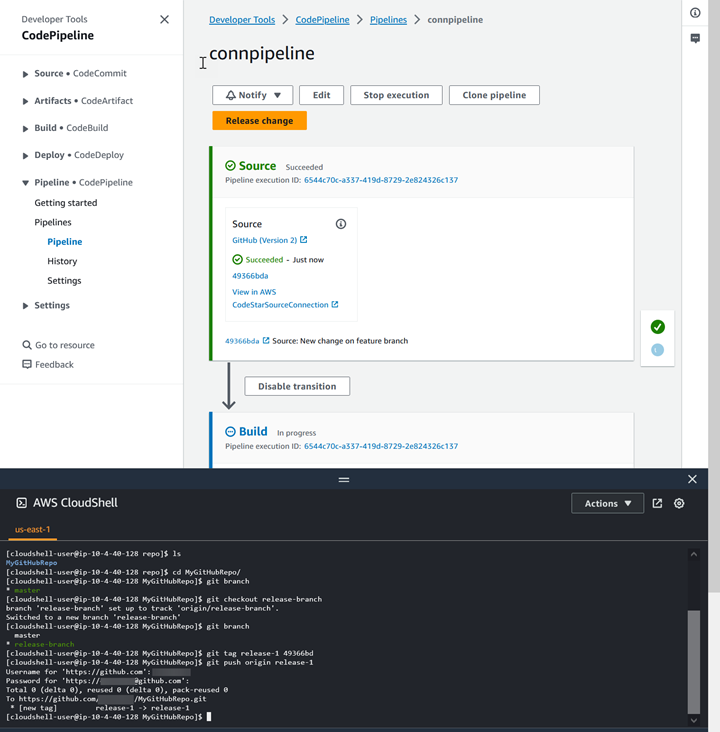

# Tutorial: Use Git tags to start your pipeline

In this tutorial, you will create a pipeline that connects to your GitHub repository where
the source action is configured for the Git tags trigger type. When a Git tag is created on a
commit, your pipeline starts. This example shows you how to create a pipeline that allows
filtering for tags based on the syntax of the tag name. For more information about filtering
with glob patterns, see [Working with glob patterns in syntax](syntax-glob.md "syntax-glob.md").

###### Important

As part of creating a pipeline, an S3 artifact bucket provided by the customer will be
used by CodePipeline for artifacts. (This is different from the bucket used for an S3 source action.)
If the S3 artifact bucket is in a different account from the account for your pipeline, make
sure that the S3 artifact bucket is owned by AWS accounts that are safe and will be
dependable.

This tutorial connects to GitHub through the `CodeStarSourceConnection` action
type.

###### Note

This feature is not available in the Asia Pacific (Hong Kong),
Africa (Cape Town), Middle East (Bahrain), or Europe (Zurich) Regions. To reference other
available actions, see [Product and service integrations with CodePipeline](integrations.md "integrations.md"). For
considerations with this action in the Europe (Milan) Region, see the note in [CodeStarSourceConnection for
Bitbucket Cloud, GitHub, GitHub Enterprise Server, GitLab.com, and GitLab self-managed
actions](action-reference-CodestarConnectionSource.md "action-reference-CodestarConnectionSource.md").

###### Topics

- [Prerequisites](#tutorials-github-tags-prereq "#tutorials-github-tags-prereq")
- [Step 1: Open CloudShell and clone your repository](#w2aac13c16c15 "#w2aac13c16c15")
- [Step 2: Create a pipeline to trigger on Git
  tags](#tutorials-github-tags-pipeline "#tutorials-github-tags-pipeline")
- [Step 3: Tag your commits for release](#w2aac13c16c19 "#w2aac13c16c19")
- [Step 4: Release change and view logs](#tutorials-github-tags-view "#tutorials-github-tags-view")

## Prerequisites

Before you begin, you must do the following:

- Create a GitHub repository with your GitHub account.
- Have your GitHub credentials ready. When you use the AWS Management Console to set up a connection,
  you are asked to sign in with your GitHub credentials.

## Step 1: Open CloudShell and clone your repository

You can use a command line interface to clone your repository, make commits, and add tags.
This tutorial launches a CloudShell instance for the command line interface.

1. Sign in to the AWS Management Console.
2. In the top navigation bar, choose the AWS icon. The main page of the AWS Management Console
   displays.
3. In the top navigation bar, choose the AWS CloudShell icon. CloudShell opens. Wait
   while the CloudShell environment is created.

###### Note

If you don't see the CloudShell icon, make sure that you're in a [Region supported by CloudShell](../../../cloudshell/latest/userguide/faq-list.md#regions-available "../../../cloudshell/latest/userguide/faq-list.md#regions-available"). This tutorial assumes you are in the
US West (Oregon) Region. 4. In GitHub, navigate to your repository. Choose **Code**, and then
choose **HTTPS**. Copy the path. The address to clone your Git repository
is copied to your clipboard. 5. Run the following command to clone the repository.

```
git clone https://github.com/<account>/MyGitHubRepo.git
```

6. Enter your GitHub account `Username` and `Password` when
   prompted. For the `Password` entry, you must use a user-created token rather
   than your account password.

## Step 2: Create a pipeline to trigger on Git

tags

In this section, you create a pipeline with the following actions:

- A source stage with a connection to your GitHub repository and action.
- A build stage with an AWS CodeBuild build action.

###### To create a pipeline with the wizard

1. Sign in to the CodePipeline console at [https://console.aws.amazon.com/codepipeline/](https://console.aws.amazon.com/codepipeline/ "https://console.aws.amazon.com/codepipeline/").
2. On the **Welcome** page, **Getting started** page,
   or **Pipelines** page, choose **Create
   pipeline**.
3. On the **Step 1: Choose creation option** page, under
   **Creation options**, choose the **Build custom
   pipeline** option. Choose **Next**.
4. In **Step 2: Choose pipeline settings**, in **Pipeline
   name**, enter `MyGitHubTagsPipeline`.
5. In **Pipeline type**, keep the default selection at
   **V2**. Pipeline types differ in characteristics and price. For more
   information, see [Pipeline types](pipeline-types.md "pipeline-types.md").
6. In **Service role**, choose **New service
   role**.

###### Note

If you choose instead to use your existing CodePipeline service role, make sure that you
have added the `codestar-connections:UseConnection` IAM permission to your
service role policy. For instructions for the CodePipeline service role, see [Add permissions
to the the CodePipeline service role](security-iam.md#how-to-update-role-new-services "security-iam.md#how-to-update-role-new-services"). 7. Under **Advanced settings**, leave the defaults. In
**Artifact store**, choose **Default location** to use
the default artifact store, such as the Amazon S3 artifact bucket designated as the default,
for your pipeline in the Region you selected for your pipeline.

###### Note

This is not the source bucket for your source code. This is the artifact store for
your pipeline. A separate artifact store, such as an S3 bucket, is required for each
pipeline.

Choose **Next**. 8. On the **Step 3: Add source stage** page, add a source stage:

    1. In **Source provider**, choose **GitHub (via GitHub
     App)**.
    2. Under **Connection**, choose an existing connection or create a
     new one. To create or manage a connection for your GitHub source action, see [GitHub connections](connections-github.md "connections-github.md").
    3. In **Repository name**, choose the name of your GitHub
     repository.
    4. In **Default branch**, choose the branch that you want to specify
     when the pipeline is started manually or with a source event that is not a Git tag. If
     the source of the change is not the trigger or if a pipeline execution was started
     manually, then the change used will be the HEAD commit from the default branch.
    5. Under **Webhook events**, in **Filter type**,
     choose **Tags**.


    In the **Tags or patterns** field, enter
     `release*`.


    ###### Important

    Pipelines that start with a trigger type of Git tags will be configured for
     WebhookV2 events and will not use the Webhook event (change detection on all push
     events) to start the pipeline.Choose **Next**.

9. In **Add build stage**, add a build stage:
   1. In **Build provider**, choose **AWS CodeBuild**.
      Allow **Region** to default to the pipeline Region.
   2. Choose **Create project**.
   3. In **Project name**, enter a name for this build project.
   4. In **Environment image**, choose **Managed
      image**. For **Operating system**, choose
      **Ubuntu**.
   5. For **Runtime**, choose **Standard**. For
      **Image**, choose
      **aws/codebuild/standard:5.0**.
   6. For **Service role**, choose **New service
      role**.

   ###### Note

   Note the name of your CodeBuild service role. You will need the role name for the
   final step in this tutorial. 7. Under **Buildspec**, for **Build
   specifications**, choose **Insert build commands**. Choose
   **Switch to editor**, and paste the following under **Build
   commands**.

   ```
   version: 0.2
   #env:
     #variables:
        # key: "value"
        # key: "value"
     #parameter-store:
        # key: "value"
        # key: "value"
     #git-credential-helper: yes
   phases:
     install:
       #If you use the Ubuntu standard image 2.0 or later, you must specify runtime-versions.
       #If you specify runtime-versions and use an image other than Ubuntu standard image 2.0, the build fails.
       runtime-versions:
         nodejs: 12
       #commands:
         # - command
         # - command
     #pre_build:
       #commands:
         # - command
         # - command
     build:
       commands:
         -
     #post_build:
       #commands:
         # - command
         # - command
   artifacts:
     files:
        - '*'
       # - location
     name: $(date +%Y-%m-%d)
     #discard-paths: yes
     #base-directory: location
   #cache:
     #paths:
       # - paths
   ```

   8. Choose **Continue to CodePipeline**. This returns to the CodePipeline
      console and creates a CodeBuild project that uses your build commands for configuration.
      The build project uses a service role to manage AWS service permissions. This step
      might take a couple of minutes.
   9. Choose **Next**.

10. In **Step 5: Add test stage**, choose **Skip test
    stage**, and then accept the warning message by choosing
    **Skip** again.

Choose **Next**. 11. On the **Step 6: Add deploy stage** page, choose **Skip
deploy stage**, and then accept the warning message by choosing
**Skip** again. Choose **Next**. 12. On **Step 7: Review**, choose **Create
pipeline**.

## Step 3: Tag your commits for release

After you create your pipeline and specify Git tags, you can tag commits in your GitHub
repository. In these steps, you will tag a commit with the `release-1` tag. Each
commit in a Git repository must have a unique Git tag. When you choose the commit and tag it,
this allows you to incorporate changes from different branches into your pipeline deployment.
Note that the tag name release does not apply to the concept of a release in GitHub.

1. Reference the copied commit IDs you want to tag. To view commits in each branch, in
   the CloudShell terminal, enter the following command to capture the commit IDs you want to
   tag:

```
git log
```

2. In the CloudShell terminal, enter the command to tag your commit and push it to
   origin. After you tag your commit, you use the git push command to push the tag to origin.
   In the following example, enter the following command to use the `release-1`
   tag for the second commit with ID `49366bd`. This tag will be filtered by the
   pipeline `release*` tag filter and will start the pipeline.

```
git tag release-1 49366bd
```

```
git push origin release-1
```



## Step 4: Release change and view logs

1. After the pipeline runs successfully, on your successful build stage, choose
   **View log**.

Under **Logs**, view the CodeBuild build output. The commands output the
value of the entered variable. 2. In the **History** page, view the **Triggers**
column. View the trigger type **GitTag : release-1**.
