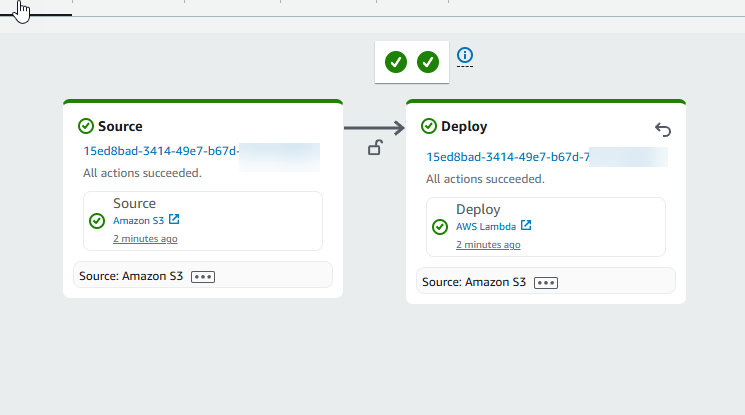

# Tutorial: Lambda

function
deployments with CodePipeline

This tutorial helps you to create a deploy action in CodePipeline that deploys your code to your
function you have configured in
Lambda. You will
create a sample Lambda function where you will create an alias and version, add the zipped
Lambda function to your source location, and run the Lambda action in your
pipeline.

###### Note

As part of creating a pipeline in the console, an S3 artifact bucket will be used by
CodePipeline for artifacts. (This is different from the bucket used for an S3 source action.)
If the S3 artifact bucket is in a different account from the account for your pipeline,
make sure that the S3 artifact bucket is owned by AWS accounts that are safe and will
be dependable.

###### Note

The `Lambda` deploy action is only available for V2 type pipelines.

## Prerequisites

There are a few resources that you must have in place before you can use this tutorial
to create your CD pipeline. Here are the things you need to get started:

###### Note

All of these resources should be created within the same AWS Region.

- A source control
  repository,
  such as GitHub, or a source S3 bucket (this tutorial uses
  S3)
  where you will
  store a
  `.zip`
  file that
  you create for your Lambda function.
- You must use an existing CodePipeline service role that has been updated with the
  permissions for this action. To update your service role, see [Service role policy
  permissions for the
  Lambda
  deploy action](action-reference-LambdaDeploy.md#action-reference-LambdaDeploy-permissions-action "action-reference-LambdaDeploy.md#action-reference-LambdaDeploy-permissions-action").

After you have satisfied these prerequisites, you can proceed with the tutorial and
create your CD pipeline.

## Step 1:

Create your
sample Lambda function

In this step, you create the
Lambda
function
where you will
deploy.

###### To create

your Lambda
function

1. Access the Lambda console and follow the steps in the following tutorial to
   create a sample Lambda function: link.
2. From the
   top
   navigation, choose
   **Create**,
   and select
   **Start
   from scratch** from the top of the page.
3. In **Name**, enter
   `MyLambdaFunction`.
4. Publish a new version. This will be the version that the alias will point
   to.
   1. Select your function.
   2. Choose the **Actions** dropdown.
   3. Choose **Publish new version**.
   4. (Optional) Add to the description in
      **Description**.
   5. Choose **Publish**.

5. Create an alias for your function, such as `aliasV1`.
6. Make sure the alias is pointing to the version that you just created (such as
   1).

###### Note

If you choose $LATEST, you cannot use traffic shifting features because
Lambda does not support $LATEST for an alias pointing to more than 1
version.

## Step

2:
Upload
the function file to your repository

Download
the function and save it as a zip file. Upload the zipped file to your S3 bucket using
the following steps.

###### To add a

`.zip`
file to your source repository

1. Open
   your S3
   bucket.
2. Choose **Upload**.
3. Upload
   the zip file containing your
   `sample_lambda_source.zip`
   file to your source
   bucket.

Make a note of the
path.

```
object key
```

## Step

3:
Creating your pipeline

Use the CodePipeline wizard to create your pipeline stages and connect your source
repository.

###### To create your pipeline

1. Open the CodePipeline console at
   [https://console.aws.amazon.com/codepipeline/](https://console.aws.amazon.com/codepipeline/ "https://console.aws.amazon.com/codepipeline/").
2. On the **Welcome** page, **Getting started**
   page, or the **Pipelines** page, choose **Create
   pipeline**.
3. On the **Step 1: Choose creation option** page, under
   **Creation options**, choose the **Build custom
   pipeline** option. Choose **Next**.
4. In **Step 2: Choose pipeline settings**, in
   **Pipeline name**, enter
   `MyPipeline`.
5. CodePipeline provides V1 and V2 type pipelines, which differ in characteristics and
   price. The V2 type is the only type you can choose in the console. For more
   information, see [pipeline types](pipeline-types-planning.md "pipeline-types-planning.md"). For information about pricing for CodePipeline, see [Pricing](https://aws.amazon.com/codepipeline/pricing/ "https://aws.amazon.com/codepipeline/pricing/").
6. In **Service role**, choose **Use existing service
   role**, and then choose the CodePipeline service role that has been
   updated with the required permissions for this action. To configure your CodePipeline
   service role for this action, see [Service role policy
   permissions for the
   Lambda
   deploy action](action-reference-LambdaDeploy.md#action-reference-LambdaDeploy-permissions-action "action-reference-LambdaDeploy.md#action-reference-LambdaDeploy-permissions-action").
7. Leave the settings under **Advanced settings** at their
   defaults, and then choose **Next**.
8. On the **Step 3: Add source stage** page, add a source
   stage:
   1. In **Source provider**, choose
      **Amazon
      S3**.
   2. In
      **Object
      key**,
      add
      the name of your .zip file, including the file extension, such as
      `sample_lambda_source.zip`.Choose **Next**.

9. On the **Step 4: Add build stage** page, choose
   **Skip**.
10. On the **Step 5: Add test stage** page, choose
    **Skip**.
11. On the **Step
    6:
    Add deploy stage** page, choose
    **Lambda**.


    1. Add
     your function name and alias.
    2. Choose
     your deploy strategy.
    3. Choose **Next**.

12. On the **Step
    7:
    Review** page, review your pipeline configuration and choose
    **Create pipeline** to create the pipeline.



## Step

4:
Test Your Pipeline

Your pipeline should have everything for running an end-to-end native AWS continuous
deployment. Now, test its functionality by pushing a code change to your source
repository.

###### To test your pipeline

1. Make a code change to your configured source repository, commit, and push the
   change.
2. Open the CodePipeline console at
   [https://console.aws.amazon.com/codepipeline/](https://console.aws.amazon.com/codepipeline/ "https://console.aws.amazon.com/codepipeline/").
3. Choose your pipeline from the list.
4. Watch the pipeline progress through its stages. Your pipeline should complete
   and your action deploys
   to
   your Lambda function.

## Learn more

The Lambda deploy action allows two methods of deployment. One method is traffic
shifting alone without an input artifact from the source action. The other method is
updating function code using an input artifact from the source action, then publishing a
new version based on the updated code. For the second method, if the alias is provided,
CodePipeline will do the traffic shifting as well. This Lambda deploy action tutorial
demonstrates updating your function using a source artifact.

To learn more about the action, see the action reference page at [AWS Lambda deploy action reference](action-reference-LambdaDeploy.md "action-reference-LambdaDeploy.md").
