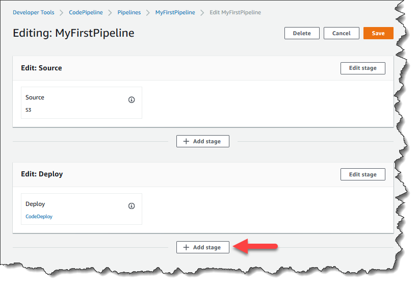
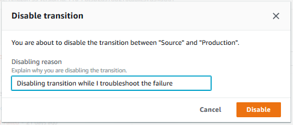

# Tutorial: Create a simple pipeline (S3 bucket)

The easiest way to create a pipeline is to use the **Create pipeline**
wizard in the AWS CodePipeline console.

In this tutorial, you create a two-stage pipeline that uses a versioned S3 source bucket and
CodeDeploy to release a sample application.

###### Note

When Amazon S3 is the source provider for your pipeline, you may zip your source file or files
into a single .zip and upload the .zip to your source bucket. You may also upload a single
unzipped file; however, downstream actions that expect a .zip file will fail.

###### Important

As part of creating a pipeline, an S3 artifact bucket provided by the customer will be
used by CodePipeline for artifacts. (This is different from the bucket used for an S3 source action.)
If the S3 artifact bucket is in a different account from the account for your pipeline, make
sure that the S3 artifact bucket is owned by AWS accounts that are safe and will be
dependable.

After you create this simple pipeline, you add another stage and then disable and enable the
transition between stages.

###### Important

Many of the actions you add to your pipeline in this procedure involve AWS resources that you need to create before you create the pipeline. AWS resources for your source actions must always be created in the same AWS Region
where you create your pipeline. For example, if you create your pipeline in the US East (Ohio)
Region, your CodeCommit repository must be in the US East (Ohio) Region.

You can add cross-region actions when you create your pipeline. AWS resources for cross-region actions must be in the same AWS Region where you plan to execute the action.
For more information, see [Add a cross-Region action in CodePipeline](actions-create-cross-region.md "actions-create-cross-region.md").

Before you begin, you should complete the prerequisites in [Getting started with CodePipeline](getting-started-codepipeline.md "getting-started-codepipeline.md").

###### Topics

- [Step 1: Create an S3 source bucket for your
  application](#s3-create-s3-bucket "#s3-create-s3-bucket")
- [Step 2: Create Amazon EC2 Windows instances and install the
  CodeDeploy agent](#S3-create-instances "#S3-create-instances")
- [Step 3: Create an application in CodeDeploy](#S3-create-deployment "#S3-create-deployment")
- [Step 4: Create your first pipeline in CodePipeline](#s3-create-pipeline "#s3-create-pipeline")
- [(Optional) Step 5: Add another stage to your pipeline](#s3-add-stage "#s3-add-stage")
- [(Optional) Step 6: Disable and enable transitions
  between stages in CodePipeline](#s3-configure-transitions "#s3-configure-transitions")
- [Step 7: Clean up resources](#s3-clean-up "#s3-clean-up")

## Step 1: Create an S3 source bucket for your

application

You can store your source files or applications in any versioned location. In this
tutorial, you create an S3 bucket for the sample application files and enable versioning on
that bucket. After you have enabled versioning, you copy the sample applications to that
bucket.

###### To create an S3 bucket

1. Sign in to the console at AWS Management Console. Open the S3 console.
2. Choose **Create bucket**.
3. In **Bucket name**, enter a name for your bucket (for example,
   `awscodepipeline-demobucket-example-date`).

###### Note

Because all bucket names in Amazon S3 must be unique, use one of your own, not the name
shown in the example. You can change the example name just by adding the date to it.
Make a note of this name because you need it for the rest of this tutorial.

In **Region**, choose the Region where you intend to create your
pipeline, such as **US West (Oregon)**, and then choose
**Create bucket**. 4. After the bucket is created, a success banner displays. Choose **Go to bucket
details**. 5. On the **Properties** tab, choose **Versioning**.
Choose **Enable versioning**, and then choose
**Save**.

When versioning is enabled, Amazon S3 saves every version of every object in the
bucket. 6. On the **Permissions** tab, leave the defaults. For more information
about S3 bucket and object permissions, see [Specifying
Permissions in a Policy](../../../AmazonS3/latest/dev/using-with-s3-actions.md "../../../AmazonS3/latest/dev/using-with-s3-actions.md"). 7. Next, download a sample and save it into a folder or directory on your local
computer.

    1. Choose one of the following. Choose `SampleApp_Windows.zip` if
     you want to follow the steps in this tutorial for Windows Server instances.


    	* If you want to deploy to Amazon Linux instances using CodeDeploy, download the sample
    	 application here: [SampleApp\_Linux.zip](samples/SampleApp_Linux.md "samples/SampleApp_Linux.md").
    	* If you want to deploy to Windows Server instances using CodeDeploy, download the
    	 sample application here: [SampleApp\_Windows.zip](samples/SampleApp_Windows.md "samples/SampleApp_Windows.md").
    The sample application contains the following files for deploying with CodeDeploy:


    	* `appspec.yml` – The application specification file (AppSpec
    	 file) is a [YAML](http://www.yaml.org "http://www.yaml.org")-formatted file used by
    	 CodeDeploy to manage a deployment. For more information about the AppSpec file, see
    	 [CodeDeploy AppSpec File
    	 reference](../../../codedeploy/latest/userguide/reference-appspec-file.md "../../../codedeploy/latest/userguide/reference-appspec-file.md") in the *AWS CodeDeploy User Guide*.
    	* `index.html` – The index file contains the home page
    	 for the deployed sample application.
    	* `LICENSE.txt` – The license file contains license
    	 information for the sample application.
    	* Files for scripts – The sample application uses scripts to write text
    	 files to a location on your instance. One file is written for each of several
    	 CodeDeploy deployment lifecycle events as follows:


    		+ (Linux sample only) `scripts` folder – The
    		 folder contains the following shell scripts to install dependencies and start
    		 and stop the sample application for the automated deployment:
    		 `install_dependencies`, `start_server`, and
    		 `stop_server`.
    		+ (Windows sample only) `before-install.bat` –
    		 This is a batch script for the `BeforeInstall` deployment lifecycle
    		 event, which will run to remove old files written during previous deployments
    		 of this sample and create a location on your instance to which to write the
    		 new files.
    2. Download the compressed (zipped) file. Do not unzip the file.

8. In the Amazon S3 console, for your bucket, upload the file:
   1. Choose **Upload**.
   2. Drag and drop the file or choose **Add files** and browse for the
      file.
   3. Choose **Upload**.

## Step 2: Create Amazon EC2 Windows instances and install the

CodeDeploy agent

###### Note

This tutorial provides sample steps for creating Amazon EC2 Windows instances. For sample
steps to create Amazon EC2 Linux instances, see [Step 3: Create an Amazon EC2 Linux instance and
install the CodeDeploy agent](tutorials-simple-codecommit.md#codecommit-create-deployment "tutorials-simple-codecommit.md#codecommit-create-deployment"). When prompted for the number of instances
to create, specify **2** instances.

In this step, you create the Windows Server Amazon EC2 instances to which you will deploy a sample
application. As part of this process, you create an instance role with policies that allow
install and management of the CodeDeploy agent on the instances. The CodeDeploy agent is a software
package that enables an instance to be used in CodeDeploy deployments. You also attach policies
that allow the instance to fetch files that the CodeDeploy agent uses to deploy your application
and to allow the instance to be managed by SSM.

###### To create an instance role

1. Open the IAM console at [https://console.aws.amazon.com/iam/](https://console.aws.amazon.com/iam/ "https://console.aws.amazon.com/iam/")).
2. From the console dashboard, choose **Roles**.
3. Choose **Create role**.
4. Under **Select type of trusted entity**, select
   **AWS service**. Under **Choose a use case**, select
   **EC2**, and then choose **Next: Permissions**.
5. Search for and select the policy named
   **`AmazonEC2RoleforAWSCodeDeploy`**.
6. Search for and select the policy named
   **`AmazonSSMManagedInstanceCore`**. Choose **Next:
   Tags**.
7. Choose **Next: Review**. Enter a name for the role (for example,
   `EC2InstanceRole`).

###### Note

Make a note of your role name for the next step. You choose this role when you are
creating your instance.

Choose **Create role**.

###### To launch instances

1. Open the Amazon EC2 console at
   [https://console.aws.amazon.com/ec2/](https://console.aws.amazon.com/ec2/ "https://console.aws.amazon.com/ec2/").
2. From the side navigation, choose **Instances**, and select
   **Launch instances** from the top of the page.
3. Under **Name and tags**, in **Name**, enter
   `MyCodePipelineDemo`. This assigns the instances a tag
   **Key** of `Name` and a tag
   **Value** of `MyCodePipelineDemo`. Later, you
   create a CodeDeploy application that deploys the sample application to the instances. CodeDeploy
   selects instances to deploy based on the tags.
4. Under **Application and OS Images (Amazon Machine Image)**, choose
   the **Windows** option. (This AMI is described as the **Microsoft
   Windows Server 2019 Base** and is labeled "Free tier eligible" and can be found
   under **Quick Start**..)
5. Under **Instance type**, choose the free tier eligible
   `t2.micro` type as the hardware configuration for your instance.
6. Under **Key pair (login)**, choose a key pair or create one.

You can also choose **Proceed without a key pair**.

###### Note

For the purposes of this tutorial, you can proceed without a key pair. To use SSH to
connect to your instances, create or use a key pair. 7. Under **Network settings**, do the following.

In **Auto-assign Public IP**, make sure the status is
**Enable**.

    * Next to **Assign a security group**, choose **Create a
     new security group**.
    * In the row for **SSH**, under **Source type**,
     choose **My IP**.
    * Choose **Add security group**, choose **HTTP**,
     and then under **Source type**, choose **My
     IP**.

8. Expand **Advanced details**. In **IAM instance
   profile**, choose the IAM role you created in the previous procedure (for
   example, `EC2InstanceRole`).
9. Under **Summary**, under **Number of instances**,
   enter `2`..
10. Choose **Launch instance**.
11. Choose **View all instances** to close the confirmation page and
    return to the console.
12. You can view the status of the launch on the **Instances** page. When
    you launch an instance, its initial state is `pending`. After the instance
    starts, its state changes to `running`, and it receives a public DNS name. (If
    the **Public DNS** column is not displayed, choose the **Show/Hide** icon, and then select **Public
    DNS**.)
13. It can take a few minutes for the instance to be ready for you to connect to it. Check
    that your instance has passed its status checks. You can view this information in the
    **Status Checks** column.

## Step 3: Create an application in CodeDeploy

In CodeDeploy, an _application_ is an identifier, in the form of a name, for
the code you want to deploy. CodeDeploy uses this name to ensure the correct combination of
revision, deployment configuration, and deployment group are referenced during a deployment.
You select the name of the CodeDeploy application you create in this step when you create your
pipeline later in this tutorial.

You first create a service role for CodeDeploy to use. If you have already created a service
role, you do not need to create another one.

###### To create a CodeDeploy service role

1. Open the IAM console at [https://console.aws.amazon.com/iam/](https://console.aws.amazon.com/iam/ "https://console.aws.amazon.com/iam/")).
2. From the console dashboard, choose **Roles**.
3. Choose **Create role**.
4. Under **Select trusted entity**, choose
   **AWS service**. Under **Use case**, choose
   **CodeDeploy**. Choose **CodeDeploy** from the options
   listed. Choose **Next**. The `AWSCodeDeployRole` managed
   policy is already attached to the role.
5. Choose **Next**.
6. Enter a name for the role (for example, `CodeDeployRole`), and
   then choose **Create role**.

###### To create an application in CodeDeploy

1. Open the CodeDeploy console at [https://console.aws.amazon.com/codedeploy](https://console.aws.amazon.com/codedeploy "https://console.aws.amazon.com/codedeploy").
2. If the **Applications** page does not appear, on the AWS CodeDeploy menu,
   choose **Applications**.
3. Choose **Create application**.
4. In **Application name**, enter `MyDemoApplication`.
5. In **Compute Platform**, choose
   **EC2/On-premises**.
6. Choose **Create application**.

###### To create a deployment group in CodeDeploy

1. On the page that displays your application, choose **Create deployment
   group**.
2. In **Deployment group name**, enter
   `MyDemoDeploymentGroup`.
3. In **Service role**, choose the service role you created earlier. You
   must use a service role that trusts AWS CodeDeploy with, at minimum, the trust and permissions
   described in [Create a
   Service Role for CodeDeploy](../../../codedeploy/latest/userguide/getting-started-create-service-role.md "../../../codedeploy/latest/userguide/getting-started-create-service-role.md"). To get the service role ARN, see [Get the Service Role ARN (Console)](../../../codedeploy/latest/userguide/how-to-create-service-role.md#getting-started-get-service-role-console "../../../codedeploy/latest/userguide/how-to-create-service-role.md#getting-started-get-service-role-console").
4. Under **Deployment type**, choose
   **In-place**.
5. Under **Environment configuration**, choose **Amazon EC2
   Instances**. Choose **Name** in the **Key**
   field, and in the **Value** field, enter
   `MyCodePipelineDemo`.

###### Important

You must choose the same value for the **Name** key here that you
assigned to your EC2 instances when you created them. If you tagged your instances with
something other than `MyCodePipelineDemo`, be sure to use it
here. 6. Under **Agent configuration with AWS Systems Manager**, choose
**Now and schedule updates**. This installs the agent on the instance.
The Windows instance is already configured with the SSM agent and will now be updated with
the CodeDeploy agent. 7. Under **Deployment settings**, choose
`CodeDeployDefault.OneAtaTime`. 8. Under **Load Balancer**, make sure the **Enable load
balancing** box is not selected. You do not need to set up a load balancer or
choose a target group for this example. After you de-select the checkbox, the load
balancer options do not display. 9. In the **Advanced** section, leave the defaults. 10. Choose **Create deployment group**.

## Step 4: Create your first pipeline in CodePipeline

In this part of the tutorial, you create the pipeline. The sample runs automatically
through the pipeline.

###### To create a CodePipeline automated release process

1. Sign in to the AWS Management Console and open the CodePipeline console at [http://console.aws.amazon.com/codesuite/codepipeline/home](http://console.aws.amazon.com/codesuite/codepipeline/home "http://console.aws.amazon.com/codesuite/codepipeline/home").
2. On the **Welcome** page, **Getting started** page,
   or the **Pipelines** page, choose **Create
   pipeline**.
3. On the **Step 1: Choose creation option** page, under
   **Creation options**, choose the **Build custom
   pipeline** option. Choose **Next**.
4. In **Step 2: Choose pipeline settings**, in **Pipeline
   name**, enter `MyFirstPipeline`.

###### Note

If you choose another name for your pipeline, be sure to use that name instead of
`MyFirstPipeline` for the rest of this tutorial. After
you create a pipeline, you cannot change its name. Pipeline names are subject to some
limitations. For more information, see [Quotas in AWS CodePipeline](limits.md "limits.md"). 5. CodePipeline provides V1 and V2 type pipelines, which differ in characteristics and price.
The V2 type is the only type you can choose in the console. For more information, see
[pipeline types](pipeline-types-planning.md "pipeline-types-planning.md"). For information about pricing for CodePipeline, see [Pricing](https://aws.amazon.com/codepipeline/pricing/ "https://aws.amazon.com/codepipeline/pricing/"). 6. In **Service role**, do one of the following:

    * Choose **New service role** to allow CodePipeline to create a new
     service role in IAM.
    * Choose **Existing service role** to use a service role already
     created in IAM. In **Role name**, choose your service role from the
     list.

7. Leave the settings under **Advanced settings** at their defaults, and
   then choose **Next**.
8. In **Step 3: Add source stage**, in **Source
   provider**, choose **Amazon S3**. In **Bucket**,
   enter the name of the S3 bucket you created in [Step 1: Create an S3 source bucket for your
   application](#s3-create-s3-bucket "#s3-create-s3-bucket"). In **S3 object key**, enter the
   object key with or without a file path, and remember to include the file extension. For
   example, for `SampleApp_Windows.zip`, enter the sample file name as shown in
   this example:

```
SampleApp_Windows.zip
```

Choose **Next step**.

Under **Change detection options**, leave the defaults. This allows
CodePipeline to use Amazon CloudWatch Events to detect changes in your source bucket.

Choose **Next**. 9. In **Step 4: Add build stage**, choose **Skip build
stage**, and then accept the warning message by choosing
**Skip** again. Choose **Next**. 10. In **Step 5: Add test stage**, choose **Skip test
stage**, and then accept the warning message by choosing
**Skip** again.

Choose **Next**. 11. In **Step 6: Add deploy stage**, in **Deploy
provider**, choose **CodeDeploy** . The
**Region** field defaults to the same AWS Region as your pipeline. In
**Application name**, enter `MyDemoApplication`, or choose
the **Refresh** button, and then choose the application name from the
list. In **Deployment group**, enter
`MyDemoDeploymentGroup`, or choose it from the list, and then
choose **Next**.

###### Note

The name Deploy is the name given by default to the stage created in the
**Step 4: Add deploy stage** step, just as Source is the name given
to the first stage of the pipeline. 12. In **Step 7: Review**, review the information, and then choose
**Create pipeline**. 13. The pipeline starts to run. You can view progress and success and failure messages as
the CodePipeline sample deploys a webpage to each of the Amazon EC2 instances in the CodeDeploy
deployment.

Congratulations! You just created a simple pipeline in CodePipeline. The pipeline has two
stages:

- A source stage named **Source**, which detects changes in the
  versioned sample application stored in the S3 bucket and pulls those changes into the
  pipeline.
- A **Deploy** stage that deploys those changes to EC2 instances with
  CodeDeploy.

Now, verify the results.

###### To verify your pipeline ran successfully

1. View the initial progress of the pipeline. The status of each stage changes from
   **No executions yet** to **In Progress**, and then to
   either **Succeeded** or **Failed**. The pipeline should
   complete the first run within a few minutes.
2. After **Succeeded** is displayed for the action status, in the status
   area for the **Deploy** stage, choose **Details**. This
   opens the CodeDeploy console.
3. In the **Deployment group** tab, under **Deployment lifecycle
   events**, choose an instance ID. This opens the EC2 console.
4. On the **Description** tab, in **Public DNS**, copy
   the address, and then paste it into the address bar of your web browser. View the index
   page for the sample application you uploaded to your S3 bucket.

The web page displays for the sample application you uploaded to your S3
bucket.

For more information about stages, actions, and how pipelines work, see [CodePipeline concepts](concepts.md "concepts.md").

## (Optional) Step 5: Add another stage to your pipeline

Now add another stage in the pipeline to deploy from staging servers to production servers
using CodeDeploy. First, you create another deployment group in the CodePipelineDemoApplication in CodeDeploy.
Then you add a stage that includes an action that uses this deployment group. To add another
stage, you use the CodePipeline console or the AWS CLI to retrieve and manually edit the structure of
the pipeline in a JSON file, and then run the **update-pipeline** command to
update the pipeline with your changes.

###### Topics

- [Create a second deployment group in CodeDeploy](#s3-add-stage-part-1 "#s3-add-stage-part-1")
- [Add the deployment group as another stage in your
  pipeline](#s3-add-stage-part-2 "#s3-add-stage-part-2")

### Create a second deployment group in CodeDeploy

###### Note

In this part of the tutorial, you create a second deployment group, but deploy to the
same Amazon EC2 instances as before. This is for demonstration purposes only. It is purposely
designed to fail to show you how errors are displayed in CodePipeline.

###### To create a second deployment group in CodeDeploy

1. Open the CodeDeploy console at [https://console.aws.amazon.com/codedeploy](https://console.aws.amazon.com/codedeploy "https://console.aws.amazon.com/codedeploy").
2. Choose **Applications**, and in the list of applications, choose
   `MyDemoApplication`.
3. Choose the **Deployment groups** tab, and then choose
   **Create deployment group**.
4. On the **Create deployment group** page, in **Deployment
   group name**, enter a name for the second deployment group (for example,
   `CodePipelineProductionFleet`).
5. In **Service Role**, choose the same CodeDeploy service role you used
   for the initial deployment (not the CodePipeline service role).
6. Under **Deployment type**, choose
   **In-place**.
7. Under **Environment configuration**, choose **Amazon EC2 Instances**. Choose **Name** in the
   **Key** box, and in the **Value** box, choose
   `MyCodePipelineDemo` from the list. Leave the default configuration for
   **Deployment settings**.
8. Under **Deployment configuration**, choose
   `CodeDeployDefault.OneAtaTime`.
9. Under **Load Balancer**, clear **Enable load
   balancing**.
10. Choose **Create deployment group**.

### Add the deployment group as another stage in your

pipeline

Now that you have another deployment group, you can add a stage that uses this
deployment group to deploy to the same EC2 instances you used earlier. You can use the CodePipeline
console or the AWS CLI to add this stage.

###### Topics

- [Create a third stage (console)](#s3-add-stage-part-2-console "#s3-add-stage-part-2-console")
- [Create a third stage (CLI)](#s3-add-stage-part-2-cli "#s3-add-stage-part-2-cli")

#### Create a third stage (console)

You can use the CodePipeline console to add a new stage that uses the new deployment group.
Because this deployment group is deploying to the EC2 instances you've already used, the
deploy action in this stage fails.

1. Sign in to the AWS Management Console and open the CodePipeline console at [http://console.aws.amazon.com/codesuite/codepipeline/home](http://console.aws.amazon.com/codesuite/codepipeline/home "http://console.aws.amazon.com/codesuite/codepipeline/home").
2. In **Name**, choose the name of the pipeline you created,
   MyFirstPipeline.
3. On the pipeline details page, choose **Edit**.
4. On the **Edit** page, choose **+ Add stage** to
   add a stage immediately after the Deploy stage.

 5. In **Add stage**, in **Stage name**, enter
`Production`. Choose **Add stage**. 6. In the new stage, choose **+ Add action group**. 7. In **Edit action**, in **Action name**, enter
`Deploy-Second-Deployment`. In **Action
provider**, under **Deploy**, choose
**CodeDeploy**. 8. In the CodeDeploy section, in **Application name**, choose
`MyDemoApplication` from the drop-down list, as you did when you created
the pipeline. In **Deployment group**, choose the deployment group
you just created, `CodePipelineProductionFleet`. In **Input
artifacts**, choose the input artifact from the source action. Choose
**Save**. 9. On the **Edit** page, choose **Save**. In
**Save pipeline changes**, choose **Save**. 10. Although the new stage has been added to your pipeline, a status of **No
executions yet** is displayed because no changes have triggered another run
of the pipeline. You must manually rerun the last revision to see how the edited
pipeline runs. On the pipeline details page, choose
**Release change**, and then choose
**Release** when prompted. This runs the most recent revision
available in each source location specified in a source action through the pipeline.

Alternatively, to use the AWS CLI to rerun the pipeline, from a terminal on your
local Linux, macOS, or Unix machine, or a command prompt on your local Windows machine, run the
**start-pipeline-execution** command, specifying the name of the
pipeline. This runs the application in your source bucket through the pipeline for a
second time.

```
aws codepipeline start-pipeline-execution --name MyFirstPipeline
```

This command returns a `pipelineExecutionId` object. 11. Return to the CodePipeline console and in the list of pipelines, choose
**MyFirstPipeline** to open the view page.

The pipeline shows three stages and the state of the artifact running through
those three stages. It might take up to five minutes for the pipeline to run through
all stages. You see the deployment succeeds on the first two stages, just as before,
but the **Production** stage shows the
**Deploy-Second-Deployment** action failed. 12. In the **Deploy-Second-Deployment** action, choose
**Details**. You are redirected to the page for the CodeDeploy
deployment. In this case, the failure is the result of the first instance group
deploying to all of the EC2 instances, leaving no instances for the second deployment
group.

###### Note

This failure is by design, to demonstrate what happens when there is a failure
in a pipeline stage.

#### Create a third stage (CLI)

Although using the AWS CLI to add a stage to your pipeline is more complex than using
the console, it provides more visibility into the structure of the pipeline.

###### To create a third stage for your pipeline

1. Open a terminal session on your local Linux, macOS, or Unix machine, or a command prompt on
   your local Windows machine, and run the **get-pipeline** command to
   display the structure of the pipeline you just created. For
   `MyFirstPipeline`, you would type the following
   command:

```
aws codepipeline get-pipeline --name "`MyFirstPipeline`"
```

This command returns the structure of MyFirstPipeline. The first part of
the output should look similar to the following:

```
{
    "pipeline": {
        "roleArn": "arn:aws:iam::80398EXAMPLE:role/AWS-CodePipeline-Service",
        "stages": [
    ...
```

The final part of the output includes the pipeline metadata and should look
similar to the following:

```
    ...
        ],
        "artifactStore": {
            "type": "S3"
            "location": "amzn-s3-demo-bucket",
        },
        "name": "MyFirstPipeline",
        "version": 4
    },
    "metadata": {
        "pipelineArn": "arn:aws:codepipeline:us-east-2:80398EXAMPLE:MyFirstPipeline",
        "updated": 1501626591.112,
        "created": 1501626591.112
    }
}
```

2. Copy and paste this structure into a plain-text editor, and save the file as
   `pipeline.json`. For convenience, save this file in the
   same directory where you run the **aws codepipeline** commands.

###### Note

You can pipe the JSON directly into a file with the
**get-pipeline** command as follows:

```
aws codepipeline get-pipeline --name `MyFirstPipeline` >`pipeline.json`
```

3. Copy the **Deploy** stage section and paste it after the first
   two stages. Because it is a deploy stage, just like the **Deploy**
   stage, you use it as a template for the third stage.
4. Change the name of the stage and the deployment group details.

The following example shows the JSON you add to the pipeline.json file after
the **Deploy** stage. Edit the emphasized elements with new values.
Remember to include a comma to separate the **Deploy** and
**Production** stage definitions.

```
,
{
    "name": "`Production`",
     "actions": [
        {
         "inputArtifacts": [
             {
              "name": "MyApp"
             }
           ],
          "name": "`Deploy-Second-Deployment`",
          "actionTypeId": {
              "category": "Deploy",
              "owner": "AWS",
              "version": "1",
              "provider": "CodeDeploy"
              },
         "outputArtifacts": [],
         "configuration": {
              "ApplicationName": "CodePipelineDemoApplication",
              "DeploymentGroupName": "`CodePipelineProductionFleet`"
               },
         "runOrder": 1
        }
    ]
}
```

5. If you are working with the pipeline structure retrieved using the
   **get-pipeline** command, you must remove the `metadata`
   lines from the JSON file. Otherwise, the **update-pipeline** command
   cannot use it. Remove the `"metadata": { }` lines and the
   `"created"`, `"pipelineARN"`, and `"updated"`
   fields.

For example, remove the following lines from the structure:

```
"metadata": {
  "pipelineArn": "arn:aws:codepipeline:`region`:`account-ID`:`pipeline-name`",
  "created": "`date`",
  "updated": "`date`"
  }
```

Save the file. 6. Run the **update-pipeline** command, specifying the pipeline JSON
file, similar to the following:

```
aws codepipeline update-pipeline --cli-input-json file://pipeline.json
```

This command returns the entire structure of the updated pipeline.

###### Important

Be sure to include `file://` before the file name. It is required in this command. 7. Run the **start-pipeline-execution** command, specifying the name
of the pipeline. This runs the application in your source bucket through the pipeline
for a second time.

```
aws codepipeline start-pipeline-execution --name MyFirstPipeline
```

This command returns a `pipelineExecutionId` object. 8. Open the CodePipeline console and choose **MyFirstPipeline**
from the list of pipelines.

The pipeline shows three stages and the state of the artifact running through
those three stages. It might take up to five minutes for the pipeline to run through
all stages. Although the deployment succeeds on the first two stages, just as before,
the **Production** stage shows that the
**Deploy-Second-Deployment** action failed. 9. In the **Deploy-Second-Deployment** action, choose
**Details** to see details of the failure. You are redirected to
the details page for the CodeDeploy deployment. In this case, the failure is the result of
the first instance group deploying to all of the EC2 instances, leaving no instances
for the second deployment group.

###### Note

This failure is by design, to demonstrate what happens when there is a failure
in a pipeline stage.

## (Optional) Step 6: Disable and enable transitions

between stages in CodePipeline

You can enable or disable the transition between stages in a pipeline. Disabling the
transition between stages allows you to manually control transitions between one stage and
another. For example, you might want to run the first two stages of a pipeline, but disable
transitions to the third stage until you are ready to deploy to production, or while you
troubleshoot a problem or failure with that stage.

###### To disable and enable transitions between stages in a CodePipeline pipeline

1. Open the CodePipeline console and choose **MyFirstPipeline** from
   the list of pipelines.
2. On the details page for the pipeline, choose the **Disable
   transition** button between the second stage (**Deploy**) and
   the third stage that you added in the previous section
   (**Production**).
3. In **Disable transition**, enter a reason for disabling the
   transition between the stages, and then choose **Disable**.

The arrow between stages displays an icon and color change, and the **Enable
transition** button.

 4. Upload your sample again to the S3 bucket. Because the bucket is versioned, this
change starts the pipeline. 5. Return to the details page for your pipeline and watch the status of the stages. The
pipeline view changes to show progress and success on the first two stages, but no changes
occur on the third stage. This process might take a few minutes. 6. Enable the transition by choosing the **Enable transition** button
between the two stages. In the **Enable transition** dialog box, choose
**Enable**. The stage starts running in a few minutes and attempts to
process the artifact that has already been run through the first two stages of the
pipeline.

###### Note

If you want this third stage to succeed, edit the CodePipelineProductionFleet deployment
group before you enable the transition, and specify a different set of EC2 instances
where the application is deployed. For more information about how to do this, see [Change deployment group settings](../../../codedeploy/latest/userguide/how-to-change-deployment-group-settings.md "../../../codedeploy/latest/userguide/how-to-change-deployment-group-settings.md"). If you create more EC2 instances, you might
incur additional costs.

## Step 7: Clean up resources

You can use some of the resources you created in this tutorial for the [Tutorial: Create a four-stage pipeline](tutorials-four-stage-pipeline.md "tutorials-four-stage-pipeline.md"). For
example, you can reuse the CodeDeploy application and deployment. You can configure a build action
with a provider such as CodeBuild, which is a fully managed build service in the cloud. You can
also configure a build action that uses a provider with a build server or system, such as
Jenkins.

However, after you complete this and any other tutorials, you should delete the pipeline
and the resources it uses, so that you are not charged for the continued use of those
resources. First, delete the pipeline, then the CodeDeploy application and its associated Amazon EC2
instances, and finally, the S3 bucket.

###### To clean up the resources used in this tutorial

1. To clean up your CodePipeline resources, follow the instructions in [Delete a pipeline in
   AWS CodePipeline](pipelines-delete.md "pipelines-delete.md").
2. To clean up your CodeDeploy resources, follow the instructions in [To clean up resources (console)](../../../codedeploy/latest/userguide/tutorials-wordpress-clean-up.md#tutorials-wordpress-clean-up-console "../../../codedeploy/latest/userguide/tutorials-wordpress-clean-up.md#tutorials-wordpress-clean-up-console").
3. To delete the S3 bucket, follow the instructions in [Deleting or emptying a bucket](../../../AmazonS3/latest/userguide/delete-or-empty-bucket.md "../../../AmazonS3/latest/userguide/delete-or-empty-bucket.md"). If
   you do not intend to create more pipelines, delete the S3 bucket created for storing your
   pipeline artifacts. For more information about this bucket, see [CodePipeline concepts](concepts.md "concepts.md").
