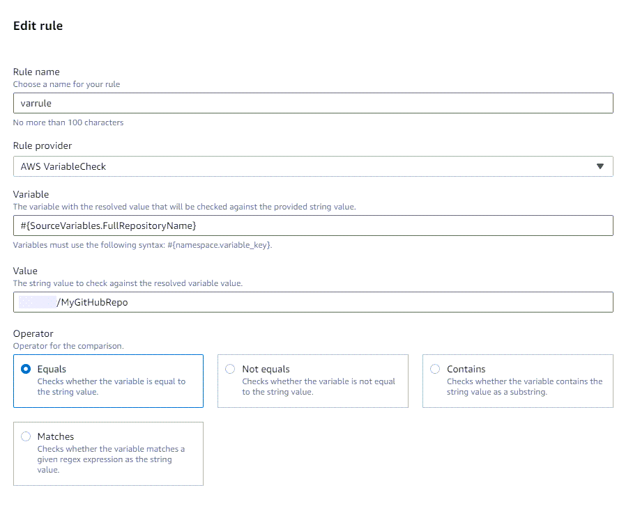
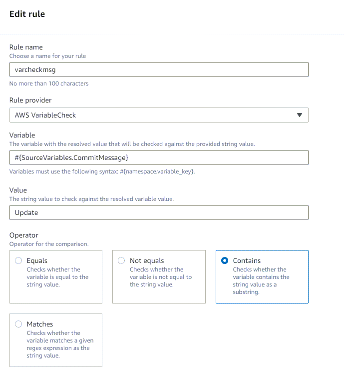
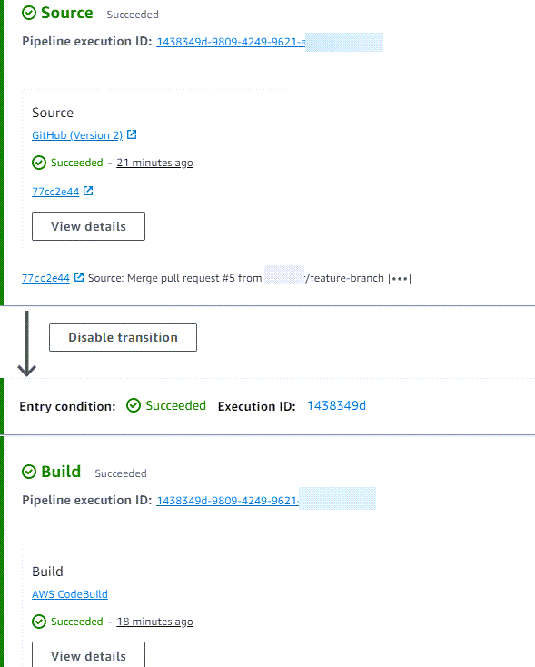
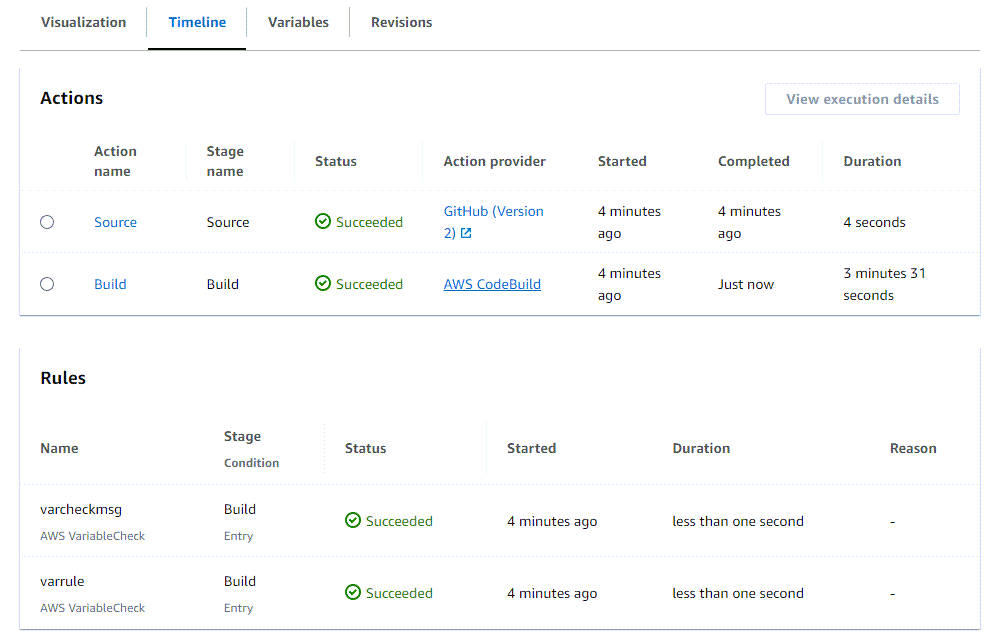

# Tutorial: Create a variable check rule for a

pipeline as an entry condition

In this tutorial, you configure a pipeline that continuously delivers files using GitHub
as the source action provider in your source stage. The completed pipeline detects changes
when you make a change to the source files in your source repository. The pipeline runs and
then checks the output variables against the source repository name and branch name provided
in the condition for entry to the build stage.

###### Important

As part of creating a pipeline, an S3 artifact bucket provided by the customer will be
used by CodePipeline for artifacts. (This is different from the bucket used for an S3 source
action.) If the S3 artifact bucket is in a different account from the account for your
pipeline, make sure that the S3 artifact bucket is owned by AWS accounts that are safe
and will be dependable.

###### Important

Many of the actions you add to your pipeline in this procedure involve AWS resources that you need to create before you create the pipeline. AWS resources for your source actions must always be created in the same AWS Region
where you create your pipeline. For example, if you create your pipeline in the US East (Ohio)
Region, your CodeCommit repository must be in the US East (Ohio) Region.

You can add cross-region actions when you create your pipeline. AWS resources for cross-region actions must be in the same AWS Region where you plan to execute the action.
For more information, see [Add a cross-Region action in CodePipeline](actions-create-cross-region.md "actions-create-cross-region.md").

This example uses the example pipeline with a GitHub (Version2) source action and a CodeBuild
build action where the entry condition for the build stage will check for variables.

## Prerequisites

Before you begin, you must do the following:

- Create a GitHub repository with your GitHub account.
- Have your GitHub credentials ready. When you use the AWS Management Console to set up a
  connection, you are asked to sign in with your GitHub credentials.
- A connection to your repository to set up GitHub (via GitHub App) as the source
  action for your pipeline. To create a connection to your GitHub repository, see
  [GitHub connections](connections-github.md "connections-github.md").

## Step 1: Create sample source file and add to

your GitHub repository

In this section, you create and add your example source file to the repository that
the pipeline uses for your source stage. For this example, you produce and add the
following:

- A `README.md` file.

After you create your GitHub repository, use these steps to add your README
file.

1. Log in to your GitHub repository and choose your repository.
2. To create a new file, choose **Add file**, and then choose
   **Create new file**. Name the file
   `README.md` and add the following text.

```
This is a GitHub repository!
```

3. Choose **Commit changes**. For the purposes of this tutorial,
   add a commit message that contains the capitalized word "Update" as in the
   following example:

```
Update to source files
```

###### Note

The rule check for strings is case-sensitive.

Make sure the `README.md` file is at the root level of your
repository.

## Step 2: Create your pipeline

In this section, you create a pipeline with the following actions:

- A source stage with a connection to your GitHub repository and action.
- A CodeBuild build stage where the stage has an On Entry condition configured
  for the variable check rule.

###### To create a pipeline with the wizard

1. Sign in to the CodePipeline console at [https://console.aws.amazon.com/codepipeline/](https://console.aws.amazon.com/codepipeline/ "https://console.aws.amazon.com/codepipeline/").
2. On the **Welcome** page, **Getting started**
   page, or **Pipelines** page, choose **Create
   pipeline**.
3. On the **Step 1: Choose creation option** page, under
   **Creation options**, choose the **Build custom
   pipeline** option. Choose **Next**.
4. In **Step 2: Choose pipeline settings**, in
   **Pipeline name**, enter
   `MyVarCheckPipeline`.
5. CodePipeline provides V1 and V2 type pipelines, which differ in characteristics and
   price. The V2 type is the only type you can choose in the console. For more
   information, see [pipeline types](pipeline-types-planning.md "pipeline-types-planning.md"). For information about pricing for CodePipeline, see [Pricing](https://aws.amazon.com/codepipeline/pricing/ "https://aws.amazon.com/codepipeline/pricing/").
6. In **Service role**, choose **New service
   role**.

###### Note

If you choose instead to use your existing CodePipeline service role, make sure
that you have added the `codeconnections:UseConnection` IAM
permission to your service role policy. For instructions for the CodePipeline
service role, see [Add permissions to the the CodePipeline service role](security-iam.md#how-to-update-role-new-services "security-iam.md#how-to-update-role-new-services"). 7. Under **Advanced settings**, leave the defaults.

Choose **Next**. 8. On the **Step 3: Add source stage** page, add a source
stage:

    1. In **Source provider**, choose **GitHub
     (via GitHub App)**.
    2. Under **Connection**, choose an existing connection
     or create a new one. To create or manage a connection for your GitHub
     source action, see [GitHub connections](connections-github.md "connections-github.md").
    3. In **Repository name**, choose the name of your
     GitHub repository.
    4. In **Branch name**, choose the repository
     branch you want to use.
    5. Make sure the **No trigger** option is
     selected.Choose **Next**.

9. In **Step 4: Add build stage**, add a build stage:
   1. In **Build provider**, choose
      **AWS CodeBuild**. Allow **Region** to
      default to the pipeline Region.
   2. Choose **Create project**.
   3. In **Project name**, enter a name for this build
      project.
   4. In **Environment image**, choose **Managed
      image**. For **Operating system**, choose
      **Ubuntu**.
   5. For **Runtime**, choose
      **Standard**. For **Image**, choose
      **aws/codebuild/standard:5.0**.
   6. For **Service role**, choose **New service
      role**.

   ###### Note

   Note the name of your CodeBuild service role. You will need the role
   name for the final step in this tutorial. 7. Under **Buildspec**, for **Build
   specifications**, choose **Insert build
   commands**. Choose **Switch to editor**,
   and paste the following under **Build
   commands**.

   ```
   version: 0.2
   #env:
     #variables:
        # key: "value"
        # key: "value"
     #parameter-store:
        # key: "value"
        # key: "value"
     #git-credential-helper: yes
   phases:
     install:
       #If you use the Ubuntu standard image 2.0 or later, you must specify runtime-versions.
       #If you specify runtime-versions and use an image other than Ubuntu standard image 2.0, the build fails.
       runtime-versions:
         nodejs: 12
       #commands:
         # - command
         # - command
     #pre_build:
       #commands:
         # - command
         # - command
     build:
       commands:
         -
     #post_build:
       #commands:
         # - command
         # - command
   artifacts:
     files:
        - '*'
       # - location
     name: $(date +%Y-%m-%d)
     #discard-paths: yes
     #base-directory: location
   #cache:
     #paths:
       # - paths
   ```

   8. Choose **Continue to CodePipeline**. This returns to
      the CodePipeline console and creates a CodeBuild project that uses your build
      commands for configuration. The build project uses a service role to
      manage AWS service permissions. This step might take a couple of
      minutes.
   9. Choose **Next**.

10. In **Step 5: Add test stage**, choose **Skip test
    stage**, and then accept the warning message by choosing
    **Skip** again.

Choose **Next**. 11. On the **Step 6: Add deploy stage** page, choose
**Skip deploy stage**, and then accept the warning message
by choosing **Skip** again. Choose
**Next**. 12. On **Step 7: Review**, choose **Create
pipeline**.

## Step 2: Edit the build stage to add the

condition and rule

In this step, you edit the stage to add an On Entry condition for the variable check
rule.

1. Choose your pipeline, and then choose **Edit**. Choose to add
   an entry rule on the build stage.

In **Rule provider**, choose
**VariableCheck**. 2. In **Variable**, enter the variable or variables that you
want to check. In **Value**, enter the string value
to check against the resolved variable. In the following example screens, a rule
is created for an "equals" check, and another rule is created for a "contains"
check.



 3. Choose **Save**.

Choose **Done**.

## Step 3: Run the pipeline and view

resolved variables

In this step, you view the resolved values and results of the variable check
rule.

1. View the resolved run after the rule check is successful as shown in the
   following example.

 2. View the variable information on the **Timeline** tab.


