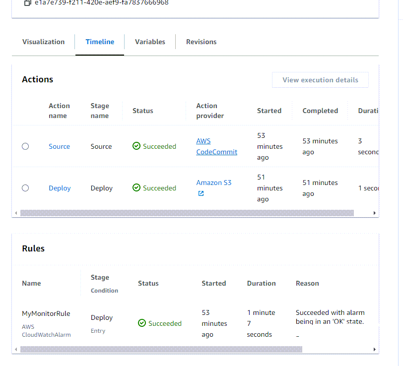

# View rule results for stage conditions in execution history

You can view the rule results for an execution where a stage condition ran a rule and
engaged a result for the stage, such as rollback or failure.

Valid status values for conditions and rules are as follows: `InProgress | Failed
 | Errored | Succeeded | Cancelled | Abandoned | Overridden`

## View rule results for stage conditions in execution history (console)

You can use the console to view the rule results for an execution where a stage
condition ran a rule and engaged a result for the stage.

###### View rule results for stage conditions (console)

1. Sign in to the AWS Management Console and open the CodePipeline console at [http://console.aws.amazon.com/codesuite/codepipeline/home](http://console.aws.amazon.com/codesuite/codepipeline/home "http://console.aws.amazon.com/codesuite/codepipeline/home").

The names and status of all pipelines associated with your AWS account
are displayed. 2. In **Name**, choose the name of the pipeline you want to
view. 3. Choose **History**, and then choose the execution. On the
history page, choose the **Timeline** tab. Under
**Rules**, view the rule results for the
execution.



## View rule results for stage conditions with `list-rule-executions`

(CLI)

You can use the CLI to view the rule results for an execution where a stage
condition ran a rule and engaged a result for the stage.

- Open a terminal (Linux, macOS, or Unix) or command prompt (Windows) and use the AWS CLI
  to run the **list-rule-executions** command for a pipeline
  named `MyPipeline`:

```
aws codepipeline list-rule-executions --pipeline-name MyFirstPipeline
```

This command returns a list of all of the completed rule executions
associated with the pipeline.

The following example shows the returned data for a pipeline with a stage
condition where the rule is named
`MyMonitorRule`.

```
{
    "ruleExecutionDetails": [
        {
            "pipelineExecutionId": "e1a7e739-f211-420e-aef9-fa7837666968",
            "ruleExecutionId": "3aafc0c7-0e1c-44f1-b357-d1b16a28e483",
            "pipelineVersion": 9,
            "stageName": "Deploy",
            "ruleName": "MyMonitorRule",
            "startTime": "2024-07-29T15:55:01.271000+00:00",
            "lastUpdateTime": "2024-07-29T15:56:08.682000+00:00",
            "status": "Succeeded",
            "input": {
                "ruleTypeId": {
                    "category": "Rule",
                    "owner": "AWS",
                    "provider": "CloudWatchAlarm",
                    "version": "1"
                },
                "configuration": {
                    "AlarmName": "CWAlarm",
                    "WaitTime": "1"
                },
                "resolvedConfiguration": {
                    "AlarmName": "CWAlarm",
                    "WaitTime": "1"
                },
                "region": "us-east-1",
                "inputArtifacts": []
            },
            "output": {
                "executionResult": {
                    "externalExecutionSummary": "Succeeded with alarm 'CWAlarm' being i
n an 'OK' state."
                }
            }
        }
```
