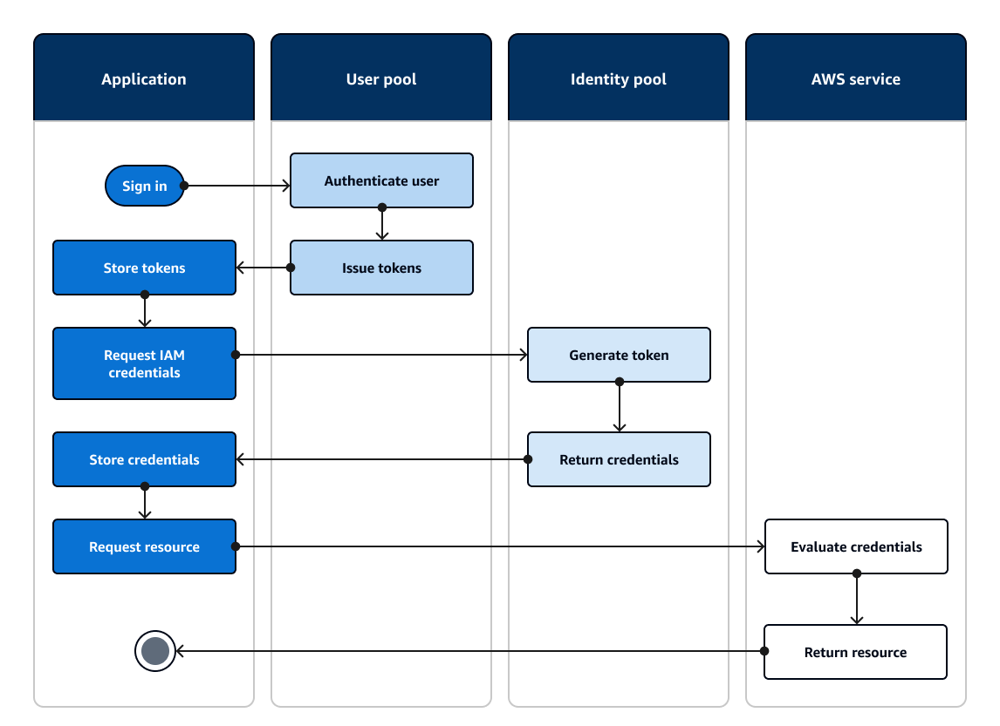

# Accessing

AWS services using an identity pool after sign-in

After your users sign in with a user pool, they can access AWS services with temporary
API credentials that are issued from an identity pool.

Your web or mobile app receives tokens from a user pool. When you configure your user pool
as an identity provider to your identity pool, the identity pool exchanges tokens for
temporary AWS credentials. These credentials can be scoped to IAM roles and their policies
that give users access to a limited set of AWS resources. For more information, see [Identity pools authentication flow](authentication-flow.md "authentication-flow.md").

The following diagram shows how an application signs in with a user pool, retrieves
identity pool credentials, and requests an asset from an AWS service.


You can use identity pool credentials to:

- Make fine-grained authorization requests to Amazon Verified Permissions with your user's own
  credentials.
- Connect to an Amazon API Gateway REST API or an AWS AppSync GraphQL API that authorizes
  connections with IAM.
- Connect to a database backend like Amazon DynamoDB or Amazon RDS that authorizes connections with
  IAM.
- Retrieve application assets from an Amazon S3 bucket.
- Initiate a session with an Amazon WorkSpaces virtual desktop.
  Identity pools don't operate exclusively within an authenticated session with a user pool.
  They also accept authentication directly from third-party identity providers and can generate
  credentials for unauthenticated guest users.

For more information about using identity pools together with user pool groups to control
access to your AWS resources, see [Adding groups to a user pool](cognito-user-pools-user-groups.md "cognito-user-pools-user-groups.md") and [Using role-based access control](role-based-access-control.md "role-based-access-control.md"). Also, for
more information about identity pools and AWS Identity and Access Management, see [Identity pools authentication flow](authentication-flow.md "authentication-flow.md").

## Setting up a user pool with the AWS Management Console

Create an Amazon Cognito user pool and make a note of the **User Pool ID** and
**App Client ID** for each of your client apps. For more information
about creating user pools, see [Getting started with user pools](getting-started-user-pools.md "getting-started-user-pools.md").

## Setting up an identity pool with the AWS Management Console

The following procedure describes how to use the AWS Management Console to integrate an identity pool
with one or more user pools and client apps.

###### To add an Amazon Cognito user pools identity provider (IdP)

1. Choose **Identity pools** from the [Amazon Cognito console](https://console.aws.amazon.com/cognito/home "https://console.aws.amazon.com/cognito/home"). Select an identity
   pool.
2. Choose the **User access** tab.
3. Select **Add identity provider**.
4. Choose **Amazon Cognito user pool**.
5. Enter a **User pool ID** and an **App client
   ID**.
6. To set the role that Amazon Cognito requests when it issues credentials to users who have
   authenticated with this provider, configure **Role settings**.
   1. You can give users from that IdP the **Default role** that you
      set up when you configured your **Authenticated role**, or you can
      **Choose role with rules**. With an Amazon Cognito user pool IdP, you can
      also **Choose role with preferred_role claim in tokens**. For more
      information about the `cognito:preferred_role` claim, see [Assigning precedence values to
      groups](cognito-user-pools-user-groups.md#assigning-precedence-values-to-groups "cognito-user-pools-user-groups.md#assigning-precedence-values-to-groups").
      1. If you chose **Choose role with rules**, enter the source
         **Claim** from your user's authentication, the
         **Operator** that you want to use to compare the claim to the
         rule, the **Value** that will cause a match to this role
         choice, and the **Role** that you want to assign when the
         **Role assignment** matches. Select **Add
         another** to create an additional rule based on a different
         condition.
      2. If you chose **Choose role with preferred_role claim in
         tokens**, Amazon Cognito issues credentials for the role in your user's
         `cognito:preferred_role` claim. If no preferred role claim is
         present, Amazon Cognito issues credentials based on your **Role
         resolution**.

   2. Choose a **Role resolution**. When your user's claims don't
      match your rules, you can deny credentials or issue credentials for your
      **Authenticated role**.

7. To change the principal tags that Amazon Cognito assigns when it issues credentials to users
   who have authenticated with this provider, configure **Attributes for access
   control**.
   - To apply no principal tags, choose **Inactive**.
   - To apply principal tags based on `sub` and `aud` claims,
     choose **Use default mappings**.
   - To create your own custom schema of attributes to principal tags, choose
     **Use custom mappings**. Then enter a **Tag
     key** that you want to source from each **Claim** that
     you want to represent in a tag.

8. Select **Save changes**.

## Integrating a user pool with an identity pool

After your app user is authenticated, add that user's identity token to the logins map
in the credentials provider. The provider name will depend on your Amazon Cognito user pool ID. It
will have the following structure:

```
cognito-idp.`<region>`.amazonaws.com/`<YOUR_USER_POOL_ID>`
```

You can derive the value for `<region>` from the
**User Pool ID**. For example, if the user pool ID is
`us-east-1_EXAMPLE1`, then the `<region>` is
`us-east-1`. If the user pool ID is `us-west-2_EXAMPLE2`, then the
`<region>` is `us-west-2`.

JavaScript

```
var cognitoUser = userPool.getCurrentUser();

if (cognitoUser != null) {
	cognitoUser.getSession(function(err, result) {
		if (result) {
			console.log('You are now logged in.');

			// Add the User's Id Token to the Cognito credentials login map.
			AWS.config.credentials = new AWS.CognitoIdentityCredentials({
				IdentityPoolId: '`YOUR_IDENTITY_POOL_ID`',
				Logins: {
					'cognito-idp.`<region>`.amazonaws.com/`<YOUR_USER_POOL_ID>`': result.getIdToken().getJwtToken()
				}
			});
		}
	});
}
```

Android

```
cognitoUser.getSessionInBackground(new AuthenticationHandler() {
	@Override
	public void onSuccess(CognitoUserSession session) {
		String idToken = session.getIdToken().getJWTToken();

		Map<String, String> logins = new HashMap<String, String>();
		logins.put("cognito-idp.`<region>`.amazonaws.com/`<YOUR_USER_POOL_ID>`", session.getIdToken().getJWTToken());
		credentialsProvider.setLogins(logins);
	}

});
```

iOS - objective-C

```
AWSServiceConfiguration *serviceConfiguration = [[AWSServiceConfiguration alloc] initWithRegion:AWSRegionUSEast1 credentialsProvider:nil];
AWSCognitoIdentityUserPoolConfiguration *userPoolConfiguration = [[AWSCognitoIdentityUserPoolConfiguration alloc] initWithClientId:@"`YOUR_CLIENT_ID`"  clientSecret:@"`YOUR_CLIENT_SECRET`" poolId:@"`YOUR_USER_POOL_ID`"];
[AWSCognitoIdentityUserPool registerCognitoIdentityUserPoolWithConfiguration:serviceConfiguration userPoolConfiguration:userPoolConfiguration forKey:@"UserPool"];
AWSCognitoIdentityUserPool *pool = [AWSCognitoIdentityUserPool CognitoIdentityUserPoolForKey:@"UserPool"];
AWSCognitoCredentialsProvider *credentialsProvider = [[AWSCognitoCredentialsProvider alloc] initWithRegionType:AWSRegionUSEast1 identityPoolId:@"`YOUR_IDENTITY_POOL_ID`" identityProviderManager:pool];
```

iOS - swift

```
let serviceConfiguration = AWSServiceConfiguration(region: .USEast1, credentialsProvider: nil)
let userPoolConfiguration = AWSCognitoIdentityUserPoolConfiguration(clientId: "`YOUR_CLIENT_ID`", clientSecret: "`YOUR_CLIENT_SECRET`", poolId: "`YOUR_USER_POOL_ID`")
AWSCognitoIdentityUserPool.registerCognitoIdentityUserPoolWithConfiguration(serviceConfiguration, userPoolConfiguration: userPoolConfiguration, forKey: "UserPool")
let pool = AWSCognitoIdentityUserPool(forKey: "UserPool")
let credentialsProvider = AWSCognitoCredentialsProvider(regionType: .USEast1, identityPoolId: "`YOUR_IDENTITY_POOL_ID`", identityProviderManager:pool)
```
