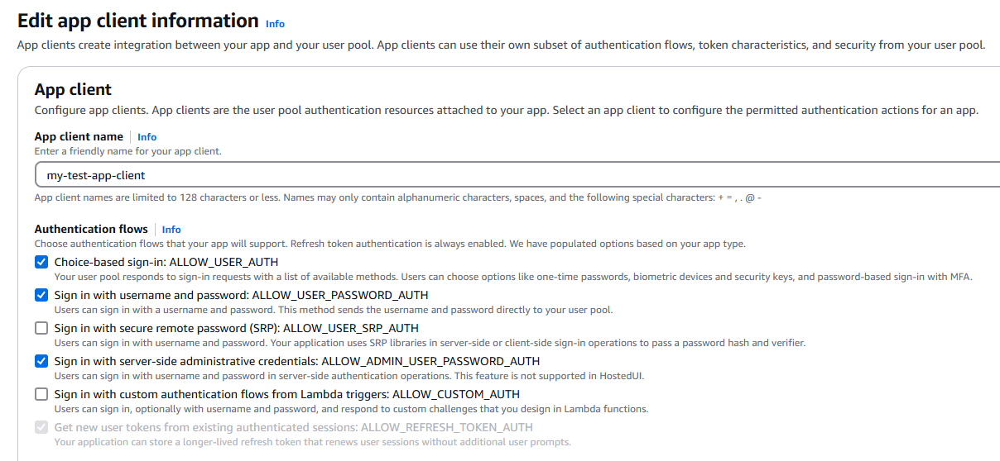
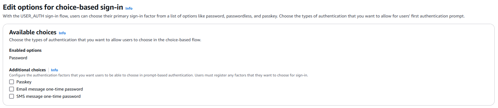
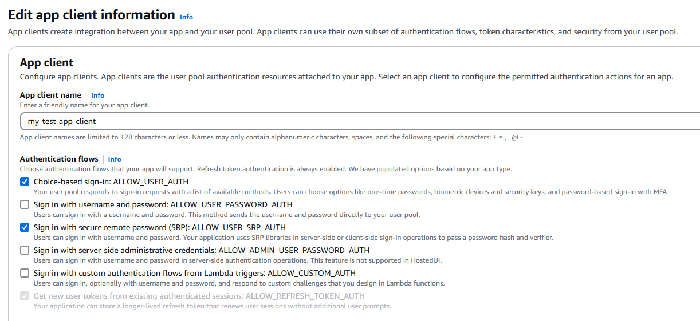

# Authentication

flows

The process of authentication with Amazon Cognito user pools can best be described as a _flow_ where users make an initial choice, submit credentials, and
respond to additional challenges. When you implement managed login authentication in your
application, Amazon Cognito manages the flow of these prompts and challenges. When you implement flows
with an AWS SDK in your application back end, you must construct the logic of requests,
prompt users for input, and respond to challenges.

As an application administrator, your user characteristics, security requirements, and
authorization model help determine how you want to permit users to sign in. Ask yourself the
following questions.

- Do I want to permit users to sign in with credentials from [other identity
  providers (IdPs)](#amazon-cognito-user-pools-authentication-flow-methods-federated "#amazon-cognito-user-pools-authentication-flow-methods-federated")?
- Is a [username and password](#amazon-cognito-user-pools-authentication-flow-methods-password "#amazon-cognito-user-pools-authentication-flow-methods-password") enough proof of identity?
- Could my authentication requests for username-password authentication be intercepted?
  Do I want my application to transmit passwords, or to [negotiate
  authentication using hashes and salts](#amazon-cognito-user-pools-authentication-flow-methods-srp "#amazon-cognito-user-pools-authentication-flow-methods-srp")?
- Do I want to permit users to skip password entry and [receive a
  one-time password](#amazon-cognito-user-pools-authentication-flow-methods-passwordless "#amazon-cognito-user-pools-authentication-flow-methods-passwordless") that signs them in?
- Do I want to permit users to sign in with a [thumbprint,
  face, or a hardware security key](#amazon-cognito-user-pools-authentication-flow-methods-passkey "#amazon-cognito-user-pools-authentication-flow-methods-passkey")?
- When do I want to require [multi-factor
  authentication (MFA)](#amazon-cognito-user-pools-authentication-flow-methods-mfa "#amazon-cognito-user-pools-authentication-flow-methods-mfa"), if at all?
- Do I want to [persist user
  sessions without re-prompting for credentials](#amazon-cognito-user-pools-authentication-flow-methods-refresh "#amazon-cognito-user-pools-authentication-flow-methods-refresh")?
- Do I want to [extend my
  authorization model](#amazon-cognito-user-pools-authentication-flow-methods-custom "#amazon-cognito-user-pools-authentication-flow-methods-custom") beyond the built-in capabilities of Amazon Cognito?
  When you have the answers to these questions, you can learn how to activate the relevant
  features and implement them in the authentication requests that your application makes.

After you set up sign-in flows for a user, you can check their current status for MFA and
[choice-based](authentication-flows-selection-sdk.md#authentication-flows-selection-choice "authentication-flows-selection-sdk.md#authentication-flows-selection-choice") authentication
factors with requests to the [GetUserAuthFactors](../../../cognito-user-identity-pools/latest/APIReference/API_GetUserAuthFactors.md "../../../cognito-user-identity-pools/latest/APIReference/API_GetUserAuthFactors.md") API operation. This operation requires authorization with the
access token of a signed-in user. It returns user authentication factors and MFA
settings.

###### Topics

- [Sign-in
  with third-party IdPs](#amazon-cognito-user-pools-authentication-flow-methods-federated "#amazon-cognito-user-pools-authentication-flow-methods-federated")
- [Sign-in
  with persistent passwords](#amazon-cognito-user-pools-authentication-flow-methods-password "#amazon-cognito-user-pools-authentication-flow-methods-password")
- [Sign-in with
  persistent passwords and secure payload](#amazon-cognito-user-pools-authentication-flow-methods-srp "#amazon-cognito-user-pools-authentication-flow-methods-srp")
- [Passwordless sign-in with one-time passwords](#amazon-cognito-user-pools-authentication-flow-methods-passwordless "#amazon-cognito-user-pools-authentication-flow-methods-passwordless")
- [Passwordless
  sign-in with WebAuthn passkeys](#amazon-cognito-user-pools-authentication-flow-methods-passkey "#amazon-cognito-user-pools-authentication-flow-methods-passkey")
- [MFA after
  sign-in](#amazon-cognito-user-pools-authentication-flow-methods-mfa "#amazon-cognito-user-pools-authentication-flow-methods-mfa")
- [Refresh
  tokens](#amazon-cognito-user-pools-authentication-flow-methods-refresh "#amazon-cognito-user-pools-authentication-flow-methods-refresh")
- [Custom
  authentication](#amazon-cognito-user-pools-authentication-flow-methods-custom "#amazon-cognito-user-pools-authentication-flow-methods-custom")
- [User
  migration authentication flow](#amazon-cognito-user-pools-user-migration-authentication-flow "#amazon-cognito-user-pools-user-migration-authentication-flow")

## Sign-in

with third-party IdPs

Amazon Cognito user pools serve as an intermediate broker of authentication sessions between IdPs
like Sign in with Apple, Login with Amazon, and OpenID Connect (OIDC) services. This process
is also called _federated sign-in_ or _federated authentication_. Federated authentication doesn't make
use of any of the authentication flows that you can build into your app client. Instead, you
assign configured user pool IdPs to your app client. Federated sign-in happens when users
select their IdP in managed login or your application invokes a session with a redirect to
their IdP sign-in page.

With federated sign-in, you delegate primary and MFA authentication factors to the
user's IdP. Amazon Cognito doesn't add the other advanced flows in this section to a federated user
unless you [link
them to a local user](cognito-user-pools-identity-federation-consolidate-users.md "cognito-user-pools-identity-federation-consolidate-users.md"). Unlinked federated users have usernames, but they are a store
of mapped attribute data that's not typically used for sign-in independent of the
browser-based flow.

###### Implementation resources

- [User pool sign-in with third party
  identity providers](cognito-user-pools-identity-federation.md "cognito-user-pools-identity-federation.md")

## Sign-in

with persistent passwords

In Amazon Cognito user pools, every user has a username. This might be a phone number, an email address,
or a chosen or administrator-provided identifier. Users of this type can sign in with their
username and their password, and optionally provide MFA. User pools can perform
username-password sign-in with public or IAM-authorized API operations and SDK methods.
Your application can directly send the password to your user pool for authentication. Your
user pool responds with additional challenges or the JSON web tokens (JWTs) that are the
result of successful authentication.

Activate password sign-in
To activate [client-based
authentication](authentication-flows-selection-sdk.md#authentication-flows-selection-client "authentication-flows-selection-sdk.md#authentication-flows-selection-client") with username and password, configure your app client to
permit it. In the Amazon Cognito console, navigate to the **App clients** menu
under **Applications** in your user pool configuration. To permit
plain-password sign-in for a client-side mobile or native app, edit an app client and
choose **Sign in with username and password:
ALLOW_USER_PASSWORD_AUTH** under **Authentication flows**.
To permit plain-password sign-in for a server-side app, edit an app client and choose
**Sign in with server-side administrative credentials:
ALLOW_ADMIN_USER_PASSWORD_AUTH**.

To activate [choice-based
authentication](authentication-flows-selection-sdk.md#authentication-flows-selection-choice "authentication-flows-selection-sdk.md#authentication-flows-selection-choice") with username and password, configure your app client to
permit it. Edit your app client and choose **Choice-based sign-in:
ALLOW_USER_AUTH**.



To verify that password authentication is available in choice-based authentication
flows, navigate to the **Sign-in menu** and review the section under
**Options for choice-based sign-in**. You can sign in with
plain-password authentication if **Password** is visible under
**Available choices**. The **Password** option
includes the plain and SRP username-password authentication variants.



Configure `ExplicitAuthFlows` with your preferred username-and-password
authentication options in a [CreateUserPoolClient](../../../cognito-user-identity-pools/latest/APIReference/API_CreateUserPoolClient.md "../../../cognito-user-identity-pools/latest/APIReference/API_CreateUserPoolClient.md") or [UpdateUserPoolClient](../../../cognito-user-identity-pools/latest/APIReference/API_UpdateUserPoolClient.md "../../../cognito-user-identity-pools/latest/APIReference/API_UpdateUserPoolClient.md") request.

```
"ExplicitAuthFlows": [
   "ALLOW_USER_PASSWORD_AUTH",
   "ALLOW_ADMIN_USER_PASSWORD_AUTH",
   "ALLOW_USER_AUTH"
]
```

In a [CreateUserPool](../../../cognito-user-identity-pools/latest/APIReference/API_CreateUserPool.md "../../../cognito-user-identity-pools/latest/APIReference/API_CreateUserPool.md") or [UpdateUserPool](../../../cognito-user-identity-pools/latest/APIReference/API_UpdateUserPool.md "../../../cognito-user-identity-pools/latest/APIReference/API_UpdateUserPool.md") request, configure `Policies` with the
choice-based authentication flows that you want to support. The `PASSWORD`
value in `AllowedFirstAuthFactors` includes both the plain-password and SRP
authentication flow options.

```
"Policies": {
   "SignInPolicy": {
      "AllowedFirstAuthFactors": [
         "PASSWORD",
         "EMAIL_OTP",
         "WEB_AUTHN"
      ]
   }
}
```

Choice-based sign-in with a password
To sign a user in to an application with username-password authentication,
configure the body of your [AdminInitiateAuth](../../../cognito-user-identity-pools/latest/APIReference/API_AdminInitiateAuth.md "../../../cognito-user-identity-pools/latest/APIReference/API_AdminInitiateAuth.md") or [InitiateAuth](../../../cognito-user-identity-pools/latest/APIReference/API_InitiateAuth.md "../../../cognito-user-identity-pools/latest/APIReference/API_InitiateAuth.md") request as follows. This sign-in request succeeds or continues
to the next challenge if the current user is eligible for username-password
authentication. Otherwise, it responds with a list of available primary-factor
authentication challenges. This set of parameters is the minimum required for sign-in.
Additional parameters are available.

```
{
   "AuthFlow": "USER_AUTH",
   "AuthParameters": {
      "USERNAME" : "`testuser`",
      "PREFERRED_CHALLENGE" : "`PASSWORD`",
      "PASSWORD" : "`[User's password]`"
   },
   "ClientId": "`1example23456789`"
}
```

You can also omit the `PREFERRED_CHALLENGE` value and receive a
response that contains a list of eligible sign-in factors for the user.

```
{
   "AuthFlow": "USER_AUTH",
   "AuthParameters": {
      "USERNAME" : "`testuser`"
   },
   "ClientId": "`1example23456789`"
}
```

If you didn't submit a preferred challenge or the submitted user isn't eligible
for their preferred challenge, Amazon Cognito returns a list of options in
`AvailableChallenges`. When `AvailableChallenges` includes a
`ChallengeName` of `PASSWORD`, you can continue authentication
with a [RespondToAuthChallenge](../../../cognito-user-identity-pools/latest/APIReference/API_RespondToAuthChallenge.md "../../../cognito-user-identity-pools/latest/APIReference/API_RespondToAuthChallenge.md") or [AdminRespondToAuthChallenge](../../../cognito-user-identity-pools/latest/APIReference/API_AdminRespondToAuthChallenge.md "../../../cognito-user-identity-pools/latest/APIReference/API_AdminRespondToAuthChallenge.md") challenge response in the format that follows.
You must pass a `Session` parameter that associates the challenge response
with the API response to your initial sign-in request. This set of parameters is the
minimum required for sign-in. Additional parameters are available.

```
{
   "ChallengeName": "`PASSWORD`",
   "ChallengeResponses": {
      "USERNAME" : "`testuser`",
      "PASSWORD" : "`[User's Password]`"
   },
   "ClientId": "`1example23456789`",
   "Session": "`[Session ID from the previous response`"
}
```

Amazon Cognito responds to eligible and successful preferred-challenge requests and
`PASSWORD` challenge responses with tokens or an additional required
challenge like multi-factor authentication (MFA).

Client-based sign-in with a password
To sign a user in to a client-side app with username-password authentication,
configure the body of your [InitiateAuth](../../../cognito-user-identity-pools/latest/APIReference/API_InitiateAuth.md "../../../cognito-user-identity-pools/latest/APIReference/API_InitiateAuth.md") request as follows. This set of parameters is the minimum
required for sign-in. Additional parameters are available.

```
{
   "AuthFlow": "USER_PASSWORD_AUTH",
   "AuthParameters": {
      "USERNAME" : "`testuser`",
      "PASSWORD" : "`[User's password]`"
   },
   "ClientId": "`1example23456789`"
}
```

To sign a user in to a server-side app with username-password authentication,
configure the body of your [AdminInitiateAuth](../../../cognito-user-identity-pools/latest/APIReference/API_AdminInitiateAuth.md "../../../cognito-user-identity-pools/latest/APIReference/API_AdminInitiateAuth.md") request as follows. Your application must sign this
request with AWS credentials. This set of parameters is the minimum required for
sign-in. Additional parameters are available.

```
{
   "AuthFlow": "ADMIN_USER_PASSWORD_AUTH",
   "AuthParameters": {
      "USERNAME" : "`testuser`",
      "PASSWORD" : "`[User's password]`"
   },
   "ClientId": "`1example23456789`"
}
```

Amazon Cognito responds to successful requests with tokens or an additional required
challenge like multi-factor authentication (MFA).

## Sign-in with

persistent passwords and secure payload

Another form of the username-password sign-in methods in user pools is with the Secure
Remote Password (SRP) protocol. This option sends proof of knowledge of a password—a
password hash and a salt—that your user pool can verify. With no readable secret
information in the request to Amazon Cognito, your application is the only entity that processes the
passwords that users enter. SRP authentication involves mathematical calculations that are
best done by an existing component that you can import in your SDK. SRP is typically
implemented in client-side applications like mobile apps. For more information about the
protocol, see [The Stanford SRP Homepage](http://srp.stanford.edu/ "http://srp.stanford.edu/").
[Wikipedia](https://en.wikipedia.org/wiki/Secure_Remote_Password_protocol "https://en.wikipedia.org/wiki/Secure_Remote_Password_protocol") also has resources and examples. [A
variety of public libraries](https://en.wikipedia.org/wiki/Secure_Remote_Password_protocol#Implementations "https://en.wikipedia.org/wiki/Secure_Remote_Password_protocol#Implementations") are available to perform the SRP calculations for your
authentication flows.

The initiate-challenge-respond sequence of Amazon Cognito authentication validates users and
their passwords with SRP. You must configure your user pool and app client to support SRP
authentication, then implement the logic of sign-in requests and challenge responses in your
application. Your SRP libraries can generate the random numbers and calculated values that
demonstrate to your user pool that you are in possession of a user's password. Your
application fills in these calculated values to the JSON-formatted
`AuthParameters` and `ChallengeParameters` fields in the Amazon Cognito user pools API
operations and SDK methods for authentication.

Activate SRP sign-in
To activate [client-based
authentication](authentication-flows-selection-sdk.md#authentication-flows-selection-client "authentication-flows-selection-sdk.md#authentication-flows-selection-client") with username and SRP, configure your app client to permit it.
In the Amazon Cognito console, navigate to the **App clients** menu under
**Applications** in your user pool configuration. To permit SRP
sign-in for a client-side mobile or native app, edit an app client and choose
**Sign in with secure remote password (SRP): ALLOW_USER_SRP_AUTH**
under **Authentication flows**.

To activate [choice-based
authentication](authentication-flows-selection-sdk.md#authentication-flows-selection-choice "authentication-flows-selection-sdk.md#authentication-flows-selection-choice") with username and SRP, edit your app client and choose
**Choice-based sign-in: ALLOW_USER_AUTH**.



To verify that SRP authentication is available in your choice-based authentication
flows, navigate to the **Sign-in menu** and review the section under
**Options for choice-based sign-in**. You can sign in with SRP
authentication if **Password** is visible under **Available
choices**. The **Password** option includes the plaintext
and SRP username-password authentication variants.


Configure `ExplicitAuthFlows` with your preferred username-and-password
authentication options in a [CreateUserPoolClient](../../../cognito-user-identity-pools/latest/APIReference/API_CreateUserPoolClient.md "../../../cognito-user-identity-pools/latest/APIReference/API_CreateUserPoolClient.md") or [UpdateUserPoolClient](../../../cognito-user-identity-pools/latest/APIReference/API_UpdateUserPoolClient.md "../../../cognito-user-identity-pools/latest/APIReference/API_UpdateUserPoolClient.md") request.

```
"ExplicitAuthFlows": [
   "ALLOW_USER_SRP_AUTH",
   "ALLOW_USER_AUTH"
]
```

In a [CreateUserPool](../../../cognito-user-identity-pools/latest/APIReference/API_CreateUserPool.md "../../../cognito-user-identity-pools/latest/APIReference/API_CreateUserPool.md") or [UpdateUserPool](../../../cognito-user-identity-pools/latest/APIReference/API_UpdateUserPool.md "../../../cognito-user-identity-pools/latest/APIReference/API_UpdateUserPool.md") request, configure `Policies` with the
choice-based authentication flows that you want to support. The `PASSWORD`
value in `AllowedFirstAuthFactors` includes both the plaintext-password and
SRP authentication flow options.

```
"Policies": {
   "SignInPolicy": {
      "AllowedFirstAuthFactors": [
         "PASSWORD",
         "EMAIL_OTP",
         "WEB_AUTHN"
      ]
   }
}
```

Choice-based sign-in with SRP
To sign a user in to an application with username-password authentication with
SRP, configure the body of your [AdminInitiateAuth](../../../cognito-user-identity-pools/latest/APIReference/API_AdminInitiateAuth.md "../../../cognito-user-identity-pools/latest/APIReference/API_AdminInitiateAuth.md") or [InitiateAuth](../../../cognito-user-identity-pools/latest/APIReference/API_InitiateAuth.md "../../../cognito-user-identity-pools/latest/APIReference/API_InitiateAuth.md") request as follows. This sign-in request succeeds or continues
to the next challenge if the current user is eligible for username-password
authentication. Otherwise, it responds with a list of available primary-factor
authentication challenges. This set of parameters is the minimum required for sign-in.
Additional parameters are available.

```
{
   "AuthFlow": "USER_AUTH",
   "AuthParameters": {
      "USERNAME" : "`testuser`",
      "PREFERRED_CHALLENGE" : "`PASSWORD_SRP`",
      "SRP_A" : "`[g^a % N]`"
   },
   "ClientId": "`1example23456789`"
}
```

You can also omit the `PREFERRED_CHALLENGE` value and receive a
response that contains a list of eligible sign-in factors for the user.

```
{
   "AuthFlow": "USER_AUTH",
   "AuthParameters": {
      "USERNAME" : "`testuser`"
   },
   "ClientId": "`1example23456789`"
}
```

If you didn't submit a preferred challenge or the submitted user isn't eligible
for their preferred challenge, Amazon Cognito returns a list of options in
`AvailableChallenges`. When `AvailableChallenges` includes a
`ChallengeName` of `PASSWORD_SRP`, you can continue
authentication with a [RespondToAuthChallenge](../../../cognito-user-identity-pools/latest/APIReference/API_RespondToAuthChallenge.md "../../../cognito-user-identity-pools/latest/APIReference/API_RespondToAuthChallenge.md") or [AdminRespondToAuthChallenge](../../../cognito-user-identity-pools/latest/APIReference/API_AdminRespondToAuthChallenge.md "../../../cognito-user-identity-pools/latest/APIReference/API_AdminRespondToAuthChallenge.md") challenge response in the format that follows.
You must pass a `Session` parameter that associates the challenge response
with the API response to your initial sign-in request. This set of parameters is the
minimum required for sign-in. Additional parameters are available.

```
{
   "ChallengeName": "`PASSWORD_SRP`",
   "ChallengeResponses": {
      "USERNAME" : "`testuser`",
      "SRP_A" : "`[g^a % N]`"
   },
   "ClientId": "`1example23456789`",
   "Session": "`[Session ID from the previous response`"
}
```

Amazon Cognito responds to eligible preferred-challenge requests and
`PASSWORD_SRP` challenge responses with a `PASSWORD_VERIFIER`
challenge. Your client must complete SRP calculations and respond to the challenge in
a [RespondToAuthChallenge](../../../cognito-user-identity-pools/latest/APIReference/API_RespondToAuthChallenge.md "../../../cognito-user-identity-pools/latest/APIReference/API_RespondToAuthChallenge.md") or [AdminRespondToAuthChallenge](../../../cognito-user-identity-pools/latest/APIReference/API_AdminRespondToAuthChallenge.md "../../../cognito-user-identity-pools/latest/APIReference/API_AdminRespondToAuthChallenge.md") request.

```
{
   "ChallengeName": "PASSWORD_VERIFIER",
   "ChallengeResponses": {
      "PASSWORD_CLAIM_SIGNATURE" : "`string`",
      "PASSWORD_CLAIM_SECRET_BLOCK" : "`string`",
      "TIMESTAMP" : "`string`"
   },
   "ClientId": "`1example23456789`",
   "Session": "`[Session ID from the previous response]`"
}
```

On a successful `PASSWORD_VERIFIER` challenge response, Amazon Cognito issues
tokens or another required challenge like multi-factor authentication (MFA).

Client-based sign-in with SRP
SRP authentication is more common to client-side authentication than to
server-side. However, you can use SRP authentication with [InitiateAuth](../../../cognito-user-identity-pools/latest/APIReference/API_InitiateAuth.md "../../../cognito-user-identity-pools/latest/APIReference/API_InitiateAuth.md") and [AdminInitiateAuth](../../../cognito-user-identity-pools/latest/APIReference/API_AdminInitiateAuth.md "../../../cognito-user-identity-pools/latest/APIReference/API_AdminInitiateAuth.md"). To sign a user in to an application, configure the body
of your `InitiateAuth` or `AdminInitiateAuth` request as
follows. This set of parameters is the minimum required for sign-in. Additional
parameters are available.

The client generates `SRP_A` from a generator modulo N _g_ raised to the power of a secret random integer _a_.

```
{
   "AuthFlow": "USER_SRP_AUTH",
   "AuthParameters": {
      "USERNAME" : "`testuser`",
      "SRP_A" : "`[g^a % N]`"
   },
   "ClientId": "`1example23456789`"
}
```

Amazon Cognito responds with a `PASSWORD_VERIFIER` challenge. Your client must
complete SRP calculations and respond to the challenge in a [RespondToAuthChallenge](../../../cognito-user-identity-pools/latest/APIReference/API_RespondToAuthChallenge.md "../../../cognito-user-identity-pools/latest/APIReference/API_RespondToAuthChallenge.md") or [AdminRespondToAuthChallenge](../../../cognito-user-identity-pools/latest/APIReference/API_AdminRespondToAuthChallenge.md "../../../cognito-user-identity-pools/latest/APIReference/API_AdminRespondToAuthChallenge.md") request.

```
{
   "ChallengeName": "PASSWORD_VERIFIER",
   "ChallengeResponses": {
      "PASSWORD_CLAIM_SIGNATURE" : "`string`",
      "PASSWORD_CLAIM_SECRET_BLOCK" : "`string`",
      "TIMESTAMP" : "`string`"
   },
   "ClientId": "`1example23456789`",
   "Session": "`[Session ID from the previous response]`"
}
```

On a successful `PASSWORD_VERIFIER` challenge response, Amazon Cognito issues
tokens or another required challenge like multi-factor authentication (MFA).

## Passwordless sign-in with one-time passwords

Passwords can be lost or stolen. You might want to verify only that your users have
access to a verified email address, phone number, or authenticator app. The solution to this
is _passwordless_ sign-in. Your application can prompt
users to enter their username, email address, or phone number. Amazon Cognito then generates a
one-time password (OTP), a code that they must confirm. A successful code completes
authentication.

Passwordless authentication flows aren't compatible with required multi-factor
authentication (MFA) in your user pool. If MFA is optional in your user pool, users who have
activated MFA can't sign in with a passwordless first factor. Users who don't have an MFA
preference in an MFA-optional user pool can sign in with passwordless factors. For more
information, see [Things to know about user pool
MFA](user-pool-settings-mfa.md#user-pool-settings-mfa-prerequisites "user-pool-settings-mfa.md#user-pool-settings-mfa-prerequisites").

When a user correctly enters a code they received in an SMS or email message as part of
passwordless authentication, in addition to authenticating the user, your user pool marks
the user’s unverified email address or phone number attribute as verified. The user status
also changed from `UNCONFIRMED` to `CONFIRMED`, regardless of whether
you configured your user pool to [automatically
verify](signing-up-users-in-your-app.md "signing-up-users-in-your-app.md") email addresses or phone numbers.

###### New options with passwordless sign-in

When you activate passwordless authentication in your user pool, it changes how some
user flows work.

1. Users can sign up without a password and choose a passwordless factor when they sign
   in. You can also create users without passwords as an administrator.
2. Users who you [import with a CSV
   file](cognito-user-pools-using-import-tool.md "cognito-user-pools-using-import-tool.md") can sign in immediately with a passwordless factor. They aren't required
   to set a password before sign-in.
3. Users who don't have a password can submit [ChangePassword](../../../cognito-user-identity-pools/latest/APIReference/API_ChangePassword.md "../../../cognito-user-identity-pools/latest/APIReference/API_ChangePassword.md") API requests without the `PreviousPassword`
   parameter.

###### Automatic sign-in with OTPs

Users who sign up and confirm their user accounts with email or SMS message OTPs can
automatically sign in with the passwordless factor that matches their confirmation
message. In the managed login UI, users who confirm their accounts and are eligible for
OTP sign-in with the confirmation-code delivery method automatically proceed through to
their first sign-in after they provide the confirmation code. In your custom-built
application with an AWS SDK, pass the following parameters to an [InitiateAuth](../../../cognito-user-identity-pools/latest/APIReference/API_InitiateAuth.md "../../../cognito-user-identity-pools/latest/APIReference/API_InitiateAuth.md") or [AdminInitiateAuth](../../../cognito-user-identity-pools/latest/APIReference/API_AdminInitiateAuth.md "../../../cognito-user-identity-pools/latest/APIReference/API_AdminInitiateAuth.md") operation.

- The `Session` parameter from the [ConfirmSignUp](../../../cognito-user-identity-pools/latest/APIReference/API_ConfirmSignUp.md "../../../cognito-user-identity-pools/latest/APIReference/API_ConfirmSignUp.md") API response as the `Session` request
  parameter.
- An [AuthFlow](../../../cognito-user-identity-pools/latest/APIReference/API_InitiateAuth.md#CognitoUserPools-InitiateAuth-request-AuthFlow "../../../cognito-user-identity-pools/latest/APIReference/API_InitiateAuth.md#CognitoUserPools-InitiateAuth-request-AuthFlow") of `USER_AUTH`.

You can pass a [PREFERRED_CHALLENGE](../../../cognito-user-identity-pools/latest/APIReference/API_InitiateAuth.md#CognitoUserPools-InitiateAuth-request-AuthParameters "../../../cognito-user-identity-pools/latest/APIReference/API_InitiateAuth.md#CognitoUserPools-InitiateAuth-request-AuthParameters") of `EMAIL_OTP` or `SMS_OTP`, but it's
not required. The `Session` parameter provides proof of authentication and Amazon Cognito
ignores the `AuthParameters` when you pass a valid session code.

The sign-in operation returns the response that indicates successful authentication,
[AuthenticationResult](../../../cognito-user-identity-pools/latest/APIReference/API_AuthenticationResultType.md "../../../cognito-user-identity-pools/latest/APIReference/API_AuthenticationResultType.md"), with no additional challenges if the following conditions
are true.

- The `Session` code is valid and not expired.
- The user is eligible for the OTP authentication method.

Activate passwordless sign-in

###### Console

To activate passwordless sign-in, configure your user pool to permit primary
sign-in with one or more passwordless types, then configure your app client to
permit the `USER_AUTH` flow. In the Amazon Cognito console, navigate to the
**Sign-in** menu under **Authentication** in
your user pool configuration. Edit **Options for choice-based
sign-in** and choose **Email message one-time password**
or **SMS message one-time password**. You can activate both
options. Save your changes.

Navigate to the **App clients** menu and choose an app client or
create a new one. Select **Edit** and choose **Select an
authentication type at sign-in: ALLOW_USER_AUTH**.

###### API/SDK

In the user pools API, configure `SignInPolicy` with the appropriate
passwordless options in a [CreateUserPool](../../../cognito-user-identity-pools/latest/APIReference/API_CreateUserPool.md "../../../cognito-user-identity-pools/latest/APIReference/API_CreateUserPool.md") or [UpdateUserPool](../../../cognito-user-identity-pools/latest/APIReference/API_UpdateUserPool.md "../../../cognito-user-identity-pools/latest/APIReference/API_UpdateUserPool.md") request.

```
"SignInPolicy": {
    "AllowedFirstAuthFactors": [
        "EMAIL_OTP",
        "SMS_OTP"
    ]
}
```

Configure your app client `ExplicitAuthFlows` with the required option
in a [CreateUserPoolClient](../../../cognito-user-identity-pools/latest/APIReference/API_CreateUserPoolClient.md "../../../cognito-user-identity-pools/latest/APIReference/API_CreateUserPoolClient.md") or [UpdateUserPoolClient](../../../cognito-user-identity-pools/latest/APIReference/API_UpdateUserPoolClient.md "../../../cognito-user-identity-pools/latest/APIReference/API_UpdateUserPoolClient.md") request.

```
"ExplicitAuthFlows": [
   "ALLOW_USER_AUTH"
]
```

Sign in with passwordless
Passwordless sign-in doesn't have a [client-based](authentication-flows-selection-sdk.md#authentication-flows-selection-client "authentication-flows-selection-sdk.md#authentication-flows-selection-client")
`AuthFlow` that you can specify in [InitiateAuth](../../../cognito-user-identity-pools/latest/APIReference/API_InitiateAuth.md "../../../cognito-user-identity-pools/latest/APIReference/API_InitiateAuth.md") and [AdminInitiateAuth](../../../cognito-user-identity-pools/latest/APIReference/API_AdminInitiateAuth.md "../../../cognito-user-identity-pools/latest/APIReference/API_AdminInitiateAuth.md"). OTP authentication is only available in the [choice-based](authentication-flows-selection-sdk.md#authentication-flows-selection-choice "authentication-flows-selection-sdk.md#authentication-flows-selection-choice")
`AuthFlow` of `USER_AUTH`, where you can request a preferred
sign-in option or choose the passwordless option from a user's [AvailableChallenges](../../../cognito-user-identity-pools/latest/APIReference/API_InitiateAuth.md#CognitoUserPools-InitiateAuth-response-AvailableChallenges "../../../cognito-user-identity-pools/latest/APIReference/API_InitiateAuth.md#CognitoUserPools-InitiateAuth-response-AvailableChallenges"). To sign a user in to an application, configure the
body of your `InitiateAuth` or `AdminInitiateAuth` request as
follows. This set of parameters is the minimum required for sign-in. Additional
parameters are available.

In this example, we don't know which way the user wants to sign in. If we add a
`PREFERRED_CHALLENGE` parameter and the preferred challenge is available
to the user, Amazon Cognito responds with that challenge.

```
{
   "AuthFlow": "USER_AUTH",
   "AuthParameters": {
      "USERNAME" : "`testuser`"
   },
   "ClientId": "`1example23456789`"
}
```

You can instead add `"PREFERRED_CHALLENGE": "EMAIL_OTP"` or
`"PREFERRED_CHALLENGE": "SMS_OTP"` to `AuthParameters` in this
example. If the user is eligible for that preferred method, your user pool immediately
sends a code to the user's email address or phone number and returns
`"ChallengeName": "EMAIL_OTP"` or `"ChallengeName":
 "SMS_OTP"`.

If you don't specify a preferred challenge, Amazon Cognito responds with an
`AvailableChallenges` parameter.

```
{
   "AvailableChallenges": [
      "EMAIL_OTP",
      "SMS_OTP",
      "PASSWORD"
    ],
   "Session": "`[Session ID]`"
}
```

This user is eligible for passwordless sign-in with email message OTP, SMS message
OTP, and username-password. Your application can prompt the user for their selection,
or make a selection based on internal logic. It then proceeds with a [RespondToAuthChallenge](../../../cognito-user-identity-pools/latest/APIReference/API_RespondToAuthChallenge.md "../../../cognito-user-identity-pools/latest/APIReference/API_RespondToAuthChallenge.md") or [AdminRespondToAuthChallenge](../../../cognito-user-identity-pools/latest/APIReference/API_AdminRespondToAuthChallenge.md "../../../cognito-user-identity-pools/latest/APIReference/API_AdminRespondToAuthChallenge.md") request that selects the challenge. Suppose the
user wants to complete passwordless authentication with an email-message OTP.

```
{
   "ChallengeName": "SELECT_CHALLENGE",
   "ChallengeResponses": {
      "USERNAME" : "`testuser`",
      "ANSWER" : "EMAIL_OTP"
   },
   "ClientId": "`1example23456789`",
   "Session": "`[Session ID from the previous response]`"
}
```

Amazon Cognito responds with an `EMAIL_OTP` challenge and sends a code to your
user's verified email address. Your application then must respond again to this
challenge.

This would also be the next challenge response if you requested
`EMAIL_OTP` as a `PREFERRED_CHALLENGE`.

```
{
   "ChallengeName": "EMAIL_OTP",
   "ChallengeResponses": {
      "USERNAME" : "`testuser`",
      "EMAIL_OTP_CODE" : "`123456`"
   },
   "ClientId": "`1example23456789`",
   "Session": "`[Session ID from the previous response]`"
}
```

## Passwordless

sign-in with WebAuthn passkeys

Passkeys are secure and impose a relatively low effort level on users. Passkey sign-in
makes use of _authenticators_, external devices that users
can authenticate with. Regular passwords expose users to vulnerabilities like phishing,
password guessing, and credential theft. With passkeys, your application can benefit from
advanced security measures on mobile phones and other devices attached to or built in to
information systems. A common passkey sign-in workflow starts with a call to your device
that invokes your password or _credentials_ manager, for
example the iOS keychain or the Google Chrome password manager. The on-device credentials
manager prompts them to select a passkey and authorize it with an existing credential or
device-unlock mechanism. Modern phones have face scanners, fingerprint scanners, unlock
patterns and other mechanisms, some that simultaneously satisfy the _something you know_ and _something you have_
principles of strong authentication. In the case of passkey authentication with biometrics,
passkeys represent a _something you are_.

You might want to replace passwords with the thumbprint, face, or security-key
authentication. This is _passkey_ or _WebAuthn_ authentication. It's common for application developers
to permit users to enroll a biometric device after they first sign in with a password. With
Amazon Cognito user pools, your application can configure this sign-in option for users. Passkey
authentication isn't eligible for multi-factor authentication (MFA).

Passwordless authentication flows aren't compatible with required multi-factor
authentication (MFA) in your user pool. If MFA is optional in your user pool, users who have
activated MFA can't sign in with a passwordless first factor. Users who don't have an MFA
preference in an MFA-optional user pool can sign in with passwordless factors. For more
information, see [Things to know about user pool
MFA](user-pool-settings-mfa.md#user-pool-settings-mfa-prerequisites "user-pool-settings-mfa.md#user-pool-settings-mfa-prerequisites").

### What are passkeys?

Passkeys simplify the user experience by eliminating the need to remember complex
passwords or enter OTPs. Passkeys are based on WebAuthn and CTAP2 standards drafted by the
[World Wide Web Consortium](https://www.w3.org/TR/webauthn-3/ "https://www.w3.org/TR/webauthn-3/") (W3C)
and FIDO (Fast Identity Online) Alliance. Browsers and platforms implement these
standards, provide APIs for web or mobile applications to start a passkey registration or
authentication process, and also UI for user to select and interact with a passkey
_authenticator_.

When a user registers an authenticator with a website or an app, the authenticator
creates a public-private key pair. WebAuthn browsers and platforms submit the public key
to the application back end of the website or app. The authenticator keeps the private
key, key IDs, and metadata about the user and application. When the user wants to
authenticate in the registered application with their registered authenticator, the
application generates a random challenge. The response to this challenge is the digital
signature of the challenge generated with the private key of the authenticator for that
application and user, and relevant metadata. The browser or application platform receives
the digital signature and passes it to the application back end. The application then
validates the signature with the stored public key.

###### Note

Your application doesn't receive any authentication secrets that users provide to
their authenticator, nor does it receive information about the private key.

The following are some examples and capabilities of authenticators currently on the
market. An authenticator might meet any or all of these categories.

- Some authenticators perform _user verification_
  with factors like a PIN, biometric input with a face or fingerprint, or a passcode
  before granting access, ensuring that only the legitimate user can authorize actions.
  Other authenticators don't have any user verification capabilities, and some can skip
  user verification when an application doesn't require it.
- Some authenticators, for example YubiKey hardware tokens, are portable. They
  communicate with devices through USB, Bluetooth or NFC connections. Some
  authenticators are local and bound to a platform, for example Windows Hello on a PC or
  Face ID on an iPhone. A device-bound authenticator can be carried by user if small
  enough, like a mobile device. Sometimes users can connect their hardware authenticator
  with many different platforms with wireless communication. For example, users in
  desktop browsers can use their smart phone as a passkey authenticator when they scan a
  QR code.
- Some platform-bound passkeys sync to the cloud so that they can be used from
  multiple locations. For example, Face ID passkeys on iPhones sync passkey metadata
  with users' Apple accounts in their iCloud Keychain. These passkeys grant seamless
  authentication across Apple devices, instead of requiring that users register each
  device independently. Software-based authenticator apps like 1Password, Dashlane, and
  Bitwarden sync passkeys across all platforms where the user has installed the
  app.

In WebAuthn terminology, websites and apps are _relying
parties_. Each passkey is associated with a specific relying party ID, a
unified identifier that represents the websites or apps that accept passkey
authentication.. Developers must carefully select their relying party ID to have the right
scope of authentication. A typical reliying party ID is the root domain name of a
webserver. A passkey with this relying party ID specification can authenticate for that
domain and subdomains. Browsers and platforms deny passkey authentication when the URL of
the website a user want to access doesn't match the relying party ID. Similarly, for
mobile apps, a passkey can only be used if the app path is present in the
`.well-known` association files that the application makes available at the
path indicated by the relying party ID.

Passkeys are _discoverable_. They can be
automatically recognized and used by a browser or platform without requiring the user to
input a username. When a user visits a website or app that supports passkey
authentication, they can select from a list of passkeys that the browser or platform
already knows, or they can scan a QR code.

### How does Amazon Cognito implement passkey authentication?

Passkeys are an opt-in feature that's available in all [feature plans](cognito-sign-in-feature-plans.md "cognito-sign-in-feature-plans.md") except for
**Lite**. It is only available in the [choice-based authentication flow](authentication-flows-selection-sdk.md#authentication-flows-selection-choice "authentication-flows-selection-sdk.md#authentication-flows-selection-choice").
With [managed login](authentication-flows-selection-managedlogin.md "authentication-flows-selection-managedlogin.md"),
Amazon Cognito handles the logic of passkey authentication. You can also use the [Amazon Cognito user pools API in AWS
SDKs](amazon-cognito-user-pools-authentication-flow-methods.md "amazon-cognito-user-pools-authentication-flow-methods.md") to do passkey authentication in your application back end.

Amazon Cognito recognizes passkeys created using either of two asymmetric cryptographic
algorithms, ES256(-7) and RS256(-257). Most authenticators support both algorithms. By
default, users can set up any type of authenticators, for example hardware tokens, mobile
smart phones, and software authenticator apps. Amazon Cognito doesn't currently support [attestation](https://csrc.nist.gov/glossary/term/attestation "https://csrc.nist.gov/glossary/term/attestation")
enforcement.

In your user pool, you can configure user verification to be preferred or required.
This setting defaults to preferred in API requests that don't provide a value, and
preferred is selected by default in the Amazon Cognito console. When you set user verification to
preferred, users can set up authenticators that don't have the user verification
capability, and registration and authentication operations can succeed without user
verification. To mandate user verification in passkey registration and authentication,
change this setting to required.

The relying party (RP) ID that you set in your passkey configuration is an important
decision. When you don't specify otherwise and your [domain branding version](managed-login-branding.md "managed-login-branding.md") is managed login, your user pool defaults to expecting
the name of your [custom domain](cognito-user-pools-add-custom-domain.md "cognito-user-pools-add-custom-domain.md")
as the RP ID. If you don't have a custom domain and don't specify otherwise, your user
pool defaults to an RP ID of your [prefix domain](cognito-user-pools-assign-domain-prefix.md "cognito-user-pools-assign-domain-prefix.md"). You can also configure your RP ID to be any domain name not in
the public suffix list (PSL). Your RP ID entry applies to passkey registration and
authentication in managed login and in SDK authentication. Passkey is only functional in
mobile applications with Amazon Cognito can locate a `.well-known` association file with
your RP ID as the domain. As a best practice, determine and set the value of your relying
party ID before your website or app is publicly available. If you change your RP ID, your
users must register again with the new RP ID.

Each user can register up to 20 passkeys. They can only register a passkey after they
have signed in to your user pool at least once. Managed login removes significant effort
from passkey registration. When you enable passkey authentication for a user pool and app
client, your user pool with a managed login domain reminds end users to register a passkey
after they sign up for a new user account. You can also invoke users' browsers at any time
to direct them to a managed login page for passkey registration. Users must provide a
username before Amazon Cognito can initiate passkey authentication. Managed login handles this
automatically. The sign-in page prompts for a username, validates that the user has at
least one passkey registered, and then prompts for passkey sign-in. Similarly, SDK-based
applications must prompt for a username and provide it in the authentication
request.

When you set up user pool authentication with passkeys and you have a custom domain
and a prefix domain, the RP ID defaults to the fully-qualified domain name (FQDN) of your
custom domain. To set a prefix domain as the RP ID in the Amazon Cognito console, delete your
custom domain or enter the FQDN of the prefix domain as a **Third-party
domain**.

Activate passkey sign-in

###### Console

To activate sign-in with passkeys, configure your user pool to permit primary
sign-in with one or more passwordless types, then configure your app client to
permit the `USER_AUTH` flow. In the Amazon Cognito console, navigate to the
**Sign-in** menu under **Authentication** in
your user pool configuration. Edit **Options for choice-based
sign-in** and add **Passkey** to the list of
**Available choices**.

Navigate to the **Authentication methods** menu and edit
**Passkey**.

- **User verification** is the setting for whether your user
  pool requires passkey devices that perform additional checks that the current user
  is authorized for a passkey. To encourage users to configure a device with user
  verification, but not require it, select **Preferred**. To only
  support devices with user verification, select **Required**. For
  more information, see [User
  verification](https://www.w3.org/TR/webauthn-2/#user-verification "https://www.w3.org/TR/webauthn-2/#user-verification") at w3.org.
- The **Domain for relying party ID** is the identifier that
  your application will pass in users' passkey registration requests. It sets the
  target of the trust relationship with the issuer of users' passkeys. Your relying
  party ID can be: the domain of your user pool if

**Cognito domain**

The Amazon Cognito [prefix
domain](cognito-user-pools-assign-domain-prefix.md "cognito-user-pools-assign-domain-prefix.md") of your user pool.

**Custom domain**

The [custom
domain](cognito-user-pools-add-custom-domain.md "cognito-user-pools-add-custom-domain.md") of your user pool.

**Third-party domain**

The domain for applications that don't use the user pools managed login
pages. This setting is typically associated with user pools that don't have
a [domain](cognito-user-pools-assign-domain.md "cognito-user-pools-assign-domain.md") and perform
authentication with an AWS SDK and the user pools API in the
backend.

Navigate to the **App clients** menu and choose an app client or
create a new one. Select **Edit** and under **Authentication
flows**, choose **Select an authentication type at sign-in:
ALLOW_USER_AUTH**.

###### API/SDK

In the user pools API, configure `SignInPolicy` with the appropriate
passkey options in a [CreateUserPool](../../../cognito-user-identity-pools/latest/APIReference/API_CreateUserPool.md "../../../cognito-user-identity-pools/latest/APIReference/API_CreateUserPool.md") or [UpdateUserPool](../../../cognito-user-identity-pools/latest/APIReference/API_UpdateUserPool.md "../../../cognito-user-identity-pools/latest/APIReference/API_UpdateUserPool.md") request. The `WEB_AUTHN` option for passkey
authentication must be accompanied by at least one other option. Passkey
registration requires an existing authentication session.

```
"SignInPolicy": {
    "AllowedFirstAuthFactors": [
        "PASSWORD",
        "WEB_AUTHN"
    ]
}
```

Configure your user-verification preference and RP ID in the
`WebAuthnConfiguration` parameter of a [SetUserPoolMfaConfig](../../../cognito-user-identity-pools/latest/APIReference/API_SetUserPoolMfaConfig.md#CognitoUserPools-SetUserPoolMfaConfig-request-WebAuthnConfiguration "../../../cognito-user-identity-pools/latest/APIReference/API_SetUserPoolMfaConfig.md#CognitoUserPools-SetUserPoolMfaConfig-request-WebAuthnConfiguration") request. The `RelyingPartyId`, the intended
target of passkey authentication outcomes, can be your user pool prefix or custom
domain, or a domain of your own choosing.

```
"WebAuthnConfiguration": {
   "RelyingPartyId": "`example.auth.us-east-1.amazoncognito.com`",
   "UserVerification": "`preferred`"
}
```

Configure your app client `ExplicitAuthFlows` with the required option
in a [CreateUserPoolClient](../../../cognito-user-identity-pools/latest/APIReference/API_CreateUserPoolClient.md "../../../cognito-user-identity-pools/latest/APIReference/API_CreateUserPoolClient.md") or [UpdateUserPoolClient](../../../cognito-user-identity-pools/latest/APIReference/API_UpdateUserPoolClient.md "../../../cognito-user-identity-pools/latest/APIReference/API_UpdateUserPoolClient.md") request.

```
"ExplicitAuthFlows": [
   "ALLOW_USER_AUTH"
]
```

Register a passkey (managed login)
Managed login handles user registration of passkeys. When passkey authentication
is active in your user pool, Amazon Cognito prompts users to set up a passkey when the register
for a new user account.

Amazon Cognito doesn't prompt users to set up a passkey when they have already signed up
and not set up a passkey, or if you created their account as an administrator. Users
in this state must sign in with another factor like a password or passwordless OTP
before they can register a passkey.

###### To register a passkey

1. Direct the user to your [sign-in
   page](authorization-endpoint.md "authorization-endpoint.md").

```
https://`auth.example.com`/oauth2/authorize/?client_id=`1example23456789`&response_type=`code`&scope=`email+openid+phone`&redirect_uri=`https%3A%2F%2Fwww.example.com`
```

2. Process the authentication result from the user. In this example, Amazon Cognito
   redirects them to `www.example.com` with an authorization code that
   your application exchanges for tokens.
3. Direct the user to your register-passkey page. The user will have a browser
   cookie that maintains their signed-in session. The passkey URL takes
   `client_id` and `redirect_uri` parameters. Amazon Cognito only
   permits authenticated users to access this page. Sign in your user with a
   password, email OTP, or SMS OTP and then invoke a URL that matches the following
   pattern.

You can also add other [Authorize endpoint](authorization-endpoint.md "authorization-endpoint.md") parameters to this request, like
`response_type` and `scope`.

```
https://`auth.example.com`/passkeys/add?client_id=`1example23456789`&redirect_uri=`https%3A%2F%2Fwww.example.com`
```

Register a passkey (SDK)
You register passkey credentials with metadata in a [PublicKeyCreationOptions](https://www.w3.org/TR/webauthn-3/#dictdef-publickeycredentialcreationoptions "https://www.w3.org/TR/webauthn-3/#dictdef-publickeycredentialcreationoptions") object. You can generate this object with the
credentials of a signed-in user and present them in an API request to their passkey
issuer. The issuer will return a [RegistrationResponseJSON](https://www.w3.org/TR/webauthn-3/#dictdef-registrationresponsejson "https://www.w3.org/TR/webauthn-3/#dictdef-registrationresponsejson") object that confirms passkey registration.

To start the process of passkey registration, sign in a user with an existing
sign-in option. Authorize the [token-authorized](authentication-flows-public-server-side.md#user-pool-apis-auth-unauth-token-auth "authentication-flows-public-server-side.md#user-pool-apis-auth-unauth-token-auth")
[StartWebAuthnRegistration](../../../cognito-user-identity-pools/latest/APIReference/API_StartWebAuthnRegistration.md "../../../cognito-user-identity-pools/latest/APIReference/API_StartWebAuthnRegistration.md") API request with the current user's access token.
The following is the body of an example `GetWebAuthnRegistrationOptions`
request.

```
{
   "AccessToken": "eyJra456defEXAMPLE"
}
```

The response from your user pool contains the
`PublicKeyCreationOptions` object. Present this object in an API request
to the user's issuer. It provides information like the public key and relying party
ID. The issuer will respond with a `RegistrationResponseJSON`
object.

Present the registration response in a [CompleteWebAuthnRegistration](../../../cognito-user-identity-pools/latest/APIReference/API_CompleteWebAuthnRegistration.md "../../../cognito-user-identity-pools/latest/APIReference/API_CompleteWebAuthnRegistration.md") API request, again authorized with the user's
access token. When your user pool responds with an HTTP 200 response with an empty
body, your user's passkey is registered.

Sign in with a passkey
Passwordless sign-in doesn't have an `AuthFlow` that you can specify in
[InitiateAuth](../../../cognito-user-identity-pools/latest/APIReference/API_InitiateAuth.md "../../../cognito-user-identity-pools/latest/APIReference/API_InitiateAuth.md") and [AdminInitiateAuth](../../../cognito-user-identity-pools/latest/APIReference/API_AdminInitiateAuth.md "../../../cognito-user-identity-pools/latest/APIReference/API_AdminInitiateAuth.md"). Instead, you must declare an `AuthFlow` of
`USER_AUTH` and request a sign-in option or choose your passwordless
option from the response from your user pool. To sign a user in to an application,
configure the body of your `InitiateAuth` or `AdminInitiateAuth`
request as follows. This set of parameters is the minimum required for sign-in.
Additional parameters are available.

In this example, we know that the user wants to sign in with a passkey, and we add
a `PREFERRED_CHALLENGE` parameter.

```
{
   "AuthFlow": "USER_AUTH",
   "AuthParameters": {
      "USERNAME" : "`testuser`",
      "PREFERRED_CHALLENGE" : "WEB_AUTHN"
   },
   "ClientId": "`1example23456789`"
}
```

Amazon Cognito responds with a `WEB_AUTHN` challenge. Your application must
respond to this challenge. Initiate a sign-in request with the user's passkey
provider. It will return an [AuthenticationResponseJSON](https://www.w3.org/TR/webauthn-3/#dictdef-authenticationresponsejson "https://www.w3.org/TR/webauthn-3/#dictdef-authenticationresponsejson") object.

```
{
   "ChallengeName": "WEB_AUTHN",
   "ChallengeResponses": {
      "USERNAME" : "`testuser`",
      "CREDENTIAL" : "`{AuthenticationResponseJSON}`"
   },
   "ClientId": "`1example23456789`",
   "Session": "`[Session ID from the previous response]`"
}
```

## MFA after

sign-in

You can set up users who complete sign-in with a username-password flow to be prompted
for additional verification with a one-time password from an email message, SMS message, or
code-generating application. MFA is distinct from passwordless sign-in, a first
authentication factor with one-time passwords or WebAuthn passkeys that doesn't include MFA.
MFA in user pools is a challenge-response model, where a user first demonstrates they know
the password, then they demonstrate that they have access to their registered second-factor
device.

###### Implementation resources

- [Adding MFA to a user pool](user-pool-settings-mfa.md "user-pool-settings-mfa.md")

## Refresh

tokens

When you want to keep users signed in without re-entering their credentials, _refresh tokens_ are the tool that your application has to persist
a user's session. Applications can present refresh tokens to your user pool and exchange
them for new ID and access tokens. With token refresh, you can ensure that a signed-in user
is still active, get updated attribute information, and update access-control entitlements
without user intervention.

###### Implementation resources

- [Refresh tokens](amazon-cognito-user-pools-using-the-refresh-token.md "amazon-cognito-user-pools-using-the-refresh-token.md")

## Custom

authentication

You might want to configure a method of authentication for your users that isn't listed
here. You can do that with _custom authentication_ with
Lambda triggers. In a sequence of Lambda functions, Amazon Cognito issues a challenge, asks a question
that users must answer, checks the answer for accuracy, then determines if another challenge
should be issued. The questions and answers can include security questions, requests to a
CAPTCHA service, requests to an external MFA service API, or all of these in
sequence.

###### Implementation resources

- [Custom authentication challenge Lambda
  triggers](user-pool-lambda-challenge.md "user-pool-lambda-challenge.md")

### Custom

authentication flow

Amazon Cognito user pools also make it possible to use custom authentication flows, which can
help you create a challenge/response-based authentication model using AWS Lambda
triggers.

The custom authentication flow makes possible customized challenge and response cycles
to meet different requirements. The flow starts with a call to the
`InitiateAuth` API operation that indicates the type of authentication to use
and provides any initial authentication parameters. Amazon Cognito responds to the
`InitiateAuth` call with one of the following types of information:

- A challenge for the user, along with a session and parameters.
- An error if the user fails to authenticate.
- ID, access, and refresh tokens if the supplied parameters in the
  `InitiateAuth` call are sufficient to sign the user in. (Typically the
  user or app must first answer a challenge, but your custom code must determine
  this.)

If Amazon Cognito responds to the `InitiateAuth` call with a challenge, the app
gathers more input and calls the `RespondToAuthChallenge` operation. This call
provides the challenge responses and passes it back the session. Amazon Cognito responds to the
`RespondToAuthChallenge` call similarly to the `InitiateAuth`
call. If the user has signed in, Amazon Cognito provides tokens, or if the user isn't signed in,
Amazon Cognito provides another challenge, or an error. If Amazon Cognito returns another challenge, the
sequence repeats and the app calls `RespondToAuthChallenge` until the user
successfully signs in or an error is returned. For more details about the
`InitiateAuth` and `RespondToAuthChallenge` API operations, see
the [API
documentation](../../../cognito-user-identity-pools/latest/APIReference/Welcome.md "../../../cognito-user-identity-pools/latest/APIReference/Welcome.md").

### Custom authentication flow and

challenges

An app can initiate a custom authentication flow by calling `InitiateAuth`
with `CUSTOM_AUTH` as the `Authflow`. With a custom authentication
flow, three Lambda triggers control challenges and verification of the responses.

- The `DefineAuthChallenge` Lambda trigger uses a session array of
  previous challenges and responses as input. It then generates the next challenge name
  and Booleans that indicate whether the user is authenticated and can be granted
  tokens. This Lambda trigger is a state machine that controls the user’s path through
  the challenges.
- The `CreateAuthChallenge` Lambda trigger takes a challenge name as input
  and generates the challenge and parameters to evaluate the response. When
  `DefineAuthChallenge` returns `CUSTOM_CHALLENGE` as the next
  challenge, the authentication flow calls `CreateAuthChallenge`. The
  `CreateAuthChallenge` Lambda trigger passes the next type of challenge in
  the challenge metadata parameter.
- The `VerifyAuthChallengeResponse` Lambda function evaluates the response
  and returns a Boolean to indicate if the response was valid.

A custom authentication flow can also use a combination of built-in challenges, such
as SRP password verification and MFA through SMS. It can use custom challenges such as
CAPTCHA or secret questions.

### Use SRP

password verification in custom authentication flow

If you want to include SRP in a custom authentication flow, you must begin with
SRP.

- To initiate SRP password verification in a custom flow, the app calls
  `InitiateAuth` with `CUSTOM_AUTH` as the
  `Authflow`. In the `AuthParameters` map, the request from your
  app includes `SRP_A:` (the SRP A value) and `CHALLENGE_NAME:
SRP_A`.
- The `CUSTOM_AUTH` flow invokes the `DefineAuthChallenge`
  Lambda trigger with an initial session of `challengeName: SRP_A` and
  `challengeResult: true`. Your Lambda function responds with
  `challengeName: PASSWORD_VERIFIER`, `issueTokens: false`, and
  `failAuthentication: false`.
- The app next must call `RespondToAuthChallenge` with
  `challengeName: PASSWORD_VERIFIER` and the other parameters required for
  SRP in the `challengeResponses` map.
- If Amazon Cognito verifies the password, `RespondToAuthChallenge` invokes the
  `DefineAuthChallenge` Lambda trigger with a second session of
  `challengeName: PASSWORD_VERIFIER` and `challengeResult:
true`. At that point, the `DefineAuthChallenge` Lambda trigger
  responds with `challengeName: CUSTOM_CHALLENGE` to start the custom
  challenge.
- If MFA is enabled for a user, after Amazon Cognito verifies the password, your user is then
  challenged to set up or sign in with MFA.

###### Note

The Amazon Cognito hosted sign-in webpage can't activate [Custom authentication challenge Lambda
triggers](user-pool-lambda-challenge.md "user-pool-lambda-challenge.md").

For more information about the Lambda triggers, including sample code, see [Customizing user pool
workflows with Lambda triggers](cognito-user-pools-working-with-lambda-triggers.md "cognito-user-pools-working-with-lambda-triggers.md").

## User

migration authentication flow

A user migration Lambda trigger helps migrate users from a legacy user management system
into your user pool. If you choose the `USER_PASSWORD_AUTH` authentication flow,
users don't have to reset their passwords during user migration. This flow sends your users'
passwords to the service over an encrypted SSL connection during authentication.

When you have migrated all your users, switch flows to the more secure SRP flow. The SRP
flow doesn't send any passwords over the network.

To learn more about Lambda triggers, see [Customizing user pool
workflows with Lambda triggers](cognito-user-pools-working-with-lambda-triggers.md "cognito-user-pools-working-with-lambda-triggers.md").

For more information about migrating users with a Lambda trigger, see [Importing users with a user migration
Lambda trigger](cognito-user-pools-import-using-lambda.md "cognito-user-pools-import-using-lambda.md").
