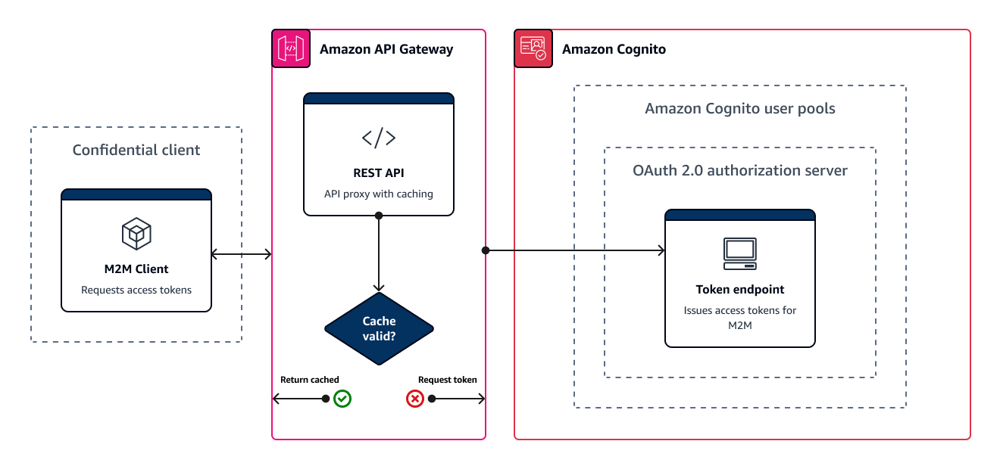

# Managing user pool

token expiration and caching

Your app must successfully complete one of the following requests each time you want to
get a new JSON Web Token (JWT).

- Request a client credentials or authorization code [grant](https://www.rfc-editor.org/rfc/rfc6749#section-1.3 "https://www.rfc-editor.org/rfc/rfc6749#section-1.3") from the [Token endpoint](token-endpoint.md "token-endpoint.md").
- Request an implicit grant from your managed login pages.
- Authenticate a local user in an Amazon Cognito API request like [InitiateAuth](../../../cognito-user-identity-pools/latest/APIReference/API_InitiateAuth.md "../../../cognito-user-identity-pools/latest/APIReference/API_InitiateAuth.md").
  You can configure your user pool to set tokens to expire in minutes, hours, or days. To
  ensure the performance and availability of your app, use Amazon Cognito tokens for about 75% of the
  token lifetime, and only then retrieve new tokens. A cache solution that you build for your
  app keeps tokens available, and prevents the rejection of requests by Amazon Cognito when your request
  rate is too high. A client-side app must store tokens in a memory cache. A server-side app can
  add an encrypted cache mechanism to store tokens.

When your user pool generates a high volume of user or machine-to-machine activity, you
might encounter the limits that Amazon Cognito sets on the number of requests for tokens that you can
make. To reduce the number of requests you make to Amazon Cognito endpoints, you can either securely
store and reuse authentication data, or implement exponential backoff and retries.

Authentication data comes from two classes of endpoints. Amazon Cognito [OAuth
2.0 endpoints](cognito-userpools-server-contract-reference.md "cognito-userpools-server-contract-reference.md") include the token endpoint, which services client credentials and
managed login authorization code requests. [Service endpoints](../../../general/latest/gr/cognito_identity.md#cognito_identity_your_user_pools_region "../../../general/latest/gr/cognito_identity.md#cognito_identity_your_user_pools_region") answer user pools API requests like `InitiateAuth` and
`RespondToAuthChallenge`. Each type of request has its own limit. For more
information about limits, see [Quotas in Amazon Cognito](quotas.md "quotas.md").

## Caching

machine-to-machine access tokens with Amazon API Gateway

With API Gateway token caching, your app can scale in response to events larger than the
default request rate quota of Amazon Cognito OAuth endpoints.

You can cache the access tokens so that your app only requests a new access token if a
cached token is expired. Otherwise, your caching endpoint returns a token from the cache.
This prevents an additional call to an Amazon Cognito API endpoint. When you use Amazon API Gateway as a proxy
to the [Token endpoint](token-endpoint.md "token-endpoint.md"), your API responds to
the majority of requests that would otherwise contribute to your request quota, avoiding
unsuccessful requests as a result of rate limiting.

The following API Gateway-based solution offers a low-latency, low-code/no-code implementation
of token caching. API Gateway APIs are encrypted in transit, and optionally at rest. An API Gateway
cache is ideal for the OAuth 2.0 [client credentials
grant](https://datatracker.ietf.org/doc/html/rfc6749#section-4.4 "https://datatracker.ietf.org/doc/html/rfc6749#section-4.4"), a frequently high-volume grant type that produces access tokens to
authorize machine-to-machine and microservice sessions. In an event like a traffic surge
that causes your microservices to horizontally scale, you can end up with many systems using
the same client credentials at a volume that exceeds the AWS request-rate limit of your
user pool or app client. To preserve app availability and low latency, a caching solution is
best practice in such scenarios.

In this solution, you define a cache in your API to store a separate access token for
each combination of OAuth scopes and app client that you want to request in your app. When
your app makes a request that matches the cache key, your API responds with an access token
that Amazon Cognito issued to the first request that matched the cache key. When your cache key
duration expires, your API forwards the request to your token endpoint and caches a new
access token.

###### Note

Your cache key duration must be shorter than the access token duration of your app
client.

The cache key is a combination of the OAuth scopes that you request in the
`scope` parameter in the request body and the `Authorization` header
in the request. The `Authorization` header contains your app client ID and client
secret. You don't need to implement additional logic in your app to implement this solution.
You must only update your configuration to change the path to your user pool token
endpoint.

You can also implement token caching with [ElastiCache (Redis OSS)](../../../elasticache/index.md "../../../elasticache/index.md"). For fine-grained control with AWS Identity and Access Management
(IAM) policies, consider an [Amazon DynamoDB](../../../amazondynamodb/latest/developerguide/authentication-and-access-control.md#authentication "../../../amazondynamodb/latest/developerguide/authentication-and-access-control.md#authentication") cache.

###### Note

Caching in API Gateway is subject to additional cost. [See pricing for more
details.](https://aws.amazon.com/api-gateway/pricing "https://aws.amazon.com/api-gateway/pricing")

###### To set up a caching proxy with API Gateway

1.  Open the [API Gateway console](https://console.aws.amazon.com/apigateway/main/apis "https://console.aws.amazon.com/apigateway/main/apis") and
    create a REST API.
2.  In **Resources**, create a POST method.
    1. Choose the HTTP **Integration type**.
    2. Select **Use HTTP proxy integration**.
    3. Enter an **Endpoint URL** of
       `https://`<your user pool
       domain>`/oauth2/token`.

3.  In **Resources**, configure the cache key.
    1. Edit the **Method request** of your POST method.

    ###### Note

    This method request validation is for use with
    `client_secret_basic` authorization in token requests, where the
    client secret is encoded in the `Authorization` request header. For
    validation of the JSON request body in `client_secret_post`
    authorization, create instead a [data
    model](../../../apigateway/latest/developerguide/models-mappings-models.md "../../../apigateway/latest/developerguide/models-mappings-models.md") that requires that [client_secret](token-endpoint.md#post-token-request-parameters-in-body "token-endpoint.md#post-token-request-parameters-in-body") be present.
    In this model, your **Request validator** should
    **Validate body, query string parameters, and headers**. 2. Configure the method **Request validator** to
    **Validate query string parameters and headers**. For more
    information about request validation, see [Request validation](../../../apigateway/latest/developerguide/api-gateway-method-request-validation.md "../../../apigateway/latest/developerguide/api-gateway-method-request-validation.md") in the _Amazon API Gateway Developer
    Guide_. 3. Set your `scope` parameter and `Authorization` header as
    your caching key.

        1. Add a query string to **URL query string parameters**.
         Enter a query string **Name** of `scope` and select
         **Required** and **Caching**.
        2. Add a header to **HTTP request headers**. Enter a request
         header **Name** of `Authorization` and select
         **Required** and **Caching**.

4.  In **Stages**, configure caching.
    1. Choose the stage that you want to modify and choose **Edit**
       from **Stage Details**.
    2. Under **Additional settings**, **Cache
       settings**, turn on the **Provision API cache**
       option.
    3. Choose a **Cache capacity**. Higher cache capacity improves
       performance but comes at additional cost.
    4. Clear the **Require authorization** check box. Select
       **Continue**.
    5. API Gateway only applies cache policies to GET methods from the stage level. You must
       apply a cache policy override to your POST method.

    Expand the stage you configured and select the `POST` method. To
    create cache settings for the method, choose **Create
    override**. 6. Activate the **Enable method cache** option. 7. Enter a \***\*Cache time-to-live (TTL)\*\*** of
    3600 seconds. Choose **Save**.

5.  In **Stages**, note the **Invoke URL**.
6.  Update your app to POST token requests to the **Invoke URL** of
    your API instead of the `/oauth2/token` endpoint of your user pool.
