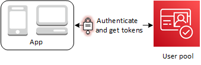

# Understanding

user pool JSON web tokens (JWTs)

Tokens are artifacts of authentication that your applications can use as proof of OIDC
authentication and to request access to resources. The _claims_
in tokens are information about your user. The ID token contains claims about their identity,
like their username, family name, and email address. The access token contains claims like
`scope` that the authenticated user can use to access third-party APIs, Amazon Cognito user
self-service API operations, and the [userInfo endpoint](userinfo-endpoint.md "userinfo-endpoint.md"). The access and ID tokens both include a
`cognito:groups` claim that contains your user's group membership in your user
pool. For more information about user pool groups, see [Adding groups to a user pool](cognito-user-pools-user-groups.md "cognito-user-pools-user-groups.md").

Amazon Cognito also has refresh tokens that you can use to get new tokens or revoke existing tokens.
[Refresh a token](amazon-cognito-user-pools-using-the-refresh-token.md "amazon-cognito-user-pools-using-the-refresh-token.md") to
retrieve a new ID and access tokens. [Revoke a
token](amazon-cognito-user-pools-using-the-refresh-token.md#amazon-cognito-identity-user-pools-revoking-all-tokens-for-user "amazon-cognito-user-pools-using-the-refresh-token.md#amazon-cognito-identity-user-pools-revoking-all-tokens-for-user") to revoke user access that is allowed by refresh tokens.

Amazon Cognito issues tokens as [base64url](https://datatracker.ietf.org/doc/html/rfc4648#section-5 "https://datatracker.ietf.org/doc/html/rfc4648#section-5")-encoded strings. You can decode any Amazon Cognito ID or access token from
`base64url` to plaintext JSON. Amazon Cognito refresh tokens are encrypted, opaque to user
pools users and administrators, and can only be read by your user pool.

###### Authenticating with tokens

When a user signs into your app, Amazon Cognito verifies the login information. If the login is
successful, Amazon Cognito creates a session and returns an ID token, an access token, and a refresh
token for the authenticated user. You can use the tokens to grant your users access to
downstream resources and APIs like Amazon API Gateway. Or you can exchange them for temporary AWS
credentials to access other AWS services.

###### Storing tokens

Your app must be able to store tokens of varying sizes. Token size can change for reasons
including, but not limited to, additional claims, changes in encoding algorithms, and changes
in encryption algorithms. When you enable token revocation in your user pool, Amazon Cognito adds
additional claims to JSON Web Tokens, increasing their size. The new claims
`origin_jti` and `jti` are added to access and ID tokens. For more
information about token revocation, see [Revoking
tokens](token-revocation.md "token-revocation.md").

###### Important

As a best practice, secure all tokens in transit and storage in the context of your
application. Tokens can contain personally-identifying information about your users, and
information about the security model that you use for your user pool.

###### Customizing tokens

You can customize the access and ID tokens that Amazon Cognito passes to your app. In a [Pre token generation Lambda
trigger](user-pool-lambda-pre-token-generation.md "user-pool-lambda-pre-token-generation.md"), you can add, modify, and suppress token
claims. The pre token generation trigger is a Lambda function that Amazon Cognito sends a default set of
claims to. The claims include OAuth 2.0 scopes, user pool group membership, user attributes,
and others. The function can then take the opportunity to make changes at runtime and return
updated token claims to Amazon Cognito.

Additional costs apply to access token customization with version 2 events. For more
information, see [Amazon Cognito Pricing](https://aws.amazon.com/cognito/pricing/ "https://aws.amazon.com/cognito/pricing/").

###### Topics

- [Understanding the identity (ID)
  token](amazon-cognito-user-pools-using-the-id-token.md "amazon-cognito-user-pools-using-the-id-token.md")
- [Understanding the access
  token](amazon-cognito-user-pools-using-the-access-token.md "amazon-cognito-user-pools-using-the-access-token.md")
- [Refresh tokens](amazon-cognito-user-pools-using-the-refresh-token.md "amazon-cognito-user-pools-using-the-refresh-token.md")
- [Ending user sessions with token revocation](token-revocation.md "token-revocation.md")
- [Verifying JSON web
  tokens](amazon-cognito-user-pools-using-tokens-verifying-a-jwt.md "amazon-cognito-user-pools-using-tokens-verifying-a-jwt.md")
- [Managing user pool
  token expiration and caching](amazon-cognito-user-pools-using-tokens-caching-tokens.md "amazon-cognito-user-pools-using-tokens-caching-tokens.md")
