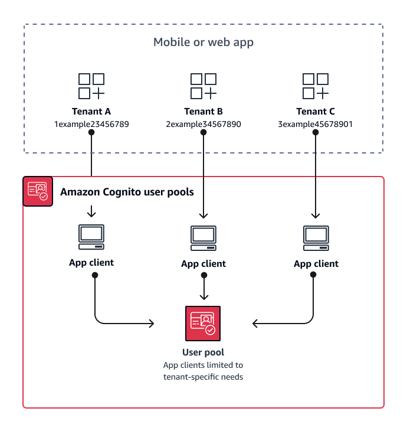

# App-client multi-tenancy best

practices

Create
an [app client](user-pool-settings-client-apps.md#user-pool-settings-client-apps.title "user-pool-settings-client-apps.md#user-pool-settings-client-apps.title") for each
tenant in your app. With app-client multi-tenancy, you can assign any
user to tenant-linked app clients and retain a single user profile. Because you can
assign any or all of the [identity providers (IdPs)](cognito-user-pools-identity-federation.md#cognito-user-pools-identity-federation.title "cognito-user-pools-identity-federation.md#cognito-user-pools-identity-federation.title") in your user pool to an app client, a tenant app
client can permit sign-in with a tenant-specific IdP. When users exist in multiple
tenants, you can link their profiles with multiple IdPs for a consistent user
experience.

The following diagram shows each tenant with a dedicated app client in a shared user
pool.

###### When to implement app-client multi-tenancy

When you can choose a universal configuration for settings at the user-pool level,
like Lambda triggers, password policy, and the content and delivery methods of email
and SMS messages. Because users in a shared user pool can sign in to any app client,
app-client multi-tenancy is ideal for sign-in with app-client-specific IdPs or the
Amazon Cognito user pools API. App-client multi-tenancy is also well-suited for one-to-many
environments where you want to permit users to transition between multiple
applications.

###### Level of effort

App-client multi-tenancy requires moderate effort. A major challenge of app-client
multi-tenancy is the ability for tenants to present a hosted UI cookie and switch
between apps. In an app-client multi-tenancy architecture, avoid hosted UI sign-in
where isolation is necessary. You can distribute your mobile app or links to your
web app with app client logic built in, or you can build initial UI elements that
determine users' tenancy. The level of effort is lower because you don't need to
standardize and maintain configuration across multiple user pools and identity
pools.
