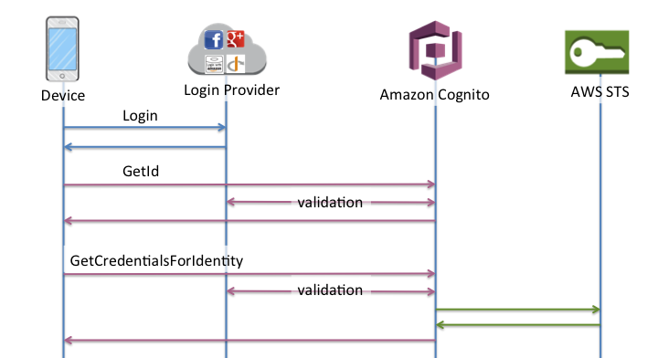
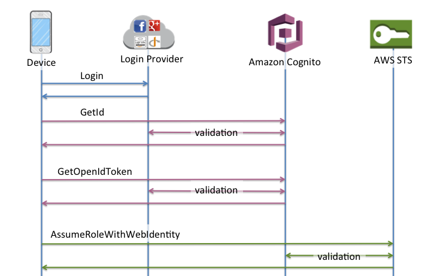
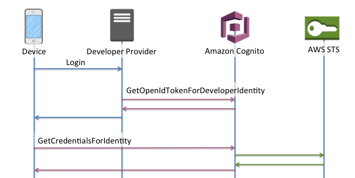
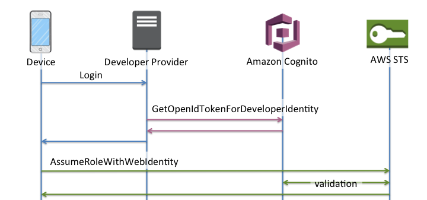

# Identity pools authentication flow

Amazon Cognito helps you create unique identifiers for your end users that are kept consistent
across devices and platforms. Amazon Cognito also delivers temporary, limited-privilege credentials to
your application to access AWS resources. This page covers the basics of how authentication
in Amazon Cognito works and explains the lifecycle of an identity inside your identity pool.

**External provider authflow**

A user authenticating with Amazon Cognito goes through a multi-step process to bootstrap their
credentials. Amazon Cognito has two different flows for authentication with public providers: enhanced
and basic.

Once you complete one of these flows, you can access other AWS services as defined by
your role's access policies. By default, the [Amazon Cognito
console](https://console.aws.amazon.com/cognito/ "https://console.aws.amazon.com/cognito/") creates roles with access to the Amazon Cognito Sync store and to Amazon Mobile Analytics. For more
information on how to grant additional access, see [IAM roles](iam-roles.md "iam-roles.md").

Identity pools accept the following artifacts from providers:

| Provider                 | Authentication artifact |
| ------------------------ | ----------------------- |
| Amazon Cognito user pool | ID token                |
| OpenID Connect (OIDC)    | ID token                |
| SAML 2.0                 | SAML assertion          |
| Social provider          | Access token            |

## The enhanced (simplified) authentication

flow

When you use the enhanced authflow, your app first presents a proof of authentication
from an authorized Amazon Cognito user pool or third-party identity provider in a [GetId](../../../cognitoidentity/latest/APIReference/API_GetId.md "../../../cognitoidentity/latest/APIReference/API_GetId.md") request.

1. Your application presents a proof of authentication–a JSON web token or a
   SAML assertion–from an authorized Amazon Cognito user pool or third-party identity
   provider in a [GetID](../../../cognitoidentity/latest/APIReference/API_GetId.md "../../../cognitoidentity/latest/APIReference/API_GetId.md") request.
2. Your identity pool returns an identity ID.
3. Your application combines the identity ID with the same proof of authentication in a
   [GetCredentialsForIdentity](../../../cognitoidentity/latest/APIReference/API_GetCredentialsForIdentity.md "../../../cognitoidentity/latest/APIReference/API_GetCredentialsForIdentity.md") request.
4. Your identity pool returns AWS credentials.
5. Your application signs AWS API requests with the temporary credentials.

Enhanced authentication manages the logic of IAM role selection and credentials
retrieval in your identity pool configuration. You can configure your identity pool to
select a default role, to apply attribute-based access control (ABAC) or role-based access
control (RBAC) principles to role selection. The AWS credentials from enhanced
authentication are valid for one hour.

###### Order of operations in Enhanced authentication

1. `GetId`
2. `GetCredentialsForIdentity`



## The basic (classic) authentication flow

When you implement the basic authentication flow, your application selects the IAM
role that you want users to assume.

1. Your application presents a proof of authentication–a JSON web token or a
   SAML assertion–from an authorized Amazon Cognito user pool or third-party identity
   provider in a [GetID](../../../cognitoidentity/latest/APIReference/API_GetId.md "../../../cognitoidentity/latest/APIReference/API_GetId.md") request.
2. Your identity pool returns an identity ID.
3. Your application combines the identity ID with the same proof of authentication in a
   [GetOpenIdToken](../../../cognitoidentity/latest/APIReference/API_GetOpenIdToken.md "../../../cognitoidentity/latest/APIReference/API_GetOpenIdToken.md")
   request.
4. `GetOpenIdToken` returns a new OAuth 2.0 token that is issued by your
   identity pool.
5. Your application presents the new token in an [AssumeRoleWithWebIdentity](../../../STS/latest/APIReference/API_AssumeRoleWithWebIdentity.md "../../../STS/latest/APIReference/API_AssumeRoleWithWebIdentity.md") request.
6. AWS Security Token Service (AWS STS) returns AWS credentials.
7. Your application signs AWS API requests with the temporary credentials.

The basic workflow gives you more granular control over the credentials that you
distribute to your users. The `GetCredentialsForIdentity` request of the enhanced
authflow requests a role based on the contents of an access token. The
`AssumeRoleWithWebIdentity` request in the classic workflow grants your app a
greater ability to request credentials for any AWS Identity and Access Management role that you have configured with
a sufficient trust policy. You can also request a custom role session duration.

You can sign in with the Basic authflow in user pools that don't have role mappings.
This type of identity pool doesn't have a default authenticated or unauthenticated role, and
doesn't have role-based or attribute-based access control configured. When you attempt
`GetOpenIdToken` in an identity pool with role mappings, you receive the
following error.

```
Basic (classic) flow is not supported with RoleMappings, please use enhanced flow.
```

###### Order of operations in Basic authentication

1. `GetId`
2. `GetOpenIdToken`
3. `AssumeRoleWithWebIdentity`



## The developer-authenticated authentication

flow

When using [Developer-authenticated identities](developer-authenticated-identities.md "developer-authenticated-identities.md"), your client uses a different
authflow that includes code outside of Amazon Cognito to validate the user in your own authentication
system. From the perspective of your identity pool, the claims that you present in your
request for an identity are arbitrary identifiers, and the authentication is authorized by
IAM credentials that you encode in your application.

###### Order of operations in Enhanced authentication with a developer provider

1. Login via Developer Provider (code outside of Amazon Cognito)
2. Validate the user login (code outside of Amazon Cognito)
3. [GetOpenIdTokenForDeveloperIdentity](../../../cognitoidentity/latest/APIReference/API_GetOpenIdTokenForDeveloperIdentity.md "../../../cognitoidentity/latest/APIReference/API_GetOpenIdTokenForDeveloperIdentity.md")
4. [GetCredentialsForIdentity](../../../cognitoidentity/latest/APIReference/API_GetCredentialsForIdentity.md "../../../cognitoidentity/latest/APIReference/API_GetCredentialsForIdentity.md")



###### Order of operations in basic authentication with a developer provider

1. Implement logic outside of identity pool to sign in and generate a
   developer-provider identifier.
2. Retrieve stored server-side AWS credentials.
3. Send developer provider identifier in a [GetOpenIdTokenForDeveloperIdentity](../../../cognitoidentity/latest/APIReference/API_GetOpenIdTokenForDeveloperIdentity.md "../../../cognitoidentity/latest/APIReference/API_GetOpenIdTokenForDeveloperIdentity.md") API request signed with authorized AWS
   credentials.
4. Request application credentials with [AssumeRoleWithWebIdentity](../../../STS/latest/APIReference/API_AssumeRoleWithWebIdentity.md "../../../STS/latest/APIReference/API_AssumeRoleWithWebIdentity.md").



## Which authentication flow should I

implement?

The **enhanced flow** is the most secure choice with the
lowest level of developer effort:

- The enhanced flow reduces the complexity, size, and rate of API requests.
- Your application doesn't need to make additional API requests to AWS STS.
- Your identity pool evaluates your users for the IAM role credentials that they
  should receive. You don't need to embed logic for role selection in your client.

###### Important

When you create a new identity pool, don't activate basic (classic) authentication by
default, as a best practice. To implement basic authentication, first evaluate the trust
relationships of your IAM roles for web identities. Then build the logic for role
selection into your client and secure the client against modification by users.

The **basic authentication flow** delegates the logic of
IAM role selection to your application. In this flow, Amazon Cognito validates your user's
authenticated or unauthenticated session and issues a token that you can exchange for
credentials with AWS STS. Users can exchange the tokens from basic authentication for any
IAM roles that trust your identity pool and `amr`, or
authenticated/unauthenticated state.

Similarly, understand that **developer authentication** is
a shortcut around validation of identity provider authentication. Amazon Cognito trusts the AWS
credentials that authorize a [GetOpenIdTokenForDeveloperIdentity](../../../cognitoidentity/latest/APIReference/API_GetOpenIdTokenForDeveloperIdentity.md "../../../cognitoidentity/latest/APIReference/API_GetOpenIdTokenForDeveloperIdentity.md") request without additional validation of the
request contents. Secure the secrets that authorize developer authentication from access by
users.

## Authentication flow API operations

overview

**GetId**

The [GetId](../../../cognitoidentity/latest/APIReference/API_GetId.md "../../../cognitoidentity/latest/APIReference/API_GetId.md") API call is
the first call necessary to establish a new identity in Amazon Cognito.

Unauthenticated access

Amazon Cognito can grant unauthenticated guest access in your applications. If this
feature is enabled in your identity pool, users can request a new identity ID at
any time via the `GetId` API. The application is expected to cache
this identity ID to make subsequent calls to Amazon Cognito. The AWS Mobile SDKs and
the AWS SDK for JavaScript in the Browser have credentials providers that
handle this caching for you.

Authenticated access

When you've configured your application with support for a public login
provider (Facebook, Google+, Login with Amazon, or Sign in with Apple), users
can also supply tokens (OAuth or OpenID Connect) that identify them in those
providers. When used in a call to `GetId`, Amazon Cognito creates a new
authenticated identity or returns the identity already associated with that
particular login. Amazon Cognito does this by validating the token with the provider and
making sure of the following:

- The token is valid and from the configured provider.
- The token is not expired.
- The token matches the application identifier created with that provider
  (for example, Facebook app ID).
- The token matches the user identifier.

**GetCredentialsForIdentity**

The [GetCredentialsForIdentity](../../../cognitoidentity/latest/APIReference/API_GetCredentialsForIdentity.md "../../../cognitoidentity/latest/APIReference/API_GetCredentialsForIdentity.md") API can be called after you establish an identity
ID. This operation is functionally equivalent to calling [GetOpenIdToken](../../../cognitoidentity/latest/APIReference/API_GetOpenIdToken.md "../../../cognitoidentity/latest/APIReference/API_GetOpenIdToken.md"), then [AssumeRoleWithWebIdentity](../../../STS/latest/APIReference/API_AssumeRoleWithWebIdentity.md "../../../STS/latest/APIReference/API_AssumeRoleWithWebIdentity.md").

For Amazon Cognito to call `AssumeRoleWithWebIdentity` on your behalf, your
identity pool must have IAM roles associated with it. You can do this via the Amazon Cognito
console or manually via the [SetIdentityPoolRoles](../../../cognitoidentity/latest/APIReference/API_SetIdentityPoolRoles.md "../../../cognitoidentity/latest/APIReference/API_SetIdentityPoolRoles.md") operation.

**GetOpenIdToken**

Make a [GetOpenIdToken](../../../cognitoidentity/latest/APIReference/API_GetOpenIdToken.md "../../../cognitoidentity/latest/APIReference/API_GetOpenIdToken.md") API request after you establish an identity ID. Cache
identity IDs after your first request, and start subsequent basic (classic) sessions
for that identity with `GetOpenIdToken`.

The response to a `GetOpenIdToken` API request is a token that Amazon Cognito
generates. You can submit this token as the `WebIdentityToken` parameter in
an [AssumeRoleWithWebIdentity](../../../STS/latest/APIReference/API_AssumeRoleWithWebIdentity.md "../../../STS/latest/APIReference/API_AssumeRoleWithWebIdentity.md") request.

Before you submit the OpenID token, verify it in your app. You can use OIDC
libraries in your SDK or a library like [aws-jwt-verify](https://github.com/awslabs/aws-jwt-verify "https://github.com/awslabs/aws-jwt-verify") to confirm that Amazon Cognito issued the token. The
signing key ID, or `kid`, of the OpenID token is one of those listed in the
Amazon Cognito Identity [jwks_uri document](https://cognito-identity.amazonaws.com/.well-known/jwks_uri "https://cognito-identity.amazonaws.com/.well-known/jwks_uri")†. These keys are subject to
change. Your function that verifies Amazon Cognito Identity tokens should periodically update its list
of keys from the _jwks_uri_ document. Amazon Cognito sets the
refresh duration in the _jwks_uri_ cache-control
response header, currently set to a `max-age` of 30 days.

Unauthenticated access

To obtain a token for an unauthenticated identity, you only need the
identity ID itself. It is not possible to get an unauthenticated token for
authenticated identities or identities that you have deactivated.

Authenticated access

If you have an authenticated identity, you must pass at least one valid
token for a login already associated with that identity. All tokens passed in
during the `GetOpenIdToken` call must pass the same validation
mentioned earlier; if any of the tokens fail, the whole call fails. The response
from the `GetOpenIdToken` call also includes the identity ID. This is
because the identity ID that you pass in may not be the one that is
returned.

Linking logins

If you submit a token for a login that is not already associated with any
identity, the login is considered to be "linked" to the associated identity. You
may only link one login per public provider. Attempts to link more than one
login with a public provider results in a `ResourceConflictException`
error response. If a login is merely linked to an existing identity, the
identity ID returned from `GetOpenIdToken` is the same as the one
that you passed in.

Merging identities

If you pass in a token for a login that is not currently linked to the given
identity, but is linked to another identity, the two identities are merged. Once
merged, one identity becomes the parent/owner of all associated logins and the
other is disabled. In this case, the identity ID of the parent/owner is
returned. You must update your local cache if this value differs. The providers
in the AWS Mobile SDKs or AWS SDK for JavaScript in the Browser perform this
operation for you.

**GetOpenIdTokenForDeveloperIdentity**

The [GetOpenIdTokenForDeveloperIdentity](../../../cognitoidentity/latest/APIReference/API_GetOpenIdTokenForDeveloperIdentity.md "../../../cognitoidentity/latest/APIReference/API_GetOpenIdTokenForDeveloperIdentity.md") operation replaces the use of [GetId](../../../cognitoidentity/latest/APIReference/API_GetId.md "../../../cognitoidentity/latest/APIReference/API_GetId.md") and [GetOpenIdToken](../../../cognitoidentity/latest/APIReference/API_GetOpenIdToken.md "../../../cognitoidentity/latest/APIReference/API_GetOpenIdToken.md") from the device when using developer authenticated
identities. Because your application signs requests to this API operation with AWS
credentials, Amazon Cognito trusts that the user identifier supplied in the request is valid.
Developer authentication replaces the token validation that Amazon Cognito performs with
external providers.

The payload for this API includes a `logins` map. This map must contain
the key of your developer provider and a value as an identifier for the user in your
system. If the user identifier isn't already linked to an existing identity, Amazon Cognito
creates a new identity and returns the new identity ID and an OpenID Connect token for
that identity. If the user identifier is already linked, Amazon Cognito returns the
pre-existing identity ID and an OpenID Connect token. Cache developer identity IDs
after your first request, and start subsequent basic (classic) sessions for that
identity with `GetOpenIdTokenForDeveloperIdentity`.

The response to a `GetOpenIdTokenForDeveloperIdentity` API request is a
token that Amazon Cognito generates. You can submit this token as the
`WebIdentityToken` parameter in an `AssumeRoleWithWebIdentity`
request.

Before you submit the OpenID Connect token, verify it in your app. You can use
OIDC libraries in your SDK or a library like [aws-jwt-verify](https://github.com/awslabs/aws-jwt-verify "https://github.com/awslabs/aws-jwt-verify") to confirm that Amazon Cognito issued the token. The
signing key ID, or `kid`, of the OpenID Connect token is one of those
listed in the Amazon Cognito Identity [_jwks_uri_ document](https://cognito-identity.amazonaws.com/.well-known/jwks_uri "https://cognito-identity.amazonaws.com/.well-known/jwks_uri")†. These keys are subject
to change. Your function that verifies Amazon Cognito Identity tokens should periodically update its
list of keys from the _jwks_uri_ document. Amazon Cognito sets
the refresh duration in the _jwks_uri_
`cache-control` response header, currently set to a `max-age` of
30 days.

Linking logins

As with external providers, supplying additional logins that are not already
associated with an identity implicitly links those logins to that identity. If
you link an external provider login to an identity, the user can use the
external provider authflow with that provider. However, they cannot use your
developer provider name in the logins map when calling `GetId` or
`GetOpenIdToken`.

Merging identities

With developer authenticated identities, Amazon Cognito supports both implicit
merging and explicit merging through the [MergeDeveloperIdentities](../../../cognitoidentity/latest/APIReference/API_MergeDeveloperIdentities.md "../../../cognitoidentity/latest/APIReference/API_MergeDeveloperIdentities.md") API. With explicit merging, you can mark two
identities with user identifiers in your system as a single identity. If you
supply the source and destination user identifiers, Amazon Cognito merges them. The next
time you request an OpenID Connect token for either user identifier, the same
identity id is returned.

**AssumeRoleWithWebIdentity**

After you have an OpenID Connect token, you can then trade this for temporary
AWS credentials through the [AssumeRoleWithWebIdentity](../../../STS/latest/APIReference/API_AssumeRoleWithWebIdentity.md "../../../STS/latest/APIReference/API_AssumeRoleWithWebIdentity.md") API request to AWS Security Token Service (AWS STS).

Because there is no restriction on the number of identities that you can create,
it is important to understand the permissions that you're granting to your users. Set
up different IAM roles for your application: one for unauthenticated users, and one
for authenticated users. The Amazon Cognito console can create default roles when you first set
up your identity pool. These roles have effectively no permissions granted. Modify
them to meet your needs.

Learn more about [Role trust and permissions](iam-roles.md#role-trust-and-permissions "iam-roles.md#role-trust-and-permissions").

† The default Amazon Cognito Identity [_jwks_uri_](https://cognito-identity.amazonaws.com/.well-known/jwks_uri "https://cognito-identity.amazonaws.com/.well-known/jwks_uri") document contains information about the keys that sign
tokens for identity pools in most AWS Regions. The following Regions have different
_jwks_uri_ documents.

| Amazon Cognito Identity JSON web key URIs in other AWS Regions | AWS Region                                                                  | Path to \*jwks_uri<br>• document |
| -------------------------------------------------------------- | --------------------------------------------------------------------------- | -------------------------------- |
| AWS GovCloud (US-West)                                         | `https://cognito-identity.us-gov-west-1.amazonaws.com/.well-known/jwks_uri` |
| China (Beijing)                                                | `https://cognito-identity.cn-north-1.amazonaws.com.cn/.well-known/jwks_uri` |
| Opt-in Regions like Europe (Milan) and Africa (Cape Town)      | `https://cognito-identity.`Region`.amazonaws.com/.well-known/jwks_uri`      |

You can also extrapolate the _jwks_uri_ from the issuer
or `iss` that you receive in the OpenID token from Amazon Cognito. The OIDC-standard
discovery endpoint `<issuer>/.well-known/openid-configuration` lists a path to
the _jwks_uri_ for your token.
