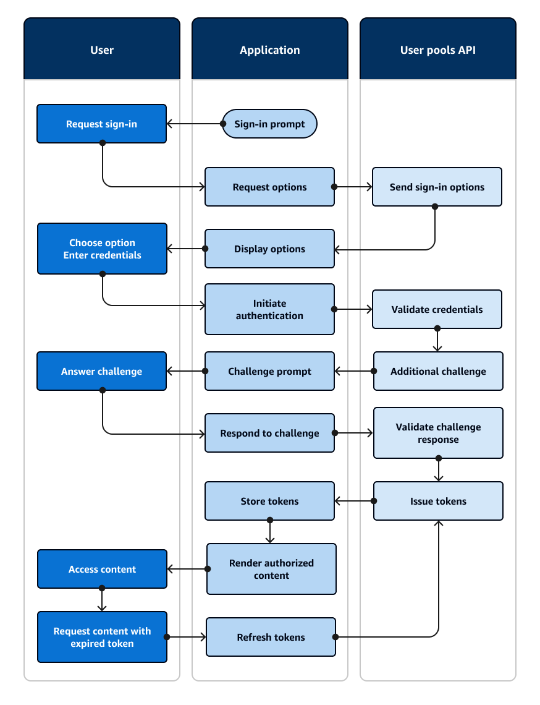

# Authentication with Amazon Cognito user pools

Amazon Cognito includes several methods to authenticate your users. Users can sign in with passwords
and WebAuthn passkeys. Amazon Cognito can send them a one-time password in an email or SMS message. You
can implement Lambda functions that orchestrate your own sequence of challenges and responses.
These are _authentication flows_. In authentication flows,
users provide a secret and Amazon Cognito verifies the secret, then issues JSON web tokens (JWTs) for
applications to process with OIDC libraries. In this chapter, we'll talk about how to configure
your user pools and app clients for various authentication flows in various application
environments. You'll learn about options for the use of the hosted sign-in pages of managed
login, and for building your own logic and front end in an AWS SDK.

All user pools, whether you have a domain or not, can authenticate users in the user pools
API. If you add a domain to your user pool, you can use the [user pool
endpoints](cognito-userpools-server-contract-reference.md "cognito-userpools-server-contract-reference.md"). The user pools API supports a variety of authorization models and request
flows for API requests.

To verify the identity of users, Amazon Cognito supports authentication flows that incorporate
challenge types in addition to passwords like email and SMS message one-time passwords and
passkeys.

###### Topics

- [Implement authentication flows](#authentication-implement "#authentication-implement")
- [Things to know about authentication with
  user pools](#authentication-flow-things-to-know "#authentication-flow-things-to-know")
- [An example authentication
  session](#amazon-cognito-user-pools-authentication-flow "#amazon-cognito-user-pools-authentication-flow")
- [Configure authentication methods
  for managed login](authentication-flows-selection-managedlogin.md "authentication-flows-selection-managedlogin.md")
- [Manage authentication methods in AWS
  SDKs](authentication-flows-selection-sdk.md "authentication-flows-selection-sdk.md")
- [Authentication
  flows](amazon-cognito-user-pools-authentication-flow-methods.md "amazon-cognito-user-pools-authentication-flow-methods.md")
- [Authorization models for API and SDK
  authentication](authentication-flows-public-server-side.md "authentication-flows-public-server-side.md")

## Implement authentication flows

Whether you're implementing [managed login](authentication-flows-selection-managedlogin.md "authentication-flows-selection-managedlogin.md") or a [custom-built
application front end](authentication-flows-selection-sdk.md "authentication-flows-selection-sdk.md") with an AWS SDK for authentication, you must configure your
app client for the types of authentication that you want to implement. The following
information describes setup for authentication flows in your [app clients](user-pool-settings-client-apps.md "user-pool-settings-client-apps.md") and your application.

App client supported flows
You can configure supported flows for your app clients in the Amazon Cognito console or with
the API in an AWS SDK. After you configure your app client to support these flows, you
can deploy them in your application.

The following procedure configures available authentication flows for an app client
with the Amazon Cognito console.

###### To configure an app client for authentication flows (console)

1. Sign in to AWS and navigate to the [Amazon Cognito user pools console](https://console.aws.amazon.com/cognito/v2/idp "https://console.aws.amazon.com/cognito/v2/idp"). Choose a user pool or create a new one.
2. In your user pool configuration, select the **App clients**
   menu. Choose an app client or create a new one.
3. Under **App client information**, select
   **Edit**.
4. Under **App client flows**, choose the authentication flows
   that you want to support.

###### To configure an app client for authentication flows (API/SDK)

To configure available authentication flows for an app client with the Amazon Cognito API,
set the value of `ExplicitAuthFlows` in a [CreateUserPoolClient](../../../cognito-user-identity-pools/latest/APIReference/API_CreateUserPoolClient.md#CognitoUserPools-CreateUserPoolClient-request-ExplicitAuthFlows "../../../cognito-user-identity-pools/latest/APIReference/API_CreateUserPoolClient.md#CognitoUserPools-CreateUserPoolClient-request-ExplicitAuthFlows") or [UpdateUserPoolClient](../../../cognito-user-identity-pools/latest/APIReference/API_UpdateUserPoolClient.md#CognitoUserPools-UpdateUserPoolClient-request-ExplicitAuthFlows "../../../cognito-user-identity-pools/latest/APIReference/API_UpdateUserPoolClient.md#CognitoUserPools-UpdateUserPoolClient-request-ExplicitAuthFlows") request. The following is an example that provisions
secure remote password (SRP) and choice-based authentication to a client.

```
"ExplicitAuthFlows": [
   "ALLOW_USER_AUTH",
   "ALLOW_USER_SRP_AUTH
]
```

When you configure app client supported flows, you can specify the following options
and API values.

| App client flow support                                                                                                                                                                                                                                                                         | Authentication flow                                                                          | Compatibility                                                 | Console                          | API |
| ----------------------------------------------------------------------------------------------------------------------------------------------------------------------------------------------------------------------------------------------------------------------------------------------- | -------------------------------------------------------------------------------------------- | ------------------------------------------------------------- | -------------------------------- | --- |
| [Choice-based<br>authentication](authentication-flows-selection-sdk.md#authentication-flows-selection-choice "authentication-flows-selection-sdk.md#authentication-flows-selection-choice")                                                                                                     | Server-side, client-side                                                                     | Select an authentication type at sign-in                      | `ALLOW_USER_AUTH`                |
| [Sign-in with persistent passwords](amazon-cognito-user-pools-authentication-flow-methods.md#amazon-cognito-user-pools-authentication-flow-methods-password "amazon-cognito-user-pools-authentication-flow-methods.md#amazon-cognito-user-pools-authentication-flow-methods-password")          | Client-side                                                                                  | Sign in with username and password                            | `ALLOW_USER_PASSWORD_AUTH`       |
| [Sign-in with persistent passwords and secure payload](amazon-cognito-user-pools-authentication-flow-methods.md#amazon-cognito-user-pools-authentication-flow-methods-srp "amazon-cognito-user-pools-authentication-flow-methods.md#amazon-cognito-user-pools-authentication-flow-methods-srp") | Server-side, client-side                                                                     | Sign in with secure remote password (SRP)                     | `ALLOW_USER_SRP_AUTH`            |
| [Refresh tokens](amazon-cognito-user-pools-authentication-flow-methods.md#amazon-cognito-user-pools-authentication-flow-methods-refresh "amazon-cognito-user-pools-authentication-flow-methods.md#amazon-cognito-user-pools-authentication-flow-methods-refresh")                               | Server-side, client-side                                                                     | Get new user tokens from existing authenticated sessions      | `ALLOW_REFRESH_TOKEN_AUTH`       |
| [Server-side authentication](authentication-flows-public-server-side.md#amazon-cognito-user-pools-server-side-authentication-flow "authentication-flows-public-server-side.md#amazon-cognito-user-pools-server-side-authentication-flow")                                                       | Server-side                                                                                  | Sign in with server-side administrative credentials           | `ALLOW_ADMIN_USER_PASSWORD_AUTH` |
| [Custom<br>authentication](amazon-cognito-user-pools-authentication-flow-methods.md#amazon-cognito-user-pools-authentication-flow-methods-custom "amazon-cognito-user-pools-authentication-flow-methods.md#amazon-cognito-user-pools-authentication-flow-methods-custom")                       | Server-side and client-side custom-built applications. Not compatible with<br>managed login. | Sign in with custom authentication flows from Lambda triggers | `ALLOW_CUSTOM_AUTH`              |

Implement flows in your application
Managed login automatically makes your configured authentication options available
in your sign-pages. In custom-built applications, start authentication with a
declaration of the initial flow.

- To choose from a list of flow options for a user, declare [choice-based authentication](authentication-flows-selection-sdk.md#authentication-flows-selection-choice "authentication-flows-selection-sdk.md#authentication-flows-selection-choice")
  with the `USER_AUTH` flow. This flow has available authentication methods
  that aren't available in client-based authentication flows, for example [passkey](amazon-cognito-user-pools-authentication-flow-methods.md#amazon-cognito-user-pools-authentication-flow-methods-passkey "amazon-cognito-user-pools-authentication-flow-methods.md#amazon-cognito-user-pools-authentication-flow-methods-passkey") and [passwordless](amazon-cognito-user-pools-authentication-flow-methods.md#amazon-cognito-user-pools-authentication-flow-methods-passwordless "amazon-cognito-user-pools-authentication-flow-methods.md#amazon-cognito-user-pools-authentication-flow-methods-passwordless") authentication.
- To choose your authentication flow up front, declare [client-based authentication](authentication-flows-selection-sdk.md#authentication-flows-selection-client "authentication-flows-selection-sdk.md#authentication-flows-selection-client")
  with any other flow that's available in your app client.

When you sign users in, the body of your [InitiateAuth](../../../cognito-user-identity-pools/latest/APIReference/API_InitiateAuth.md#CognitoUserPools-InitiateAuth-request-AuthFlow "../../../cognito-user-identity-pools/latest/APIReference/API_InitiateAuth.md#CognitoUserPools-InitiateAuth-request-AuthFlow") or [AdminInitiateAuth](../../../cognito-user-identity-pools/latest/APIReference/API_AdminInitiateAuth.md#CognitoUserPools-AdminInitiateAuth-request-AuthFlow "../../../cognito-user-identity-pools/latest/APIReference/API_AdminInitiateAuth.md#CognitoUserPools-AdminInitiateAuth-request-AuthFlow") request must include an `AuthFlow`
parameter.

Choice-based authentication:

```
"AuthFlow": "USER_AUTH"
```

Client-based authentication with SRP:

```
"AuthFlow": "USER_SRP_AUTH"
```

## Things to know about authentication with

user pools

Consider the following information in the design of your authentication model with
Amazon Cognito user pools.

**Authentication flows in managed login and the hosted UI**

[Managed login](cognito-user-pools-managed-login.md "cognito-user-pools-managed-login.md") has more
options for authentication than the classic hosted UI. For example, users can do
passwordless and passkey authentication only in managed login.

**Custom authentication flows only available in AWS SDK authentication**

You can't do _custom authentication flows_, or
[custom authentication with Lambda
triggers](user-pool-lambda-challenge.md "user-pool-lambda-challenge.md"), with managed login or the classic hosted UI. Custom authentication is
available in [authentication with
AWS SDKs](authentication-flows-selection-sdk.md "authentication-flows-selection-sdk.md").

**Managed login for external identity provider (IdP) sign-in**

You can't sign users in through [third-party IdPs](cognito-user-pools-identity-federation.md "cognito-user-pools-identity-federation.md") in [authentication with AWS SDKs](authentication-flows-selection-sdk.md "authentication-flows-selection-sdk.md").
You must implement managed login or the classic hosted UI, redirect to IdPs, and then
process the resulting authentication object with OIDC libraries in your application. For
more information about managed login, see [User pool managed login](cognito-user-pools-managed-login.md "cognito-user-pools-managed-login.md").

**Passwordless authentication effect on other user features**

Activation of passwordless sign-in with [one-time
passwords](amazon-cognito-user-pools-authentication-flow-methods.md#amazon-cognito-user-pools-authentication-flow-methods-passwordless "amazon-cognito-user-pools-authentication-flow-methods.md#amazon-cognito-user-pools-authentication-flow-methods-passwordless") or [passkeys](amazon-cognito-user-pools-authentication-flow-methods.md#amazon-cognito-user-pools-authentication-flow-methods-passkey "amazon-cognito-user-pools-authentication-flow-methods.md#amazon-cognito-user-pools-authentication-flow-methods-passkey") in your user pool and app client has an effect on user creation and
migration. When passwordless sign-in is active:

1. Administrators can create users without passwords. The default invitation
   message template changes to no longer include the `{###}` password
   placeholder. For more information, see [Creating user accounts as administrator](how-to-create-user-accounts.md "how-to-create-user-accounts.md").
2. For SDK-based [SignUp](../../../cognito-user-identity-pools/latest/APIReference/API_SignUp.md "../../../cognito-user-identity-pools/latest/APIReference/API_SignUp.md") operations, users aren't required to supply a password when they
   sign up. Managed login and the hosted UI require a password in the sign-up page,
   even if passwordless authentication is permitted. For more information, see [Signing up and confirming user accounts](signing-up-users-in-your-app.md "signing-up-users-in-your-app.md").
3. Users imported from a CSV file can sign in immediatelywith passwordless options,
   without a password reset, if their attributes include an email address or phone
   number for an available passwordless sign-in option. For more information, see [Importing users into user pools from a
   CSV file](cognito-user-pools-using-import-tool.md "cognito-user-pools-using-import-tool.md").
4. Passwordless authentication doesn't invoke the [user migration Lambda
   trigger](user-pool-lambda-migrate-user.md "user-pool-lambda-migrate-user.md").
5. Users who sign in with a passwordless first factor can't add a [multi-factor authentication (MFA)](user-pool-settings-mfa.md "user-pool-settings-mfa.md") factor
   to their session. Only password-based authentication flows support MFA.

**Passkey relying party URLs can't be on the public suffix list**

You can use domain names that you own, like `www.example.com`, as the
relying party (RP) ID in your passkey configuration. This configuration is intended to
support custom-built applications that run on domains that you own. The [public suffix list](https://publicsuffix.org/ "https://publicsuffix.org/"), or PSL, contains protected
high-level domains. Amazon Cognito returns an error when you attempt to set your RP URL to a
domain on the PSL.

###### Topics

- [Authentication session flow
  duration](#authentication-flow-session-duration "#authentication-flow-session-duration")
- [Lockout behavior for failed sign-in
  attempts](#authentication-flow-lockout-behavior "#authentication-flow-lockout-behavior")

### Authentication session flow

duration

Depending on the features of your user pool, you can end up responding to several
challenges to `InitiateAuth` and `RespondToAuthChallenge` before your
app retrieves tokens from Amazon Cognito. Amazon Cognito includes a session string in the response to each
request. To combine your API requests into an authentication flow, include the session
string from the response to the previous request in each subsequent request. By default,
your users have three minutes to complete each challenge before the session string expires.
To adjust this period, change your app client **Authentication flow session
duration**. The following procedure describes how to change this setting in your
app client configuration.

###### Note

**Authentication flow session duration** settings apply to
authentication with the Amazon Cognito user pools API. Managed login sets session duration to 3 minutes for
multi-factor authentication and 8 minutes for password-reset codes.

Amazon Cognito console

###### To configure app client authentication flow session duration

(AWS Management Console)

1. From the **App integration** tab in your user pool, select
   the name of your app client from the **App clients and
   analytics** container.
2. Choose **Edit** in the **App client
   information** container.
3. Change the value of **Authentication flow session duration**
   to the validity duration that you want, in minutes, for SMS and email MFA codes.
   This also changes the amount of time that any user has to complete any
   authentication challenge in your app client.
4. Choose **Save changes**.

User pools API

###### To configure app client authentication flow session duration (Amazon Cognito

API)

1. Prepare an `UpdateUserPoolClient` request with your existing user
   pool settings from a `DescribeUserPoolClient` request. Your
   `UpdateUserPoolClient` request must include all existing app client
   properties.
2. Change the value of `AuthSessionValidity` to the validity duration
   that you want, in minutes, for SMS MFA codes. This also changes the amount of time
   that any user has to complete any authentication challenge in your app
   client.

For more information about app clients, see [Application-specific settings with app
clients](user-pool-settings-client-apps.md "user-pool-settings-client-apps.md").

### Lockout behavior for failed sign-in

attempts

After five failed sign-in attempts with a user's password, regardless of whether those
are requested with unauthenticated or IAM-authorized API operations, Amazon Cognito locks out your
user for one second. The lockout duration then doubles after each additional one failed
attempt, up to a maximum of approximately 15 minutes.

Attempts made during a lockout period generate a `Password attempts exceeded`
exception, and don't affect the duration of subsequent lockout periods. For a cumulative
number of failed sign-in attempts _n_, not including
`Password attempts exceeded` exceptions, Amazon Cognito locks out your user for
_2^(n-5)_ seconds. To reset the lockout to its _n=0_ initial state, your user must either sign in successfully
after a lockout period expires, or not initiate any sign-in attempts for 15 consecutive
minutes at any time after a lockout. This behavior is subject to change. This behavior
doesn't apply to custom challenges unless they also perform password-based
authentication.

## An example authentication

session

The following diagram and step-by-step guide illustrate a typical scenario where a user
signs in to an application. The example application presents a user with several sign-in
options. They select one by entering their credentials, provide an additional authentication
factor, and sign in.



Picture an application with a sign-in page where users can sign in with a username and
password, request a one-time code in an email message, or choose a fingerprint option.

1. **Sign-in prompt**: Your application shows a home screen
   with a _Log in_ button.
2. **Request sign-in**: The user selects _Log in_. From a cookie or a cache, your application retrieves
   their username, or prompts them to enter it.
3. **Request options**: Your application requests the user's
   sign-in options with an `InitiateAuth` API request with the
   `USER_AUTH` flow, requesting the available sign-in methods for the
   user.
4. **Send sign-in options**: Amazon Cognito responds with
   `PASSWORD`, `EMAIL_OTP`, and `WEB_AUTHN`. The response
   includes a session identifier for you to replay back in the next response.
5. **Display options**: Your application shows UI elements
   for the user to enter their username and password, get a one-time code, or scan their
   fingerprint.
6. **Choose option/Enter credentials**: The user enters
   their username and password.
7. **Initiate authentication**: Your application provides
   the user's sign-in information with a `RespondToAuthChallenge` API request that
   confirms username-password sign-in and provides the username and the password.
8. **Validate credentials**: Amazon Cognito confirms the user's
   credentials.
9. **Additional challenge**: The user has multi-factor
   authentication configured with an authenticator app. Amazon Cognito returns a
   `SOFTWARE_TOKEN_MFA` challenge.
10. **Challenge prompt**: Your application displays a form
    requesting a time-based one-time password (TOTP) from the user's authenticator app.
11. **Answer challenge**: The user submits the TOTP.
12. **Respond to challenge**: In another
    `RespondToAuthChallenge` request, your application provides the user's
    TOTP.
13. **Validate challenge response**: Amazon Cognito confirms the
    user's code and determines that your user pool is configured to issue no additional
    challenges to the current user.
14. **Issue tokens**: Amazon Cognito returns ID, access, and refresh
    JSON web tokens (JWTs). The user's initial authentication is complete.
15. **Store tokens**: Your application caches the user's
    tokens so that it can reference user data, authorize access to resources, and update
    tokens when they expire.
16. **Render authorized content**: Your application makes a
    determination of the user's access to resources based on their identity and roles, and
    delivers application content.
17. **Access content**: The user is signed in and begins
    using the application.
18. **Request content with expired token**: Later, the user
    requests a resource that requires authorization. The user's cached token has
    expired.
19. **Refresh tokens**: Your application makes an
    `InitiateAuth` request with the user's saved refresh token.
20. **Issue tokens**: Amazon Cognito returns new ID and access JWTs.
    The user's session is securely refreshed without additional prompts for
    credentials.

You can use [AWS Lambda
triggers](cognito-user-pools-working-with-lambda-triggers.md "cognito-user-pools-working-with-lambda-triggers.md") to customize the way users authenticate. These triggers issue and verify
their own challenges as part of the authentication flow.

You can also use the admin authentication flow for secure backend servers. You can use the
[user migration authentication
flow](cognito-user-pools-using-import-tool.md "cognito-user-pools-using-import-tool.md") to make user migration possible without the requirement that your users to reset
their passwords.
