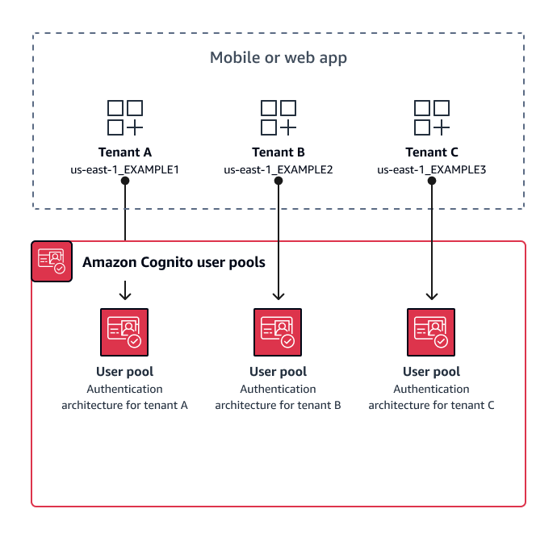

# User-pool multi-tenancy best

practices

Create a user pool for each tenant in your app. This approach provides maximum
isolation for each tenant. You can implement different configurations for each tenant.
Tenant isolation by user pool gives you flexibility in user-to-tenant mapping. You can
create multiple profiles for the same user. However, each user must sign up individually
for each tenant they can access.

Using this approach, you can set up a hosted UI for each tenant independently and
redirect users to their tenant-specific instance of your application. You can also use
this approach to integrate with backend services like [Amazon API Gateway](../../../apigateway/latest/developerguide/apigateway-integrate-with-cognito.md "../../../apigateway/latest/developerguide/apigateway-integrate-with-cognito.md").

The following diagram shows each tenant with a dedicated user pool.

###### When to implement user-pool multi-tenancy

When isolation and customization are your primary concerns. The relationship
between users and tenants might be complex in an architecture with multiple user
pools. Consider an example where you have two educational tenants. The same user
might be a limited-access student in one app, and a teacher with a high level of
permissions in another. You might require MFA in one app but not another, or have a
different password policy. Because local users can sign in to multiple app clients
in user pools with managed login, user-pool multi-tenancy is also ideal when you
want more than one of your tenants to sign in with managed login.

###### Level of effort

The development and operation effort to use this approach is high. To ensure
consistent and predictable outcomes for your family of apps, you must integrate
Amazon Cognito resources with your automation tools and maintain your baselines as your
authentication architecture grows more complex. When you want to create a single
starting place for your apps, you have to build the user-interface (UI) elements to
capture the initial decision that routes users to the correct resource.
