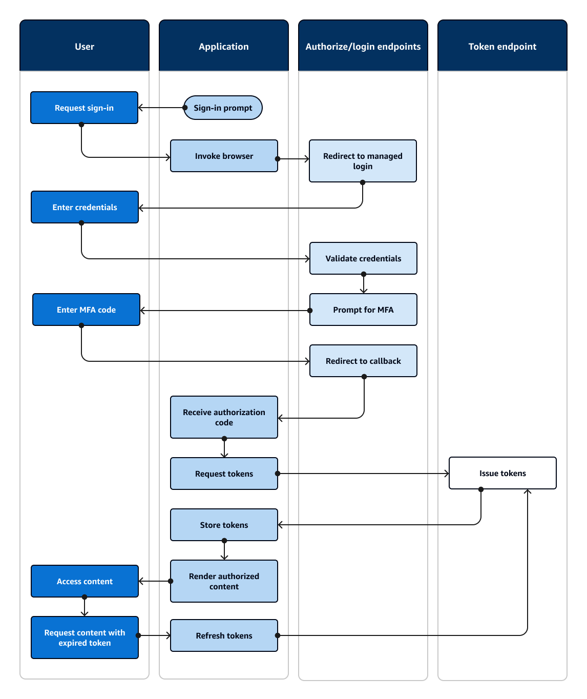
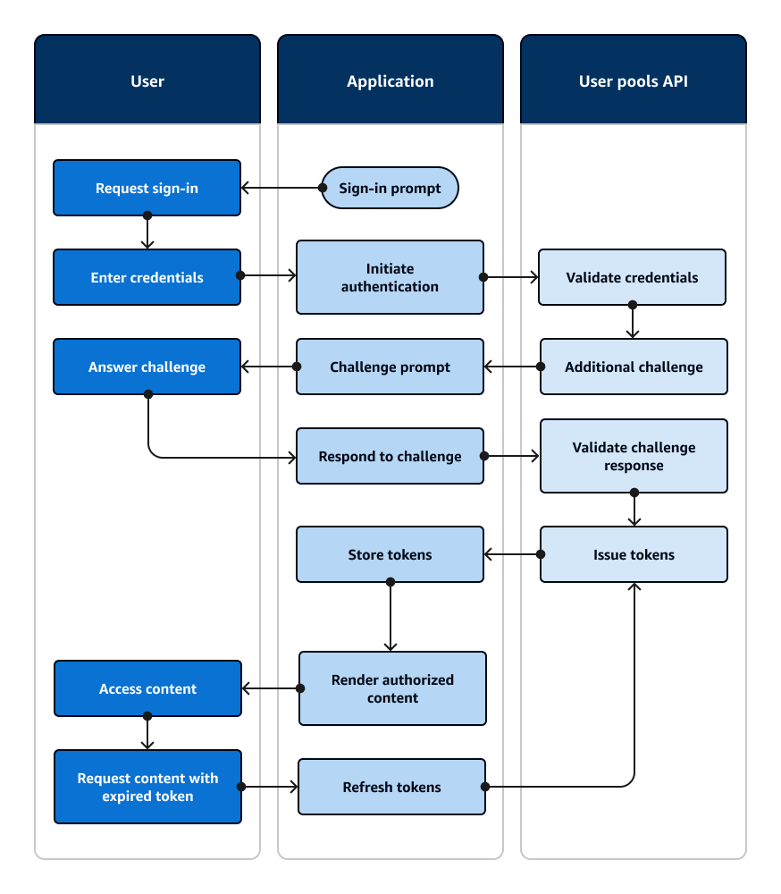
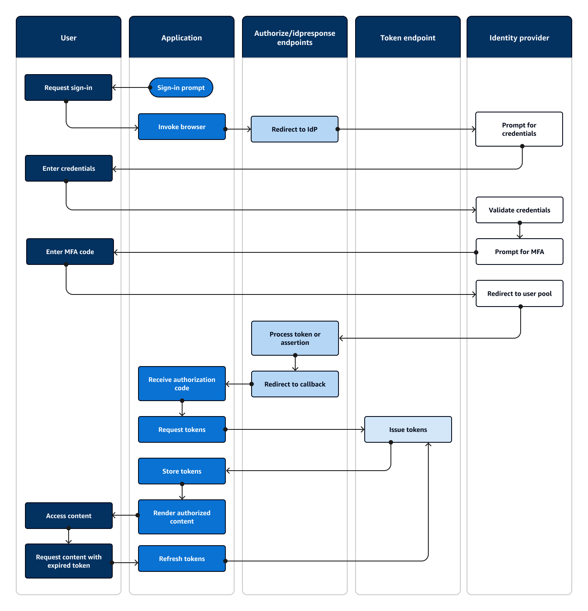
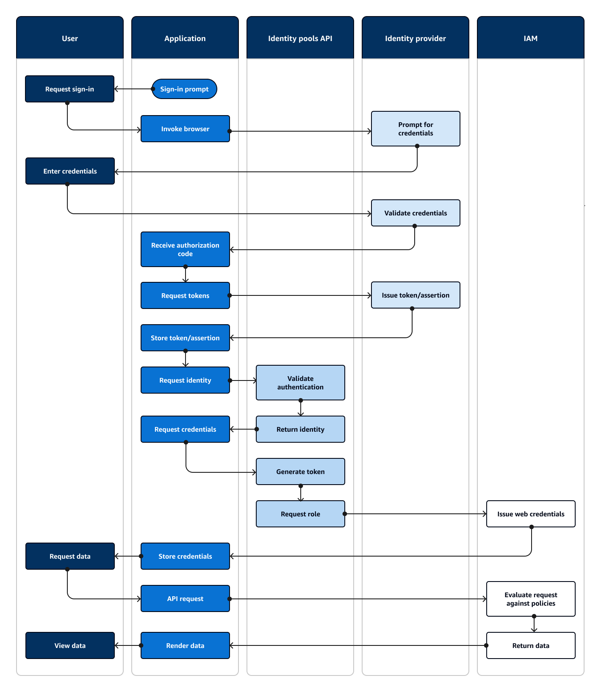

# How authentication works with Amazon Cognito

When your customer signs in to an Amazon Cognito user pool, your application receives JSON web tokens
(JWTs).

When your customer signs in to an identity pool, either with a user pool token or another
provider, your application receives temporary AWS credentials.

With user pool sign-in, you can implement authentication and authorization entirely with an
AWS SDK. If you don't want to build your own user interface (UI) components, you can invoke a
prebuilt web UI (managed login) or the sign-in page for your third-party identity provider
(IdP).

This topic is an overview of some of the ways that your application can interact with Amazon Cognito
to authenticate with ID tokens, authorize with access tokens, and access AWS services with
identity pool credentials.

###### Topics

- [User pool authentication with
  managed login](#cognito-authentication-concepts-managed-login "#cognito-authentication-concepts-managed-login")
- [User pool API authentication and
  authorization with an AWS SDK](#cognito-authentication-concepts-apiauth "#cognito-authentication-concepts-apiauth")
- [User pool authentication with a
  third-party identity provider](#cognito-authentication-concepts-thirdparty "#cognito-authentication-concepts-thirdparty")
- [Identity pool
  authentication](#cognito-authentication-concepts-identitypools "#cognito-authentication-concepts-identitypools")

## User pool authentication with

managed login

[Managed login](cognito-user-pools-managed-login.md "cognito-user-pools-managed-login.md") is a website that
is linked to your user pool and app client. It can perform sign-in, sign-up, and
password-reset operations for your users. An application with a managed login component for
authentication can require less developer effort to implement. An application can skip UI
components for authentication and invoke managed login webpages in the user's browser.

Applications collect users' JWTs with a web or app redirect location. Applications that
implement managed login can connect to user pools for authentication as if they were an OpenID
Connect (OIDC) IdP.

Managed login fits the model where applications require the authentication services of an
OIDC authorization server, but don't immediately require features like custom authentication,
identity pools integration, or user attribute self-service. When you want to use some of these
advanced options, you can implement them with a user pools component for an SDK.

Managed login and third-party IdP authentication models, with a primary reliance on OIDC
implementation, are best for advanced authorization models with OAuth 2.0 scopes.

The following diagram illustrates a typical sign-in session for managed login
authentication.

###### Managed login authentication flow

1. A user accesses your application.
2. They select a "Sign in" link.
3. The application directs the user to a sign-in prompt in the managed login pages of
   your user pool domain.
4. They enter their username and password.
5. The user pool validates the user's credentials and determines that the user has
   activated multi-factor authentication (MFA).
6. The managed login page prompts the user to enter an MFA code.
7. The user enters their MFA code.
8. Your user pool redirects the user to the application URL.
9. The application collects the authorization code from the URL request parameter that
   managed login appended to the [callback URL](cognito-terms.md#term-callbackurl "cognito-terms.md#term-callbackurl").
10. The application requests tokens with the authorization code.
11. The token endpoint returns JWTs to the application.
12. The application decodes, validates, and stores or caches the user's JWTs.
13. The application displays the requested access-controlled component.
14. The user views their content.
15. Later, the user's access token has expired, and they request to view an
    access-controlled component.
16. The application determines that the user's session should persist. It requests new
    tokens from the token endpoint with the refresh token.

###### Variants and customization

You can customize the look and feel of your managed login pages with the [branding editor](managed-login-brandingeditor.md "managed-login-brandingeditor.md") for your entire user pool,
or at the level of any [app client](cognito-terms.md#term-appclient "cognito-terms.md#term-appclient"). You can also [configure app clients](user-pool-settings-client-apps.md "user-pool-settings-client-apps.md") with their own
identity providers, scopes, access to user attributes, and advanced security
configuration.

###### Related resources

- [User pool managed login](cognito-user-pools-managed-login.md "cognito-user-pools-managed-login.md")
- [Scopes, M2M, and APIs with
  resource servers](cognito-user-pools-define-resource-servers.md "cognito-user-pools-define-resource-servers.md")
- [User pool endpoints and
  managed login reference](cognito-userpools-server-contract-reference.md "cognito-userpools-server-contract-reference.md")

## User pool API authentication and

authorization with an AWS SDK

AWS has developed components for Amazon Cognito user pools, or _Amazon Cognito identity
provider_, in [a variety of
developer frameworks](cognito-integrate-apps.md#amazon-cognito-authentication-with-sdks "cognito-integrate-apps.md#amazon-cognito-authentication-with-sdks"). The methods built into these SDKs call the [Amazon Cognito user pools API](../../../cognito-user-identity-pools/latest/APIReference/Welcome.md "../../../cognito-user-identity-pools/latest/APIReference/Welcome.md"). The same user pools API namespace has operations for configuration of
user pools and for user authentication. For a more thorough overview, see [Understanding API, OIDC, and managed login pages
authentication](authentication-flows-public-server-side.md#user-pools-API-operations "authentication-flows-public-server-side.md#user-pools-API-operations").

API authentication fits the model where your applications have existing UI components and
primarily rely on the user pool as a user directory. This design adds Amazon Cognito as a component
within a larger application. It requires programmatic logic to handle complex chains of
challenge and response.

This application doesn't need to implement a full OpenID Connect (OIDC) relying party
implementation. Instead, it has the ability to decode and use JWTs. When you want access to
the full set of user pool features for [local users](cognito-terms.md#terms-localuser "cognito-terms.md#terms-localuser"),
build your authentication with the Amazon Cognito SDK in your development environment.

API authentication with custom OAuth scopes is less oriented toward external API
authorization. To add custom scopes to an access token from API
authentication, modify the token at runtime with a [Pre token generation Lambda
trigger](user-pool-lambda-pre-token-generation.md "user-pool-lambda-pre-token-generation.md").

The following diagram illustrates a typical sign-in session for API authentication.

###### API authentication flow

1. A user accesses your application.
2. They select a "Sign in" link.
3. They enter their username and password.
4. The application invokes the method that makes an [InitiateAuth](../../../cognito-user-identity-pools/latest/APIReference/API_InitiateAuth.md "../../../cognito-user-identity-pools/latest/APIReference/API_InitiateAuth.md") API request. The request passes the user's credentials to a user
   pool.
5. The user pool validates the user's credentials and determines that the user has
   activated multi-factor authentication (MFA).
6. The user pool responds with a challenge that requests an MFA code.
7. The application generates a prompt that collects the MFA code from the user.
8. The application invokes the method that makes a [RespondToAuthChallenge](../../../cognito-user-identity-pools/latest/APIReference/API_RespondToAuthChallenge.md "../../../cognito-user-identity-pools/latest/APIReference/API_RespondToAuthChallenge.md") API request. The request passes the user's MFA
   code.
9. The user pool validates the user's MFA code.
10. The user pool responds with the user's JWTs.
11. The application decodes, validates, and stores or caches the user's JWTs.
12. The application displays the requested access-controlled component.
13. The user views their content.
14. Later, the user's access token has expired, and they request to view an
    access-controlled component.
15. The application determines that the user's session should persist. It invokes the
    [InitiateAuth](../../../cognito-user-identity-pools/latest/APIReference/API_InitiateAuth.md "../../../cognito-user-identity-pools/latest/APIReference/API_InitiateAuth.md") method again with the refresh token and retrieves new
    tokens.

###### Variants and customization

You can augment this flow with additional challenges—for example, your own custom
authentication challenges. You can automatically restrict access for users whose passwords
have been compromised, or whose unexpected sign-in characteristics might indicate a
malicious sign-in attempt. This flow looks much the same for operations to sign up, update
user attributes, and reset passwords. Most of these flows have duplicate public
(client-side) and confidential (server-side) API operations.

###### Related resources

- [Amazon Cognito user pools
  API](../../../cognito-user-identity-pools/latest/APIReference/Welcome.md "../../../cognito-user-identity-pools/latest/APIReference/Welcome.md")
- [Getting started with user pools](getting-started-user-pools.md "getting-started-user-pools.md")
- [Integrating Amazon Cognito authentication and authorization with
  web and mobile apps](cognito-integrate-apps.md "cognito-integrate-apps.md")
- [Understanding API, OIDC, and managed login pages
  authentication](authentication-flows-public-server-side.md#user-pools-API-operations "authentication-flows-public-server-side.md#user-pools-API-operations")

## User pool authentication with a

third-party identity provider

Sign-in with an external identity provider (IdP), or _federated
authentication_, is a similar model to [managed login](#cognito-authentication-concepts-managed-login "#cognito-authentication-concepts-managed-login"). Your
application is an OIDC relying party to your user pool, while your user pool serves as a
passthrough to an IdP. The IdP can be a consumer user directory like Facebook or Google, or it
can be a SAML 2.0 or OIDC enterprise directory like Azure.

Instead of managed login in the user's browser, your application invokes a redirect
endpoint on the user pool [authorization server](cognito-terms.md#term-authzserver "cognito-terms.md#term-authzserver"). From
the user's view, they choose the sign-in button in your application. Then their IdP prompts
them to sign in. Like with managed login authentication, an application collects JWTs at a
redirect location in the app.

Authentication with a third-party IdP fits a model where users might not want to come up
with a new password when they sign up for your application. Third-party authentication can be
added with low effort to an application that's implemented managed login authentication. In
effect, managed login and third-party IdPs produce a consistent authentication outcome from
minor variations in what you invoke in users' browsers.

Like managed login authentication, federated authentication is best for advanced
authorization models with OAuth 2.0 scopes.

The following diagram illustrates a typical sign-in session for federated
authentication.

###### Federated authentication flow

1. A user accesses your application.
2. They select a "Sign in" link.
3. The application directs the user to a sign-in prompt with their IdP.
4. They enter their username and password.
5. The IdP validates the user's credentials and determines that the user has activated
   multi-factor authentication (MFA).
6. The IdP prompts the user to enter an MFA code.
7. The user enters their MFA code.
8. The IdP redirects the user to the user pool with a SAML response or an authorization
   code.
9. If the user passed an authorization code, the user pool silently exchanges the code
   for IdP tokens. The user pool validates the IdP tokens and redirects the user to the
   application with a new authorization code.
10. The application collects the authorization code from the URL request parameter that
    the user pool appended to the [callback URL](cognito-terms.md#term-callbackurl "cognito-terms.md#term-callbackurl").
11. The application requests tokens with the authorization code.
12. The token endpoint returns JWTs to the application.
13. The application decodes, validates, and stores or caches the user's JWTs.
14. The application displays the requested access-controlled component.
15. The user views their content.
16. Later, the user's access token has expired, and they request to view an
    access-controlled component.
17. The application determines that the user's session should persist. It requests new
    tokens from the token endpoint with the refresh token.

###### Variants and customization

You can initiate federated authentication in [managed login](#cognito-authentication-concepts-managed-login "#cognito-authentication-concepts-managed-login"), where users
can choose from a list of IdPs that you assigned to your [app
client](cognito-terms.md#term-appclient "cognito-terms.md#term-appclient"). Managed login can also prompt for an email address and [automatically route a user's
request](cognito-user-pools-managing-saml-idp-naming.md "cognito-user-pools-managing-saml-idp-naming.md") to the corresponding SAML IdP. Authentication with a third-party identity
provider doesn't _require_ user interaction with managed
login. Your application can add a request parameter to a user's [authorization server request](cognito-terms.md#term-authorizationserver "cognito-terms.md#term-authorizationserver") and cause the user
to silently redirect to their IdP sign-in page.

###### Related resources

- [User pool sign-in with third party
  identity providers](cognito-user-pools-identity-federation.md "cognito-user-pools-identity-federation.md")
- [Scopes, M2M, and APIs with
  resource servers](cognito-user-pools-define-resource-servers.md "cognito-user-pools-define-resource-servers.md")
- [User pool endpoints and
  managed login reference](cognito-userpools-server-contract-reference.md "cognito-userpools-server-contract-reference.md")

## Identity pool

authentication

An identity pool is a component for your application that is distinct from a user pool in
function, API namespace, and SDK model. Where user pools offer token-based authentication and
authorization, identity pools offer authorization for AWS Identity and Access Management (IAM).

You can assign a set of IdPs to identity pools and sign in users with them. User pools are
closely integrated as identity pool IdPs and give identity pools the most options for access
control. At the same time, there is a wide selection of authentication options for identity
pools. User pools join SAML, OIDC, social, developer, and guest identity sources as routes to
temporary AWS credentials from identity pools.

Authentication with an identity pool is external—it follows one of the previously
illustrated user pool flows, or a flow that you develop independently with another IdP. After
your application performs initial authentication, it passes the proof to an identity pool and
receives a temporary session in return.

Authentication with an identity pool fits a model where you enforce the access control for
application assets and data in AWS services with IAM authorization. Like with [API authentication in user pools](#cognito-authentication-concepts-apiauth "#cognito-authentication-concepts-apiauth"), a
successful application includes AWS SDKs for each of the services that you want to access
for your users' benefit. AWS SDKs apply the credentials from identity pool authentication as
signatures to API requests.

The following diagram illustrates a typical sign-in session for identity pool
authentication with an IdP.

###### Identity pool authentication flow

1. A user accesses your application.
2. They select a "Sign in" link.
3. The application directs the user to a sign-in prompt with their IdP.
4. They enter their username and password.
5. The IdP validates the user's credentials.
6. The IdP redirects the user to the application with a SAML response or an authorization
   code.
7. If the user passed an authorization code, the application exchanges the code for IdP
   tokens.
8. The application decodes, validates, and stores or caches the user's JWTs or
   assertion.
9. The application invokes the method that makes a [GetId](../../../cognitoidentity/latest/APIReference/API_GetId.md "../../../cognitoidentity/latest/APIReference/API_GetId.md") API request. It
   passes the user's token or assertion and requests an identity ID.
10. The identity pool validates the token or assertion against configured identity
    providers.
11. The identity pool returns an identity ID.
12. The application invokes the method that makes a [GetCredentialsForIdentity](../../../cognitoidentity/latest/APIReference/API_GetCredentialsForIdentity.md "../../../cognitoidentity/latest/APIReference/API_GetCredentialsForIdentity.md") API request. It passes the user's token or assertions
    and requests an IAM role.
13. The identity pool generates a new JWT. The new JWT contains claims that request an
    IAM role. The identity pool determines the role based on the user's request and the
    role-selection criteria in the identity pool configuration for the IdP.
14. AWS Security Token Service (AWS STS) responds to the [AssumeRoleWithWebIdentity](../../../STS/latest/APIReference/API_AssumeRoleWithWebIdentity.md "../../../STS/latest/APIReference/API_AssumeRoleWithWebIdentity.md") request from the identity pool. The response contains
    API credentials for a temporary session with an IAM role.
15. The application stores the session credentials.
16. The user takes an action in the app that requires access-protected resources in
    AWS.
17. The application applies the temporary credentials as [signatures](../../../IAM/latest/UserGuide/reference_aws-signing.md "../../../IAM/latest/UserGuide/reference_aws-signing.md") to API requests
    for the required AWS services.
18. IAM evaluates the policies attached to the role in the credentials. It compares them
    to the request.
19. The AWS service returns the requested data.
20. The application renders the data in the user's interface.
21. The user views the data.

###### Variants and customization

To visualize authentication with a user pool, insert one of the previous user-pool
overviews after the **Issue token/assertion** step. Developer
authentication replaces all steps before **Request identity** with a
request signed by [developer credentials](cognito-terms.md#term-developercredentials "cognito-terms.md#term-developercredentials").
Guest authentication also skips straight to **Request identity**, doesn't
validate authentication, and returns credentials for a [limited-access](iam-roles.md#access-policies-scope-down-services "iam-roles.md#access-policies-scope-down-services") IAM role.

###### Related resources

- [Amazon Cognito identity pools](cognito-identity.md "cognito-identity.md")
- [User IAM roles](identity-pools.md#user-iam-roles "identity-pools.md#user-iam-roles")
- [Identity pools authentication flow](authentication-flow.md "authentication-flow.md")
