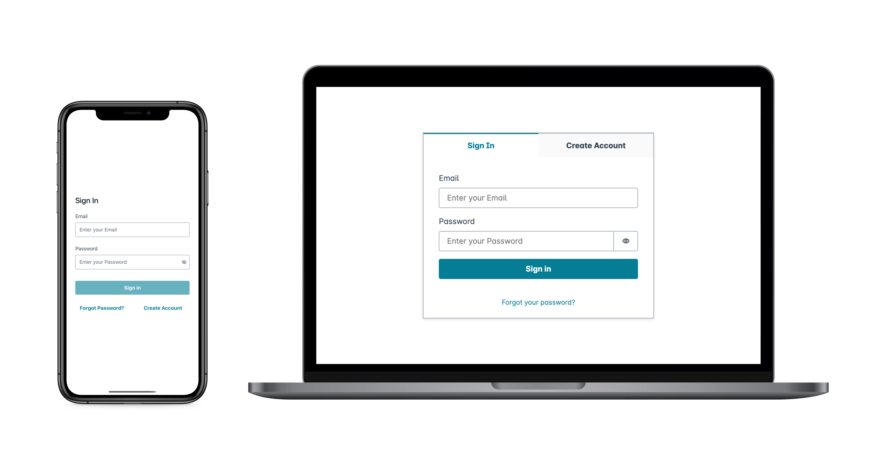

# Integrating Amazon Cognito authentication and authorization with

web and mobile apps

Implementation of Amazon Cognito is a mix of AWS Management Console or AWS SDK administrative tools, and SDK
libraries in applications. The Amazon Cognito console is the visual interface for setup and management of
your Amazon Cognito user pools and identity pools.

The lowest-effort integration you can create with Amazon Cognito user pools is with [managed login](cognito-terms.md#terms-managedlogin "cognito-terms.md#terms-managedlogin"). Managed login is a ready-to-use web-based
sign-in application for quick testing and deployment of Amazon Cognito user pools. User pool authentication with
managed login requires OpenID Connect (OIDC) libraries that direct users to hosted sign-in
pages. In this series of user-interactive and redirect web endpoints, Amazon Cognito handles the flow of
authentication, including third-party sign-in, multi-factor authentication (MFA), and choosing
an authentication flow. Your application only has to process the authentication outcome that
Amazon Cognito returns in the response.

You can also add an AWS SDK to your application, custom-build authentication interfaces,
and invoke API operations for authentication and authorization of your users. [AWS Amplify](https://docs.amplify.aws/ "https://docs.amplify.aws/") is an AWS service for building
full-stack applications, with Amazon Cognito authentication in the back end.

For example, your app might invoke managed login for user sign-in, then call the token
endpoint from your app code to exchange your user's authorization code for tokens. Then your app
must interpret and store your user's tokens, and present them in the appropriate context for
authentication and authorization. Amplify adds guided integration tools with built-in
functions for these processes.

You can also build your Amazon Cognito resources entirely in code. Identity pools don't have the same
managed authentication options as user pools—for access to AWS credentials in your
applications, implement identity pools operations in imported SDK modules. To get started with
your own custom-built application code, visit the Amazon Cognito [code examples](service_code_examples.md "service_code_examples.md") for
[AWS SDKs](https://aws.amazon.com/developer/tools/ "https://aws.amazon.com/developer/tools/"). For integration with the
Amazon Cognito as an OpenID Connect identity provider, use [OpenID Connect developer
tools](https://openid.net/certified-open-id-developer-tools/ "https://openid.net/certified-open-id-developer-tools/").

Before you use Amazon Cognito authentication and authorization, choose an app platform and prepare
your code to integrate with the service. For available platforms for AWS SDKs, see [Authentication with AWS
SDKs](#amazon-cognito-authentication-with-sdks "#amazon-cognito-authentication-with-sdks"). The AWS CLI is a command-line SDK for Amazon Cognito
and other AWS services, and is a valuable place to begin to familiarize yourself with Amazon Cognito
API operations and their syntax.

###### Note

Some components of Amazon Cognito can be configured only with the API. For example, you can only
set a user pool [custom SMS
or email sender](user-pool-lambda-custom-sender-triggers.md "user-pool-lambda-custom-sender-triggers.md") Lambda trigger with a request that updates the
`LambdaConfig` property of the [UserPool](../../../cognito-user-identity-pools/latest/APIReference/API_UserPoolType.md "../../../cognito-user-identity-pools/latest/APIReference/API_UserPoolType.md")
class in a [CreateUserPool](../../../cognito-user-identity-pools/latest/APIReference/API_CreateUserPool.md "../../../cognito-user-identity-pools/latest/APIReference/API_CreateUserPool.md") or [UpdateUserPool](../../../cognito-user-identity-pools/latest/APIReference/API_UpdateUserPool.md "../../../cognito-user-identity-pools/latest/APIReference/API_UpdateUserPool.md") API request.

The Amazon Cognito user pools API shares its namespace with several classes of API operations. One class
configures user pools and their processes, identity providers and users. Another includes
unauthenticated operations for your users in a public client to sign in, sign out, and manage
their profiles. The final class of API operations performs user operations that you authorize
with your own AWS credentials in a confidential server-side client. You must know your
intended app architecture before you begin to implement app code. For more information, see
[Understanding API, OIDC, and managed login pages
authentication](authentication-flows-public-server-side.md#user-pools-API-operations "authentication-flows-public-server-side.md#user-pools-API-operations").

###### Topics

- [Authentication with AWS Amplify](#cognito-integrate-apps-amplify "#cognito-integrate-apps-amplify")
- [Authentication with AWS
  SDKs](#amazon-cognito-authentication-with-sdks "#amazon-cognito-authentication-with-sdks")
- [How authentication works with Amazon Cognito](cognito-how-to-authenticate.md "cognito-how-to-authenticate.md")
- [Using this service with an AWS SDK](sdk-general-information-section.md "sdk-general-information-section.md")
- [Authorization with Amazon Verified Permissions](amazon-cognito-authorization-with-avp.md "amazon-cognito-authorization-with-avp.md")

## Authentication with AWS Amplify

AWS Amplify is a complete solution for building web and mobile applications. With
Amplify, you can connect to existing resources with the Amplify libraries, or you can
create and configure new resources with the Amplify command line interface (CLI). Amplify
also has connected UI components like [Authenticator](https://ui.docs.amplify.aws/react/connected-components/authenticator "https://ui.docs.amplify.aws/react/connected-components/authenticator") for setup and customization of the sign-in and sign-up experience in
your app.

To use Amplify authentication features in your front-end app, see the following
documentation by platform.

- [Amplify authentication for
  React](https://docs.amplify.aws/react/start/ "https://docs.amplify.aws/react/start/")
- [Amplify authentication for
  React Native](https://docs.amplify.aws/react-native/start/ "https://docs.amplify.aws/react-native/start/")
- [Amplify authentication for Swift
  (iOS)](https://docs.amplify.aws/swift/start/ "https://docs.amplify.aws/swift/start/")
- [Amplify authentication for
  Android](https://docs.amplify.aws/android/start/ "https://docs.amplify.aws/android/start/")
- [Amplify authentication for
  Flutter](https://docs.amplify.aws/flutter/start/ "https://docs.amplify.aws/flutter/start/")

The Amplify libraries are open source and are available on [GitHub](https://github.com/aws-amplify "https://github.com/aws-amplify"). To learn more about how Amplify Auth
implements Amazon Cognito authentication, visit the following libraries.

- [amplify-js](https://github.com/aws-amplify/amplify-js/tree/main/packages/auth "https://github.com/aws-amplify/amplify-js/tree/main/packages/auth")
- [amplify-swift](https://github.com/aws-amplify/amplify-swift/tree/main/Amplify/Categories/Auth "https://github.com/aws-amplify/amplify-swift/tree/main/Amplify/Categories/Auth")
- [amplify-flutter](https://github.com/aws-amplify/amplify-flutter/tree/main/packages/auth "https://github.com/aws-amplify/amplify-flutter/tree/main/packages/auth")
- [amplify-android](https://github.com/aws-amplify/amplify-android/tree/main/aws-auth-cognito "https://github.com/aws-amplify/amplify-android/tree/main/aws-auth-cognito")

### Creating a user interface (UI) with

Amplify

[User pool managed login](cognito-user-pools-managed-login.md "cognito-user-pools-managed-login.md") can fulfill the essential needs of an
authentication front-end for a web or mobile app. To customize your user interface (UI)
beyond the parameters that managed login accommodates, custom-build an application. [Amplify UI](https://ui.docs.amplify.aws/ "https://ui.docs.amplify.aws/") is a customizable collection of
front-end components in a variety of languages.

To get started with your custom authentication component, visit the following
documentation for the Authenticator component.

- [Authenticator for Android](https://ui.docs.amplify.aws/android/connected-components/authenticator "https://ui.docs.amplify.aws/android/connected-components/authenticator")
- [Authenticator for Angular](https://ui.docs.amplify.aws/angular/connected-components/authenticator "https://ui.docs.amplify.aws/angular/connected-components/authenticator")
- [Authenticator for Flutter](https://ui.docs.amplify.aws/flutter/connected-components/authenticator "https://ui.docs.amplify.aws/flutter/connected-components/authenticator")
- [Authenticator for React](https://ui.docs.amplify.aws/react/connected-components/authenticator "https://ui.docs.amplify.aws/react/connected-components/authenticator")
- [Authenticator for React Native](https://ui.docs.amplify.aws/react-native/connected-components/authenticator "https://ui.docs.amplify.aws/react-native/connected-components/authenticator")
- [Authenticator for Swift](https://ui.docs.amplify.aws/swift/connected-components/authenticator "https://ui.docs.amplify.aws/swift/connected-components/authenticator")
- [Authenticator for Vue](https://ui.docs.amplify.aws/vue/connected-components/authenticator "https://ui.docs.amplify.aws/vue/connected-components/authenticator")

## Authentication with AWS

SDKs

To use a secure backend to build your own identity microservice that interacts with Amazon Cognito,
connect to the Amazon Cognito user pools and Amazon Cognito identity pools API with an AWS SDK in the language of your
choice.

For details on each API operation, see the [Amazon Cognito user pools API Reference](../../../cognito-user-identity-pools/latest/APIReference/API_Operations.md "../../../cognito-user-identity-pools/latest/APIReference/API_Operations.md") and the [Amazon Cognito API Reference](../../../cognitoidentity/latest/APIReference/Welcome.md "../../../cognitoidentity/latest/APIReference/Welcome.md"). These documents contain [**See also**](../../../cognito-user-identity-pools/latest/APIReference/API_InitiateAuth.md#API_InitiateAuth_SeeAlso "../../../cognito-user-identity-pools/latest/APIReference/API_InitiateAuth.md#API_InitiateAuth_SeeAlso") sections with resources for using a variety of SDKs
in supported platforms.

- [AWS Command Line
  Interface](../../../cli/latest/reference/cognito-idp/index.md#cli-aws-cognito-idp "../../../cli/latest/reference/cognito-idp/index.md#cli-aws-cognito-idp")
- [AWS SDK for .NET](../../../sdkfornet/v3/apidocs/items/CognitoIdentityProvider/TCognitoIdentityProviderClient.md "../../../sdkfornet/v3/apidocs/items/CognitoIdentityProvider/TCognitoIdentityProviderClient.md")
- [AWS SDK for C++](https://sdk.amazonaws.com/cpp/api/LATEST/aws-cpp-sdk-cognito-idp/html/class_aws_1_1_cognito_identity_provider_1_1_cognito_identity_provider_client.html "https://sdk.amazonaws.com/cpp/api/LATEST/aws-cpp-sdk-cognito-idp/html/class_aws_1_1_cognito_identity_provider_1_1_cognito_identity_provider_client.html")
- [AWS SDK
  for Go](../../../sdk-for-go/api/service/cognitoidentityprovider.md#CognitoIdentityProvider "../../../sdk-for-go/api/service/cognitoidentityprovider.md#CognitoIdentityProvider")
- [AWS SDK for Java V2](https://sdk.amazonaws.com/java/api/latest/software/amazon/awssdk/services/cognitoidentityprovider/CognitoIdentityProviderClient.html "https://sdk.amazonaws.com/java/api/latest/software/amazon/awssdk/services/cognitoidentityprovider/CognitoIdentityProviderClient.html")
- [AWS SDK for
  JavaScript](../../../AWSJavaScriptSDK/latest/AWS/CognitoIdentityServiceProvider.md "../../../AWSJavaScriptSDK/latest/AWS/CognitoIdentityServiceProvider.md")
- [AWS SDK for PHP V3](../../../aws-sdk-php/v3/api/class-Aws.CognitoIdentityProvider.md "../../../aws-sdk-php/v3/api/class-Aws.CognitoIdentityProvider.md")
- [AWS SDK for Python](https://boto3.amazonaws.com/v1/documentation/api/latest/reference/services/cognito-idp.html "https://boto3.amazonaws.com/v1/documentation/api/latest/reference/services/cognito-idp.html")
- [AWS SDK for Ruby
  V3](../../../sdk-for-ruby/v3/api/Aws/CognitoIdentityProvider/Client.md "../../../sdk-for-ruby/v3/api/Aws/CognitoIdentityProvider/Client.md")
