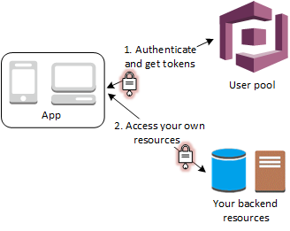
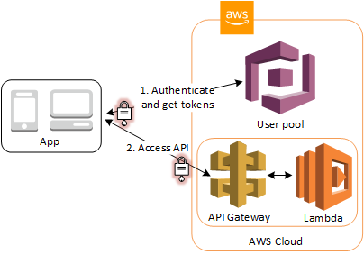
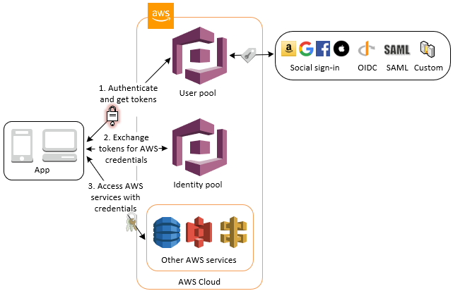
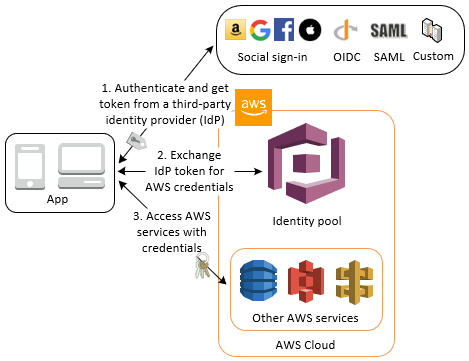
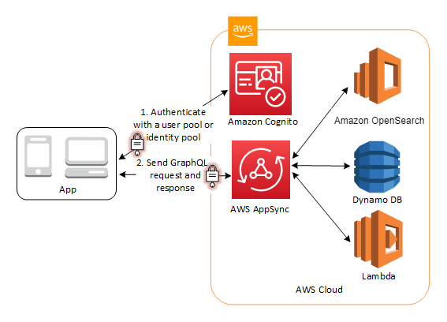

# Common Amazon Cognito scenarios

This topic describes six common scenarios for using Amazon Cognito.

The two main components of Amazon Cognito are user pools and identity pools. User pools are user
directories that provide sign-up and sign-in options for your web and mobile app users. Identity pools
provide temporary AWS credentials to grant your users access to other AWS services.

A user pool is a user directory in Amazon Cognito. Your app users can either sign in directly through a user pool, or they can federate through a
third-party identity provider (IdP). The user pool manages the overhead of handling the tokens
that are returned from social sign-in through Facebook, Google, Amazon, and Apple, and from OpenID
Connect (OIDC) and SAML IdPs. Whether your users sign in
directly or through a third party, all members of the user pool have a directory profile that
you can access through an SDK.

With an identity pool, your users can obtain temporary AWS credentials to access AWS
services, such as Amazon S3 and DynamoDB. Identity pools support anonymous guest users, as well
as federation through third-party IdPs.

###### Topics

- [Authenticate with a user pool](#scenario-basic-user-pool "#scenario-basic-user-pool")
- [Access back-end resources with user pool tokens](#scenario-backend "#scenario-backend")
- [Access resources with API Gateway and Lambda with a user
  pool](#scenario-api-gateway "#scenario-api-gateway")
- [Access AWS services with a user pool and an
  identity pool](#scenario-aws-and-user-pool "#scenario-aws-and-user-pool")
- [Authenticate with a third party and access AWS
  services with an identity pool](#scenario-identity-pool "#scenario-identity-pool")
- [Access AWS AppSync resources with Amazon Cognito](#scenario-appsync "#scenario-appsync")

## Authenticate with a user pool

You can enable your users to authenticate with a user pool. Your app users can either sign in directly through a user pool, or they can federate through a
third-party identity provider (IdP). The user pool manages the overhead of handling the tokens
that are returned from social sign-in through Facebook, Google, Amazon, and Apple, and from OpenID
Connect (OIDC) and SAML IdPs.

After a successful authentication, your web or mobile app will receive user pool tokens
from Amazon Cognito. You can use those tokens to retrieve AWS credentials that allow your app to access
other AWS services, or you might choose to use them to control access to your server-side
resources, or to the Amazon API Gateway.

For more information, see [An example authentication
session](authentication.md#amazon-cognito-user-pools-authentication-flow "authentication.md#amazon-cognito-user-pools-authentication-flow") and [Understanding
user pool JSON web tokens (JWTs)](amazon-cognito-user-pools-using-tokens-with-identity-providers.md "amazon-cognito-user-pools-using-tokens-with-identity-providers.md").

## Access back-end resources with user pool tokens

After a successful user pool sign-in, your web or mobile app will receive user pool tokens
from Amazon Cognito. You can use those tokens to control access to your server-side resources. You can
also create user pool groups to manage permissions, and to represent different types of users.
For more information on using groups to control access to your resources, see [Adding groups to a user pool](cognito-user-pools-user-groups.md "cognito-user-pools-user-groups.md").

After you configure a domain for your user pool, Amazon Cognito provisions a hosted web UI that
allows you to add sign-up and sign-in pages to your app. Using this OAuth 2.0 foundation, you
can create your own resource server to enable your users to access protected resources. For
more information, see [Scopes, M2M, and resource
servers](cognito-user-pools-define-resource-servers.md "cognito-user-pools-define-resource-servers.md").

For more information about user pool authentication, see [An example authentication
session](authentication.md#amazon-cognito-user-pools-authentication-flow "authentication.md#amazon-cognito-user-pools-authentication-flow") and [Understanding
user pool JSON web tokens (JWTs)](amazon-cognito-user-pools-using-tokens-with-identity-providers.md "amazon-cognito-user-pools-using-tokens-with-identity-providers.md").

## Access resources with API Gateway and Lambda with a user

pool

You can enable your users to access your API through API Gateway. API Gateway validates the tokens
from a successful user pool authentication, and uses them to grant your users access to
resources including Lambda functions, or your own API.

You can use groups in a user pool to control permissions with API Gateway by mapping group
membership to IAM roles. The groups that a user is a member of are included in the ID token
provided by a user pool when your app user signs in. For more information on user pool groups
See [Adding groups to a user pool](cognito-user-pools-user-groups.md "cognito-user-pools-user-groups.md").

You can submit your user pool tokens with a request to API Gateway for verification by an Amazon Cognito
authorizer Lambda function. For more information on API Gateway, see [Using API Gateway with
Amazon Cognito user pools](../../../apigateway/latest/developerguide/apigateway-integrate-with-cognito.md "../../../apigateway/latest/developerguide/apigateway-integrate-with-cognito.md").

## Access AWS services with a user pool and an

identity pool

After a successful user pool authentication, your app will receive user pool tokens from
Amazon Cognito. You can exchange them for temporary access to other AWS services with an identity pool.
For more information, see [Accessing
AWS services using an identity pool after sign-in](amazon-cognito-integrating-user-pools-with-identity-pools.md "amazon-cognito-integrating-user-pools-with-identity-pools.md") and [Getting started with Amazon Cognito identity
pools](getting-started-with-identity-pools.md "getting-started-with-identity-pools.md").

## Authenticate with a third party and access AWS

services with an identity pool

You can enable your users access to AWS services through an identity pool. An identity
pool requires an IdP token from a user that's authenticated by a third-party identity provider
(or nothing if it's an anonymous guest). In exchange, the identity pool grants temporary AWS
credentials that you can use to access other AWS services. For more information, see [Getting started with Amazon Cognito identity
pools](getting-started-with-identity-pools.md "getting-started-with-identity-pools.md").

## Access AWS AppSync resources with Amazon Cognito

You can grant your users access to AWS AppSync resources with tokens from a successful Amazon Cognito
user pool authentication. For more information, see [AMAZON_COGNITO_USER_POOLS authorization](../../../appsync/latest/devguide/security-authz.md#amazon-cognito-user-pools-authorization "../../../appsync/latest/devguide/security-authz.md#amazon-cognito-user-pools-authorization") in the _AWS AppSync
Developer Guide_.

You can also sign requests to the AWS AppSync GraphQL API with the IAM credentials that you
receive from an identity pool. See [AWS_IAM
authorization](../../../appsync/latest/devguide/security-authz.md#aws-iam-authorization "../../../appsync/latest/devguide/security-authz.md#aws-iam-authorization").

