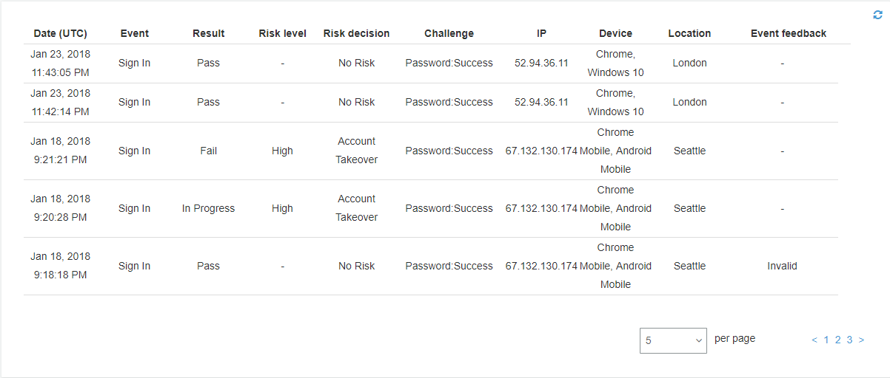
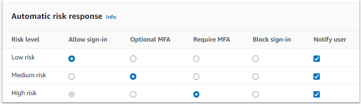

# Working with adaptive

authentication

With adaptive authentication, you can configure your user pool to block suspicious
sign-ins or add second factor authentication in response to an increased risk level. For
each sign-in attempt, Amazon Cognito generates a risk score for how likely the sign-in request is to
be from a compromised source. This risk score is based on device and user factors that your
application provides, and others that Amazon Cognito derives from the request. Some factors that
contribute to the risk evaluation by Amazon Cognito are IP
address, user agent, and geographical distance from other sign-in
attempts. Adaptive authentication can turn on or require multi-factor
authentication (MFA) for a user in your user pool when Amazon Cognito detects risk in a user's
session, and the user hasn't yet chosen an MFA method. When you activate MFA for a user,
they always receive a challenge to provide or set up a second factor during authentication,
regardless of how you configured adaptive authentication. From your user's perspective, your
app offers to help them set up MFA, and optionally Amazon Cognito prevents them from signing in again
until they have configured an additional factor.

Amazon Cognito publishes metrics about sign-in attempts, their risk levels, and failed challenges
to Amazon CloudWatch. For more information, see [Viewing threat
protection metrics](metrics-for-cognito-user-pools.md#user-pool-settings-viewing-threat-protection-metrics "metrics-for-cognito-user-pools.md#user-pool-settings-viewing-threat-protection-metrics").

To add adaptive authentication to your user pool, see [Advanced security with threat
protection](cognito-user-pool-settings-threat-protection.md "cognito-user-pool-settings-threat-protection.md").

###### Topics

- [Adaptive authentication overview](#security-cognito-user-pool-settings-adaptive-authentication-overview "#security-cognito-user-pool-settings-adaptive-authentication-overview")
- [Adding
  user device and session data to API requests](#user-pool-settings-adaptive-authentication-device-fingerprint "#user-pool-settings-adaptive-authentication-device-fingerprint")
- [Viewing
  and exporting user event history](#user-pool-settings-adaptive-authentication-event-user-history "#user-pool-settings-adaptive-authentication-event-user-history")
- [Providing event
  feedback](#user-pool-settings-adaptive-authentication-feedback "#user-pool-settings-adaptive-authentication-feedback")
- [Sending notification
  messages](#user-pool-settings-adaptive-authentication-messages "#user-pool-settings-adaptive-authentication-messages")

## Adaptive authentication overview

From the **Threat protection** menu in the Amazon Cognito console, you can
choose settings for adaptive authentication, including what actions to take at different
risk levels and customization of notification messages to users. You can assign a global
threat protection configuration to all of your app clients, but apply a client-level
configuration to individual app clients.

Amazon Cognito adaptive authentication assigns one of the following risk levels to each user
session: **High**, **Medium**, **Low**,
or **No Risk**.

Consider your options carefully when you change your **Enforcement
method** from **Audit-only** to
**Full-function**. The automatic responses that you apply to risk
levels influence the risk level that Amazon Cognito assigns to subsequent user sessions with the
same characteristics. For example, after you choose to take no action, or
**Allow**, user sessions that Amazon Cognito initially evaluates to be
high-risk, Amazon Cognito considers similar sessions to have a lower risk.

| For each risk level, you can choose from the following options: | Option                                                                                                                                                                                                                                                                  | Action                                                                                                                                                                                                                                                                                                                                                                                                                                                                                                                                                                                                                                                                                                                                                                                                                                                                                                                                                                                                                                                                                                                                                                                                                                                                                                                                                                                                                                                                                                                                                                                                                                                                                                                                                                                                                                                                                                                                                                                                                                                                                                                                                                                                                                                                                                                                                                                                                                                                                                                                                                                                                                                                                                                                                                                                                                                                                                                                                                                                                                                                                                                                                                                                                                                                                                                                                                                                                                                                                                                                                                                                                                                                                                                                                                                                                                                                                                                                                                                                                                                                                                                                                                                                                                                                                                                                                                                                                                                                                                                                                                                                                                                                                                                                                                                                                                                                                                                                                                                                                                                                                                                                                                                                                                                                                                                                                                                                                                                                                                                                                                                                                                                                                                                                                                                                                                                                                                                                                                                                                                                                                                                                                                                                                                                                                                                                                                                                                                                                                                                                                                                                                                                                                                                                                                                                                                                                                                                                                                                                                                                                                                                                                                                                                                                                                                                                                                                                                                                                                                                                                                                                                                                                                                                                                                                                                                                                                                                                                                                                                                                                                                                                                                                                                                                                                                                                                                                                                                                                                                                                                                                                                                                                                                                                                                                                                                                                                                                                                                                                                                                                                                                                                                                                                                                                                                                                                                                                                                                                                                                                                                                                                                                                                                                                                                                                                                                                                                                                                                                                                                                                                                                                                                                                                                                                                                                                                                                                                                                                                                                                                                                                                                                                                                                                                                                                                                                                                                                                                                                                                                                                                                                                                                                                                                                                                                                                                                                                                                                                                                                                                                                                                                                                                                                                                                                                                                                                                                                                                                                                                                                                                                                                                                                                                                                                                                                                                                                                                                                                                                                                                                                                                                                                                                                                                                                                                                                                                                                                                                                                                                                                                                                                                                                                                                                                                                                                                                                                                                                                                                                                                                                                                                                                                                                                                                                                                                                                                                                                                                                                                                                                                                                                                                                                                                                                                                                                                                                                                                                                                                                                                                                                                                                                                                                                                                                                                                                                                                                                                                                                                                                                                                                                                                                                                                                                                                                                                                                                                                                                                                                                                                                                                                                                                                                                                                                                                                                                                                                                                                                                                                                                                                                                                                                                                                                                                                                                                                                                                                                                                                                                                                                                                                                                                                                                                                                                                                                                                                                                                                                                                                                                                                                                                                                                                                                                                                                                                                                                                                                                                                                                                                                                                                                                                                                                                                                                                                                                                                                                                                                                                                                                                                                                                                                                                                                                                                                                                                                                                                                                                                                                                                                                                                                                                                                                                                                                                                                                                                                                                                                                                                                                                                                                                                                                                                                                                                                                                                                                                                                                                                                                                                                                                                                                                                                                                                                                                                                                                                                                                                                                                                                                                                                                                                                                                                                                                                                                                                                                                                                                                                                                                                                                                                                              |
| --------------------------------------------------------------- | ----------------------------------------------------------------------------------------------------------------------------------------------------------------------------------------------------------------------------------------------------------------------- | ------------------------------------------------------------------------------------------------------------------------------------------------------------------------------------------------------------------------------------------------------------------------------------------------------------------------------------------------------------------------------------------------------------------------------------------------------------------------------------------------------------------------------------------------------------------------------------------------------------------------------------------------------------------------------------------------------------------------------------------------------------------------------------------------------------------------------------------------------------------------------------------------------------------------------------------------------------------------------------------------------------------------------------------------------------------------------------------------------------------------------------------------------------------------------------------------------------------------------------------------------------------------------------------------------------------------------------------------------------------------------------------------------------------------------------------------------------------------------------------------------------------------------------------------------------------------------------------------------------------------------------------------------------------------------------------------------------------------------------------------------------------------------------------------------------------------------------------------------------------------------------------------------------------------------------------------------------------------------------------------------------------------------------------------------------------------------------------------------------------------------------------------------------------------------------------------------------------------------------------------------------------------------------------------------------------------------------------------------------------------------------------------------------------------------------------------------------------------------------------------------------------------------------------------------------------------------------------------------------------------------------------------------------------------------------------------------------------------------------------------------------------------------------------------------------------------------------------------------------------------------------------------------------------------------------------------------------------------------------------------------------------------------------------------------------------------------------------------------------------------------------------------------------------------------------------------------------------------------------------------------------------------------------------------------------------------------------------------------------------------------------------------------------------------------------------------------------------------------------------------------------------------------------------------------------------------------------------------------------------------------------------------------------------------------------------------------------------------------------------------------------------------------------------------------------------------------------------------------------------------------------------------------------------------------------------------------------------------------------------------------------------------------------------------------------------------------------------------------------------------------------------------------------------------------------------------------------------------------------------------------------------------------------------------------------------------------------------------------------------------------------------------------------------------------------------------------------------------------------------------------------------------------------------------------------------------------------------------------------------------------------------------------------------------------------------------------------------------------------------------------------------------------------------------------------------------------------------------------------------------------------------------------------------------------------------------------------------------------------------------------------------------------------------------------------------------------------------------------------------------------------------------------------------------------------------------------------------------------------------------------------------------------------------------------------------------------------------------------------------------------------------------------------------------------------------------------------------------------------------------------------------------------------------------------------------------------------------------------------------------------------------------------------------------------------------------------------------------------------------------------------------------------------------------------------------------------------------------------------------------------------------------------------------------------------------------------------------------------------------------------------------------------------------------------------------------------------------------------------------------------------------------------------------------------------------------------------------------------------------------------------------------------------------------------------------------------------------------------------------------------------------------------------------------------------------------------------------------------------------------------------------------------------------------------------------------------------------------------------------------------------------------------------------------------------------------------------------------------------------------------------------------------------------------------------------------------------------------------------------------------------------------------------------------------------------------------------------------------------------------------------------------------------------------------------------------------------------------------------------------------------------------------------------------------------------------------------------------------------------------------------------------------------------------------------------------------------------------------------------------------------------------------------------------------------------------------------------------------------------------------------------------------------------------------------------------------------------------------------------------------------------------------------------------------------------------------------------------------------------------------------------------------------------------------------------------------------------------------------------------------------------------------------------------------------------------------------------------------------------------------------------------------------------------------------------------------------------------------------------------------------------------------------------------------------------------------------------------------------------------------------------------------------------------------------------------------------------------------------------------------------------------------------------------------------------------------------------------------------------------------------------------------------------------------------------------------------------------------------------------------------------------------------------------------------------------------------------------------------------------------------------------------------------------------------------------------------------------------------------------------------------------------------------------------------------------------------------------------------------------------------------------------------------------------------------------------------------------------------------------------------------------------------------------------------------------------------------------------------------------------------------------------------------------------------------------------------------------------------------------------------------------------------------------------------------------------------------------------------------------------------------------------------------------------------------------------------------------------------------------------------------------------------------------------------------------------------------------------------------------------------------------------------------------------------------------------------------------------------------------------------------------------------------------------------------------------------------------------------------------------------------------------------------------------------------------------------------------------------------------------------------------------------------------------------------------------------------------------------------------------------------------------------------------------------------------------------------------------------------------------------------------------------------------------------------------------------------------------------------------------------------------------------------------------------------------------------------------------------------------------------------------------------------------------------------------------------------------------------------------------------------------------------------------------------------------------------------------------------------------------------------------------------------------------------------------------------------------------------------------------------------------------------------------------------------------------------------------------------------------------------------------------------------------------------------------------------------------------------------------------------------------------------------------------------------------------------------------------------------------------------------------------------------------------------------------------------------------------------------------------------------------------------------------------------------------------------------------------------------------------------------------------------------------------------------------------------------------------------------------------------------------------------------------------------------------------------------------------------------------------------------------------------------------------------------------------------------------------------------------------------------------------------------------------------------------------------------------------------------------------------------------------------------------------------------------------------------------------------------------------------------------------------------------------------------------------------------------------------------------------------------------------------------------------------------------------------------------------------------------------------------------------------------------------------------------------------------------------------------------------------------------------------------------------------------------------------------------------------------------------------------------------------------------------------------------------------------------------------------------------------------------------------------------------------------------------------------------------------------------------------------------------------------------------------------------------------------------------------------------------------------------------------------------------------------------------------------------------------------------------------------------------------------------------------------------------------------------------------------------------------------------------------------------------------------------------------------------------------------------------------------------------------------------------------------------------------------------------------------------------------------------------------------------------------------------------------------------------------------------------------------------------------------------------------------------------------------------------------------------------------------------------------------------------------------------------------------------------------------------------------------------------------------------------------------------------------------------------------------------------------------------------------------------------------------------------------------------------------------------------------------------------------------------------------------------------------------------------------------------------------------------------------------------------------------------------------------------------------------------------------------------------------------------------------------------------------------------------------------------------------------------------------------------------------------------------------------------------------------------------------------------------------------------------------------------------------------------------------------------------------------------------------------------------------------------------------------------------------------------------------------------------------------------------------------------------------------------------------------------------------------------------------------------------------------------------------------------------------------------------------------------------------------------------------------------------------------------------------------------------------------------------------------------------------------------------------------------------------------------------------------------------------------------------------------------------------------------------------------------------------------------------------------------------------------------------------------------------------------------------------------------------------------------------------------------------------------------------------------------------------------------------------------------------------------------------------------------------------------------------------------------------------------------------------------------------------------------------------------------------------------------------------------------------------------------------------------------------------------------------------------------------------------------------------------------------------------------------------------------------------------------------------------------------------------------------------------------------------------------------------------------------------------------------------------------------------------------------------------------------------------------------------------------------------------------------------------------------------------------------------------------------------------------------------------------------------------------------------------------------------------------------------------------------------------------------------------------------------------------------------------------------------------------------------------------------------------------------------------------------------------------------------------------------------------------------------------------------------------------------------------------------------------------------------------------------------------------------------------------------------------------------------------------------------------------------------------------------------------------------------------------------------------------------------------------------------------------------------------------------------------------------------------------------------------------------------------------------------------------------------------------------------------------------------------------------------------------------------------------------------------------------------------------------------------------------------------------------------------------------------------------------------------------------------------------------------------------------------------------------------------------------------------------------------------------------------------------------------------------------------------------------------------------------------------------------------------------------------------------------------------------------------------------------------------------------------------------------------------------------------------------------------------------------------------------------------------------------------------------------------------------------------------------------------------------------------------------------------------------------------------------------------------------------------------------------------------------------------------------------------------------------------------------------------------------------------------------------------------------------------------------------------------------------------------------------------------------------------------------------------------------------------------------------------------------------------------------------------------------------------------------------------------------------------------------------------------------------------------------------------------------------------------------------------------------------------------------------------------------------------------------------------------------------------------------------------------------------------------------------------------------------------------------------------------------------------------------------------------------------------------------------------------------------------------------------------------------------------------------------------------------------------------------------------------------------------------------------------------------------------------------------------------------------------------------------------------------------------------------------------------------------------------------------------------------------------------------------------------------------------------------------------------------------------------------------------------------------------------------------------------------------------------------------------------------------------------------------------------------------------------------------------------------------------------------------------------------------------------------------------------------------------------- |
| Allow                                                           | Users can sign in without an additional factor.                                                                                                                                                                                                                         |
| Optional MFA                                                    | Users who have a second factor configured must complete a second factor challenge to sign in. A phone number for SMS and a TOTP software token are the available second factors. Users without a second factor configured can sign in with only one set of credentials. |
| Require MFA                                                     | Users who have a second factor configured must complete a second factor challenge to sign in. Amazon Cognito blocks sign-in for users who don't have a second factor configured.                                                                                        |
| Block                                                           | Amazon Cognito blocks all sign-in attempts at the designated risk level.                                                                                                                                                                                                | ###### Note You don't have to verify phone numbers to use them for SMS as a second authentication factor. ## Adding user device and session data to API requests You can collect and pass information about your user's session to Amazon Cognito threat protection when you use the API to sign them up, sign them in, and reset their password. This information includes your user's IP address and a unique device identifier. You might have a intermediate network device between your users and Amazon Cognito, like a proxy service or an application server. You can collect users' context data and pass it to Amazon Cognito so that adaptive authentication calculates your risk based on the characteristics of the user endpoint, instead of your server or proxy. If your client-side app calls Amazon Cognito API operations directly, adaptive authentication automatically records the source IP address. However, it does not record other device information like the `user-agent` unless you also collect a device fingerprint. Generate this data with the Amazon Cognito context data collection library and submit it to Amazon Cognito threat protection with the [ContextData](../../../cognito-user-identity-pools/latest/APIReference/API_ContextDataType.md "../../../cognito-user-identity-pools/latest/APIReference/API_ContextDataType.md") and [UserContextData](../../../cognito-user-identity-pools/latest/APIReference/API_UserContextDataType.md "../../../cognito-user-identity-pools/latest/APIReference/API_UserContextDataType.md") parameters. The context data collection library is included in the AWS SDKs. For more information, see [Integrating Amazon Cognito authentication and authorization with web and mobile apps](cognito-integrate-apps.md "cognito-integrate-apps.md"). You can submit `ContextData` if you have the Plus feature plan. For more information, see [Setting up threat protection](cognito-user-pool-settings-threat-protection.md#cognito-user-pool-settings-configure-threat-protection "cognito-user-pool-settings-threat-protection.md#cognito-user-pool-settings-configure-threat-protection"). When you call the following Amazon Cognito authenticated API operations from your application server, pass the IP of the user’s device in the `ContextData` parameter. In addition, pass your server name, server path, and encoded device-fingerprinting data.  • [AdminInitiateAuth](../../../cognito-user-identity-pools/latest/APIReference/API_AdminInitiateAuth.md "../../../cognito-user-identity-pools/latest/APIReference/API_AdminInitiateAuth.md")  • [AdminRespondToAuthChallenge](../../../cognito-user-identity-pools/latest/APIReference/API_AdminRespondToAuthChallenge.md "../../../cognito-user-identity-pools/latest/APIReference/API_AdminRespondToAuthChallenge.md") When you call Amazon Cognito unauthenticated API operations, you can submit `UserContextData` to Amazon Cognito threat protection. This data includes a device fingerprint in the `EncodedData` parameter. You can also submit an `IpAddress` parameter in your `UserContextData` if you meet the following conditions:  • Your user pool is on the Plus feature plan. For more information, see [User pool feature plans](cognito-sign-in-feature-plans.md "cognito-sign-in-feature-plans.md").  • Your app client has a client secret. For more information, see [Application-specific settings with app clients](user-pool-settings-client-apps.md "user-pool-settings-client-apps.md").  • You have activated **Accept additional user context data** in your app client. For more information, see [Accepting additional user context data (AWS Management Console)](#user-pool-settings-adaptive-authentication-accept-user-context-data "#user-pool-settings-adaptive-authentication-accept-user-context-data"). Your app can populate the `UserContextData` parameter with encoded device-fingerprinting data and the IP address of the user's device in the following Amazon Cognito unauthenticated API operations.  • [InitiateAuth](../../../cognito-user-identity-pools/latest/APIReference/API_InitiateAuth.md "../../../cognito-user-identity-pools/latest/APIReference/API_InitiateAuth.md")  • [RespondToAuthChallenge](../../../cognito-user-identity-pools/latest/APIReference/API_RespondToAuthChallenge.md "../../../cognito-user-identity-pools/latest/APIReference/API_RespondToAuthChallenge.md")  • [SignUp](../../../cognito-user-identity-pools/latest/APIReference/API_SignUp.md "../../../cognito-user-identity-pools/latest/APIReference/API_SignUp.md")  • [ConfirmSignUp](../../../cognito-user-identity-pools/latest/APIReference/API_ConfirmSignUp.md "../../../cognito-user-identity-pools/latest/APIReference/API_ConfirmSignUp.md")  • [ForgotPassword](../../../cognito-user-identity-pools/latest/APIReference/API_ForgotPassword.md "../../../cognito-user-identity-pools/latest/APIReference/API_ForgotPassword.md")  • [ConfirmForgotPassword](../../../cognito-user-identity-pools/latest/APIReference/API_ConfirmForgotPassword.md "../../../cognito-user-identity-pools/latest/APIReference/API_ConfirmForgotPassword.md")  • [ResendConfirmationCode](../../../cognito-user-identity-pools/latest/APIReference/API_ResendConfirmationCode.md "../../../cognito-user-identity-pools/latest/APIReference/API_ResendConfirmationCode.md") ### Accepting additional user context data (AWS Management Console) Your user pool accepts an IP address in a `UserContextData` parameter after you activate the **Accept additional user context data** feature. You don’t need to activate this feature if:  • Your users only sign in with authenticated API operations like [AdminInitiateAuth](../../../cognito-user-identity-pools/latest/APIReference/API_AdminInitiateAuth.md "../../../cognito-user-identity-pools/latest/APIReference/API_AdminInitiateAuth.md") , and you use the `ContextData` parameter.  • You only want your unauthenticated API operations to send a device fingerprint, but not an IP address, to Amazon Cognito threat protection. Update your app client as follows in the Amazon Cognito console to add support for additional user context data. 1. Sign in to the [Amazon Cognito console](https://console.aws.amazon.com/cognito/home "https://console.aws.amazon.com/cognito/home") . 2. In the navigation pane, choose **Manage your User Pools**, and choose the user pool you want to edit. 3. Choose the **App clients** menu. 4. Choose or create an app client. For more information, see [Configuring a user pool app client](cognito-user-pools-app-idp-settings.md "cognito-user-pools-app-idp-settings.md"). 5. Choose **Edit** from the **App client information** container. 6. In the **Advanced authentication settings** for your app client, choose **Accept additional user context data**. 7. Choose **Save changes**. To configure your app client to accept user context data in the Amazon Cognito API, set `EnablePropagateAdditionalUserContextData` to `true` in a [CreateUserPoolClient](../../../cognito-user-identity-pools/latest/APIReference/API_CreateUserPoolClient.md "../../../cognito-user-identity-pools/latest/APIReference/API_CreateUserPoolClient.md") or [UpdateUserPoolClient](../../../cognito-user-identity-pools/latest/APIReference/API_UpdateUserPoolClient.md "../../../cognito-user-identity-pools/latest/APIReference/API_UpdateUserPoolClient.md") request. For information about how to work with threat protection in your web or mobile app, see [Collecting data for threat protection in applications](user-pool-settings-viewing-threat-protection-app.md "user-pool-settings-viewing-threat-protection-app.md"). When your app calls Amazon Cognito from your server, collect user context data from the client side. The following is an example that uses the JavaScript SDK method `getData`. ``var EncodedData = AmazonCognitoAdvancedSecurityData.getData(`username`, `userPoolId`, `clientId`);`` When you design your app to use adaptive authentication, we recommend that you incorporate the latest Amazon Cognito SDK into your app.. The latest version of the SDK collects device fingerprinting information like device ID, model, and time zone. For more information about Amazon Cognito SDKs, see [Install a user pool SDK](user-pool-sdk-links.md "user-pool-sdk-links.md"). Amazon Cognito threat protection only saves and assigns a risk score to events that your app submits in the correct format. If Amazon Cognito returns an error response, check that your request includes a valid secret hash and that the `IPaddress` parameter is a valid IPv4 or IPv6 address. ###### `ContextData` and `UserContextData` resources  • AWS Amplify SDK for Android: [GetUserContextData](https://github.com/aws-amplify/aws-sdk-android/blob/main/aws-android-sdk-cognitoidentityprovider/src/main/java/com/amazonaws/mobileconnectors/cognitoidentityprovider/CognitoUserPool.java#L626 "https://github.com/aws-amplify/aws-sdk-android/blob/main/aws-android-sdk-cognitoidentityprovider/src/main/java/com/amazonaws/mobileconnectors/cognitoidentityprovider/CognitoUserPool.java#L626")  • AWS Amplify SDK for iOS: [userContextData](https://github.com/aws-amplify/aws-sdk-ios/blob/d3cd4fa0086b526f2f5c9c6c58880c9da7004c66/AWSCognitoIdentityProviderASF/AWSCognitoIdentityProviderASF.m#L21 "https://github.com/aws-amplify/aws-sdk-ios/blob/d3cd4fa0086b526f2f5c9c6c58880c9da7004c66/AWSCognitoIdentityProviderASF/AWSCognitoIdentityProviderASF.m#L21")  • JavaScript: [amazon-cognito-advanced-security-data.min.js](https://amazon-cognito-assets.us-east-1.amazoncognito.com/amazon-cognito-advanced-security-data.min.js "https://amazon-cognito-assets.us-east-1.amazoncognito.com/amazon-cognito-advanced-security-data.min.js") ## Viewing and exporting user event history Amazon Cognito generates a log for each authentication event by a user when you enable threat protection. By default, you can view user logs in the **Users** menu in the Amazon Cognito console or with the [AdminListUserAuthEvents](../../../cognito-user-identity-pools/latest/APIReference/API_AdminListUserAuthEvents.md "../../../cognito-user-identity-pools/latest/APIReference/API_AdminListUserAuthEvents.md") API operation. You can also export these events to an external system like CloudWatch Logs, Amazon S3, or Amazon Data Firehose. The export feature can make security information about user activity in your application more accessible to your own security-analysis systems. ###### Topics  • [Viewing user event history (AWS Management Console)](#user-pool-settings-adaptive-authentication-event-user-history-console "#user-pool-settings-adaptive-authentication-event-user-history-console")  • [Viewing user event history (API/CLI)](#user-pool-settings-adaptive-authentication-event-user-history-api-cli "#user-pool-settings-adaptive-authentication-event-user-history-api-cli")  • [Exporting user authentication events](#user-pool-settings-adaptive-authentication-event-user-history-exporting "#user-pool-settings-adaptive-authentication-event-user-history-exporting") ### Viewing user event history (AWS Management Console) To see the sign-in history for a user, you can choose the user from the **Users** menu in the Amazon Cognito console. Amazon Cognito retains user event history for two years.  Each sign-in event has an event ID. The event also has corresponding context data, such as location, device details, and risk detection results. You can also correlate the event ID with the token that Amazon Cognito issued at the time that it recorded the event. The ID and access tokens include this event ID in their payload. Amazon Cognito also correlates refresh token use to the original event ID. You can trace the original event ID back to the event ID of the sign-in event that resulted in issuing the Amazon Cognito tokens. You can trace token usage within your system to a particular authentication event. For more information, see [Understanding user pool JSON web tokens (JWTs)](amazon-cognito-user-pools-using-tokens-with-identity-providers.md "amazon-cognito-user-pools-using-tokens-with-identity-providers.md"). ### Viewing user event history (API/CLI) You can query user event history with the Amazon Cognito API operation [AdminListUserAuthEvents](../../../cognito-user-identity-pools/latest/APIReference/API_AdminListUserAuthEvents.md "../../../cognito-user-identity-pools/latest/APIReference/API_AdminListUserAuthEvents.md") or with the AWS Command Line Interface (AWS CLI) with [admin-list-user-auth-events](../../../cli/latest/reference/cognito-idp/admin-list-user-auth-events.md "../../../cli/latest/reference/cognito-idp/admin-list-user-auth-events.md"). AdminListUserAuthEvents request The following request body for `AdminListUserAuthEvents` returns the most recent activity log for one user. `{ "UserPoolId": "us-west-2_EXAMPLE", "Username": "myexampleuser", "MaxResults": 1 }` admin-list-user-auth-events request The following request for `admin-list-user-auth-events` returns the most recent activity log for one user. `aws cognito-idp admin-list-user-auth-events --max-results 1 --username myexampleuser --user-pool-id us-west-2_EXAMPLE` Response Amazon Cognito returns the same JSON response body to both requests. The following is an example response for a managed login sign-in event that wasn't found to contain risk factors: ``{ "AuthEvents": [ { "EventId": "`[event ID]`", "EventType": "SignIn", "CreationDate": "`[Timestamp]`", "EventResponse": "Pass", "EventRisk": { "RiskDecision": "NoRisk", "CompromisedCredentialsDetected": false }, "ChallengeResponses": [ { "ChallengeName": "Password", "ChallengeResponse": "Success" } ], "EventContextData": { "IpAddress": "192.168.2.1", "DeviceName": "Chrome 125, Windows 10", "Timezone": "-07:00", "City": "Bellevue", "Country": "United States" } } ], "NextToken": "`[event ID]`#`[Timestamp]`" }`` ### Exporting user authentication events Configure your user pool to export user events from threat protection to an external system. The supported external systems–Amazon S3, CloudWatch Logs, and Amazon Data Firehose–might add costs to your AWS bill for data that you send or retrieve. For more information, see [Exporting threat protection user activity logs](exporting-quotas-and-usage.md#exporting-quotas-and-usage-user-activity "exporting-quotas-and-usage.md#exporting-quotas-and-usage-user-activity"). AWS Management Console 1. Sign in to the [Amazon Cognito console](https://console.aws.amazon.com/cognito/home "https://console.aws.amazon.com/cognito/home"). 2. Choose **User Pools**. 3. Choose an existing user pool from the list, or [create a user pool](cognito-user-pool-as-user-directory.md "cognito-user-pool-as-user-directory.md"). 4. Choose the **Log streaming** menu. Select **Edit**. 5. Under **Logging status**, select the checkbox next to **Activate user activity log export**. 6. Under **Logging destination**, choose the AWS service that you want to handle your logs: **CloudWatch log group**, **Amazon Data Firehose stream**, or **S3 bucket**. 7. Your selection will populate the resource selector with the corresponding resource type. Select a log group, stream, or bucket from the list. You can also select the **Create** button to navigate to the AWS Management Console for the selected service and create a new resource. 8. Select **Save changes**. API Choose one type of destination for your user activity logs. The following is an example `SetLogDeliveryConfiguration` request body that sets a Firehose stream as the log destination. ``{ "LogConfigurations": [ { "EventSource": "userAuthEvents", "FirehoseConfiguration": { "StreamArn": "`arn:aws:firehose:us-west-2:123456789012:deliverystream/example-user-pool-activity-exported`" }, "LogLevel": "INFO" } ], "UserPoolId": "us-west-2_EXAMPLE" }`` The following is an example `SetLogDeliveryConfiguration` request body that sets a Amazon S3 bucket as the log destination. ``{ "LogConfigurations": [ { "EventSource": "userAuthEvents", "S3Configuration": { "BucketArn": "`arn:aws:s3:::amzn-s3-demo-logging-bucket`" }, "LogLevel": "INFO" } ], "UserPoolId": "us-west-2_EXAMPLE" }`` The following is an example `SetLogDeliveryConfiguration` request body that sets a CloudWatch log group as the log destination. ``{ "LogConfigurations": [ { "EventSource": "userAuthEvents", "CloudWatchLogsConfiguration": { "LogGroupArn": "`arn:aws:logs:us-west-2:123456789012:log-group:DOC-EXAMPLE-LOG-GROUP`" }, "LogLevel": "INFO" } ], "UserPoolId": "us-west-2_EXAMPLE" }`` ## Providing event feedback Event feedback affects risk evaluation in real time and improves the risk evaluation algorithm over time. You can provide feedback on the validity of sign-in attempts through the Amazon Cognito console and API operations. ###### Note Your event feedback influences the risk level that Amazon Cognito assigns to subsequent user sessions with the same characteristics. In the Amazon Cognito console, choose a user from the **Users** menu and select **Provide event feedback**. You can review the event details and **Set as valid** or **Set as invalid**. The console lists the sign-in history in user details in the **Users** menu. If you select an entry, you can mark the event as valid or not valid. You can also provide feedback through the user pool API operation [AdminUpdateAuthEventFeedback](../../../cognito-user-identity-pools/latest/APIReference/API_AdminUpdateAuthEventFeedback.md "../../../cognito-user-identity-pools/latest/APIReference/API_AdminUpdateAuthEventFeedback.md"), and through the AWS CLI command [admin-update-auth-event-feedback](../../../cli/latest/reference/cognito-idp/admin-update-auth-event-feedback.md "../../../cli/latest/reference/cognito-idp/admin-update-auth-event-feedback.md"). When you select **Set as valid** in the Amazon Cognito console or provide a `FeedbackValue` value of `valid` in the API, you tell Amazon Cognito that you trust a user session where Amazon Cognito has evaluated some level of risk. When you select **Set as invalid** in the Amazon Cognito console or provide a `FeedbackValue` value of `invalid` in the API, you tell Amazon Cognito that you don't trust a user session, or you don't believe that Amazon Cognito evaluated a high-enough risk level. ## Sending notification messages With threat protection, Amazon Cognito can notify your users of risky sign-in attempts. Amazon Cognito can also prompt users to select links to indicate if the sign-in was valid or not valid. Amazon Cognito uses this feedback to improve the risk detection accuracy for your user pool. ###### Note Amazon Cognito only sends notification messages to users when their action generates an automated risk response: block sign-in, allow sign-in, set MFA to optional, or require MFA. Some requests might be assigned a level of risk but don't generate adaptive authentication automated risk responses; for these, your user pool doesn't send notifications. For example, incorrect passwords might be logged with a risk rating, but the response by Amazon Cognito is to fail sign-in, not to apply an adaptive authentication rule. In the **Automatic risk response** section choose **Notify Users** for low, medium, or high-risk cases.  Amazon Cognito sends email notifications to your users regardless of whether they have verified their email address. You can customize notification email messages, and provide both plaintext and HTML versions of these messages. To customize your email notifications, open **Email templates** from **Adaptive authentication messages** in your threat protection configuration. To learn more about email templates, see [Message templates](cognito-user-pool-settings-message-customizations.md#cognito-user-pool-settings-message-templates "cognito-user-pool-settings-message-customizations.md#cognito-user-pool-settings-message-templates"). |
