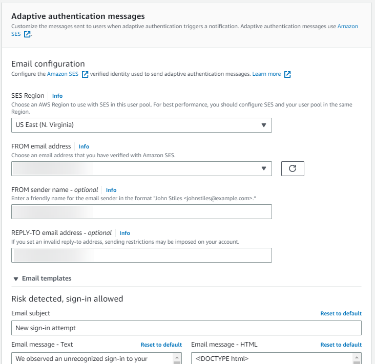

# Advanced security with threat

protection

After you create your user pool, you have access to **Threat protection**
in the navigation menu in the Amazon Cognito console. You can turn threat protection features on and
customize the actions that are taken in response to different risks. Or you can use audit mode
to gather metrics on detected risks without applying any security mitigations. In audit mode,
threat protection publishes metrics to Amazon CloudWatch. You can see metrics after Amazon Cognito generates its
first event. See [Viewing threat
protection metrics](metrics-for-cognito-user-pools.md#user-pool-settings-viewing-threat-protection-metrics "metrics-for-cognito-user-pools.md#user-pool-settings-viewing-threat-protection-metrics").

Threat protection, formerly called _advanced security
features_, is a set of monitoring tools for unwanted activity in your user pool,
and configuration tools to automatically shut down potentially malicious activity.
Threat
protection has different configuration options for standard and custom authentication
operations.
For example, you might want to send a notification to a user with a suspicious custom
authentication sign-in, where you have set up additional security factors, but block a user at
the same risk level with basic username-password
authentication.

Threat protection is available in the Plus feature plan. For more information, see [User pool feature plans](cognito-sign-in-feature-plans.md "cognito-sign-in-feature-plans.md").

The following user pool options are the components of threat protection.

**Compromised credentials**

Users reuse passwords for multiple user accounts. The compromised credentials
feature of Amazon Cognito compiles data from public leaks of user names and passwords, and
compares your users' credentials to lists of leaked credentials. Compromised credentials
detection also checks for commonly-guessed passwords. You can check for compromised
credentials in username-and-password standard authentication flows in user pools. Amazon Cognito
doesn't detect compromised credentials in secure remote password
(SRP)
or custom
authentication.

You can choose the user actions that prompt a check for compromised credentials, and
the action that you want Amazon Cognito to take in response. For sign-in, sign-up, and
password-change events, Amazon Cognito can **Block sign-in**, or **Allow
sign-in**. In both cases, Amazon Cognito generates a user activity log where you can
find more information about the event.

###### Learn more

[Working with
compromised-credentials detection](cognito-user-pool-settings-compromised-credentials.md "cognito-user-pool-settings-compromised-credentials.md")

**Adaptive authentication**

Amazon Cognito can review location and device information from your users' sign-in requests
and apply an automatic response to secure the user accounts in your user pool against
suspicious activity. You can monitor user activity and automate responses to detected
risk levels in username-password and
SRP,
and custom
authentication.

When you activate threat protection, Amazon Cognito assigns a risk score to user activity.
You can assign an automatic response to suspicious activity: you can **Require
MFA**, **Block sign-in**, or just log the activity details
and risk score. You can also automatically send email messages that notify your user of
the suspicious activity so that they can reset their password or take other self-guided
actions.

###### Learn more

[Working with adaptive
authentication](cognito-user-pool-settings-adaptive-authentication.md "cognito-user-pool-settings-adaptive-authentication.md")

**IP address allowlist and denylist**

With Amazon Cognito threat protection in **Full function** mode, you can
create IP address **Always block** and **Always
allow** exceptions. A session from an IP address on the **Always
block** exception list isn't assigned a risk level by adaptive
authentication, and can't sign in to your user pool.

###### Things to know about IP-address allowlists and blocklists

- You must express **Always block** and **Always
  allow** in CIDR format, for example `192.0.2.0/24`, a 24-bit
  mask, or `192.0.2.252/32`, a single IP address.
- Devices with IP addresses in an **Always block** IP range
  can't sign up or sign in with SDK-based or managed login applications, but they can
  sign in with third-party IdPs.
- **Always allow** and **Always block** lists
  don't affect token refresh.
- Amazon Cognito doesn't apply adaptive authentication MFA rules to devices from an
  **Always allow** IP range, but does apply compromised-credentials
  rules.

**Log export**

Threat protection logs granular details of users' authentication requests to your
user pool. These logs feature threat assessments, user information, and session metadata
like location and device. You can create external archives of these logs for retention
and analysis. Amazon Cognito user pools export threat protection logs to Amazon S3, CloudWatch Logs, and Amazon Data Firehose. For
more information, see [Viewing
and exporting user event history](cognito-user-pool-settings-adaptive-authentication.md#user-pool-settings-adaptive-authentication-event-user-history "cognito-user-pool-settings-adaptive-authentication.md#user-pool-settings-adaptive-authentication-event-user-history").

###### Learn more

[Exporting threat protection user
activity logs](exporting-quotas-and-usage.md#exporting-quotas-and-usage-user-activity "exporting-quotas-and-usage.md#exporting-quotas-and-usage-user-activity")

###### Topics

- [Considerations and
  limitations for threat protection](#cognito-user-pool-threat-protection-considerations "#cognito-user-pool-threat-protection-considerations")
- [Turning on threat
  protection in user pools](#cognito-user-pool-threat-protection-activating "#cognito-user-pool-threat-protection-activating")
- [Threat protection enforcement concepts](#cognito-user-pool-settings-threat-protection-threat-protection-enforcement "#cognito-user-pool-settings-threat-protection-threat-protection-enforcement")
- [Threat protection for standard authentication and custom
  authentication](#cognito-user-pool-settings-threat-protection-threat-protection-types "#cognito-user-pool-settings-threat-protection-threat-protection-types")
- [Threat protection
  prerequisites](#cognito-user-pool-threat-protection-prerequisites "#cognito-user-pool-threat-protection-prerequisites")
- [Setting up threat
  protection](#cognito-user-pool-settings-configure-threat-protection "#cognito-user-pool-settings-configure-threat-protection")
- [Working with
  compromised-credentials detection](cognito-user-pool-settings-compromised-credentials.md "cognito-user-pool-settings-compromised-credentials.md")
- [Working with adaptive
  authentication](cognito-user-pool-settings-adaptive-authentication.md "cognito-user-pool-settings-adaptive-authentication.md")
- [Collecting data for
  threat protection in applications](user-pool-settings-viewing-threat-protection-app.md "user-pool-settings-viewing-threat-protection-app.md")

## Considerations and

limitations for threat protection

###### Threat protection options differ between authentication flows

Amazon Cognito supports both adaptive authentication and compromised-credentials detection with
the authentication flows `USER_PASSWORD_AUTH` and
`ADMIN_USER_PASSWORD_AUTH`. You can enable only adaptive authentication for
`USER_SRP_AUTH`.
You can't use threat protection with federated sign-in.

###### Always-block IPs contribute to request quotas

Blocked requests from IP addresses on an **Always block** exception
list in your user pool contribute to the [request rate
quotas](limits.md#category_operations "limits.md#category_operations") for your user pools.

###### Threat protection doesn't apply rate limits

Some malicious traffic has the characteristic of a high volume of requests, like
distributed denial of service (DDoS) attacks. The risk ratings that Amazon Cognito applies to
incoming traffic are per-request and don't take request volume into account. Individual
requests in a high-volume event might receive a risk score and an automated response for
application-layer reasons that aren't related to their role in a volumetric attack. To
implement defenses against volumetric attacks in your user pools, add AWS WAF web ACLs. For
more information, see [Associate an AWS WAF web ACL with a user pool](user-pool-waf.md "user-pool-waf.md").

###### Threat protection doesn't affect M2M requests

Client credentials grants are intended for machine-to-machine (M2M) authorization with
no connection to user accounts. Threat protection only monitors user accounts and
passwords in your user pool. To implement security features with your M2M activity,
consider the capabilities of AWS WAF for monitoring request rates and content. For more
information, see [Associate an AWS WAF web ACL with a user pool](user-pool-waf.md "user-pool-waf.md").

## Turning on threat

protection in user pools

Amazon Cognito user pools console

###### To activate threat protection for a user pool

1. Go to the [Amazon Cognito console](https://console.aws.amazon.com/cognito/home "https://console.aws.amazon.com/cognito/home").
   If prompted, enter your AWS credentials.
2. Choose **User Pools**.
3. Choose an existing user pool from the list, or [create a user
   pool](cognito-user-pool-as-user-directory.md "cognito-user-pool-as-user-directory.md").
4. If you haven't already, activate the Plus feature plan from the
   **Settings** menu.
5. Choose the **Threat protection** menu and select
   **Activate**.
6. Choose **Save changes**.

API
Set your feature plan to Plus in a [CreateUserPool](../../../cognito-user-identity-pools/latest/APIReference/API_CreateUserPool.md "../../../cognito-user-identity-pools/latest/APIReference/API_CreateUserPool.md") or [UpdateUserPool](../../../cognito-user-identity-pools/latest/APIReference/API_UpdateUserPool.md "../../../cognito-user-identity-pools/latest/APIReference/API_UpdateUserPool.md") API request. The following partial example request body sets
threat protection to full-function mode. For a complete example request, see [Examples](../../../cognito-user-identity-pools/latest/APIReference/API_CreateUserPool.md#API_CreateUserPool_Examples "../../../cognito-user-identity-pools/latest/APIReference/API_CreateUserPool.md#API_CreateUserPool_Examples").

```
"UserPoolAddOns": {
      "AdvancedSecurityMode": "ENFORCED"
   }
```

Threat protection is the collective term for the features that monitor user operations for
signs of account takeover and automatically respond to secure affected user accounts. You can
apply threat protection settings to users when they sign in with
standard
and custom authentication
flows.

Threat protection [generates
logs](cognito-user-pool-settings-adaptive-authentication.md#user-pool-settings-adaptive-authentication-event-user-history "cognito-user-pool-settings-adaptive-authentication.md#user-pool-settings-adaptive-authentication-event-user-history") that detail users' sign-in, sign-out, and other activity. You can export these
logs to a third-party system. For more information, see [Viewing
and exporting user event history](cognito-user-pool-settings-adaptive-authentication.md#user-pool-settings-adaptive-authentication-event-user-history "cognito-user-pool-settings-adaptive-authentication.md#user-pool-settings-adaptive-authentication-event-user-history").

## Threat protection enforcement concepts

Threat protection starts out in an _audit-only_ mode
where your user pool monitors user activity, assigns risk levels, and generates logs. As a
best practice, run in audit-only mode for two weeks or more before you enable _full-function mode_. Full-function mode includes a set of
automatic reactions to detected risky activity and compromised passwords. With audit-only
mode, you can monitor the threat assessments that Amazon Cognito is performing. You can also [provide feedback](cognito-user-pool-settings-adaptive-authentication.md#user-pool-settings-adaptive-authentication-feedback "cognito-user-pool-settings-adaptive-authentication.md#user-pool-settings-adaptive-authentication-feedback") that
trains the feature on false positives and negatives.

You can configure threat protection enforcement at the user pool level to cover all app
clients in the user pool, and at the level of individual app clients. App client
threat-protection configurations override the user pool configuration. To configure threat
protection for an app client, navigate to the app client settings from the **App
clients** menu of your user pool in the Amazon Cognito console. There, you can
**Use client-level settings** and configure enforcement exclusive to the
app client.

Additionally, you can configure threat protection separately for
standard
and custom authentication types.

## Threat protection for standard authentication and custom

authentication

The ways that you can configure threat protection depend on the type of authentication
you're doing in your user pool and app clients. Each of the following types of
authentication can have their own enforcement mode and automated responses.

**Standard authentication**

_Standard authentication_ is user sign-in,
sign-out and password management with username-password flows and in managed login.
Amazon Cognito threat protection monitors operations for indicators of risk when they sign in
with managed login or use the following API `AuthFlow` parameters:

**[InitiateAuth](../../../cognito-user-identity-pools/latest/APIReference/API_InitiateAuth.md#CognitoUserPools-InitiateAuth-request-AuthFlow "../../../cognito-user-identity-pools/latest/APIReference/API_InitiateAuth.md#CognitoUserPools-InitiateAuth-request-AuthFlow")**

`USER_PASSWORD_AUTH`, `USER_SRP_AUTH`. The compromised
credentials feature doesn't have access to passwords in
`USER_SRP_AUTH` sign-in, and doesn't monitor or act on events with
this flow.

**[AdminInitiateAuth](../../../cognito-user-identity-pools/latest/APIReference/API_AdminInitiateAuth.md#CognitoUserPools-AdminInitiateAuth-request-AuthFlow "../../../cognito-user-identity-pools/latest/APIReference/API_AdminInitiateAuth.md#CognitoUserPools-AdminInitiateAuth-request-AuthFlow")**

`ADMIN_USER_PASSWORD_AUTH`, `USER_SRP_AUTH`. The
compromised credentials feature doesn't have access to passwords in
`USER_SRP_AUTH` sign-in, and doesn't monitor or act on events with
this flow.

You can set the **Enforcement mode** for standard authentication
to **Audit only** or **Full function**. To disable
threat monitoring for standard authentication, set threat protection to **No
enforcement**.

**Custom authentication**

_Custom authentication_ is user sign-in with
[custom challenge Lambda triggers](user-pool-lambda-challenge.md "user-pool-lambda-challenge.md").
You can't do custom authentication in managed login. Amazon Cognito threat protection monitors
operations for indicators of risk when they sign in with the API `AuthFlow`
parameter `CUSTOM_AUTH` of `InitiateAuth` and
`AdminInitiateAuth`.

You can set the **Enforcement mode** for custom authentication to
**Audit only**, **Full function**, or **No
enforcement**. The **No enforcement** option disables
threat monitoring for custom authentication without affecting other threat protection
features.

## Threat protection

prerequisites

Before you begin, you need the following:

- A user pool with an app client. For more information, see [Getting started with user pools](getting-started-user-pools.md "getting-started-user-pools.md").
- Set multi-factor authentication (MFA) to **Optional** in the Amazon Cognito
  console to use the risk-based adaptive authentication feature. For more information, see
  [Adding MFA to a user pool](user-pool-settings-mfa.md "user-pool-settings-mfa.md").
- If you're using email notifications, go to the [Amazon SES console](https://console.aws.amazon.com/ses/home "https://console.aws.amazon.com/ses/home") to configure and
  verify an email address or domain to use with your email notifications. For more
  information about Amazon SES, see [Verifying
  Identities in Amazon SES](../../../ses/latest/dg/verify-addresses-and-domains.md "../../../ses/latest/dg/verify-addresses-and-domains.md").

## Setting up threat

protection

Follow these instructions to set up user pool threat protection.

###### Note

To set up a different threat protection configuration for an app client in the Amazon Cognito user pools
console, select the app client from the **App clients** menu and choose
**Use client-level settings**.

AWS Management Console

###### To configure threat protection for a user pool

1. Go to the [Amazon Cognito console](https://console.aws.amazon.com/cognito/home "https://console.aws.amazon.com/cognito/home").
   If prompted, enter your AWS credentials.
2. Choose **User Pools**.
3. Choose an existing user pool from the list, or [create a user
   pool](cognito-user-pool-as-user-directory.md "cognito-user-pool-as-user-directory.md").
4. Choose the **Threat protection** menu and select
   **Activate**.
5. Choose the threat protection method that you want to configure:
   **Standard and custom
   authentication**.
   You can set different enforcement modes for custom and standard authentication,
   but they share the configuration of automated responses in **Full
   function** mode.
6. Select **Edit**.
7. Choose an **Enforcement mode**. To start responding to
   detected risks immediately, select **Full function** and
   configure the automated responses for compromised credentials and adaptive
   authentication. To gather information in user-level logs and in CloudWatch, select
   **Audit only** .

We recommend that you keep threat protection in audit mode for two weeks
before enabling actions. During this time, Amazon Cognito can learn the usage patterns of
your app users and you can provide event feedback to adjust responses. 8. If you selected **Audit only**, choose **Save
changes**. If you selected **Full function**:

    1. Select whether you will take **Custom** action or use or
     **Cognito defaults** to respond to suspected
     **Compromised credentials**. **Cognito
     defaults** are:


    	1. Detect compromised credentials on **Sign-in**,
    	 **Sign-up**, and **Password
    	 change**.
    	2. Respond to compromised credentials with the action **Block
    	 sign-in**.
    2. If you selected **Custom** actions for
     **Compromised credentials**, choose the user pool actions
     that Amazon Cognito will use for **Event detection** and the
     **Compromised credentials responses** that you would like
     Amazon Cognito to take. You can **Block sign-in** or **Allow
     sign-in** with suspected compromised credentials.
    3. Choose how to respond to malicious sign-in attempts under
     **Adaptive authentication**. Select whether you will take
     **Custom** action or use or **Cognito
     defaults** to respond to suspected malicious activity. When you
     select **Cognito defaults**, Amazon Cognito blocks sign-in at all
     risk levels and does not notify the user.
    4. If you selected **Custom** actions for **Adaptive
     authentication**, choose the **Automatic risk
     response** actions that Amazon Cognito will take in response to detected
     risks based on severity level. When you assign a response to a level of risk,
     you can't assign a less-restrictive response to a higher level of risk. You
     can assign the following responses to risk levels:


    	1. **Allow sign-in** - Take no preventative
    	 action.
    	2. **Optional MFA** - If the user has MFA configured,
    	 Amazon Cognito will always require the user to provide an additional SMS or
    	 time-based one-time password (TOTP) factor when they sign in. If the user
    	 does not have MFA configured, they can continue signing in
    	 normally.
    	3. **Require MFA** - If the user has MFA
    	 configured, Amazon Cognito will always require the user to provide an additional
    	 SMS or TOTP factor when they sign in. If the user does not have MFA
    	 configured, Amazon Cognito will prompt them to set up MFA. Before you automatically
    	 require MFA for your users, configure a mechanism in your app to capture
    	 phone numbers for SMS MFA, or to register authenticator apps for TOTP
    	 MFA.
    	4. **Block sign-in** - Prevent the user from
    	 signing in.
    	5. **Notify user** - Send an email message
    	 to the user with information about the risk that Amazon Cognito detected and the
    	 response you have taken. You can customize email message templates for the
    	 messages you send.

9. If you chose **Notify user** in the previous step, you can
   customize your email delivery settings and email message templates for adaptive
   authentication.
   1. Under **Email configuration**, choose the **SES
      Region**, **FROM email address**, **FROM
      sender name**, and **REPLY-TO email address** that
      you want to use with adaptive authentication. For more information about
      integrating your user pool email messages with Amazon Simple Email Service, see [Email settings for Amazon Cognito user pools](user-pool-email.md "user-pool-email.md").

    2. Expand **Email templates** to customize adaptive
   authentication notifications with both HTML and plaintext versions of email
   messages. To learn more about email message templates, see [Message templates](cognito-user-pool-settings-message-customizations.md#cognito-user-pool-settings-message-templates "cognito-user-pool-settings-message-customizations.md#cognito-user-pool-settings-message-templates").

10. Expand **IP address exceptions** to create an
    **Always-allow** or an **Always-block** list
    of IPv4 or IPv6 address ranges that will always be allowed or blocked, regardless
    of the threat protection risk assessment. Specify the IP address ranges in [CIDR notation](https://en.wikipedia.org/wiki/Classless_Inter-Domain_Routing#CIDR_notation "https://en.wikipedia.org/wiki/Classless_Inter-Domain_Routing#CIDR_notation") (such as 192.168.100.0/24).
11. Choose **Save changes**.

API (user pool)
To set the threat protection configuration for a user pool, send a [SetRiskConfiguration](../../../cognito-user-identity-pools/latest/APIReference/API_SetRiskConfiguration.md "../../../cognito-user-identity-pools/latest/APIReference/API_SetRiskConfiguration.md") API request that includes a `UserPoolId`
parameter, but not a `ClientId` parameter. The following is an example
request body for a user pool. This risk configuration takes an escalating series of
actions based on the severity of risk and notifies users at all risk levels. It
applies a compromised-credentials block to sign-up operations.

To enforce this configuration, you must set `AdvancedSecurityMode` to
`ENFORCED` in a separate [CreateUserPool](../../../cognito-user-identity-pools/latest/APIReference/API_CreateUserPool.md "../../../cognito-user-identity-pools/latest/APIReference/API_CreateUserPool.md") or [UpdateUserPool](../../../cognito-user-identity-pools/latest/APIReference/API_UpdateUserPool.md "../../../cognito-user-identity-pools/latest/APIReference/API_UpdateUserPool.md") API request. For more information about the placeholder
templates like `{username}` in this example, see [Configuring MFA,
authentication, verification and invitation messages](cognito-user-pool-settings-message-customizations.md "cognito-user-pool-settings-message-customizations.md").

```
{
   "AccountTakeoverRiskConfiguration": {
      "Actions": {
         "HighAction": {
            "EventAction": "MFA_REQUIRED",
            "Notify": true
         },
         "LowAction": {
            "EventAction": "NO_ACTION",
            "Notify": true
         },
         "MediumAction": {
            "EventAction": "MFA_IF_CONFIGURED",
            "Notify": true
         }
      },
      "NotifyConfiguration": {
         "BlockEmail": {
            "Subject": "You have been blocked for suspicious activity",
            "TextBody": "We blocked {username} at {login-time} from {ip-address}."
         },
         "From": "admin@example.com",
         "MfaEmail": {
            "Subject": "Suspicious activity detected, MFA required",
            "TextBody": "Unexpected sign-in from {username} on device {device-name}. You must use MFA."
         },
         "NoActionEmail": {
            "Subject": "Suspicious activity detected, secure your user account",
            "TextBody": "We noticed suspicious sign-in activity by {username} from {city}, {country} at {login-time}. If this was not you, reset your password."
         },
         "ReplyTo": "admin@example.com",
         "SourceArn": "arn:aws:ses:us-west-2:123456789012:identity/admin@example.com"
      }
   },
   "CompromisedCredentialsRiskConfiguration": {
      "Actions": {
         "EventAction": "BLOCK"
      },
      "EventFilter": [ "SIGN_UP" ]
   },
   "RiskExceptionConfiguration": {
      "BlockedIPRangeList": [ "192.0.2.0/24","198.51.100.0/24" ],
      "SkippedIPRangeList": [ "203.0.113.0/24" ]
   },
   "UserPoolId": "us-west-2_EXAMPLE"
}
```

API (app client)
To set the threat protection configuration for an app client, send a [SetRiskConfiguration](../../../cognito-user-identity-pools/latest/APIReference/API_SetRiskConfiguration.md "../../../cognito-user-identity-pools/latest/APIReference/API_SetRiskConfiguration.md") API request that includes a `UserPoolId`
parameter and a `ClientId` parameter. The following is an example request
body for an app client. This risk configuration is more severe than the user pool
configuration, blocking high-risk entries. It also applies compromised-credentials
blocks to sign-up, sign-in, and password-reset operations.

To enforce this configuration, you must set `AdvancedSecurityMode` to
`ENFORCED` in a separate [CreateUserPool](../../../cognito-user-identity-pools/latest/APIReference/API_CreateUserPool.md "../../../cognito-user-identity-pools/latest/APIReference/API_CreateUserPool.md") or [UpdateUserPool](../../../cognito-user-identity-pools/latest/APIReference/API_UpdateUserPool.md "../../../cognito-user-identity-pools/latest/APIReference/API_UpdateUserPool.md") API request. For more information about the placeholder
templates like `{username}` in this example, see [Configuring MFA,
authentication, verification and invitation messages](cognito-user-pool-settings-message-customizations.md "cognito-user-pool-settings-message-customizations.md").

```
{
   "AccountTakeoverRiskConfiguration": {
      "Actions": {
         "HighAction": {
            "EventAction": "BLOCK",
            "Notify": true
         },
         "LowAction": {
            "EventAction": "NO_ACTION",
            "Notify": true
         },
         "MediumAction": {
            "EventAction": "MFA_REQUIRED",
            "Notify": true
         }
      },
      "NotifyConfiguration": {
         "BlockEmail": {
            "Subject": "You have been blocked for suspicious activity",
            "TextBody": "We blocked {username} at {login-time} from {ip-address}."
         },
         "From": "admin@example.com",
         "MfaEmail": {
            "Subject": "Suspicious activity detected, MFA required",
            "TextBody": "Unexpected sign-in from {username} on device {device-name}. You must use MFA."
         },
         "NoActionEmail": {
            "Subject": "Suspicious activity detected, secure your user account",
            "TextBody": "We noticed suspicious sign-in activity by {username} from {city}, {country} at {login-time}. If this was not you, reset your password."
         },
         "ReplyTo": "admin@example.com",
         "SourceArn": "arn:aws:ses:us-west-2:123456789012:identity/admin@example.com"
      }
   },
   "ClientId": "1example23456789",
   "CompromisedCredentialsRiskConfiguration": {
      "Actions": {
         "EventAction": "BLOCK"
      },
      "EventFilter": [ "SIGN_UP", "SIGN_IN", "PASSWORD_CHANGE" ]
   },
   "RiskExceptionConfiguration": {
      "BlockedIPRangeList": [ "192.0.2.1/32","192.0.2.2/32" ],
      "SkippedIPRangeList": [ "192.0.2.3/32","192.0.2.4/32" ]
   },
   "UserPoolId": "us-west-2_EXAMPLE"
}
```
