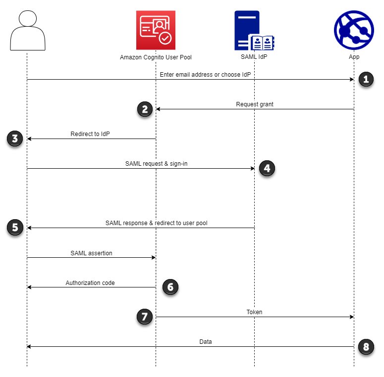
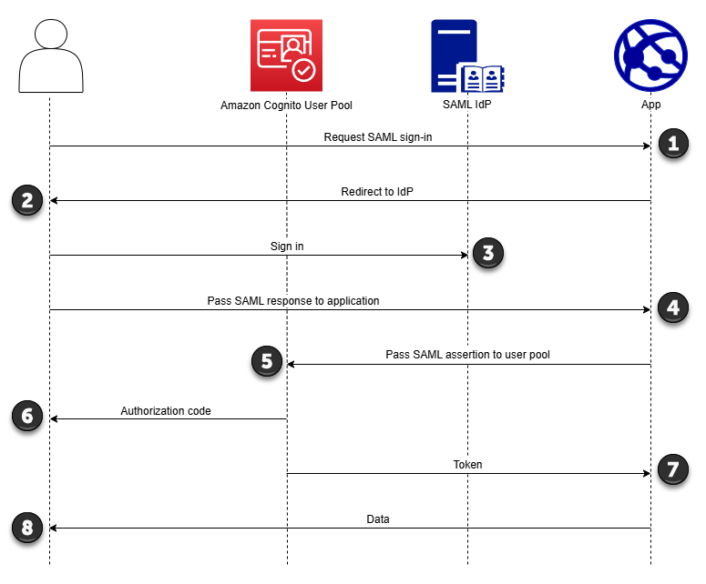

# SAML session initiation

in Amazon Cognito user pools

Amazon Cognito supports service provider-initiated (SP-initiated) single sign-on (SSO)
and IdP-initiated SSO. As a best security practice, implement SP-initiated SSO in
your user pool. Section 5.1.2 of the [SAML V2.0 Technical Overview](http://docs.oasis-open.org/security/saml/Post2.0/sstc-saml-tech-overview-2.0-cd-02.html#5.1.2.SP-Initiated%20SSO:%20%20Redirect/POST%20Bindings|outline "http://docs.oasis-open.org/security/saml/Post2.0/sstc-saml-tech-overview-2.0-cd-02.html#5.1.2.SP-Initiated%20SSO:%20%20Redirect/POST%20Bindings|outline") describes SP-initiated SSO. Amazon Cognito is the
identity provider (IdP) to your app. The app is the service provider (SP) that
retrieves tokens for authenticated users. However, when you use a third-party IdP to
authenticate users, Amazon Cognito is the SP. When your SAML 2.0 users authenticate with an
SP-initiated flow, they must always first make a request to Amazon Cognito and redirect to
the IdP for authentication.

For some enterprise use cases, access to internal applications starts at a
bookmark on a dashboard hosted by the enterprise IdP. When a user selects a
bookmark, the IdP generates a SAML response and sends it to the SP to authenticate
the user with the application.

You can configure a SAML IdP in your user pool to support IdP-initiated SSO. When
you support IdP-initiated authentication, Amazon Cognito can't verify that it has solicited
the SAML response that it receives because Amazon Cognito doesn't initiate authentication
with a SAML request. In SP-initiated SSO, Amazon Cognito sets state parameters that validate
a SAML response against the original request. With SP-initiated sign-in you can also
guard against cross-site request forgery (CSRF).

###### Topics

- [Implement
  SP-initated SAML sign-in](#cognito-user-pools-saml-idp-authentication "#cognito-user-pools-saml-idp-authentication")
- [Implement IdP-initiated SAML sign-in](#cognito-user-pools-SAML-session-initiation-idp-initiation "#cognito-user-pools-SAML-session-initiation-idp-initiation")

## Implement

SP-initated SAML sign-in

As a best practice, implement service-provider-initiated (SP-initiated)
sign-in to your user pool. Amazon Cognito initiates your user's session and redirects
them to your IdP. With this method, you have the greatest control over who
presents sign-in requests. You can also permit IdP-initiated sign-in under
certain conditions.

The following process shows how users complete SP-initiated sign in to your
user pool through a SAML provider.



1. Your user enters their email address at a sign-in page. To determine
   your user’s redirect to their IdP, you can collect their email address
   in a custom-built application or invoke managed login in web
   view.

You can configure your managed login pages to display a list of IdPs
or to prompt for an email address and match it to the identifier of your
SAML IdP. To prompt for an email address, edit your managed login
branding style and in **Foundation**, locate
**Authentication behavior** and under
**Provider display**, set **Display
style** to **Domain search input**. 2. Your app invokes your user pool redirect endpoint and requests a
session with the client ID that corresponds to the app and the IdP ID
that corresponds to the user. 3. Amazon Cognito redirects your user to the IdP with a SAML request, [optionally
signed](cognito-user-pools-SAML-signing-encryption.md#cognito-user-pools-SAML-signing.title "cognito-user-pools-SAML-signing-encryption.md#cognito-user-pools-SAML-signing.title"), in an `AuthnRequest` element. 4. The IdP authenticates the user interactively, or with a remembered
session in a browser cookie. 5. The IdP redirects your user to your user pool SAML response endpoint
with the [optionally-encrypted](cognito-user-pools-SAML-signing-encryption.md#cognito-user-pools-SAML-signing-encryption.title "cognito-user-pools-SAML-signing-encryption.md#cognito-user-pools-SAML-signing-encryption.title") SAML assertion in their POST
payload.

###### Note

Amazon Cognito cancels sessions that don't receive a response within 5
minutes, and redirects the user to managed login. When your user
experiences this outcome, they receive a `Something went
 wrong` error message. 6. After it verifies the SAML assertion and [maps
user attributes](cognito-user-pools-specifying-attribute-mapping.md#cognito-user-pools-specifying-attribute-mapping.title "cognito-user-pools-specifying-attribute-mapping.md#cognito-user-pools-specifying-attribute-mapping.title") from the claims in the response, Amazon Cognito
internally creates or updates the user's profile in the user pool.
Typically, your user pool returns an authorization code to your user's
browser session. 7. Your user presents their authorization code to your app, which
exchanges the code for JSON web tokens (JWTs). 8. Your app accepts and processes your user's ID token as authentication,
generates authorized requests to resources with their access token, and
stores their refresh token.

When a user authenticates and receives an authorization code grant, the user
pool returns ID, access, and refresh tokens. The ID token is a authentication
object for OIDC-based identity management. The access token is an authorization
object with [OAuth 2.0](https://oauth.net/2/ "https://oauth.net/2/") scopes. The
refresh token is an object that generates new ID and access tokens when your
user's current tokens have expired. You can configure the duration of users'
tokens in your user pool app client.

You can also choose the duration of refresh tokens. After a user's refresh
token expires, they must sign in again. If they authenticated through a SAML
IdP, your users' session duration is set by the expiration of their tokens, not
the expiration of their session with their IdP. Your app must store each user's
refresh token and renew their session when it expires. Managed login maintains
user sessions in a browser cookie that's valid for 1 hour.

## Implement IdP-initiated SAML sign-in

When you configure your identity provider for IdP-initiated SAML 2.0 sign-in,
you can present SAML assertions to the `saml2/idpresponse` endpoint
in your user pool domain without the need to initiate the session at the [Authorize endpoint](authorization-endpoint.md "authorization-endpoint.md"). A
user pool with this configuration accepts IdP-initiated SAML assertions from a
user pool external identity provider that the requested app client
supports.



1. A user requests SAML sign-in with your application.
2. Your application invokes a browser or redirects the user to the
   sign-in page for their SAML provider.
3. The IdP authenticates the user interactively, or with a remembered
   session in a browser cookie.
4. The IdP redirects your user to your application with the SAML
   assertion, or response, in their POST body.
5. Your application adds the SAML assertion to the POST body of a request
   to your user pool `saml2/idpresponse` endpoint.
6. Amazon Cognito issues an authorization code to your user.
7. Your user presents their authorization code to your app, which
   exchanges the code for JSON web tokens (JWTs).
8. Your application accepts and processes your user's ID token as
   authentication, generates authorized requests to resources with their
   access token, and stores their refresh token.

The following steps describe the overall process to configure and sign in with
an IdP-initiated SAML 2.0 provider.

1. Create or designate a user pool and app client.
2. Create a SAML 2.0 IdP in your user pool.
3. Configure your IdP to support IdP initiation. IdP-initiated SAML
   introduces security considerations that other SSO providers aren’t
   subject to. Because of this, you can’t add non-SAML IdPs, including the
   user pool itself, to any app client that uses a SAML provider with
   IdP-initiated sign-in.
4. Associate your IdP-initiated SAML provider with an app client in your
   user pool.
5. Direct your user to the sign-in page for your SAML IdP and retrieve a
   SAML assertion.
6. Direct your user to your user pool `saml2/idpresponse`
   endpoint with their SAML assertion.
7. Receive JSON web tokens (JWTs).

To accept unsolicited SAML assertions in your user pool, you must consider its
effect on your app security. Request spoofing and CSRF attempts are likely when
you accept IdP-initiated requests. Although your user pool can't verify an
IdP-initiated sign-in session, Amazon Cognito validates your request parameters and SAML
assertions.

Additionally, your SAML assertion must not contain an
`InResponseTo` claim and must have been issued within the
previous 6 minutes.

You must submit requests with IdP-initiated SAML to your
`/saml2/idpresponse`. For SP-initiated and managed login
authorization requests, you must provide parameters that identify your requested
app client, scopes, redirect URI, and other details as query string parameters
in `HTTP GET` requests. For IdP-initiated SAML assertions, however,
the details of your request must be formatted as a `RelayState`
parameter in the body of an `HTTP POST` request. The request body
must also contain your SAML assertion as a `SAMLResponse`
parameter.

The following is an example request and response for an IdP-initiated SAML
provider.

```
POST /saml2/idpresponse HTTP/1.1
User-Agent: `USER_AGENT`
Accept: */*
Host: `example.auth.us-east-1.amazoncognito.com`
Content-Type: application/x-www-form-urlencoded

SAMLResponse=`[Base64-encoded SAML assertion]`&RelayState=identity_provider%3D`MySAMLIdP`%26client_id%3D`1example23456789`%26redirect_uri%3D`https%3A%2F%2Fwww.example.com`%26response_type%3D`code`%26scope%3D`email%2Bopenid%2Bphone`

HTTP/1.1 302 Found
Date: Wed, 06 Dec 2023 00:15:29 GMT
Content-Length: 0
x-amz-cognito-request-id: 8aba6eb5-fb54-4bc6-9368-c3878434f0fb
Location: `https://www.example.com`?code=`[Authorization code]`
```

AWS Management Console

###### To configure an IdP for IdP-initiated SAML

1. Create a [user pool](cognito-user-pool-as-user-directory.md "cognito-user-pool-as-user-directory.md"), [app client](cognito-user-pools-configuring-app-integration.md "cognito-user-pools-configuring-app-integration.md"), and SAML identity provider.
2. Disassociate all social and OIDC identity providers from
   your app client, if any are associated.
3. Navigate to the **Social and external
   providers** menu of your user pool.
4. Edit or add a SAML provider.
5. Under **IdP-initiated SAML sign-in**,
   choose **Accept SP-initiated and and IdP-initiated
   SAML assertions**.
6. Choose **Save changes**.

API/CLI
**To configure an IdP for IdP-initiated
SAML**

Configure IdP-initiated SAML with the `IDPInit`
parameter in a [CreateIdentityProvider](../../../cognito-user-identity-pools/latest/APIReference/API_CreateIdentityProvider.md "../../../cognito-user-identity-pools/latest/APIReference/API_CreateIdentityProvider.md") or [UpdateIdentityProvider](../../../cognito-user-identity-pools/latest/APIReference/API_UpdateIdentityProvider.md "../../../cognito-user-identity-pools/latest/APIReference/API_UpdateIdentityProvider.md") API request. The following is an
example `ProviderDetails` of an IdP that supports
IdP-initiated SAML.

```
"ProviderDetails": {
      "MetadataURL" : "`https://myidp.example.com/saml/metadata`",
      "IDPSignout" : "true",
      "RequestSigningAlgorithm" : "rsa-sha256",
      "EncryptedResponses" : "true",
      **"IDPInit" : "true"**
}
```
