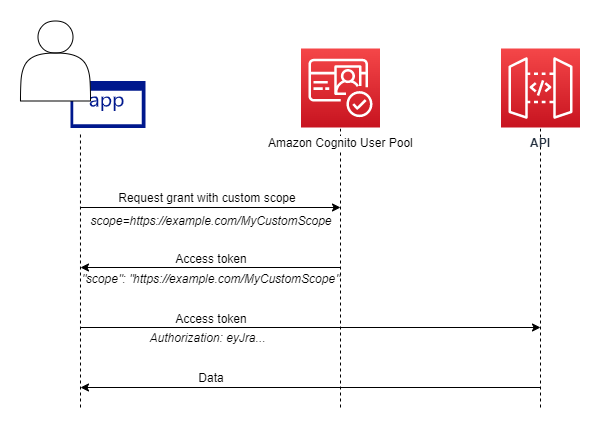

# Scopes, M2M, and APIs with

resource servers

After you configure a domain for your user pool, Amazon Cognito automatically provisions an OAuth
2.0 authorization server and a hosted web UI with sign-up and sign-in pages that your app
can present to your users. For more information see [User pool managed login](cognito-user-pools-managed-login.md "cognito-user-pools-managed-login.md"). You can choose the scopes that you want
the authorization server to add to access tokens. Scopes authorize access to resource
servers and user data.

A _resource server_ is an OAuth 2.0 API server. To secure
access-protected resources, it validates that access tokens from your user pool contain the
scopes that authorize the requested method and path in the API that it protects. It verifies
the issuer based on the token signature, validity based on token expiration time, and access
level based on the scopes in token claims. User pool scopes are in the access token
`scope` claim. For more information about the claims in Amazon Cognito access tokens,
see [Understanding the access
token](amazon-cognito-user-pools-using-the-access-token.md "amazon-cognito-user-pools-using-the-access-token.md").

With Amazon Cognito, the scopes in access tokens can authorize access to external APIs or to user
attributes. You can issue access tokens to local users, federated users, or machine
identities.

###### Topics

- [API
  authorization](#cognito-user-pools-define-resource-servers-about-api-authz "#cognito-user-pools-define-resource-servers-about-api-authz")
- [Machine-to-machine (M2M) authorization](#cognito-user-pools-define-resource-servers-about-m2m "#cognito-user-pools-define-resource-servers-about-m2m")
- [About
  scopes](#cognito-user-pools-define-resource-servers-about-scopes "#cognito-user-pools-define-resource-servers-about-scopes")
- [About resource servers](#cognito-user-pools-define-resource-servers-about-resource-servers "#cognito-user-pools-define-resource-servers-about-resource-servers")
- [Resource binding](#cognito-user-pools-resource-binding "#cognito-user-pools-resource-binding")

## API

authorization

The following are some of the ways that you can authorize requests to APIs with Amazon Cognito
tokens:

**Access token**

When add an Amazon Cognito authorizer to a REST API method request configuration,
add **Authorization scopes** to the authorizer
configuration. With this configuration, your API accepts access tokens in
the `Authorization` header and reviews them for accepted
scopes.

**ID token**

When you pass a valid ID token to an Amazon Cognito authorizer in your REST API,
API Gateway accepts the request and passes the ID token contents to the API
backend.

**Amazon Verified Permissions**

In Verified Permissions, you have the option to create an [API-linked policy store](../../../verifiedpermissions/latest/userguide/policy-stores_api-userpool.md "../../../verifiedpermissions/latest/userguide/policy-stores_api-userpool.md"). Verified Permissions creates and assigns a Lambda
authorizer that processes ID or access tokens from your request
`Authorization` header. This Lambda authorizer passes your
token to your policy store, where Verified Permissions compares it to policies and returns
an allow or deny decision to the authorizer.

###### More resources

- [Controlling and managing access to a REST API in API Gateway](../../../apigateway/latest/developerguide/apigateway-control-access-to-api.md "../../../apigateway/latest/developerguide/apigateway-control-access-to-api.md")
- [Authorization with Amazon Verified Permissions](amazon-cognito-authorization-with-avp.md "amazon-cognito-authorization-with-avp.md")

## Machine-to-machine (M2M) authorization

Amazon Cognito supports applications that access API data with _machine
identities_. Machine identities in user pools are [confidential clients](user-pool-settings-client-apps.md#user-pool-settings-client-app-client-types "user-pool-settings-client-apps.md#user-pool-settings-client-app-client-types")
that run on application servers and connect to remote APIs. Their operation happens
without user interaction: scheduled tasks, data streams, or asset updates. When these
clients authorize their requests with an access token, they perform _machine to machine_, or M2M, authorization. In M2M
authorization, a shared secret replaces user credentials in access control.

An application that accesses an API with M2M authorization must have a client ID and
client secret. In your user pool, you must build an app client that supports client
credentials grants. To support client credentials, your app client must have a client
secret and you must have a user pool domain. In this flow, your machine identity
requests an access token directly from the [Token endpoint](token-endpoint.md "token-endpoint.md"). You can authorize only custom scopes from [resource
servers](#cognito-user-pools-define-resource-servers-about-resource-servers "#cognito-user-pools-define-resource-servers-about-resource-servers") in access tokens for client credentials grants. For more information
about setting up app clients, see [Application-specific settings with app
clients](user-pool-settings-client-apps.md "user-pool-settings-client-apps.md").

The access token from a client credentials grant is a verifiable statement of the
operations that you want to permit your machine identity to request from an API. To
learn more about how access tokens authorize API requests, continue reading. For an
example application, see [Amazon Cognito and API Gateway based machine to machine authorization using AWS
CDK](https://github.com/aws-samples/amazon-cognito-and-api-gateway-based-machine-to-machine-authorization-using-aws-cdk "https://github.com/aws-samples/amazon-cognito-and-api-gateway-based-machine-to-machine-authorization-using-aws-cdk").

M2M authorization has a billing model that differs from the way that monthly active
users (MAUs) are billed. Where user authentication carries a cost per active user, M2M
billing reflects active client credentials app clients and total token-request volume.
For more information, see [Amazon Cognito
Pricing](https://aws.amazon.com/cognito/pricing "https://aws.amazon.com/cognito/pricing"). To control costs for M2M authorization, optimize the duration of
access tokens and the number of token requests that your applications make. See [Managing user pool
token expiration and caching](amazon-cognito-user-pools-using-tokens-caching-tokens.md "amazon-cognito-user-pools-using-tokens-caching-tokens.md") for a way to use
API Gateway caching to reduce requests for new tokens in M2M authorization.

For information about optimizing Amazon Cognito operations that add costs to your AWS bill,
see [Managing costs](tracking-cost.md#tracking-cost-managing "tracking-cost.md#tracking-cost-managing").

###### Client metadata for machine-to-machine (M2M) client credentials

You can pass [client
metadata](cognito-user-pools-working-with-lambda-triggers.md#working-with-lambda-trigger-client-metadata "cognito-user-pools-working-with-lambda-triggers.md#working-with-lambda-trigger-client-metadata") in M2M requests. Client metadata is additional information from a
user or application environment that can contribute to the outcomes of a [Pre token generation Lambda
trigger](user-pool-lambda-pre-token-generation.md "user-pool-lambda-pre-token-generation.md"). In authentication operations with a user principal, you can pass client metadata
to the pre token generation trigger in the body of [AdminRespondToAuthChallenge](../../../cognito-user-identity-pools/latest/APIReference/API_AdminRespondToAuthChallenge.md "../../../cognito-user-identity-pools/latest/APIReference/API_AdminRespondToAuthChallenge.md") and [RespondToAuthChallenge](../../../cognito-user-identity-pools/latest/APIReference/API_RespondToAuthChallenge.md "../../../cognito-user-identity-pools/latest/APIReference/API_RespondToAuthChallenge.md") API requests. Because applications conduct the
flow for generation of access tokens for M2M with direct requests to the [Token endpoint](token-endpoint.md "token-endpoint.md"), they have a different
model. In the POST body of token requests for client credentials, pass an
`aws_client_metadata` parameter with the client metadata object
URL-encoded (`x-www-form-urlencoded`) to string. For an example request,
see [Client credentials with basic authorization](token-endpoint.md#exchanging-client-credentials-for-an-access-token-in-request-body "token-endpoint.md#exchanging-client-credentials-for-an-access-token-in-request-body"). The following is an example parameter that passes the key-value pairs
`{"environment": "dev", "language": "en-US"}`.

```
aws_client_metadata=%7B%22environment%22%3A%20%22dev%22,%20%22language%22%3A%20%22en-US%22%7D
```

## About

scopes

A _scope_ is a level of access that an app can request to a
resource. In an Amazon Cognito access token, the scope is backed up by the trust that you set up
with your user pool: a trusted issuer of access tokens with a known digital signature.
User pools can generate access tokens with scopes that prove your customer is allowed to
manage some or all of their own user profile, or to retrieve data from a back-end API.
Amazon Cognito user pools issue access tokens with _the user pools reserved API
scope_, _custom scopes_, and _OpenID Connect (OIDC) scopes_.

###### The user pools reserved API scope

The `aws.cognito.signin.user.admin` scope authorizes self-service
operations for the current user in the Amazon Cognito user pools API. It authorizes the bearer of an
access token to query and update all information about the bearer with, for example,
the [GetUser](../../../cognito-user-identity-pools/latest/APIReference/API_GetUser.md "../../../cognito-user-identity-pools/latest/APIReference/API_GetUser.md") and [UpdateUserAttributes](../../../cognito-user-identity-pools/latest/APIReference/API_UpdateUserAttributes.md "../../../cognito-user-identity-pools/latest/APIReference/API_UpdateUserAttributes.md") API operations. When you authenticate your user
with the Amazon Cognito user pools API, this is the only scope you receive in the access token. It's
also the only scope you need to read and write user attributes that you've
authorized your app client to read and write. You can also request this scope in
requests to your [Authorize endpoint](authorization-endpoint.md "authorization-endpoint.md"). This scope alone isn't sufficient to request
user attributes from the [userInfo endpoint](userinfo-endpoint.md "userinfo-endpoint.md"). For access tokens that authorize both user
pools API _and_
`userInfo` requests for your users, you must request both of the scopes
`openid` and `aws.cognito.signin.user.admin` in an
`/oauth2/authorize` request.

###### Custom scopes

Custom scopes authorize requests to the external APIs that resource servers
protect. You can request custom scopes with other types of scopes. You can find more
information about custom scopes throughout this page.

###### OpenID Connect (OIDC) scopes

When you authenticate users with your user pool authorization server, including
with managed login, you must request scopes. You can authenticate user pool local
users and third-party federated users in your Amazon Cognito authorization server. OIDC
scopes authorize your app to read user information from the [userInfo endpoint](userinfo-endpoint.md "userinfo-endpoint.md") of your user
pool. The OAuth model, where you query user attributes from the
`userInfo` endpoint, can optimize your app for a high volume of
requests for user attributes. The `userInfo` endpoint returns attributes
at a permission level that's determined by the scopes in the access token. You can
authorize your app client to issue access tokens with the following OIDC
scopes.

openid

The minimum scope for OpenID Connect (OIDC) queries. Authorizes the ID
token, the unique-identifier claim `sub`, and the ability to
request other scopes.

###### Note

When you request the `openid` scope and no others, your
user pool ID token and `userInfo` response include claims for
all user attributes that your app client can read. When you request
`openid` and other OIDC scopes like `profile`,
`email`, and `phone`, the contents of the ID
token and [userInfo](userinfo-endpoint.md#userinfo-endpoint.title "userinfo-endpoint.md#userinfo-endpoint.title")
response are limited to the constraints of the additional scopes.

For example, a request to the [Authorize endpoint](authorization-endpoint.md "authorization-endpoint.md") with the parameter
`scope=openid+email` returns an ID token with
`sub`, `email`, and
`email_verified`. The access token from this request
returns the same attributes from [userInfo endpoint](userinfo-endpoint.md "userinfo-endpoint.md"). A request with parameter
`scope=openid` returns all client-readable attributes in
the ID token and from `userInfo`.

profile

Authorizes all user attributes that the app client can read.

email

Authorizes the user attributes `email` and
`email_verified`. Amazon Cognito returns `email_verified`
if it has had a value explicitly set.

phone

Authorizes the user attributes `phone_number` and
`phone_number_verified`.

## About resource servers

A resource server API might grant access to the information in a database, or control
your IT resources. An Amazon Cognito access token can authorize access to APIs that support OAuth
2.0. Amazon API Gateway REST APIs have [built-in support](../../../apigateway/latest/developerguide/apigateway-integrate-with-cognito.md "../../../apigateway/latest/developerguide/apigateway-integrate-with-cognito.md") for authorization with Amazon Cognito access tokens. Your app
passes the access token in the API call to the resource server. The resource server
inspects the access token to determine if access should be granted.

Amazon Cognito might make future updates to the schema of user pool access tokens. If your app
analyzes the contents of the access token before it passes it to an API, you must
engineer your code to accept updates to the schema.

Custom scopes are defined by you, and extend the authorization capabilities of a user
pool to include purposes unrelated to querying and modifying users and their attributes.
For example, if you have a resource server for photos, it might define two scopes:
`photos.read` for read access to the photos and `photos.write`
for write/delete access. You can configure an API to accept access tokens for
authorization, and grant `HTTP GET` requests to access tokens with
`photos.read` in the `scope` claim, and `HTTP POST`
requests to tokens with `photos.write`. These are _custom scopes_.

###### Note

Your resource server must verify the access token signature and expiration date
before processing any claims inside the token. For more information about verifying
tokens, see [Verifying JSON web
tokens](amazon-cognito-user-pools-using-tokens-verifying-a-jwt.md "amazon-cognito-user-pools-using-tokens-verifying-a-jwt.md"). For more
information about verifying and using user pool tokens in Amazon API Gateway, see the blog
[Integrating Amazon Cognito User Pools with API Gateway](https://aws.amazon.com/blogs/mobile/integrating-amazon-cognito-user-pools-with-api-gateway/ "https://aws.amazon.com/blogs/mobile/integrating-amazon-cognito-user-pools-with-api-gateway/"). API Gateway
is a good option for inspecting access tokens and protecting your resources. For
more about API Gateway Lambda authorizers, see [Use API Gateway Lambda authorizers](../../../apigateway/latest/developerguide/apigateway-use-lambda-authorizer.md "../../../apigateway/latest/developerguide/apigateway-use-lambda-authorizer.md").

###### Overview

With Amazon Cognito, you can create OAuth 2.0 **Resource servers** and
associate **Custom scopes** with them. Custom scopes in an access
token authorize specific actions in your API. You can authorize any app client in
your user pool to issue custom scopes from any of your resource servers. Associate
your custom scopes with an app client and request those scopes in OAuth 2.0
authorization code grants, implicit grants, and client credentials grants from the
[Token endpoint](token-endpoint.md "token-endpoint.md"). Amazon Cognito adds
custom scopes to the `scope` claim in an access token. A client can use
the access token against its resource server, which makes the authorization decision
based on the scopes present in the token. For more information about access token
scope, see [Using
Tokens with User Pools](amazon-cognito-user-pools-using-tokens-with-identity-providers.md "amazon-cognito-user-pools-using-tokens-with-identity-providers.md").



To get an access token with custom scopes, your app must make a request to the [Token endpoint](token-endpoint.md "token-endpoint.md") to redeem an authorization
code or to request a client credentials grant. In managed login, you can also request
custom scopes in an access token from an implicit grant.

###### Note

Because they are designed for human-interactive authentication with the user pool
as the IdP, [InitiateAuth](../../../cognito-user-identity-pools/latest/APIReference/API_InitiateAuth.md "../../../cognito-user-identity-pools/latest/APIReference/API_InitiateAuth.md") and [AdminInitiateAuth](../../../cognito-user-identity-pools/latest/APIReference/API_AdminInitiateAuth.md "../../../cognito-user-identity-pools/latest/APIReference/API_AdminInitiateAuth.md") requests only produce a
`scope` claim in the access token with the single value
`aws.cognito.signin.user.admin`.

**Managing the Resource Server and Custom Scopes**

When creating a resource server, you must provide a resource server name and a
resource server identifier. For each scope you create in the resource server, you must
provide the scope name and description.

- **Resource server name**: A friendly name for the resource
  server, such as `Solar system object tracker` or `Photo
API`.
- **Resource server identifier**: A unique identifier for the
  resource server. The identifier is any name that you want to associate with your
  API, for example `solar-system-data`. You can configure longer
  identifiers like `https://solar-system-data-api.example.com` as a
  more direct reference to API URI paths, but longer strings increase the size of
  access tokens.
- **Scope name**: The value that you want in your
  `scope` claims. For example,
  `sunproximity.read`.
- **Description**: A friendly description of the scope. For
  example, `Check current proximity to sun`.

Amazon Cognito can include custom scopes in access tokens for any users, whether they are local
to your user pool or federated with a third-party identity provider. You can choose
scopes for your users' access tokens during authentication flows with the OAuth 2.0
authorization server that includes managed login. Your user's authentication must begin
at the [Authorize endpoint](authorization-endpoint.md "authorization-endpoint.md")
with `scope` as one of the request parameters. The following is a recommended
format for resource servers. For an identifier, use an API friendly name. For a custom
scope, use the action that they authorize.

```
`resourceServerIdentifier`/`scopeName`
```

For example, you've discovered a new asteroid in the Kuiper belt and you want to
register it through your `solar-system-data` API. The scope that authorizes
write operations to the database of asteroids is `asteroids.add`. When you
request the access token that will authorize you to register your discovery, format your
`scope` HTTPS request parameter as
`scope=solar-system-data/asteroids.add`.

Deleting a scope from a resource server does not delete its association with all
clients. Instead, the scope is marked _inactive_. Amazon Cognito
doesn't add inactive scopes to access tokens, but otherwise proceeds as normal if your
app requests one. If you add the scope to your resource server again later, then Amazon Cognito
again writes it to the access token. If you request a scope that you haven't associated
with your app client, regardless of whether you deleted it from your user pool resource
server, authentication fails.

You can use the AWS Management Console, API, or CLI to define resource servers and scopes for your
user pool.

### Defining a

resource server for your user pool (AWS Management Console)

You can use the AWS Management Console to define a resource server for your user pool.

###### To define a resource server

1. Sign in to the [Amazon Cognito
   console](https://console.aws.amazon.com/cognito/home "https://console.aws.amazon.com/cognito/home").
2. In the navigation pane, choose **User Pools**, and choose
   the user pool you want to edit.
3. Choose the **Domain** menu under
   **Branding** and locate **Resource
   servers**.
4. Choose **Create a resource server**.
5. Enter a **Resource server name**. For example,
   `Photo Server`.
6. Enter a **Resource server identifier**. For example,
   `com.example.photos`.
7. Enter **Custom scopes** for your resources, such as
   `read` and `write`.
8. For each **Scope name**, enter a
   **Description**, such as `view your photos`
   and `update your photos`.
9. Choose **Create**.

Your custom scopes can be reviewed in the **Domain** menu under
**Resource servers**, in the **Custom scopes**
column. Custom scopes can be enabled for app clients from the **App
clients** menu under **Applications**. Select an app
client, locate **Login pages** and choose
**Edit**. Add **Custom scopes** and choose
**Save changes**.

### Defining a

resource server for your user pool (AWS CLI and AWS API)

Use the following commands to specify resource server settings for your user
pool.

###### To create a resource server

- AWS CLI: `aws cognito-idp create-resource-server`
- AWS API: [CreateResourceServer](../../../cognito-user-identity-pools/latest/APIReference/API_CreateResourceServer.md "../../../cognito-user-identity-pools/latest/APIReference/API_CreateResourceServer.md")

###### To get information about your resource server settings

- AWS CLI: `aws cognito-idp describe-resource-server`
- AWS API: [DescribeResourceServer](../../../cognito-user-identity-pools/latest/APIReference/API_DescribeResourceServer.md "../../../cognito-user-identity-pools/latest/APIReference/API_DescribeResourceServer.md")

###### To list information about all resource servers for your user pool

- AWS CLI: `aws cognito-idp list-resource-servers`
- AWS API: [ListResourceServers](../../../cognito-user-identity-pools/latest/APIReference/API_ListResourceServers.md "../../../cognito-user-identity-pools/latest/APIReference/API_ListResourceServers.md")

###### To delete a resource server

- AWS CLI: `aws cognito-idp delete-resource-server`
- AWS API: [DeleteResourceServer](../../../cognito-user-identity-pools/latest/APIReference/API_DeleteResourceServer.md "../../../cognito-user-identity-pools/latest/APIReference/API_DeleteResourceServer.md")

###### To update the settings for a resource server

- AWS CLI: `aws cognito-idp update-resource-server`
- AWS API: [UpdateResourceServer](../../../cognito-user-identity-pools/latest/APIReference/API_UpdateResourceServer.md "../../../cognito-user-identity-pools/latest/APIReference/API_UpdateResourceServer.md")

## Resource binding

With resource binding, also referred to as resource indicators, you can request
API-specific grants from your user pool authorization server. Resource binding is an
OAuth 2.0 extension defined in [RFC 8707](https://www.rfc-editor.org/rfc/rfc8707.html "https://www.rfc-editor.org/rfc/rfc8707.html") that allows clients to explicitly specify which resource server
they intend to access during authorization requests. With resource binding, your API
configurations can decline access for tokens that aren't specifically intended for
them.

###### Note

You can only bind access tokens to resources for users. You can't request a
resource binding with client-credentials M2M grants.

When you use resource binding with Amazon Cognito user pools, clients can include a
`resource` parameter in their authentication requests to your user pool
authorization server . Your user pool validates that the value of the requested resource
is a URL, following the same scheme rules as [app client](user-pool-settings-client-apps.md#cognito-user-pools-app-idp-settings-about "user-pool-settings-client-apps.md#cognito-user-pools-app-idp-settings-about") callback URLs:
`https://`, `http://` with `localhost` only, or a
custom scheme like `myapp://`. Amazon Cognito sets the requested URI as the audience
in the `aud` claim of the [access token](amazon-cognito-user-pools-using-the-access-token.md "amazon-cognito-user-pools-using-the-access-token.md"). If
the requested resource is a user pool resource server, the resource server identifier
must be in a URL format. You can request one resource per authentication request.

This feature is exclusive to [managed login
authentication](authentication-flows-selection-managedlogin.md "authentication-flows-selection-managedlogin.md") with your user pool OAuth 2.0 authorization server. You can
request resource binding in implicit and authorization-code grants from the [Authorize endpoint](authorization-endpoint.md "authorization-endpoint.md").
Token-refresh grants from the [Token endpoint](token-endpoint.md "token-endpoint.md") carry over the `aud` claim from the original
request. It is not currently available in [SDK authentication
models](authentication-flows-selection-sdk.md "authentication-flows-selection-sdk.md").

###### Implement resource binding with your Amazon Cognito user pool

1. Configure one or more resource servers in your user pool with unique identifiers.
2. In your authorization request to `/oauth2/authorize`, request an
   authorization code or implicit grant and include the `resource`
   parameter. The value of `resource` must be a URL-formatted resource
   server identifier or a URL. For example,
   `&resource=https://solar-system-data-api.example.com`.
3. The authorization server validates the resource request, completes
   authentication, and sets the access token `aud` claim to the
   requested resource URL.
4. To validate that tokens were issued specifically for it, the resource that
   consumes your user's access token checks the `aud` claim.
