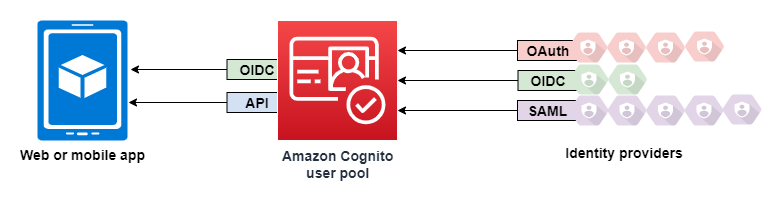

# User pool sign-in with third party

identity providers

Your app users can either sign in directly through a user pool, or they can federate through a
third-party identity provider (IdP). The user pool manages the overhead of handling the tokens
that are returned from social sign-in through Facebook, Google, Amazon, and Apple, and from OpenID
Connect (OIDC) and SAML IdPs. With the built-in hosted web UI, Amazon Cognito provides token handling and management for
authenticated users from all IdPs. This way, your backend systems can standardize on one set
of user pool tokens.

## How federated

sign-in works in Amazon Cognito user pools

Sign-in through a third party (federation) is available in Amazon Cognito user pools. This
feature is independent of federation through Amazon Cognito identity pools (federated
identities).

Amazon Cognito is a user directory and an OAuth 2.0 identity provider (IdP). When you sign in
_local users_ to the Amazon Cognito directory, your user
pool is an IdP to your app. A local user exists exclusively in your user pool directory
without federation through an external IdP.

When you connect Amazon Cognito to social, SAML, or OpenID Connect (OIDC) IdPs, your user pool
acts as a bridge between multiple service providers and your app. To your IdP, Amazon Cognito is
a service provider (SP). Your IdPs pass an OIDC ID token or a SAML assertion to Amazon Cognito.
Amazon Cognito reads the claims about your user in the token or assertion and maps those claims
to a new user profile in your user pool directory.

Amazon Cognito then creates a user profile for your federated user in its own directory. Amazon Cognito
adds attributes to your user based on the claims from your IdP and, in the case of OIDC
and social identity providers, an IdP-operated public `userinfo` endpoint.
Your user's attributes change in your user pool when a mapped IdP attribute changes. You
can also add more attributes independent of those from the IdP.

After Amazon Cognito creates a profile for your federated user, it changes its function and
presents itself as the IdP to your app, which is now the SP. Amazon Cognito is a combination OIDC
and OAuth 2.0 IdP. It generates access tokens, ID tokens, and refresh tokens. For more
information about tokens, see [Understanding
user pool JSON web tokens (JWTs)](amazon-cognito-user-pools-using-tokens-with-identity-providers.md "amazon-cognito-user-pools-using-tokens-with-identity-providers.md").

You must design an app that integrates with Amazon Cognito to authenticate and authorize your
users, whether federated or local.

## The responsibilities of an app as a service provider with Amazon Cognito

**Verify and process the information in the tokens**

In most scenarios, Amazon Cognito redirects your authenticated user to an app URL
that it appends with an authorization code. Your app [exchanges the
code](token-endpoint.md "token-endpoint.md") for access, ID, and refresh tokens. Then, it must [check the validity of the tokens](amazon-cognito-user-pools-using-tokens-verifying-a-jwt.md "amazon-cognito-user-pools-using-tokens-verifying-a-jwt.md") and serve information to your
user based on the claims in the tokens.

**Respond to authentication events with Amazon Cognito API requests**

Your app must integrate with the [Amazon Cognito user pools API](../../../cognito-user-identity-pools/latest/APIReference/Welcome.md "../../../cognito-user-identity-pools/latest/APIReference/Welcome.md") and the [authentication API endpoints](cognito-userpools-server-contract-reference.md "cognito-userpools-server-contract-reference.md"). The authentication API signs
your user in and out, and manages tokens. The user pools API has a variety
of operations that manage your user pool, your users, and the security of
your authentication environment. Your app must know what to do next when it
receives a response from Amazon Cognito.

## Things to know about Amazon Cognito user pools third-party sign-in

- If you want your users to sign in with federated providers, you must choose a
  domain. This sets up the pages for [managed login](cognito-userpools-server-contract-reference.md "cognito-userpools-server-contract-reference.md").
  For more information, see [Using your own domain for managed
  login](cognito-user-pools-add-custom-domain.md "cognito-user-pools-add-custom-domain.md").
- You can't sign in federated users with API operations like [InitiateAuth](../../../cognito-user-identity-pools/latest/APIReference/API_InitiateAuth.md "../../../cognito-user-identity-pools/latest/APIReference/API_InitiateAuth.md") and [AdminInitiateAuth](../../../cognito-user-identity-pools/latest/APIReference/API_AdminInitiateAuth.md "../../../cognito-user-identity-pools/latest/APIReference/API_AdminInitiateAuth.md"). Federated users can only sign in with the [Login endpoint](login-endpoint.md "login-endpoint.md") or the [Authorize endpoint](authorization-endpoint.md "authorization-endpoint.md").
- The [Authorize endpoint](authorization-endpoint.md "authorization-endpoint.md") is a _redirection_ endpoint. If you provide an
  `idp_identifier` or `identity_provider` parameter in
  your request, it redirects silently to your IdP, bypassing managed login.
  Otherwise, it redirects to the managed login [Login endpoint](login-endpoint.md "login-endpoint.md").
- When managed login redirects a session to a federated IdP, Amazon Cognito includes the
  `user-agent` header `Amazon/Cognito` in the
  request.
- Amazon Cognito derives the `username` attribute for a federated user profile
  from a combination of a fixed identifier and the name of your IdP. To generate a
  user name that matches your custom requirements, create a mapping to the
  `preferred_username` attribute. For more information, see [Things to know about mappings](cognito-user-pools-specifying-attribute-mapping.md#cognito-user-pools-specifying-attribute-mapping-requirements "cognito-user-pools-specifying-attribute-mapping.md#cognito-user-pools-specifying-attribute-mapping-requirements").

Example: `MyIDP_bob@example.com`

- Amazon Cognito creates a [user
  group](cognito-user-pools-user-groups.md "cognito-user-pools-user-groups.md") for each OIDC, SAMl, and social IdP that you add to your user
  pool. The name of the group is in the format `[user pool ID]_[IdP
name]`, for example `us-east-1_EXAMPLE_MYSSO` or
  `us-east-1_EXAMPLE_Google`. Each unique automatically-generated
  IdP user profile is automatically added to this group. [Linked
  users](cognito-user-pools-identity-federation-consolidate-users.md "cognito-user-pools-identity-federation-consolidate-users.md") aren't automatically added to this group, but you can add their
  profiles to the group in a separate process.
- Amazon Cognito records information about your federated user's identity to an
  attribute, and a claim in the ID token, called `identities`. This
  claim contains your user's provider and their unique ID from the provider. You
  can't change the `identities` attribute in a user profile directly.
  For more information about how to link a federated user, see [Linking
  federated users to an existing user profile](cognito-user-pools-identity-federation-consolidate-users.md "cognito-user-pools-identity-federation-consolidate-users.md").
- When you update your IdP in an [UpdateIdentityProvider](../../../cognito-user-identity-pools/latest/APIReference/API_UpdateIdentityProvider.md "../../../cognito-user-identity-pools/latest/APIReference/API_UpdateIdentityProvider.md") API request, your changes
  can take up to a minute to appear in managed login.
- Amazon Cognito supports up to 20 HTTP redirects between itself and your IdP.
- When your user signs in with managed login, their browser stores an encrypted
  login-session cookie which records the client and provider they signed in with.
  If they attempt to sign in again with the same parameters, managed login reuses
  any _unexpired_ existing session, and the user
  authenticates without providing credentials again. If your user signs in again
  with a different IdP, including a switch to or from local user pool sign-in,
  they must provide credentials and generate a new login session.

You can assign any of your user pool IdPs to any app client, and users can
only sign in with an IdP that you assigned to their app client.

###### Topics

- [Configuring identity providers for
  your user pool](cognito-user-pools-identity-provider.md "cognito-user-pools-identity-provider.md")
- [Using social identity providers with a
  user pool](cognito-user-pools-social-idp.md "cognito-user-pools-social-idp.md")
- [Using SAML identity providers with a user
  pool](cognito-user-pools-saml-idp.md "cognito-user-pools-saml-idp.md")
- [Using OIDC identity providers with a user
  pool](cognito-user-pools-oidc-idp.md "cognito-user-pools-oidc-idp.md")
- [Mapping IdP attributes
  to profiles and tokens](cognito-user-pools-specifying-attribute-mapping.md "cognito-user-pools-specifying-attribute-mapping.md")
- [Linking
  federated users to an existing user profile](cognito-user-pools-identity-federation-consolidate-users.md "cognito-user-pools-identity-federation-consolidate-users.md")
