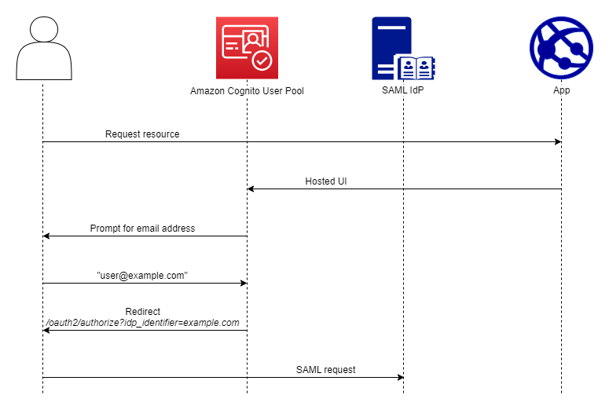
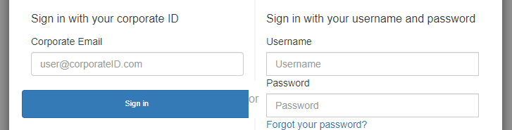

# SAML identity provider

names and identifiers

When you name your SAML identity providers (IdPs) and assign IdP identifiers, you
can automate the flow of SP-initiated sign-in and sign-out requests to that
provider. For information about string constraints to the provider name, see the
`ProviderName` property of [CreateIdentityProvider](../../../cognito-user-identity-pools/latest/APIReference/API_CreateIdentityProvider.md#CognitoUserPools-CreateIdentityProvider-request-ProviderName "../../../cognito-user-identity-pools/latest/APIReference/API_CreateIdentityProvider.md#CognitoUserPools-CreateIdentityProvider-request-ProviderName").


You can also choose up to 50 identifiers for your SAML providers. An identifier is
a friendly name for an IdP in your user pool, and must be unique within the user
pool. If your SAML identifiers match your users' email domains, managed login
requests each user's email address, evaluates the domain in their email address, and
redirects them to the IdP that corresponds to their domain. Because the same
organization can own multiple domains, a single IdP can have multiple
identifiers.

Whether you use or don't use email-domain identifiers, you can use identifiers in
a multi-tenant app to redirect users to the correct IdP. When you want to bypass
managed login entirely, you can customize the links that you present to users such
that they redirect through the [Authorize endpoint](authorization-endpoint.md "authorization-endpoint.md") directly to their IdP. To sign in your users
with an identifier and redirect to their IdP, include the identifier in the format
`idp_identifier=`myidp.example.com`` in
the request parameters of their initial authorization request.

Another method to pass a user through to your IdP is to populate the parameter
`identity_provider` with the name of your IdP in the following URL
format.

```
https://`mydomain.auth.us-east-1.amazoncognito.com`/oauth2/authorize?
response_type=`code`&
identity_provider=`MySAMLIdP`&
client_id=`1example23456789`&
redirect_uri=`https://www.example.com`
```

After a user signs in with your SAML IdP, your IdP redirects them with a SAML
response in the `HTTP POST` body to your `/saml2/idpresponse`
endpoint. Amazon Cognito processes the SAML assertion and, if the claims in the response meet
expectations, redirects to your app client callback URL. After your user has
completed authentication in this way, they have interacted with webpages for only
your IdP and your app.

With IdP identifiers in a domain format, managed login requests email addresses at
sign-in and then, when the email domain matches an IdP identifier, redirects users
to the sign-in page for their IdP. As an example, you build an app that requires
sign-in by employees of two different companies. The first company, AnyCompany A,
owns `exampleA.com` and `exampleA.co.uk`. The second company,
AnyCompany B, owns `exampleB.com`. For this example, you have set up two
IdPs, one for each company, as follows:

- For IdP A, you define identifiers `exampleA.com` and
  `exampleA.co.uk`.
- For IdP B, you define identifier `exampleB.com`.
  In your app, invoke managed login for your app client to prompt each user to enter
  their email address. Amazon Cognito derives the domain from the email address, correlates the
  domain to an IdP with a domain identifier, and redirects your user to the correct
  IdP with a request to the [Authorize endpoint](authorization-endpoint.md "authorization-endpoint.md") that contains an `idp_identifier`
  request parameter. For example, if a user enters `bob@exampleA.co.uk`,
  the next page that they interact with is the IdP sign-in page at
  `https://auth.exampleA.co.uk/sso/saml`.

You can also implement the same logic independently. In your app, you can build a
custom form that collects user input and correlates it to the correct IdP according
to your own logic. You can generate custom portals for each of your app tenants,
where each links to the authorize endpoint with the tenant's identifier in the
request parameters.

To collect an email address and parse the domain in managed login, assign at least
one identifier to each SAML IdP that you have assigned to your app client. By
default, the managed login sign-in screen displays a button for each of the IdPs
that you have assigned to your app client. However, if you have successfully
assigned identifiers, your classic hosted UI sign-in page looks like the following
image.



###### Note

In the classic hosted UI, the sign-in page for your app client automatically
prompts for an email address when you assign identifiers to your IdPs. In the
managed login experience, you must enable this behavior in the branding editor.
In the **Authentication behavior** settings category, select
**Domain search input** under the heading
**Provider display**.

Domain parsing in managed login requires that you use domains as your IdP
identifiers. If you assign an identifier of any type to each of the SAML IdPs for an
app client, managed login for that app no longer displays IdP-selection buttons. Add
IdP identifiers for SAML when you intend to use email parsing or custom logic to
generate redirects. When you want to generate silent redirects and also want your
managed login pages to display a list of IdPs, don't assign identifiers and use the
`identity_provider` request parameter in your authorization
requests.

- If you assign only one SAML IdP to your app client, the managed login
  sign-in page displays a button to sign in with that IdP.
- If you assign an identifier to every SAML IdP that you activate for your
  app client, a user input prompt for an email address appears in the managed
  login sign-in page.
- If you have multiple IdPs and you do not assign an identifier to all of
  them, the managed login sign-in page displays a button to sign in with each
  assigned IdP.
- If you assigned identifiers to your IdPs and you want your managed login
  pages to display a selection of IdP buttons, add a new IdP that has no
  identifier to your app client, or create a new app client. You can also
  delete an existing IdP and add it again without an identifier. If you create
  a new IdP, your SAML users will create new user profiles. This duplication
  of active users might have a billing impact in the month that you change
  your IdP configuration.
  For more information about IdP setup, see [Configuring identity providers for
  your user pool](cognito-user-pools-identity-provider.md "cognito-user-pools-identity-provider.md").
