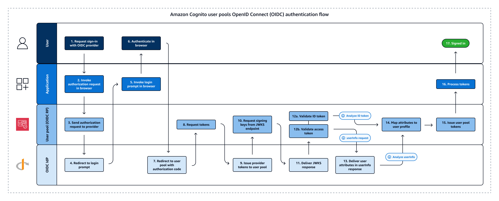

# Using OIDC identity providers with a user

pool

Users can sign in to your application using their existing accounts from OpenID
Connect (OIDC) identity providers (IdPs). With OIDC providers, users of independent
single sign-on systems can provide existing credentials while your application receives
OIDC tokens in the shared format of user pools. To configure an OIDC IdP, set up your
IdP to handle your user pool as the RP and configure your application to handle your
user pool as the IdP. Amazon Cognito serves as an intermediate step between multiple OIDC IdPs
and your applications. Your user pool applies attribute-mapping rules to the claims in
the ID and access tokens that your provider passes directly to your user pool. Amazon Cognito
then issues new tokens based on the mapped user attributes and any additional
adjustments you've made to the authentication flow with [Lambda triggers](cognito-user-pools-working-with-lambda-triggers.md#lambda-triggers-for-federated-users "cognito-user-pools-working-with-lambda-triggers.md#lambda-triggers-for-federated-users").

Users who sign in with an OIDC IdP aren't required to provide new credentials or
information to access your user pool application. Your application can silently redirect
them to their IdP for sign-in, with a user pool as a tool in the background that
standardizes the token format for your application. To learn more about IdP redirection,
see [Authorize endpoint](authorization-endpoint.md "authorization-endpoint.md").

Like with other third-party identity providers, you must register your application
with the OIDC provider and obtain information about the IdP application that you want to
connect to your user pool. A user pool OIDC IdP requires a client ID, client secret,
scopes that you want to request, and information about provider service endpoints. Your
user pool can discover the provider OIDC endpoints from a discovery endpoint or you can
enter them manually. You must also examine provider ID tokens and create attribute
mappings between the IdP and the attributes in your user pool.


See [OIDC user pool IdP authentication
flow](cognito-user-pools-oidc-flow.md "cognito-user-pools-oidc-flow.md") for more details about this authentication
flow.

###### Note

Sign-in through a third party (federation) is available in Amazon Cognito user pools. This
feature is independent of OIDC federation with Amazon Cognito identity pools.

You can add an OIDC IdP to your user pool in the AWS Management Console, through the AWS CLI, or with
the user pool API method [CreateIdentityProvider](../../../cognito-user-identity-pools/latest/APIReference/API_CreateIdentityProvider.md "../../../cognito-user-identity-pools/latest/APIReference/API_CreateIdentityProvider.md").

###### Topics

- [Prerequisites](#cognito-user-pools-oidc-idp-prerequisites "#cognito-user-pools-oidc-idp-prerequisites")
- [Register an application with an
  OIDC IdP](#cognito-user-pools-oidc-idp-step-1 "#cognito-user-pools-oidc-idp-step-1")
- [Add an OIDC IdP to your user
  pool](#cognito-user-pools-oidc-idp-step-2 "#cognito-user-pools-oidc-idp-step-2")
- [Test your OIDC IdP
  configuration](#cognito-user-pools-oidc-idp-step-3 "#cognito-user-pools-oidc-idp-step-3")
- [OIDC user pool IdP authentication
  flow](cognito-user-pools-oidc-flow.md "cognito-user-pools-oidc-flow.md")

## Prerequisites

Before you begin, you need the following:

- A user pool with an app client and a user pool domain. For more
  information, see [Create a
  user pool](cognito-user-pool-as-user-directory.md "cognito-user-pool-as-user-directory.md").
- An OIDC IdP with the following configuration:
  - Supports `client_secret_post` client authentication.
    Amazon Cognito doesn't check the
    `token_endpoint_auth_methods_supported` claim at the
    OIDC discovery endpoint for your IdP. Amazon Cognito doesn't support
    `client_secret_basic` client authentication. For more
    information on client authentication, see [Client Authentication](https://openid.net/specs/openid-connect-core-1_0.html#ClientAuthentication "https://openid.net/specs/openid-connect-core-1_0.html#ClientAuthentication") in the OpenID Connect
    documentation.
  - Only uses HTTPS for OIDC endpoints such as
    `openid_configuration`, `userInfo`, and
    `jwks_uri`.
  - Only uses TCP ports 80 and 443 for OIDC endpoints.
  - Only signs ID tokens with HMAC-SHA, ECDSA, or RSA
    algorithms.
  - Publishes a key ID `kid` claim at its
    `jwks_uri` and includes a `kid` claim in
    its tokens.
  - Presents a non-expired public key with a valid root CA trust
    chain.

## Register an application with an

OIDC IdP

Before you add an OIDC IdP to your user pool configuration and assign it to app
clients, you set up an OIDC client application in your IdP. Your user pool is the
relying-party application that will manage authentication with your IdP.

###### To register with an OIDC IdP

1. Create a developer account with the OIDC IdP.

| Links to OIDC IdPs | OIDC IdP                                                                                                                                                                                                                                        | How to Install                                                                                                                                      | OIDC Discovery URL |
| ------------------ | ----------------------------------------------------------------------------------------------------------------------------------------------------------------------------------------------------------------------------------------------- | --------------------------------------------------------------------------------------------------------------------------------------------------- | ------------------ |
| Salesforce         | [Salesforce as an OpenID Connect Identity<br>Provider](https://help.salesforce.com/s/articleView?id=xcloud.service_provider_define_oid.htm&type=5 "https://help.salesforce.com/s/articleView?id=xcloud.service_provider_define_oid.htm&type=5") | `https://`MyDomainName`.my.salesforce.com/.well-known/openid-configuration`                                                                         |
| OneLogin           | [Connect an OIDC enabled app](https://developers.onelogin.com/openid-connect/connect-to-onelogin "https://developers.onelogin.com/openid-connect/connect-to-onelogin")                                                                          | `https://`your-domain.onelogin.com`/oidc/2/.well-known/openid-configuration`                                                                        |
| JumpCloud          | [SSO with OIDC](https://jumpcloud.com/support/sso-with-oidc "https://jumpcloud.com/support/sso-with-oidc")                                                                                                                                      | `https://oauth.id.jumpcloud.com/.well-known/openid-configuration`                                                                                   |
| Okta               | [Install an Okta identity provider](https://help.okta.com/en/prev/Content/Topics/Apps/Apps_App_Integration_Wizard.htm#OIDCWizard "https://help.okta.com/en/prev/Content/Topics/Apps/Apps_App_Integration_Wizard.htm#OIDCWizard")                | `https://`Your Okta<br>subdomain`.okta.com/.well-known/openid-configuration`                                                                        |
| Microsoft Entra ID | [OpenID Connect on the Microsoft identity<br>platform](https://learn.microsoft.com/en-us/entra/identity-platform/v2-protocols-oidc "https://learn.microsoft.com/en-us/entra/identity-platform/v2-protocols-oidc")                               | `https://login.microsoftonline.com/`{tenant}`/v2.0`<br>Values of `tenant` can include a tenant ID,<br>`common`, `organizations`, or<br>`consumers`. |

2. Register your user pool domain URL with the
   `/oauth2/idpresponse` endpoint with your OIDC IdP.
   This ensures that the OIDC IdP later accepts it from Amazon Cognito when it
   authenticates users.

```
`https://`mydomain.auth.us-east-1.amazoncognito.com`/oauth2/idpresponse`
```

3. Select the [scopes](cognito-user-pools-define-resource-servers.md#cognito-user-pools-define-resource-servers-about-scopes "cognito-user-pools-define-resource-servers.md#cognito-user-pools-define-resource-servers-about-scopes") that you want your user directory to share with your user
   pool. The scope **openid** is required for OIDC IdPs to
   offer any user information. The `email` scope is needed to grant
   access to the `email` and `email_verified`
   [claims](https://openid.net/specs/openid-connect-basic-1_0.html#StandardClaims "https://openid.net/specs/openid-connect-basic-1_0.html#StandardClaims"). Additional scopes in the OIDC specification are
   `profile` for all user attributes and `phone` for
   `phone_number` and `phone_number_verified`.
4. The OIDC IdP provides you with a client ID and a client secret. Note these
   values and add them to the configuration of the OIDC IdP that you add to
   your user pool later.

###### Example: Use Salesforce as an OIDC IdP with your user pool

You use an OIDC IdP when you want to establish trust between an
OIDC-compatible IdP such as Salesforce and your user pool.

1. [Create an
   account](https://developer.salesforce.com/signup "https://developer.salesforce.com/signup") on the Salesforce Developers website.
2. [Sign in](https://developer.salesforce.com "https://developer.salesforce.com") through your
   developer account that you set up in the previous step.
3. From your Salesforce page, do one of the following:
   - If you’re using Lightning Experience, choose the setup gear icon,
     then choose **Setup Home**.
   - If you’re using Salesforce Classic and you see
     **Setup** in the user interface header, choose
     it.
   - If you’re using Salesforce Classic and you don’t see
     **Setup** in the header, choose your name from
     the top navigation bar, and choose **Setup** from
     the drop-down list.

4. On the left navigation bar, choose **Company Settings**.
5. On the navigation bar, choose **Domain**, enter a domain,
   and choose **Create**.
6. On the left navigation bar, under **Platform Tools**,
   choose **Apps**.
7. Choose **App Manager**.
8. 1. Choose **New connected app**.
   2. Complete the required fields.

   Under **Start URL**, enter a URL at the
   `/authorize` endpoint for the user pool domain that
   signs in with your Salesforce IdP. When your users access your
   connected app, Salesforce directs them to this URL to complete
   sign-in. Then Salesforce redirects the users to the callback URL
   that you have associated with your app client.

   ```
   https://`mydomain.auth.us-east-1.amazoncognito.com`/authorize?response_type=code&client_id=`<your_client_id>`&redirect_uri=`https://www.example.com`&identity_provider=`CorpSalesforce`
   ```

   3. Enable **OAuth settings** and enter the URL of
      the `/oauth2/idpresponse` endpoint for your user pool
      domain in **Callback URL**. This is the URL where
      Salesforce issues the authorization code that Amazon Cognito exchanges for an
      OAuth token.

   ```
   https://`mydomain.auth.us-east-1.amazoncognito.com`/oauth2/idpresponse
   ```

9. Select your [scopes](https://openid.net/specs/openid-connect-basic-1_0.html#Scopes "https://openid.net/specs/openid-connect-basic-1_0.html#Scopes"). You must include the scope **openid**.
   To grant access to the **email** and
   **email_verified**
   [claims](https://openid.net/specs/openid-connect-basic-1_0.html#StandardClaims "https://openid.net/specs/openid-connect-basic-1_0.html#StandardClaims"), add the **email** scope. Separate
   scopes by spaces.
10. Choose **Create**.

In Salesforce, the client ID is called a **Consumer
Key**, and the client secret is a **Consumer
Secret**. Note your client ID and client secret. You will use
them in the next section.

## Add an OIDC IdP to your user

pool

After you set up your IdP, you can configure your user pool to handle
authentication requests with an OIDC IdP.

Amazon Cognito console

###### Add an OIDC IdP in the console

1. Go to the [Amazon Cognito
   console](https://console.aws.amazon.com/cognito/home "https://console.aws.amazon.com/cognito/home"). If prompted, enter your AWS
   credentials.
2. Choose **User Pools** from the navigation
   menu.
3. Choose an existing user pool from the list, or [create a user pool](cognito-user-pool-as-user-directory.md "cognito-user-pool-as-user-directory.md").
4. Choose the **Social and external providers**
   menu and then select **Add an identity
   provider**.
5. Choose an **OpenID Connect** IdP.
6. Enter a unique **Provider name**.
7. Enter the IdP **Client ID**. This is the ID
   of the application client you build in your OIDC IdP. The client
   ID that you provide must be an OIDC provider that you've
   configured with a callback url of
   `https://`[your user pool
   domain]`/oauth2/idpresponse`.
8. Enter the IdP **Client secret**. This must be
   the client secret for the same application client from the
   previous step.
9. Enter **Authorized scopes** for this
   provider. Scopes define which groups of user attributes (such as
   `name` and `email`) that your
   application will request from your provider. Scopes must be
   separated by spaces, following the [OAuth
   2.0](https://tools.ietf.org/html/rfc6749#section-3.3 "https://tools.ietf.org/html/rfc6749#section-3.3") specification.

Your IdP might prompt users to consent to providing these
attributes to your application when they sign in. 10. Choose an **Attribute request method**. IdPs
might require that requests to their `userInfo`
endpoints are formatted as either `GET` or
`POST`. The Amazon Cognito `userInfo` endpoint
requires `HTTP GET` requests, for example. 11. Choose a **Setup method** for the way that
you want your user pool to determine the path to key
OIDC-federation endpoints at your IdP. Typically, IdPs host a
`/well-known/openid-configuration` endpoint at an
issuer base URL. If this is the case for your provider, the
**Auto fill through issuer URL** option
prompts you for that base URL, attempts to access the
`/well-known/openid-configuration` path from
there, and reads the endpoints listed there. You might have
non-typical endpoint paths or wish to pass requests to one or
more endpoints through an alternate proxy. In this case, select
**Manual input** and specify paths for the
`authorization`, `token`,
`userInfo`, and `jwks_uri`
endpoints.

###### Note

The URL should start with `https://`, and
shouldn't end with a slash `/`. Only port numbers
443 and 80 can be used with this URL. For example,
Salesforce uses this URL:

`https://login.salesforce.com`

If you choose auto fill, the discovery document must use
HTTPS for the following values:
`authorization_endpoint`,
`token_endpoint`,
`userinfo_endpoint`, and
`jwks_uri`. Otherwise the login will
fail. 12. Configure your attribute-mapping rules under **Map
attributes between your OpenID Connect provider and your
user pool**. **User pool
attribute** is the _destination_ attribute in the Amazon Cognito user profile
and **OpenID Connect attribute** is the
_source_ attribute that you
want Amazon Cognito to find in an ID-token claim or `userInfo`
response. Amazon Cognito automatically maps the OIDC claim
**sub** to `username` in the
destination user profile.

For more information, see [Mapping IdP attributes
to profiles and tokens](cognito-user-pools-specifying-attribute-mapping.md "cognito-user-pools-specifying-attribute-mapping.md"). 13. Choose **Add identity provider**. 14. From the **App clients** menu, select an app
client from the list. Navigate to the **Login
pages** tab and under **Managed login pages
configuration**, select **Edit**.
Locate **Identity providers** and add your new
OIDC IdP. 15. Choose **Save changes**.

API/CLI
See the OIDC configuration in example two at [CreateIdentityProvider](../../../cognito-user-identity-pools/latest/APIReference/API_CreateIdentityProvider.md#API_CreateIdentityProvider_Example_2 "../../../cognito-user-identity-pools/latest/APIReference/API_CreateIdentityProvider.md#API_CreateIdentityProvider_Example_2"). You can modify this syntax and use
it as the request body of `CreateIdentityProvider`,
`UpdateIdentityProvider`, or the
`--cli-input-json` input file for [create-identity-provider](../../../cli/latest/reference/cognito-idp/create-identity-provider.md "../../../cli/latest/reference/cognito-idp/create-identity-provider.md").

## Test your OIDC IdP

configuration

In your application, you must invoke a browser in the user's client so that they
can sign in with their OIDC provider. Test sign-in with your provider after you have
completed the setup procedures in the preceding sections. The following example URL
loads the sign-in page for your user pool with a prefix domain.

```

https://`mydomain.auth.us-east-1.amazoncognito.com`/oauth2/authorize?response_type=code&client_id=`1example23456789`&redirect_uri=`https://www.example.com`

```

This link is the page that Amazon Cognito directs you to when you go to the **App
clients** menu, select an app client, navigate to the **Login
pages** tab, and select **View login page**. For more
information about user pool domains, see [Configuring a user pool domain](cognito-user-pools-assign-domain.md "cognito-user-pools-assign-domain.md"). For more information about app
clients, including client IDs and callback URLs, see [Application-specific settings with app
clients](user-pool-settings-client-apps.md "user-pool-settings-client-apps.md").

The following example link sets up silent redirect to the `MyOIDCIdP`
provider from the [Authorize endpoint](authorization-endpoint.md "authorization-endpoint.md") with an `identity_provider` query
parameter. This URL bypasses interactive user pool sign-in with managed login and
goes directly to the IdP sign-in page.

```

https://`mydomain.auth.us-east-1.amazoncognito.com`/oauth2/authorize?identity_provider=`MyOIDCIdP`&response_type=code&client_id=`1example23456789`&redirect_uri=`https://www.example.com`

```
