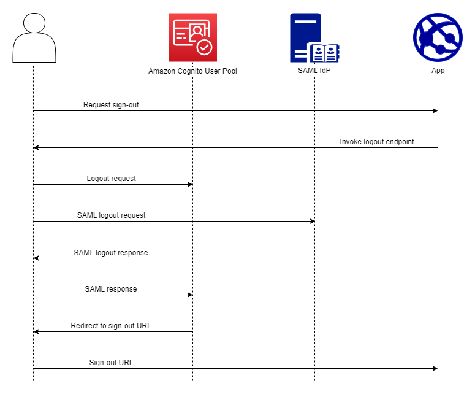

# Signing out SAML users with

single sign-out

Amazon Cognito supports SAML 2.0 [single logout](http://docs.oasis-open.org/security/saml/Post2.0/sstc-saml-tech-overview-2.0-cd-02.html#5.3.Single%20Logout%20Profile|outline "http://docs.oasis-open.org/security/saml/Post2.0/sstc-saml-tech-overview-2.0-cd-02.html#5.3.Single%20Logout%20Profile|outline") (SLO. With SLO, your application can sign out users from
their SAML identity providers (IdPs) when they sign out from your user pool. This
way, when users want to sign in to your application again, they must authenticate
with their SAML IdP. Otherwise, they might have IdP or user pool browser cookies in
place that pass them through to your application without the requirement that they
provide credentials.

When you configure your SAML IdP to support **Sign-out flow**,
Amazon Cognito redirects your user with a signed SAML logout request to your IdP. Amazon Cognito
determines the redirect location from the `SingleLogoutService` URL in
your IdP metadata. Amazon Cognito signs the sign-out request with your user pool signing
certificate.


When you direct a user with a SAML session to your user pool `/logout`
endpoint, Amazon Cognito redirects your SAML user with the following request to the SLO
endpoint that's specified in the IdP metadata.

```
https://`[SingleLogoutService endpoint]`?
SAMLRequest=`[encoded SAML request]`&
RelayState=`[RelayState]`&
SigAlg=http://www.w3.org/2001/04/xmldsig-more#rsa-sha256&
Signature=`[User pool RSA signature]`
```

Your user then returns to your `saml2/logout` endpoint with a
`LogoutResponse` from their IdP. Your IdP must send the
`LogoutResponse` in an `HTTP POST` request. Amazon Cognito then
redirects them to the redirect destination from their initial sign-out
request.

Your SAML provider might send a `LogoutResponse` with more than one
`AuthnStatement` in it. The `sessionIndex` in the first
`AuthnStatement` in a response of this type must match the
`sessionIndex` in the SAML response that originally authenticated the
user. If the `sessionIndex` is in any other `AuthnStatement`,
Amazon Cognito won’t recognize the session and your user won’t be signed out.

AWS Management Console

###### To configure SAML sign-out

1. Create a [user pool](cognito-user-pool-as-user-directory.md "cognito-user-pool-as-user-directory.md"), [app client](cognito-user-pools-configuring-app-integration.md "cognito-user-pools-configuring-app-integration.md"), and SAML IdP.
2. When you create or edit your SAML identity provider, under
   **Identity provider information**, check
   the box with the title **Add sign-out
   flow**.
3. From the **Social and external providers**
   menu of your user pool, choose your IdP and locate the
   **Signing certificate**.
4. Choose **Download as .crt**.
5. Configure your SAML provider to support SAML single logout and
   request signing, and upload the user pool signing certificate.
   Your IdP must redirect to `/saml2/logout` in your
   user pool domain.

API/CLI
**To configure SAML sign-out**

Configure single logout with the `IDPSignout` parameter of
a [CreateIdentityProvider](../../../cognito-user-identity-pools/latest/APIReference/API_CreateIdentityProvider.md "../../../cognito-user-identity-pools/latest/APIReference/API_CreateIdentityProvider.md") or [UpdateIdentityProvider](../../../cognito-user-identity-pools/latest/APIReference/API_UpdateIdentityProvider.md "../../../cognito-user-identity-pools/latest/APIReference/API_UpdateIdentityProvider.md") API request. The following is an
example `ProviderDetails` of an IdP that supports SAML single
logout.

```
"ProviderDetails": {
      "MetadataURL" : "`https://myidp.example.com/saml/metadata`",
      **"IDPSignout" : "`true`",**,
      "RequestSigningAlgorithm" : "rsa-sha256",
      "EncryptedResponses" : "`true`",
      "IDPInit" : "`true`"
}
```
