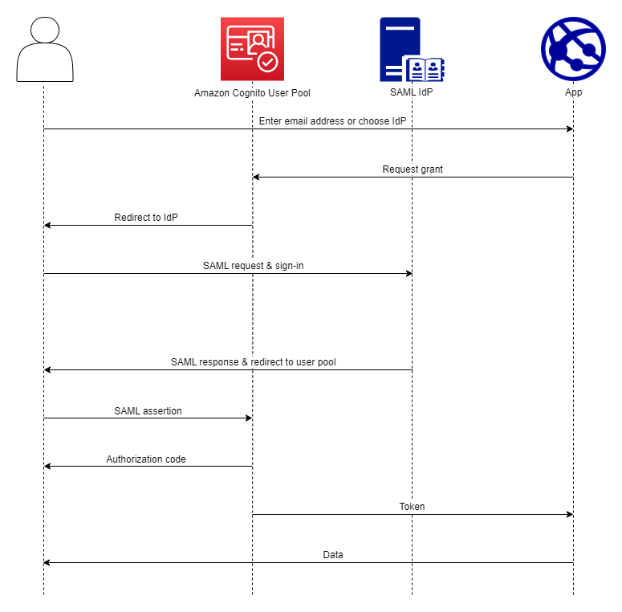

# Using SAML identity providers with a user

pool

You can choose to have your web and mobile app users sign in through a SAML identity
provider (IdP) like [Microsoft Active Directory Federation Services (ADFS)](https://msdn.microsoft.com/en-us/library/bb897402.aspx "https://msdn.microsoft.com/en-us/library/bb897402.aspx"), or [Shibboleth](http://www.shibboleth.net/ "http://www.shibboleth.net/"). You must choose a SAML IdP
which supports the [SAML 2.0
standard](http://saml.xml.org/saml-specifications "http://saml.xml.org/saml-specifications").

With managed login, Amazon Cognito authenticates local and third-party IdP users and issues
JSON web tokens (JWTs). With the tokens that Amazon Cognito issues, you can consolidate multiple
identity sources into a universal OpenID Connect (OIDC) standard across all of your
apps. Amazon Cognito can process SAML assertions from your third-party providers into that SSO
standard. You can create and manage a SAML IdP in the AWS Management Console, through the AWS CLI, or
with the Amazon Cognito user pools API. To create your first SAML IdP in the AWS Management Console, see [Adding and managing SAML
identity providers in a user pool](cognito-user-pools-managing-saml-idp.md "cognito-user-pools-managing-saml-idp.md").



###### Note

Federation with sign-in through a third-party IdP is a feature of Amazon Cognito user
pools. Amazon Cognito identity pools, sometimes called Amazon Cognito federated identities, are an
implementation of federation that you must set up separately in each identity pool.
A user pool can be a third-party IdP to an identity pool. For more information, see
[Amazon Cognito identity pools](cognito-identity.md "cognito-identity.md").

## Quick reference for IdP

configuration

You must configure your SAML IdP to accept request and send responses to your user
pool. The documentation for your SAML IdP will contain information about how to add
your user pool as a relying party or application for your SAML 2.0 IdP. The
documentation that follows provides the values that you must provide for the SP
entity ID and assertion consumer service (ACS) URL.

###### User pool SAML values quick reference

**SP entity ID**

```
urn:amazon:cognito:sp:`us-east-1_EXAMPLE`
```

**ACS URL**

```
https://`Your user pool domain`/saml2/idpresponse
```

You must configure your user pool to support your identity provider. The high-level
steps to add an external SAML IdP are as follows.

1. Download SAML metadata from your IdP, or retrieve the URL to your metadata
   endpoint. See [Configuring your third-party SAML identity provider](cognito-user-pools-integrating-3rd-party-saml-providers.md "cognito-user-pools-integrating-3rd-party-saml-providers.md").
2. Add a new IdP to your user pool. Upload the SAML metadata or provide the
   metadata URL. See [Adding and managing SAML
   identity providers in a user pool](cognito-user-pools-managing-saml-idp.md "cognito-user-pools-managing-saml-idp.md").
3. Assign the IdP to your app clients. See [Application-specific settings with app
   clients](user-pool-settings-client-apps.md "user-pool-settings-client-apps.md").

###### Topics

- [Things to know about
  SAML IdPs in Amazon Cognito user pools](cognito-user-pools-saml-idp-things-to-know.md "cognito-user-pools-saml-idp-things-to-know.md")
- [Case sensitivity of SAML user
  names](#saml-nameid-case-sensitivity "#saml-nameid-case-sensitivity")
- [Configuring your third-party SAML identity provider](cognito-user-pools-integrating-3rd-party-saml-providers.md "cognito-user-pools-integrating-3rd-party-saml-providers.md")
- [Adding and managing SAML
  identity providers in a user pool](cognito-user-pools-managing-saml-idp.md "cognito-user-pools-managing-saml-idp.md")
- [SAML session initiation
  in Amazon Cognito user pools](cognito-user-pools-SAML-session-initiation.md "cognito-user-pools-SAML-session-initiation.md")
- [Signing out SAML users with
  single sign-out](cognito-user-pools-saml-idp-sign-out.md "cognito-user-pools-saml-idp-sign-out.md")
- [SAML signing and
  encryption](cognito-user-pools-SAML-signing-encryption.md "cognito-user-pools-SAML-signing-encryption.md")
- [SAML identity provider
  names and identifiers](cognito-user-pools-managing-saml-idp-naming.md "cognito-user-pools-managing-saml-idp-naming.md")

## Case sensitivity of SAML user

names

When a federated user attempts to sign in, the SAML identity provider (IdP) passes
a unique `NameId` to Amazon Cognito in the user's SAML assertion. Amazon Cognito identifies
a SAML-federated user by their `NameId` claim. Regardless of the case
sensitivity settings of your user pool, Amazon Cognito recognizes a returning federated user
from a SAML IdP when they pass their unique and case-sensitive `NameId`
claim. If you map an attribute like `email` to `NameId`, and
your user changes their email address, they can't sign in to your app.

Map `NameId` in your SAML assertions from an IdP attribute that has
values that don't change.

For example, Carlos has a user profile in your case-insensitive user pool from an
Active Directory Federation Services (ADFS) SAML assertion that passed a
`NameId` value of `Carlos@example.com`. The next time
Carlos attempts to sign in, your ADFS IdP passes a `NameId` value of
`carlos@example.com`. Because `NameId` must be an exact
case match, the sign-in doesn't succeed.

If your users can't log in after their `NameID` changes, delete their
user profiles from your user pool. Amazon Cognito will create new user profiles the next time
they sign in.

###### Topics

- [Configuring your third-party SAML identity provider](cognito-user-pools-integrating-3rd-party-saml-providers.md "cognito-user-pools-integrating-3rd-party-saml-providers.md")
- [Adding and managing SAML
  identity providers in a user pool](cognito-user-pools-managing-saml-idp.md "cognito-user-pools-managing-saml-idp.md")
- [SAML session initiation
  in Amazon Cognito user pools](cognito-user-pools-SAML-session-initiation.md "cognito-user-pools-SAML-session-initiation.md")
- [Signing out SAML users with
  single sign-out](cognito-user-pools-saml-idp-sign-out.md "cognito-user-pools-saml-idp-sign-out.md")
- [SAML signing and
  encryption](cognito-user-pools-SAML-signing-encryption.md "cognito-user-pools-SAML-signing-encryption.md")
- [SAML identity provider
  names and identifiers](cognito-user-pools-managing-saml-idp-naming.md "cognito-user-pools-managing-saml-idp-naming.md")
