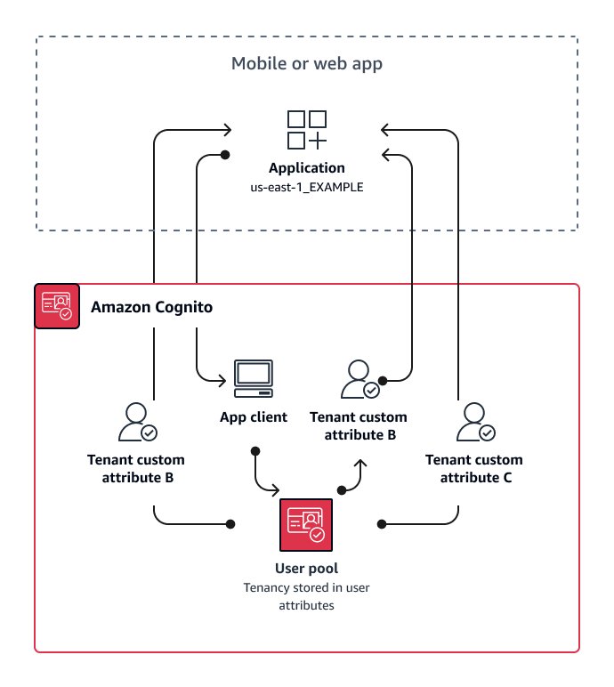

# Custom-attribute multi-tenancy

best practices

Amazon Cognito supports [custom
attributes](user-pool-settings-attributes.md#user-pool-settings-custom-attributes.title "user-pool-settings-attributes.md#user-pool-settings-custom-attributes.title") with names that you choose. One scenario where custom attributes
are useful is when they distinguish the tenancy of users in a shared user pool. When you
assign users a value for an attribute like `custom:tenantID`, your app can
assign access to tenant-specific resources accordingly. A custom attribute that defines
a tenant ID should be immutable or read-only to the app client.

The following diagram shows tenants sharing an app client and a user pool, with a
custom attributes in the user pool that indicates the tenant that they belong to.

When custom attributes determine tenancy, you can distribute a single application or
sign-in URL. After your user signs in, your app can process the
`custom:tenantID` claim determine which assets to load, the branding to
apply, and features to display. For advanced access-control decisions from user
attributes, set up your user pool as an identity provider in Amazon Verified Permissions, and generate
access decisions from the contents of ID or access tokens.

###### When to implement custom-attribute multi-tenancy

When tenancy is surface-level. A tenant attribute can contribute to branding and
layout outcomes. When you want to achieve significant isolation between tenants,
custom attributes aren't the best choice. Any difference between tenants that must
be configured at the user-pool or app-client level, like MFA or hosted UI branding,
requires that you create distinctions between tenants in a way that custom
attributes don't offer. With identity pools, you can even choose the IAM role from
your users from the custom-attribute claim in their ID token.

###### Level of effort

Because custom-attribute multi-tenancy transfers the duty of tenant-based
authorization decisions on your app, the level of effort tends to be high. If you're
already well-versed in a client configuration that parses OIDC claims, or in
Amazon Verified Permissions, this approach might require the lowest level of effort.
