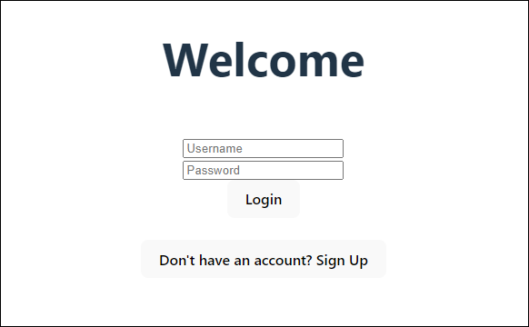
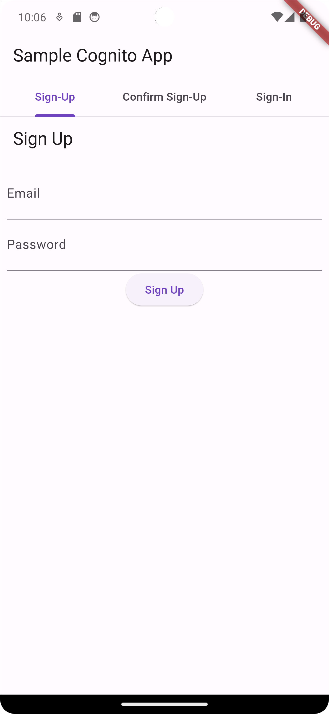

# Other application

options

You might have an existing application UI that you want to integrate with Amazon Cognito
authentication. You might even have your own existing authentication pages with a
less-functional directory setup than Amazon Cognito user pools. You can add or replace an authentication
component to an application of this type with Amazon Cognito integrations in AWS SDKs for a variety
of programming languages. Some examples follow.

If you create a user pool for this purpose in the Amazon Cognito console, it might not be necessary
to have a [user pool domain](cognito-user-pools-assign-domain.md "cognito-user-pools-assign-domain.md") that hosts
interactive sign-in pages and OpenID Connect (OIDC) services. The process of user pool
creation in the console automatically generates a domain for you. You can delete this domain
from the **Domain** tab of your user pool. Other options include programmatic
creation of Amazon Cognito resources for you application with API requests in AWS SDKs and with the
automated-setup options in the AWS Amplify CLI. For more information, see [Integrating Amazon Cognito authentication and authorization with
web and mobile apps](cognito-integrate-apps.md "cognito-integrate-apps.md").

###### Topics

- [Set up an example React single page
  application](#getting-started-test-application-react "#getting-started-test-application-react")
- [Set up an example Android app
  with Flutter](#getting-started-test-application-flutter "#getting-started-test-application-flutter")

## Set up an example React single page

application

In this tutorial, you'll create a React single page application where you can test user
sign-up, confirmation, and sign-in. React is a JavaScript-based library for web and mobile
apps, with a focus on the user interface (UI). This example application demonstrates some
basic functions of Amazon Cognito user pools. If you're already experienced in web app development with React,
[download the example app from GitHub](https://github.com/awsdocs/aws-doc-sdk-examples/tree/main/javascriptv3/example_code/cognito-identity-provider/scenarios/cognito-developer-guide-react-example "https://github.com/awsdocs/aws-doc-sdk-examples/tree/main/javascriptv3/example_code/cognito-identity-provider/scenarios/cognito-developer-guide-react-example").

The following screenshot is of the initial authentication page in the application that
you'll create.



To set up this application, your user pool must meet the following requirements:

- Users can sign in with their email address. **Cognito user pool sign-in
  options**: **Email**.
- Usernames are case insensitive. **User name requirements**:
  **Make user name case sensitive** is not selected.
- Multi-factor authentication (MFA) isn't required. **MFA
  enforcement**: **Optional MFA**.
- Your user pool verifies attributes for user-profile confirmation with an email
  message. **Attributes to verify**: **Send email message, verify
  email address**.
- Email is the only required attribute. **Required attributes**:
  **email**.
- Users can sign themselves up in your user pool.
  **Self-registration**: **Enable self-registration**
  is selected.
- Your initial app client is a public client that permits sign-in with username and
  password. **App type**: **Public client**,
  **Authentication flows**:
  `ALLOW_USER_PASSWORD_AUTH`.

### Create an

application

To build this application, you must set up a developer environment. The developer
environment requirements are:

1. Node.js is installed and updated.
2. Node package manager (npm) is installed and updated to at least version
   10.2.3.
3. The environment is accessible on TCP port 5173 in a web browser.

###### To create an example React web application

1. Sign in to your developer environment and navigate to the parent directory for
   your application.

```
cd `~/path/to/project/folder/`
```

2. Create a new React service.

```
npm create vite@latest frontend-client -- --template react-ts
```

3. Clone the `cognito-developer-guide-react-example`
   [project folder](https://github.com/awsdocs/aws-doc-sdk-examples/tree/main/javascriptv3/example_code/cognito-identity-provider/scenarios/cognito-developer-guide-react-example "https://github.com/awsdocs/aws-doc-sdk-examples/tree/main/javascriptv3/example_code/cognito-identity-provider/scenarios/cognito-developer-guide-react-example") from the AWS code examples repository on GitHub.

```
cd `~/some/other/path`
```

```
git clone https://github.com/awsdocs/aws-doc-sdk-examples.git
```

```
cp -r ./aws-doc-sdk-examples/javascriptv3/example_code/cognito-identity-provider/scenarios/cognito-developer-guide-react-example/frontend-client `~/path/to/project/folder/`
```

4. Navigate to the `src` directory in your project.

```
cd `~/path/to/project/folder/`frontend-client/src
```

5. Edit `config.json` and replace the following values:
   1. Replace `YOUR_AWS_REGION` with an AWS Region code. For example:
      `us-east-1`.
   2. Replace `YOUR_COGNITO_USER_POOL_ID` with the ID of the user pool
      that you have designated for testing. For example: `us-east-1_EXAMPLE`.
      The user pool must be in the AWS Region that you entered in the previous
      step.
   3. Replace `YOUR_COGNITO_APP_CLIENT_ID` with the ID of the app client
      that you have designated for testing. For example: `1example23456789`.
      The app client must be in the user pool from the previous step.

6. If you want to access your example application from an IP other than
   `localhost`, edit `package.json` and change the line
   `"dev": "vite",` to `"dev": "vite --host 0.0.0.0",`.
7. Install your application.

```
npm install
```

8. Launch the application.

```
npm run dev
```

9. Access the application in a web browser at `http://localhost:5173` or
   `http://[IP address]:5173`.
10. Sign up a new user with a valid email address.
11. Retrieve the confirmation code from your email message. Enter the confirmation
    code into the application.
12. Sign in with your username and password.

### Creating a React

developer environment with Amazon Lightsail

A quick way to get started with this application is to create a virtual cloud server
with Amazon Lightsail.

With Lightsail, you can quickly create a small server instance that comes
preconfigured with the prerequisites for this example application. You can SSH to your
instance with a browser-based client, and connect to the web server at a public or private
IP address.

###### To create a Lightsail instance for this example application

1. Go to the [Lightsail
   console](https://lightsail.aws.amazon.com/ls/webapp/ "https://lightsail.aws.amazon.com/ls/webapp/"). If prompted, enter your AWS credentials.
2. Choose **Create instance**.
3. For **Select a platform**, choose
   **Linux/Unix**.
4. For **Select a blueprint**, choose
   **Node.js**.
5. Under **Identify your instance**, give your development
   environment a friendly name.
6. Choose **Create instance**.
7. After Lightsail has created your instance, select it and from the
   **Connect** tab, choose **Connect using
   SSH**.
8. An SSH session opens in a browser window. Run `node -v` and `npm
-v` to confirm that your instance was provisioned with Node.js and the minimum
   npm version of 10.2.3.
9. Proceed to [configure your
   React application](#getting-started-test-application-react "#getting-started-test-application-react").

## Set up an example Android app

with Flutter

In this tutorial, you'll create a mobile application in Android Studio where you can
emulate a device and test user sign-up, confirmation, and sign-in. This example application
creates a basic Amazon Cognito user pools mobile client for Android in Flutter. If you're already experienced
in mobile app development with Flutter, [download the example app from GitHub](https://github.com/awsdocs/aws-doc-sdk-examples/tree/main/kotlin/usecases/cognito_flutter_mobile_app "https://github.com/awsdocs/aws-doc-sdk-examples/tree/main/kotlin/usecases/cognito_flutter_mobile_app").

The following screenshot shows the app running on a virtual Android device.



To set up this application, you user pool must meet the following requirements:

- Users can sign in with their email address. **Cognito user pool sign-in
  options**: **Email**.
- Usernames are case insensitive. **User name requirements**:
  **Make user name case sensitive** is not selected.
- Multi-factor authentication (MFA) isn't required. **MFA
  enforcement**: **Optional MFA**.
- Your user pool verifies attributes for user-profile confirmation with an email
  message. **Attributes to verify**: **Send email message, verify
  email address**.
- Email is the only required attribute. **Required attributes**:
  **email**.
- Users can sign themselves up in your user pool.
  **Self-registration**: **Enable self-registration**
  is selected.
- Your initial app client is a public client that permits sign-in with username and
  password. **App type**: **Public client**,
  **Authentication flows**:
  `ALLOW_USER_PASSWORD_AUTH`.

### Create an

application

###### To create an example Android app

1.  Install [Android studio](https://developer.android.com/studio "https://developer.android.com/studio")
    and [command-line
    tools](https://developer.android.com/tools "https://developer.android.com/tools").
2.  In Android Studio, install the [Flutter
    plugin](https://docs.flutter.dev/get-started/editor?tab=androidstudio "https://docs.flutter.dev/get-started/editor?tab=androidstudio").
3.  Create a new Android Studio project from the contents of the
    `cognito_flutter_mobile_app` directory in [this example app](https://github.com/awsdocs/aws-doc-sdk-examples/tree/main/kotlin/usecases/cognito_flutter_mobile_app "https://github.com/awsdocs/aws-doc-sdk-examples/tree/main/kotlin/usecases/cognito_flutter_mobile_app").
    1. Edit `assets/config.json` and replace `<<YOUR USER POOL
ID>>` and `<< YOUR CLIENT ID>>` with the IDs of your user
       pool and app client.

4.  Install [Flutter](https://docs.flutter.dev/get-started/install "https://docs.flutter.dev/get-started/install").
    1. Add Flutter to your PATH variable.
    2. Accept licenses with the following command.

    `flutter doctor --android-licenses` 3. Verify your Flutter environment and install any missing components.

    `flutter doctor`

        1. If any components are missing, run `flutter doctor -v` to learn
         how to fix the issue.

    4. Change to the directory of your new Flutter project and install
       dependencies.
       1. Run `flutter pub add amazon_cognito_identity_dart_2`.

    5. Run `flutter pub add flutter_secure_storage`.

5.  Create a virtual Android device.
    1. In the Android studio GUI, create a new device with the [device
       manager](https://developer.android.com/studio/run/managing-avds "https://developer.android.com/studio/run/managing-avds").
    2. In the CLI, run `flutter emulators --create --name
android-device`.

6.  Launch your virtual Android device.
    1. In the Android Studio GUI, select the start
       
       icon next to your virtual device.
    2. In the CLI, run `flutter emulators --launch android-device`.

7.  Launch your app on your virtual device.
    1. In the Android Studio GUI, select the deploy
       
       icon.
    2. In the CLI, run `flutter run`.

8.  Navigate to your running virtual device in Android Studio.
9.  Sign up a new user with a valid email address.
10. Retrieve the confirmation code from your email message. Enter the confirmation
    code into the application.
11. Sign in with your username and password.
