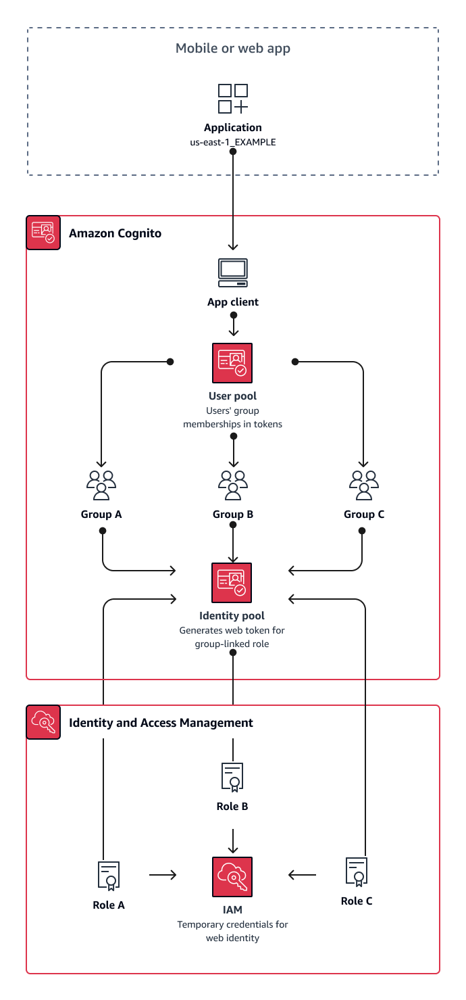

# User group multi-tenancy best

practices

Group-based multi-tenancy works best when your architecture requires Amazon Cognito user pools
with identity pools.

User pool [ID
and access tokens](amazon-cognito-user-pools-using-tokens-with-identity-providers.md#amazon-cognito-user-pools-using-tokens-with-identity-providers.title "amazon-cognito-user-pools-using-tokens-with-identity-providers.md#amazon-cognito-user-pools-using-tokens-with-identity-providers.title") contain a `cognito:groups` claim. Additionally,
ID tokens contain `cognito:roles` and `cognito:preferred_role`
claims. When the primary outcome of authentication in your app is temporary AWS
credentials from an identity pool, your users' group memberships can determine the [IAM role](iam-roles.md#iam-roles.title "iam-roles.md#iam-roles.title") and permissions that they receive.

As an example, consider three tenants that each store application assets in their own
Amazon S3 bucket. Assign the users of each tenant to an associated group, configure a
preferred role for the group, and grant that role read access to their bucket.

The following diagram shows tenants sharing an app client and a user pool, with
dedicated groups in the user pool that determine their eligibility for an IAM
role.

###### When to implement group multi-tenancy

When access to AWS resources is your primary concern. Groups in Amazon Cognito user pools are a
mechanism for role-based access control (RBAC). You can configure many groups in a
user pool and make complex RBAC decisions with group priority. Identity pools can
assign credentials for the role with the highest priority, any role in the groups
claim, or from other claims in a user's tokens.

###### Level of effort

The level of effort to maintain multi-tenancy with group membership alone is low.
However, to expand the role of user pool groups beyond the built-in capacity for
IAM role selection, you must build application logic that processes group
membership in users' tokens, and determine what to do in the client. You can
integrate Amazon Verified Permissions with your apps to make client-side authorization decisions.
Group identifiers aren't currently processed in Verified Permissions [IsAuthorizedWithToken](../../../verifiedpermissions/latest/apireference/API_IsAuthorizedWithToken.md "../../../verifiedpermissions/latest/apireference/API_IsAuthorizedWithToken.md") API operations, but you can [develop custom code](../../../verifiedpermissions/latest/userguide/identity-providers.md#identity-providers_other-idp "../../../verifiedpermissions/latest/userguide/identity-providers.md#identity-providers_other-idp") that parses the contents of tokens, including
group-membership claims.
