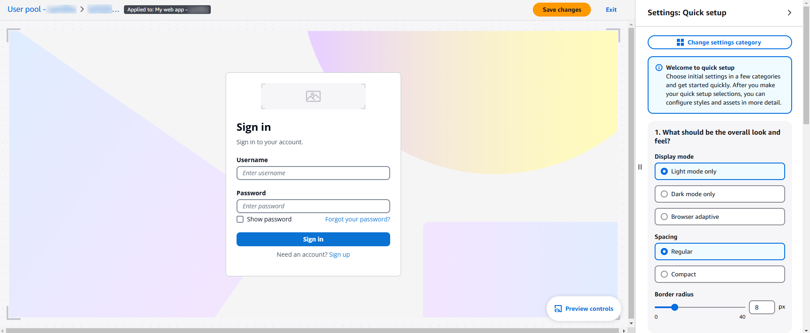
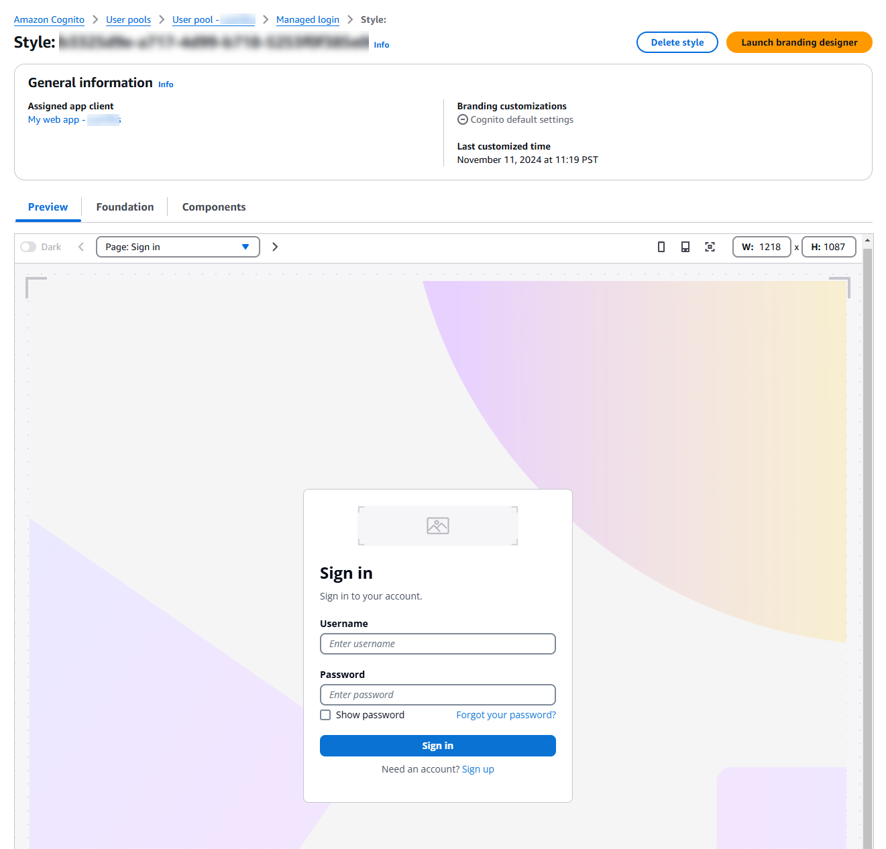

# The branding editor and customizing

managed login

The branding editor is a visual design and editing tool for your managed login
webpages. It's built in to the Amazon Cognito console. In the branding editor, you start with a
preview of your login pages and can proceed into a quick-setup option or a detailed view
with advanced options. You can modify and preview style parameters or add a custom
background image and logo. You can configure light
mode and dark
mode.


To begin, create a style that you can apply to your user pool or an app client.

###### To get started with the branding editor

1. [Create a domain](cognito-user-pools-assign-domain.md "cognito-user-pools-assign-domain.md") from
   the **Domain** tab, or update your existing domain. Under
   **Branding version**, set your domain to use
   **Managed login**.
2. Delete the existing app client style, if any.
   1. In the **App clients** menu, select your app
      client.
   2. Under **Managed login style**, select the syle
      assigned to your app client.
   3. Choose **Delete style**. Confirm your
      selection.

3. Navigate to the **Managed login** menu in your user pool. If
   you haven't already, follow the prompt to select a [feature plan](cognito-sign-in-feature-plans.md "cognito-sign-in-feature-plans.md") that includes
   managed login. You can also select **Preview this feature** if
   you want to check out the branding editor without making changes.
4. Under **Styles**, choose **Create a
   style**.
5. Choose the app client that you want to assign your style to and select
   **Create**. You can also create a new app client.
6. The Amazon Cognito console launches the branding editor.
7. Choose a tab where you want to start editing, or select **Launch
   editor** and enter [quick setup](#branding-designer-quick-setup "#branding-designer-quick-setup"). The following tabs are available:

**Preview**

See how your current selections look in your managed login
pages.

**Foundation**

Set an overall theme, configure links to external identity
providers, and style form fields.

**Components**

Configure styles for headers, footers, and individual UI
elements. 8. To make choices about initial settings, enter quick setup. Select
**Change settings category** and choose **Quick
setup**. When you select **Proceed**, the branding
editor launches with a set of basic options for you to configure.

## Text and localization

You can't modify or localize text in the branding editor. Instead, add a
`lang` query parameter to the URL that you distribute to users. This
parameters causes your managed login pages to be localized into one of several
available languages. For more information, see [Managed login localization](cognito-user-pools-managed-login.md#managed-login-localization "cognito-user-pools-managed-login.md#managed-login-localization").

## Quick setup

The **Launch branding editor** button loads a visual editor for
your managed login configuration where you can select from a variety of primary
customization options. As you make selections, Amazon Cognito renders your managed login
changes in a preview window. To return to the detailed settings menu, select the
**Change settings category** button.

**What should be the overall look and feel?**

Configure basic theme settings for managed login.

**Display mode**

Choose a light-mode, dark-mode, or adaptive experience for
your managed login. The adaptive settings defers to the
user's browser preference when Amazon Cognito renders managed login.
When you choose a browser-adaptive mode, you can choose
different colors and logo images for light and dark
mode.

**Spacing**

Set the default spacing between elements in the
page.

**Border radius**

Set the rounding depth of the outer border of
elements.

**How should the page background look?**

**Background type**

The **Show image** checkbox indicates
whether you want a background image or to set a solid
background color.

1. To use an image, select **Show
   image** and choose a background image for
   light and dark modes. You can also set a dark-mode
   and light-mode **Page background
   color** for areas of the background that
   aren't covered by the image.
2. To use only a color for the background, deselect
   **Show image** and choose a
   light-mode and dark-mode **Page background
   color**.

**How should forms look?**

Configure settings for the form elements of managed login. Examples of
form items are login and code prompts.

**Horizontal alignment**

Set the horizontal alignment of form fields.

**Form logo**

Set the positioning of your logo image.

**Logo image**

Choose a logo image file to include in the form element
for light and dark modes. To upload an image, select the
**Logo image** dropdown, choose
**Add new asset**, and add a logo
file.

**Primary branding color**

Set a theme color for light and dark modes. This color
will be applied as the background color to all elements
classified as primary.

**How should headers look?**

Choose whether you want to include a header in your managed login
pages. The header can contain a logo image.

**Header logo**

Set the position of the logo image in your header.

**Logo image**

Choose a logo position and a logo image file to include in
the header. To upload an image, select the **Logo
image** dropdown, choose **Add new
asset**, and add a logo file.

**Header background color**

Set the light and dark mode colors for the background of
the header.

## Detailed settings

In the detailed settings view, you can modify individual components in the
**Foundation** and **Components**. The
**Preview** tab displays a preview of managed login in the
current context with your customizations.



To enter the visual editor for a component, choose the edit icon in the tile for
the component. From the theme studio editor, you can switch between components with
the **Change setting category** button.

### Foundation

###### App style

Configure the basics of your managed login configuration. This category
has settings for the overall theme, text spacing, and the page header and
footer.

**Display mode**

Choose a light-mode, dark-mode, or adaptive experience for your
managed login pages. When you choose a browser-adaptive mode, you
can choose different colors and logo images for light and dark
mode.

**Spacing**

Set the default spacing between elements in the page.

###### Authentication behavior

Configure styles for the buttons that connect your users to external
identity providers (IdPs). This section includes the option **Domain
search input** to have managed login prompt users for an email
address and match them with their [SAML identity
provider identifier](cognito-user-pools-managing-saml-idp-naming.md "cognito-user-pools-managing-saml-idp-naming.md").

###### Form behavior

Configure styles for input forms: the positioning of inputs, colors, and
alignment of elements.

### Components

###### Buttons

Styles for buttons that Amazon Cognito renders on managed login pages.

###### Divider

Styles for divider lines and boundaries between managed login elements
like the input form and the external-provider sign-in selector.

###### Dropdown

Styles for dropdown menus.

###### Favicon

Styles for the image that Amazon Cognito provides for the tab and bookmark
icon.

###### Focus rings

Styles for the highlights that indicate a currently-selected input.

###### Form container

Styles for the elements that bound a form.

###### Global footer

Styles for the footer that Amazon Cognito displays at the bottom of managed login
pages.

###### Global header

Styles for the header that Amazon Cognito displays at the top of managed login
pages.

###### Indications

Styles for error and success messages.

###### Option controls

Styles for checkboxes, multi-selects, and other input prompts.

###### Page background

Styles for the overall background of managed login.

###### Inputs

Styles for form-field input prompts.

###### Link

Styles for hyperlinks in managed login pages.

###### Text for page

Styles for in-page text.

###### Text for field

Styles for the text around form inputs.

## API and SDK operations for managed login

branding

You can also apply branding to a managed login style with the API operations
[CreateManagedLoginBranding](../../../cognito-user-identity-pools/latest/APIReference/API_CreateManagedLoginBranding.md "../../../cognito-user-identity-pools/latest/APIReference/API_CreateManagedLoginBranding.md") and [UpdateManagedLoginBranding](../../../cognito-user-identity-pools/latest/APIReference/API_UpdateManagedLoginBranding.md "../../../cognito-user-identity-pools/latest/APIReference/API_UpdateManagedLoginBranding.md"). These operations are ideal for creating
identical or slightly-modified versions of a branding style for another app client
or user pool. Query the managed login branding of an existing style with the API
operation [DescribeManagedLoginBranding](../../../cognito-user-identity-pools/latest/APIReference/API_DescribeManagedLoginBranding.md "../../../cognito-user-identity-pools/latest/APIReference/API_DescribeManagedLoginBranding.md"), then modify the output as needed and
apply it to another resource.

The `UpdateManagedLoginBranding` operation doesn't change the app
client that your style is applied to. It only updates the existing style that's
assigned to an app client. To completely replace the style for an app client, delete
the existing style with [DeleteManagedLoginBranding](../../../cognito-user-identity-pools/latest/APIReference/API_DeleteManagedLoginBranding.md "../../../cognito-user-identity-pools/latest/APIReference/API_DeleteManagedLoginBranding.md") and assign a new style with
`CreateManagedLoginBranding`. In the Amazon Cognito console, the same is true:
you must delete the existing style and create a new one.

Setting up managed login branding in an API or SDK request requires that your
settings be embedded in a JSON file that's converted to a `Document`
datatype. The following is guidance for images that you can add and for generating
programmatic requests to configure a branding style.

### Image assets

[CreateManagedLoginBranding](../../../cognito-user-identity-pools/latest/APIReference/API_CreateManagedLoginBranding.md "../../../cognito-user-identity-pools/latest/APIReference/API_CreateManagedLoginBranding.md") and [UpdateManagedLoginBranding](../../../cognito-user-identity-pools/latest/APIReference/API_UpdateManagedLoginBranding.md "../../../cognito-user-identity-pools/latest/APIReference/API_UpdateManagedLoginBranding.md") include an `Assets`
parameter. This parameter is an array of image files in base64-encoded binary
format.

###### Note

Programmatic requests that create or update branding style must have a
request size of no more than 2 MB. The assets in your request might make it
exceed this limit. If this is the case, break your request up into multiple
`UpdateManagedLoginBranding` requests for groups of
parameters that don't exceed the maximum request size. These requests don't
result in unspecified parameters being set to default, so you can send
partial requests without any effect on existing settings.

Some assets have limitations on the filetypes that you can submit.

| Asset                  | Accepted file extensions |
| ---------------------- | ------------------------ |
| FAVICON_ICO            | ico                      |
| FAVICON_SVG            | svg                      |
| EMAIL_GRAPHIC          | png, svg, jpeg           |
| SMS_GRAPHIC            | png, svg, jpeg           |
| AUTH_APP_GRAPHIC       | png, svg, jpeg           |
| PASSWORD_GRAPHIC       | png, svg, jpeg           |
| PASSKEY_GRAPHIC        | png, svg, jpeg           |
| PAGE_HEADER_LOGO       | png, svg, jpeg           |
| PAGE_HEADER_BACKGROUND | png, svg, jpeg           |
| PAGE_FOOTER_LOGO       | png, svg, jpeg           |
| PAGE_FOOTER_BACKGROUND | png, svg, jpeg           |
| PAGE_BACKGROUND        | png, svg, jpeg           |
| FORM_BACKGROUND        | png, svg, jpeg           |
| FORM_LOGO              | png, svg, jpeg           |
| IDP_BUTTON_ICON        | ico, svg                 |

Files of the SVG type support the following attributes and elements.

Attributes

```
accent-height, accumulate, additivive, alignment-baseline, ascent, attributename, attributetype, azimuth, basefrequency, baseline-shift, begin, bias, by, class, clip, clip-path, clip-rule, color, color-interpolation, color-interpolation-filters, color-profile, color-rendering, cx, cy, d, dx, dy, diffuseconstant, direction, display, divisor, dur, edgemode, elevation, end, fill, fill-opacity, fill-rule, filter, filterunits, flood-color, flood-opacity, font-family, font-size, font-size-adjust, font-stretch, font-style, font-variant, font-weight, fx, fy, g1, g2, glyph-name, glyphref, gradientunits, gradienttransform, height, href, id, image-rendering, in, in2, k, k1, k2, k3, k4, kerning, keypoints, keysplines, keytimes, lang, lengthadjust, letter-spacing, kernelmatrix, kernelunitlength, lighting-color, local, marker-end, marker-mid, marker-start, markerheight, markerunits, markerwidth, maskcontentunits, maskunits, max, mask, media, method, mode, min, name, numoctaves, offset, operator, opacity, order, orient, orientation, origin, overflow, paint-order, path, pathlength, patterncontentunits, patterntransform, patternunits, points, preservealpha, preserveaspectratio, r, rx, ry, radius, refx, refy, repeatcount, repeatdur, restart, result, rotate, scale, seed, shape-rendering, specularconstant, specularexponent, spreadmethod, stddeviation, stitchtiles, stop-color, stop-opacity, stroke-dasharray, stroke-dashoffset, stroke-linecap, stroke-linejoin, stroke-miterlimit, stroke-opacity, stroke, stroke-width, style, surfacescale, tabindex, targetx, targety, transform, text-anchor, text-decoration, text-rendering, textlength, type, u1, u2, unicode, values, viewbox, visibility, vert-adv-y, vert-origin-x, vert-origin-y, width, word-spacing, wrap, writing-mode, xchannelselector, ychannelselector, x, x1, x2, xmlns, y, y1, y2, z, zoomandpan
```

Elements

```
svg, a, altglyph, altglyphdef, altglyphitem, animatecolor, animatemotion, animatetransform, audio, canvas, circle, clippath, defs, desc, ellipse, filter, font, g, glyph, glyphref, hkern, image, line, lineargradient, marker, mask, metadata, mpath, path, pattern, polygon, polyline, radialgradient, rect, stop, style, switch, symbol, text, textpath, title, tref, tspan, video, view, vkern, feBlend, feColorMatrix, feComponentTransfer, feComposite, feConvolveMatrix, feDiffuseLighting, feDisplacementMap, feDistantLight, feFlood, feFuncA, feFuncB, feFuncG, feFuncR, feGaussianBlur, feMerge, feMergeNode, feMorphology, feOffset, fePointLight, feSpecularLighting, feSpotLight, feTile, feTurbulence
```

### Tools for managed login branding

operations

Amazon Cognito manages a file in the [JSON-Schema format](https://json-schema.org/docs "https://json-schema.org/docs") for the managed-login branding settings object.
The following is how to programmatically update your branding style.

###### To update branding in the user pools API

1. In the Amazon Cognito console, create a default managed login branding style
   from the **Managed login** menu of your user pool.
   Assign it to an app client.
2. Record the ID of the app client that you created the style for, for
   example `1example23456789`.
3. Retrieve the settings for the branding style with a [DescribeManagedLoginBrandingByClient](../../../cognito-user-identity-pools/latest/APIReference/API_DescribeManagedLoginBrandingByClient.md "../../../cognito-user-identity-pools/latest/APIReference/API_DescribeManagedLoginBrandingByClient.md") API request with
   `ReturnMergedResources` set to `true`. The
   following is an example request body.

```
{
   "ClientId": "1example23456789",
   "ReturnMergedResources": true,
   "UserPoolId": "us-east-1_EXAMPLE"
}
```

4. Modify the output of `DescribeManagedLoginBrandingByClient`
   with your customizations.
   1. The response body is wrapped in a
      `ManagedLoginBranding` element that isn't part of
      the syntax for create and update operations. Remove this top
      level of the JSON object.
   2. To replace images, replace the `Bytes` value with
      the Base64-encoded binary data of each image file.
   3. To update settings, modify the output of the
      `Settings` object and include it in your next
      request. Amazon Cognito ignores any values in your `Settings`
      object that aren't in the schema that you receive in your API
      response.

5. Use the updated response body in a [CreateManagedLoginBranding](../../../cognito-user-identity-pools/latest/APIReference/API_CreateManagedLoginBranding.md "../../../cognito-user-identity-pools/latest/APIReference/API_CreateManagedLoginBranding.md") or UpdateManagedLoginBranding request. If this request exceeds
   2 MB in size, separate it out into multiple requests. These operations
   work in a `PATCH` model where original settings remain
   unchanged unless you specify otherwise.
