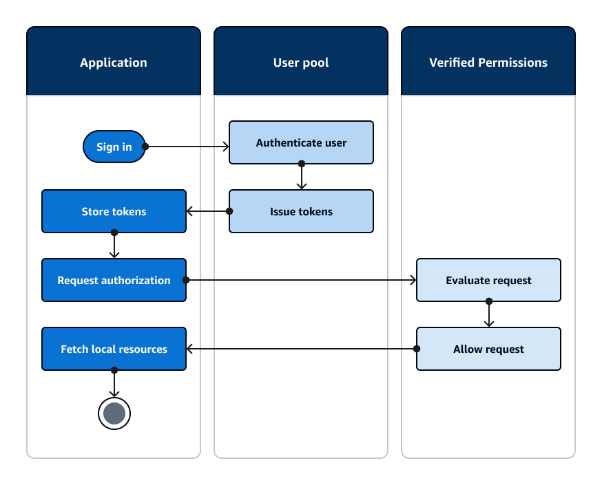

# Authorizing access to client or server resources with

Amazon Verified Permissions

Your app can pass the tokens from a signed-in user to [Amazon Verified Permissions](../../../verifiedpermissions/latest/userguide/what-is-avp.md "../../../verifiedpermissions/latest/userguide/what-is-avp.md"). Verified Permissions is a
scalable, fine-grained permissions management and authorization service for
applications that you've built. An Amazon Cognito user pool can be an identity source to a Verified Permissions policy
store. Verified Permissions makes authorization decisions for requested actions and resources, like
`GetPhoto` for `premium_badge.png`, from the principal and their
attributes in user pool tokens.

The following diagram shows how your application can pass a user's token to Verified Permissions in an
authorization request.

###### Get started with Amazon Verified Permissions

After you integrate your user pool with Verified Permissions, you gain a central source of granular
authorization for all of your Amazon Cognito apps. This removes the need for fine-grained security
logic that you would otherwise have to code and replicate between all of your apps. For more
information about authorization with Verified Permissions, see [Authorization with Amazon Verified Permissions](amazon-cognito-authorization-with-avp.md "amazon-cognito-authorization-with-avp.md").

Verified Permissions authorization requests require AWS credentials. You can implement some of the
following techniques to safely apply credentials to authorization requests.

- Operate a web application that can store secrets in the server backend.
- Acquire authenticated identity pool credentials.
- Proxy user requests through an access-token-authorized API, and append AWS
  credentials to the request.
