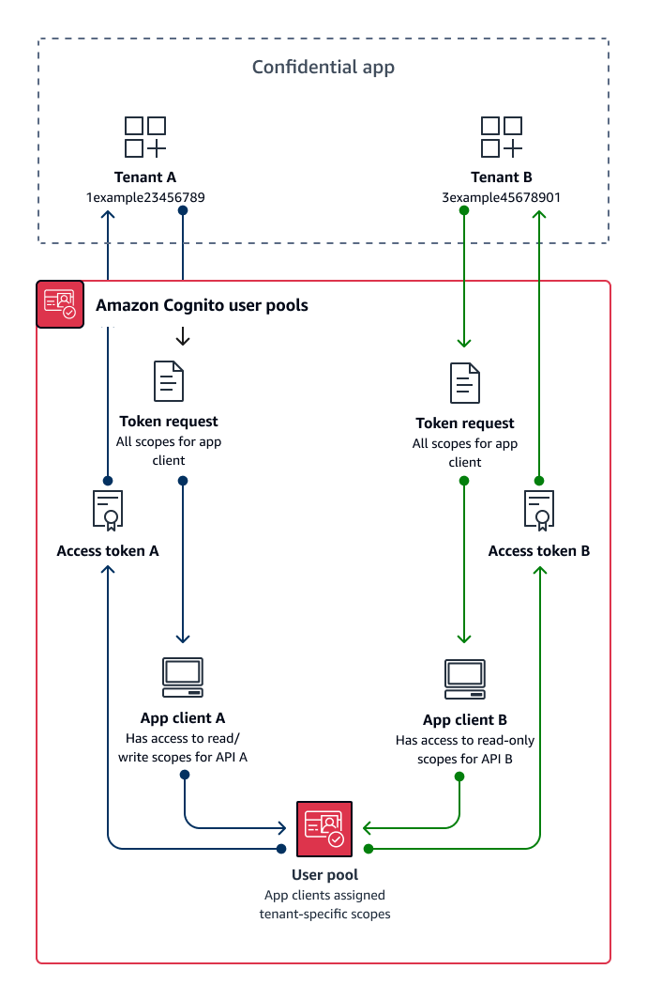

# Custom scope multi-tenancy best

practices

Amazon Cognito supports custom OAuth 2.0 scopes for [resource servers](cognito-user-pools-define-resource-servers.md "cognito-user-pools-define-resource-servers.md"). You
can implement app client multi-tenancy in users pools for machine-to-machine (M2M)
authorization models with custom scopes. Scope-based multi-tenancy reduces the effort
required to implement M2M multi-tenancy by defining access in your app client or
application configuration.

The following diagram illustrates one option for custom scope multi-tenancy. It shows
each tenant with a dedicated app client that has access to relevant scopes in a user
pool.



###### When to implement custom-scope multi-tenancy

When your usage is M2M authorization with client credentials in a confidential
client. As a best practice, create resource servers that are exclusive to an app
client. Custom scope multi-tenancy can be _request-dependent_ or _client-dependent_.

**Request-dependent**

Implement application logic to request only the scopes that match the
requirements of your tenant. For example, an app client might be able to
issue read and write access to API A and API B, but tenant application A
requests only the read scope for API A and the scope that indicates tenancy.
This model allows for more complex combinations of shared scopes between
tenants.

**Client-dependent**

Request all scopes assigned to an app client in your authorization
requests. To do this, omit the `scope` request parameter in your
request to the [Token endpoint](token-endpoint.md "token-endpoint.md"). This model allows for app clients to store the access indicators that
you want to add to your custom scopes.

In either case, your applications receive access tokens with scopes that indicate
their privileges for data sources that they depend on. Scopes can also present other
information to your application:

- Designate tenancy
- Contribute to request logging
- Indicate the APIs that the application is authorized to query
- Inform initial checks for active customers.

###### Level of effort

Custom-scope multi-tenancy requires a varying level of effort relative to the
scale of your application. You must devise application logic that allows your
applications to parse access tokens and make the appropriate API requests.

For example, a resource server scope comes in the format `[resource server
 identifier]/[name]`. The resource server identifier is unlikely to be relevant
to the authorization decision from the tenant scope, requiring the scope name to be
consistently parsed.

## Example resource

The following AWS CloudFormation template creates a user pool for custom-scope
multi-tenancy with one resource server and app client.

```
AWSTemplateFormatVersion: "2010-09-09"
Description: A sample template illustrating scope-based multi-tenancy
Resources:
  MyUserPool:
    Type: "AWS::Cognito::UserPool"
  MyUserPoolDomain:
    Type: AWS::Cognito::UserPoolDomain
    Properties:
      UserPoolId: !Ref MyUserPool
      # Note that the value for "Domain" must be unique across all of AWS.
      # In production, you may want to consider using a custom domain.
      # See: https://docs.aws.amazon.com/cognito/latest/developerguide/cognito-user-pools-add-custom-domain.html#cognito-user-pools-add-custom-domain-adding
      Domain: !Sub "example-userpool-domain-${AWS::AccountId}"
  MyUserPoolResourceServer:
    Type: "AWS::Cognito::UserPoolResourceServer"
    Properties:
      Identifier: resource1
      Name: resource1
      Scopes:
        - ScopeDescription: Read-only access
          ScopeName: readScope
      UserPoolId: !Ref MyUserPool
  MyUserPoolTenantBatch1ResourceServer:
    Type: "AWS::Cognito::UserPoolResourceServer"
    Properties:
      Identifier: TenantBatch1
      Name: TenantBatch1
      Scopes:
        - ScopeDescription: tenant1 identifier
          ScopeName: tenant1
        - ScopeDescription: tenant2 identifier
          ScopeName: tenant2
      UserPoolId: !Ref MyUserPool
  MyUserPoolClientTenant1:
    Type: "AWS::Cognito::UserPoolClient"
    Properties:
      AllowedOAuthFlows:
        - client_credentials
      AllowedOAuthFlowsUserPoolClient: true
      AllowedOAuthScopes:
        - !Sub "${MyUserPoolTenantBatch1ResourceServer}/tenant1"
        - !Sub "${MyUserPoolResourceServer}/readScope"
      GenerateSecret: true
      UserPoolId: !Ref MyUserPool
Outputs:
  UserPoolClientId:
    Description: User pool client ID
    Value: !Ref MyUserPoolClientTenant1
  UserPoolDomain:
    Description: User pool domain
    Value: !Sub "https://${MyUserPoolDomain}.auth.${AWS::Region}.amazoncognito.com"

```
