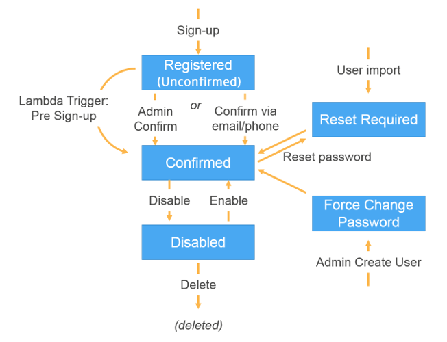

# Signing up and confirming user accounts

User accounts are added to your user pool in one of the following ways:

- The user signs up in your user pool's client app. This can be a mobile or web
  app.
- You can import the user's account into your user pool. For more information, see [Importing users into user pools from a
  CSV file](cognito-user-pools-using-import-tool.md "cognito-user-pools-using-import-tool.md").
- You can create the user's account in your user pool and invite the user to sign in. For
  more information, see [Creating user accounts as administrator](how-to-create-user-accounts.md "how-to-create-user-accounts.md").
  Users who sign themselves up must be confirmed before they can sign in. Imported and created
  users are already confirmed, but they must create their password the first time they sign in.
  The following sections explain the confirmation process and email and phone verification.

###### Passwords at sign-up

Amazon Cognito requires passwords from all users when they sign up, except under the following
conditions. If _all_ of these conditions are met, you can
omit passwords in sign-up operations.

1. [Passwordless sign-in](amazon-cognito-user-pools-authentication-flow-methods.md#amazon-cognito-user-pools-authentication-flow-methods-passwordless "amazon-cognito-user-pools-authentication-flow-methods.md#amazon-cognito-user-pools-authentication-flow-methods-passwordless") is active in your user pool and app client.
2. Your application is custom-built with authentication modules in an AWS SDK. Managed
   login and the hosted UI always require passwords.
3. Users provide attribute values for the passwordless sign-in methods—email or SMS
   message one-time passwords (OTPs)—that you permit. For example, if you allow sign-in
   with email and phone OTP, users can provide either a phone number or email address, but if
   you only allow sign-in with email, they must provide an email address.
4. Your user pool [automatically verifies](#allowing-users-to-sign-up-and-confirm-themselves "#allowing-users-to-sign-up-and-confirm-themselves") the attributes that users can use with passwordless
   sign-in.
5. For any given [SignUp](../../../cognito-user-identity-pools/latest/APIReference/API_SignUp.md "../../../cognito-user-identity-pools/latest/APIReference/API_SignUp.md")
   request, the user doesn't provide a value for the [Password](../../../cognito-user-identity-pools/latest/APIReference/API_SignUp.md#CognitoUserPools-SignUp-request-Password "../../../cognito-user-identity-pools/latest/APIReference/API_SignUp.md#CognitoUserPools-SignUp-request-Password") parameter.

## Overview of user account

confirmation

The following diagram illustrates the confirmation process:



A user account can be in any of the following states:

**Registered (Unconfirmed)**

The user has successfully signed up, but cannot sign in until the user account is
confirmed. The user is enabled but not confirmed in this state.

New users who sign themselves up start in this state.

**Confirmed**

The user account is confirmed and the user can sign in. When a user enters a code or
follows an email link to confirm their user account, that email or phone number is
automatically verified. The code or link is valid for 24 hours.

If the user account was confirmed by the administrator or a pre sign-up Lambda
trigger, there might not be a verified email or phone number associated with the
account.

**Password Reset Required**

The user account is confirmed, but the user must request a code and reset their
password before they can sign in.

User accounts that are imported by an administrator or developer start in this
state.

**Force Change Password**

The user account is confirmed and the user can sign in using a temporary password,
but on first sign-in, the user must change their password to a new value before doing
anything else.

User accounts that are created by an administrator or developer start in this
state.

**Disabled**

Before you can delete a user account, you must disable sign-in access for that
user.

###### More resources

- [Detecting and remediating inactive user accounts with Amazon Cognito](https://aws.amazon.com/blogs/security/detecting-and-remediating-inactive-user-accounts-with-amazon-cognito/ "https://aws.amazon.com/blogs/security/detecting-and-remediating-inactive-user-accounts-with-amazon-cognito/")

## Verifying contact

information at sign-up

When new users sign up in your app, you probably want them to provide at least one contact
method. For example, with your users' contact information, you might:

- Send a temporary password when a user chooses to reset their
  password.
- Notify users when their personal or financial information is updated.
- Send promotional messages, such as special offers or discounts.
- Send account summaries or billing reminders.

For use cases like these, it's important that you send your messages to a verified
destination. Otherwise, you might send your messages to an invalid email address or phone
number that was typed incorrectly. Or worse, you might send sensitive information to bad
actors who pose as your users.

To help ensure that you send messages only to the right individuals, configure your Amazon Cognito
user pool so that users must provide the following when they sign up:

1. An email address or phone number.
2. A verification code that Amazon Cognito sends to that email address or phone number. If 24
   hours have passed and your user's code or link is no longer valid, call the [ResendConfirmationCode](../../../cognito-user-identity-pools/latest/APIReference/API_ResendConfirmationCode.md "../../../cognito-user-identity-pools/latest/APIReference/API_ResendConfirmationCode.md") API operation to generate and send a new code or
   link.

By providing the verification code, a user proves that they have access to the mailbox or
phone that received the code. After the user provides the code, Amazon Cognito updates the information
about the user in your user pool by:

- Setting the user's status to `CONFIRMED`.
- Updating the user's attributes to indicate that the email address or phone number is
  verified.

To view this information, you can use the Amazon Cognito console. Or, you can use the
`AdminGetUser` API operation, the `admin-get-user` command with the
AWS CLI, or a corresponding action in one of the AWS SDKs.

If a user has a verified contact method, Amazon Cognito automatically sends a message to the user
when the user requests a password
reset.

### Other

actions that confirm and verify user attributes

The following user activity verifies user attributes. You're not required to set these
attributes to automatically verify: the listed actions mark them as verified in all
cases.

**Email address**

1. Successfully completing [passwordless authentication](amazon-cognito-user-pools-authentication-flow-methods.md#amazon-cognito-user-pools-authentication-flow-methods-passwordless "amazon-cognito-user-pools-authentication-flow-methods.md#amazon-cognito-user-pools-authentication-flow-methods-passwordless") with an email one-time password
   (OTP).
2. Successfully completing [multi-factor
   authentication (MFA)](user-pool-settings-mfa.md "user-pool-settings-mfa.md") with an email OTP.

**Phone number**

1. Successfully completing [passwordless authentication](amazon-cognito-user-pools-authentication-flow-methods.md#amazon-cognito-user-pools-authentication-flow-methods-passwordless "amazon-cognito-user-pools-authentication-flow-methods.md#amazon-cognito-user-pools-authentication-flow-methods-passwordless") with an SMS OTP.
2. Successfully completing [MFA](user-pool-settings-mfa.md "user-pool-settings-mfa.md") with
   an SMS OTP.

### To configure your user pool to require email or

phone verification

When you verify your users' email addresses and phone numbers, you ensure that you can
contact your users. Complete the following steps in the AWS Management Console to configure your user pool
to require that your users confirm their email addresses or phone numbers.

###### Note

If you don't yet have a user pool in your account, see [Getting started with user pools](getting-started-user-pools.md "getting-started-user-pools.md").

###### To configure your user pool

1. Navigate to the [Amazon Cognito console](https://console.aws.amazon.com/cognito/home "https://console.aws.amazon.com/cognito/home").
   If prompted, enter your AWS credentials.
2. From the navigation pane, choose **User Pools**. Choose an existing
   user pool from the list, or [create a user
   pool](cognito-user-pool-as-user-directory.md "cognito-user-pool-as-user-directory.md").
3. Choose the **Sign-up** menu and locate **Attribute
   verification and user account confirmation**. Choose
   **Edit**.
4. Under **Cognito-assisted verification and confirmation**, choose
   whether you will **Allow Cognito to automatically send messages to verify and
   confirm**. With this setting enabled, Amazon Cognito sends messages to the user contact
   attributes you choose when a user signs up, or you create a user profile. To verify
   attributes and confirm user profiles for sign-in, Amazon Cognito sends a code or link in messages
   to users. The users must then enter the code in your UI so that your app can confirm them
   in a `ConfirmSignUp` or `AdminConfirmSignUp` API request.

###### Note

You can also disable **Cognito-assisted verification and
confirmation** and use authenticated API actions or Lambda triggers to verify
attributes and confirm users.

If you choose this option, Amazon Cognito doesn't send verification codes when users sign up.
Choose this option if you are using a custom authentication flow that verifies at least
one contact method without using verification codes from Amazon Cognito. For example, you might
use a pre sign-up Lambda trigger that automatically verifies email addresses that belong
to a specific domain.

If you don't verify your users' contact information, they may be unable to use your
app. Remember that users require verified contact information to:

    * **Reset their passwords** — When a user
     chooses an option in your app that calls the `ForgotPassword` API action,
     Amazon Cognito sends a temporary password to the user's email address or phone number. Amazon Cognito
     sends this password only if the user has at least one verified contact
     method.
    * **Sign in by using an email address or phone number as an
     alias** — If you configure your user pool to allow these aliases,
     then a user can sign in with an alias only if the alias is verified. For more
     information, see [Customizing sign-in attributes](user-pool-settings-attributes.md#user-pool-settings-aliases "user-pool-settings-attributes.md#user-pool-settings-aliases").

5. Choose your **Attributes to verify**:

**Send SMS message, verify phone number**

Amazon Cognito sends a verification code in an SMS message when the user signs up. Choose
this option if you typically communicate with your users through SMS messages. For
example, you will want to use verified phone numbers if you send delivery
notifications, appointment confirmations, or alerts. User phone numbers will be the
verified attribute when accounts are confirmed; you must take additional action to
verify and communicate with user email addresses.

**Send email message, verify email address**

Amazon Cognito sends a verification code through an email message when the user signs up.
Choose this option if you typically communicate with your users through email. For
example, you will want to use verified email addresses if you send billing
statements, order summaries, or special offers. User email addresses will be the
verified attribute when accounts are confirmed; you must take additional action to
verify and communicate with user phone numbers.

**Send SMS message if phone number is available, otherwise send email message**

Choose this option if you don't require all users to have the same verified
contact method. In this case, the sign-up page in your app could ask users to verify
only their preferred contact method. When Amazon Cognito sends a verification code, it sends
the code to the contact method provided in the `SignUp` request from your
app. If a user provides both an email address and a phone number, and your app
provides both contact methods in the `SignUp` request, Amazon Cognito sends a
verification code only to the phone number.

If you require users to verify both an email address and a phone number, choose
this option. Amazon Cognito verifies one contact method when the user signs up, and your app
must verify the other contact method after the user signs in. For more information,
see [If you require users to confirm both email
addresses and phone numbers](#verification-email-plus-phone "#verification-email-plus-phone"). 6. Choose **Save changes**.

### Authentication flow with email or phone

verification

If your user pool requires users to verify their contact information, your app must
facilitate the following flow when a user signs up:

1. A user signs up in your app by entering a username, phone number and/or email
   address, and possibly other attributes.
2. The Amazon Cognito service receives the sign-up request from the app. After verifying that
   the request contains all attributes required for sign-up, the service completes the
   sign-up process and sends a confirmation code to the user's phone (in an SMS message) or
   email. The code is valid for 24 hours.
3. The service returns to the app that sign-up is complete and that the user account is
   pending confirmation. The response contains information about where the confirmation
   code was sent. At this point the user's account is in an unconfirmed state, and the
   user's email address and phone number are unverified.
4. The app can now prompt the user to enter the confirmation code. It is not necessary
   for the user to enter the code immediately. However, the user will not be able to sign
   in until after they enter the confirmation code.
5. The user enters the confirmation code in the app.
6. The app calls [`ConfirmSignUp`](../../../cognito-user-identity-pools/latest/APIReference/API_ConfirmSignUp.md "../../../cognito-user-identity-pools/latest/APIReference/API_ConfirmSignUp.md") to send the code to the Amazon Cognito service, which
   verifies the code and, if the code is correct, sets the user's account to the confirmed
   state. After successfully confirming the user account, the Amazon Cognito service automatically
   marks the attribute that was used to confirm (email address or phone number) as
   verified. Unless the value of this attribute is changed, the user will not have to
   verify it again.
7. At this point the user's account is in a confirmed state, and the user can sign
   in.

### If you require users to confirm both email

addresses and phone numbers

Amazon Cognito verifies only one contact method when a user signs up. In cases where Amazon Cognito must
choose between verifying an email address or phone number, it chooses to verify the phone
number by sending a verification code through SMS message. For example, if you configure
your user pool to allow users to verify either email addresses or phone numbers, and if your
app provides both of these attributes upon sign-up, Amazon Cognito verifies only the phone number.
After a user verifies their phone number, Amazon Cognito sets the user's status to
`CONFIRMED`, and the user is allowed to sign in to your app.

After the user signs in, your app can provide the option to verify the contact method
that wasn't verified during sign-up. To verify this second method, your app calls the
`VerifyUserAttribute` API action. Note that this action requires an
`AccessToken` parameter, and Amazon Cognito only provides access tokens for
authenticated users. Therefore, you can verify the second contact method only after the user
signs in.

If you require your users to verify both email addresses and phone numbers, do the
following:

1.  Configure your user pool to allow users to verify email address or phone
    numbers.
2.  In the sign-up flow for your app, require users to provide both an email address and
    a phone number. Call the [`SignUp`](../../../cognito-user-identity-pools/latest/APIReference/API_SignUp.md "../../../cognito-user-identity-pools/latest/APIReference/API_SignUp.md") API action, and provide the email address and phone
    number for the `UserAttributes` parameter. At this point, Amazon Cognito sends a
    verification code to the user's phone.
3.  In your app interface, present a confirmation page where the user enters the
    verification code. Confirm the user by calling the [`ConfirmSignUp`](../../../cognito-user-identity-pools/latest/APIReference/API_ConfirmSignUp.md "../../../cognito-user-identity-pools/latest/APIReference/API_ConfirmSignUp.md") API action. At this point, the user's status is
    `CONFIRMED`, and the user's phone number is verified, but the email address
    is not verified.
4.  Present the sign-in page, and authenticate the user by calling the [`InitiateAuth`](../../../cognito-user-identity-pools/latest/APIReference/API_InitiateAuth.md "../../../cognito-user-identity-pools/latest/APIReference/API_InitiateAuth.md") API action. After the user is authenticated,
    Amazon Cognito returns an access token to your app.
5.  Call the [`GetUserAttributeVerificationCode`](../../../cognito-user-identity-pools/latest/APIReference/API_GetUserAttributeVerificationCode.md "../../../cognito-user-identity-pools/latest/APIReference/API_GetUserAttributeVerificationCode.md") API action. Specify the
    following parameters in the request:

        * `AccessToken` – The access token returned by Amazon Cognito when the
         user signed in.
        * `AttributeName` – Specify `"email"` as the
         attribute value.

    Amazon Cognito sends a verification code to the user's email address.

6.  Present a confirmation page where the user enters the verification code. When the
    user submits the code, call the [`VerifyUserAttribute`](../../../cognito-user-identity-pools/latest/APIReference/API_VerifyUserAttribute.md "../../../cognito-user-identity-pools/latest/APIReference/API_VerifyUserAttribute.md") API action. Specify the following
    parameters in the request:

        * `AccessToken` – The access token returned by Amazon Cognito when the
         user signed in.
        * `AttributeName` – Specify `"email"` as the
         attribute value.
        * `Code` – The verification code that the user provided.

    At this point, the email address is verified.

## Allowing users to

sign up in your app but confirming them as a user pool administrator

You might not want your user pool to automatically send verification messages in your user
pool, but still want to allow anyone to sign up for an account. This model leaves room, for
example, for human review of new sign-up requests, and for batch validation and processing of
sign-ups. You can confirm new user accounts in the Amazon Cognito console or with the
IAM-authenticated API operation [AdminConfirmSignUp](../../../cognito-user-identity-pools/latest/APIReference/API_AdminConfirmSignUp.md "../../../cognito-user-identity-pools/latest/APIReference/API_AdminConfirmSignUp.md"). You can confirm user accounts as an administrator whether or
not your user pool sends verification messages.

You can only confirm a user self-service sign-up with this technique. To confirm a user
that you create as an administrator, create an [AdminSetUserPassword](../../../cognito-user-identity-pools/latest/APIReference/API_AdminSetUserPassword.md "../../../cognito-user-identity-pools/latest/APIReference/API_AdminSetUserPassword.md") API request with `Permanent` set to
`True`.

1. A user signs up in your app by entering a username, phone number and/or email address,
   and possibly other attributes.
2. The Amazon Cognito service receives the sign-up request from the app. After verifying that the
   request contains all attributes required for sign-up, the service completes the sign-up
   process and returns to the app that sign-up is complete, pending confirmation. At this
   point the user's account is in an unconfirmed state. The user cannot sign in until the
   account is confirmed.
3. Confirm the user's account. You must sign in to the AWS Management Console or sign your API request
   with AWS credentials to confirm the account.
   1. To confirm a user in the Amazon Cognito console, navigate to the **Users**
      menu, choose the user who you want to confirm, and from the
      **Actions** menu select **Confirm**.
   2. To confirm a user in the AWS API or CLI, create a [AdminConfirmSignUp](../../../cognito-user-identity-pools/latest/APIReference/API_AdminConfirmSignUp.md "../../../cognito-user-identity-pools/latest/APIReference/API_AdminConfirmSignUp.md") API request, or [admin-confirm-sign-up](../../../cli/latest/reference/cognito-idp/admin-confirm-sign-up.md "../../../cli/latest/reference/cognito-idp/admin-confirm-sign-up.md") in the AWS CLI.

4. At this point the user's account is in a confirmed state, and the user can sign
   in.

## Computing secret hash

values

Assign a client secret to your confidential app client as a best practice. When you assign
a client secret to your app client, your Amazon Cognito user pools API requests must include a hash that
includes the client secret in the request body. To validate your knowledge of the client
secret for the API operations in the following lists, concatenate the client secret with your
app client ID and your user's username, then base64-encode that string.

When your app signs in users to a client that has a secret hash, you can use the value of
any user pool sign-in attribute as the username element of the secret hash. When your app
requests new tokens in an authentication operation with `REFRESH_TOKEN_AUTH`, the
value of the username element depends on your sign-in attributes. When your user pool doesn’t
have `username` as a sign-in attribute, set the secret hash username value from the
user’s `sub` claim from their access or ID token. When `username` is a
sign-in attribute, set the secret hash username value from the `username`
claim.

The following Amazon Cognito user pools APIs accept a client-secret hash value in a `SecretHash`
parameter.

- [ConfirmForgotPassword](../../../cognito-user-identity-pools/latest/APIReference/API_ConfirmForgotPassword.md "../../../cognito-user-identity-pools/latest/APIReference/API_ConfirmForgotPassword.md")
- [ConfirmSignUp](../../../cognito-user-identity-pools/latest/APIReference/API_ConfirmSignUp.md "../../../cognito-user-identity-pools/latest/APIReference/API_ConfirmSignUp.md")
- [ForgotPassword](../../../cognito-user-identity-pools/latest/APIReference/API_ForgotPassword.md "../../../cognito-user-identity-pools/latest/APIReference/API_ForgotPassword.md")
- [ResendConfirmationCode](../../../cognito-user-identity-pools/latest/APIReference/API_ResendConfirmationCode.md "../../../cognito-user-identity-pools/latest/APIReference/API_ResendConfirmationCode.md")
- [SignUp](../../../cognito-user-identity-pools/latest/APIReference/API_SignUp.md "../../../cognito-user-identity-pools/latest/APIReference/API_SignUp.md")

Additionally, the following APIs accept a client-secret hash value in a
`SECRET_HASH` parameter, either in authentication parameters or in a challenge
response.

| API operation               | Parent parameter for SECRET_HASH                                                                                                                                                                                  |
| --------------------------- | ----------------------------------------------------------------------------------------------------------------------------------------------------------------------------------------------------------------- | ---------------------------------------------------------------------------------------------------------------------------------------------------------------------------------------------------------------------------------------------------------------------------------------------------------------------------------------------------------------------------------------------------------------------------------------------------------------------------------------------------------------------------------------------------------------------------------------------------------------------------------------------------------------------------------------------------------------------------------------------------------------------------------------------------------------------------------------------------------------------------------------------------------------------------------------------------------------------------------------------------------------------------------------------------------------------------------------------------------------------------------------- | -------------------------------------------------------------------------------------------------------------------------------------------------------------------------------------------------------------------------------------------------------------------------------------------------------------------------------------------------------------------------------------------------------------------------------------------------------------------------------------------------------------------------------------------------------------------------------------------------------------------------------------------------------------------------------------------------------------------------------------------------------------------------------------------------------------------------------------------------------------------------------------------------------------------------------------------------------------------------------------------------------------------------------------------------------------------------------------------------------------------------------------------------------------------------------------------------------------------------------------------------------------------------------------------------------------------------------------------------------------------------------------------------------------------------------------------------------------------------------------------------------------------------------------------------------------------------------------------------------------------------------------------------------------------------------------------------------------------------------------------------------------------------------------------------------------------------------------------------------------------------------------------------------------------------------------------------------------------------------------------------------------------------------------------------------------------------------------------------------------------------------------------------------------------------------------------------------------------------------------------------------------------------------------------------------------------------------------------------------------------------------------------------------------------------------------------------------------------------------------------------------------------------------------------------------------------------------------------------------------------------------------------------------------------------------------------------------------------------------------------------------------------------------------------------------------------------------------------------------------------------------------------------------------------------------------------------------------------------------------------------------------------------------------------------------------------------------------------------------------------------------------------------------------------------------------------------------------------------------------------------------------------------------------------------------------------------------------------------------------------------------------------------------------------------------------------------------------------------------------------------------------------------------------------------------------------------------------------------------------------------------------------------------------------------------------------------------------------------------------------------------------------------------------------------------------------------------------------------------------------------------------------------------------------------------------------------------------------------------------------------------------------------------------------------------------------------------------------------------------------------------------------------------------------------------------------------------------------------------------------------------------------------------------------------------------------------------------------------------------------------------------------------------------------------------------------------------------------------------------------------------------------------------------------------------------------------------------------------------------------------------------------------------------------------------------------------------------------------------------------------------------------------------------------------------------------------------------------------------------------------------------------------------------------------------------------------------------------------------------------------------------------------------------------------------------------------------------------------------------------------------------------------------------------------------------------------------------------------------------------------------------------------------------------------------------------------------------------------------------------------------------------------------------------------------------------------------------------------------------------------------------------------------------------------------------------------------------------------------------------------------------------------------------------------------------------------------------------------------------------------------------------------------------------------------------------------------------------------------------------------------------------------------------------------------------------------------------------------------------------------------------------------------------------------------------------------------------------------------------------------------------------------------------------------------------------------------------------------------------------------------------------------------------------------------------------------------------------------------------------------------------------------------------------------------------------------------------------------------------------------------------------------------------------------------------------------------------------------------------------------------------------------------------------------------------------------------------------------- | ---------------------------------------------------------------------------------------------------------------------------------------------------------------------------------------------------------------------------------------------------------------------------------------------------------------------------------------------------------------------------------------------------------------------------------------------------------------------------------------------------------------------------------------------------------------------------------------------------------------------------------------------------------------------------------------------------------------------------------------------------------------------------------------------------------------------------------------------------------------------------------------------------------------------------------------------------------------------------------------------------------------------------------------------------------------------------------------------------------------------------------------------------------------------------------------------------------------------------------------------------------------------------------------------------------------------------------------------------------------------------------------------------------------------------------------------------------------------------------------------------------------------------------------------------------------------------------------------------------------------------------------------------------------------------------------------------------------------------------------------------------------------------------------------------------------------------------------------------------------------------------------------------------------------------------------------------------------------------------------------------------------------------------------------------------------------------------------------------------------------------------------------------------------------------------------------------------------------------------------------------------------------------------------------------------------------------------------------------------------------------------------------------------------------------------------------------------------------------------------------------------------------------------------------------------------------------------------------------------------------------------------------------------------------------------------------------------------------------------------------------------------------------------------------------------------------------------------------------------------------------------------------------------------------------------------------------------------------------------------------------------------------------------------------------------------------------------------------------------------------------------------------------------------------------------------------------------------------------------------------------------------------------------------------------------------------------------------------------------------------------------------------------------------------------------------------------------------------------------------------------------------------------------------------------------------------------------------------------------------------------------------------------------------------------------------------------------------------------------------------------------------------------------------------------------------------------------------------------------------------------------------------------------------------------------------------------------------------------------------------------------------------------------------------------------------------------------------------------------------------------------------------------------------------------------------------------------------------------------------------------------------------------------------------------------------------------------------------------------------------------------------------------------------------------------------------------------------------------------------------------------------------------------------------------------------------------------------------------------------------------------------------------------------------------------------------------------------------------------------------------------------------------------------------------------------------------------------------------------------------------------------------------------------------------------------------------------------------------------------------------------------------------------------------------------------------------------------------------------------------------------------------------------------------------------------------------------------------------------------------------------------------------------------------------------------------------------------------------------------------------------------------------------------------------------------------------------------------------------------------------------------------------------------------------------------------------------------------------------------------------------------------------------------------------------------------------------------------------------------------------------------------------------------------------------------------------------------------------------------------------------------------------- |
| InitiateAuth                | AuthParameters                                                                                                                                                                                                    |
| AdminInitiateAuth           | AuthParameters                                                                                                                                                                                                    |
| RespondToAuthChallenge      | ChallengeResponses                                                                                                                                                                                                |
| AdminRespondToAuthChallenge | ChallengeResponses                                                                                                                                                                                                | The secret hash value is a Base 64-encoded keyed-hash message authentication code (HMAC) calculated using the secret key of a user pool client and username plus the client ID in the message. The following pseudocode shows how this value is calculated. In this pseudocode, `+` indicates concatenation, `HMAC_SHA256` represents a function that produces an HMAC value using HmacSHA256, and `Base64` represents a function that produces Base-64-encoded version of the hash output. `Base64 ( HMAC_SHA256 ( "Client Secret Key", "Username" + "Client Id" ) )` For a detailed overview of how to calculate and use the `SecretHash` parameter, see [How do I troubleshoot "Unable to verify secret hash for client <client-id>" errors from my Amazon Cognito user pools API?](https://aws.amazon.com/premiumsupport/knowledge-center/cognito-unable-to-verify-secret-hash/ "https://aws.amazon.com/premiumsupport/knowledge-center/cognito-unable-to-verify-secret-hash/") in the AWS Knowledge Center. You can use the following code examples in your server-side app code. Shell ``` echo -n "`[username]``[app client ID]`" | openssl dgst -sha256 -hmac `[app client secret]` -binary                                                                                                                                                                                                                                                                                                                                                                                                                                                                                                                                                                                                                                                                                                                                                                                                                                                                                                                                                                                                                                                                                                                                                                                                                                                                                                                                                                                                                                                                                                                                                                                                                                                                                                                                                                                                                                                                                                                                                                                                                                                                                                                                                                                                                                                                                                                                                                                                                                                                                                                                                                                                                                                                                                                                                                                                                                                                                                                                                                                                                                                                                                                                                                                                                                                                                                                                                                                                                                                                                                                                                                                                                                                                                                                                                                                                                                                                                                                                                                                                                                                                                                                                                                                                                                                                                                                                                                                                                                                                                                                                                                                                                                                                                                                                                                                                                                                                                                                                                                                                                                                                                                                                                                                                                                                                                                                                                                                                                                                                                                                                                                                                                                                                                                                                                                                                                                                                                                                                                                                                                                                                                                                                                                                                                                                                                                                                                                                                                                                                                                                                                                                                                                                                   | openssl enc -base64 `Java` import javax.crypto.Mac; import javax.crypto.spec.SecretKeySpec; public static String calculateSecretHash(String userPoolClientId, String userPoolClientSecret, String userName) { final String HMAC_SHA256_ALGORITHM = "HmacSHA256"; SecretKeySpec signingKey = new SecretKeySpec( userPoolClientSecret.getBytes(StandardCharsets.UTF_8), HMAC_SHA256_ALGORITHM); try { Mac mac = Mac.getInstance(HMAC_SHA256_ALGORITHM); mac.init(signingKey); mac.update(userName.getBytes(StandardCharsets.UTF_8)); byte[] rawHmac = mac.doFinal(userPoolClientId.getBytes(StandardCharsets.UTF_8)); return Base64.getEncoder().encodeToString(rawHmac); } catch (Exception e) { throw new RuntimeException("Error while calculating "); } } `Python` import sys import hmac, hashlib, base64 username = sys.argv[1] app_client_id = sys.argv[2] key = sys.argv[3] message = bytes(sys.argv[1]+sys.argv[2],'utf-8') key = bytes(sys.argv[3],'utf-8') secret_hash = base64.b64encode(hmac.new(key, message, digestmod=hashlib.sha256).digest()).decode() print("SECRET HASH:",secret_hash) ```## Confirming user accounts without verifying email or phone number The pre sign-up Lambda trigger can be used to auto-confirm user accounts at sign-up, without requiring a confirmation code or verifying email or phone number. Users who are confirmed this way can immediately sign in without having to receive a code. You can also mark a user's email or phone number verified through this trigger. ###### Note While this approach is convenient for users when they're getting started, we recommend auto-verifying at least one of email or phone number. Otherwise the user can be left unable to recover if they forget their password. If you don't require the user to receive and enter a confirmation code at sign-up and you don't auto-verify email and phone number in the pre sign-up Lambda trigger, you risk not having a verified email address or phone number for that user account. The user can verify the email address or phone number at a later time. However, if the user forgets his or her password and doesn't have a verified email address or phone number, the user is locked out of the account, because the forgot-password flow requires a verified email or phone number in order to send a verification code to the user. ## Verifying when users change their email or phone number In user pools that you configure with multiple sign-in names, users can enter a phone number or an email address as their username at sign-in. When they update their email address or phone number in your app, Amazon Cognito can immediately send them a message with a code that verifies their ownership of the new attribute value. To enable automatic sending of these verification codes, see [Configuring email or phone verification](user-pool-settings-email-phone-verification.md "user-pool-settings-email-phone-verification.md"). Users who receive a verification code must provide that code back to Amazon Cognito in a [VerifyUserAttribute](../../../cognito-user-identity-pools/latest/APIReference/API_VerifyUserAttribute.md "../../../cognito-user-identity-pools/latest/APIReference/API_VerifyUserAttribute.md") request. After they provide the code, their attribute is marked as verified. Typically, when users update their email address or phone number, you'll want to verify that they own the new value before they can use it to sign in and receive messages. User pools have a configurable option that determines whether users must verify updates to their email address or phone number. This option is the user pool property`AttributesRequireVerificationBeforeUpdate`. Configure it in a [CreateUserPool](../../../cognito-user-identity-pools/latest/APIReference/API_CreateUserPool.md#CognitoUserPools-CreateUserPool-request-UserAttributeUpdateSettings "../../../cognito-user-identity-pools/latest/APIReference/API_CreateUserPool.md#CognitoUserPools-CreateUserPool-request-UserAttributeUpdateSettings") or [UpdateUserPool](../../../cognito-user-identity-pools/latest/APIReference/API_UpdateUserPool.md#CognitoUserPools-UpdateUserPool-request-UserAttributeUpdateSettings "../../../cognito-user-identity-pools/latest/APIReference/API_UpdateUserPool.md#CognitoUserPools-UpdateUserPool-request-UserAttributeUpdateSettings") request, or with the setting **Keep original attribute value active when an update is pending** in the **Sign-up** menu of the Amazon Cognito console. How your user pool treats updates to email addresses and phone numbers is connected to the username configuration of your user pool. User pool usernames can be in a *username attributes* configuration where sign-in names are email address, phone number, or both. They can also be in an *alias attributes* configuration where the `username`attribute is a sign-in name along with email address, phone number, or preferred username as alternative sign-in names. For more information, see [Customizing sign-in attributes](user-pool-settings-attributes.md#user-pool-settings-aliases "user-pool-settings-attributes.md#user-pool-settings-aliases"). You can also use a custom message Lambda trigger to customize the verification message. For more information, see [Custom message Lambda trigger](user-pool-lambda-custom-message.md "user-pool-lambda-custom-message.md"). When a user's email address or phone number is unverified, your application should inform the user that they must verify the attribute, and provide a button or link for users to enter their verification code. The following table describes how`AttributesRequireVerificationBeforeUpdate` and alias settings determine the outcome when users change the value of their sign-in attributes. |
| Username configuration      | Behavior when users must verify new attributes                                                                                                                                                                    | Behavior when users aren't required to verify new attributes                                                                                                                                                                                                                                                                                                                                                                                                                                                                                                                                                                                                                                                                                                                                                                                                                                                                                                                                                                                                                                                                             |
| ---                         | ---                                                                                                                                                                                                               | ---                                                                                                                                                                                                                                                                                                                                                                                                                                                                                                                                                                                                                                                                                                                                                                                                                                                                                                                                                                                                                                                                                                                                      |
| Username attributes         | Original attribute remains verified, eligible for sign-in, and at original value. When user verifies new value, Amazon Cognito updates the attribute value, marks it verified, and makes it eligible for sign-in. | Amazon Cognito updates attribute to new value. New value is eligible for sign-in. When user verifies new value, Amazon Cognito marks it as verified.                                                                                                                                                                                                                                                                                                                                                                                                                                                                                                                                                                                                                                                                                                                                                                                                                                                                                                                                                                                     |
| Alias attributes            | Original attribute remains verified, eligible for sign-in, and at original value. When user verifies new value, Amazon Cognito updates the attribute value, marks it verified, and makes it eligible for sign-in. | Amazon Cognito updates attribute to new value. Neither original or new attribute value is eligible for sign-in. When user verifies new value, Amazon Cognito updates the attribute value, marks it verified, and makes it eligible for sign-in.                                                                                                                                                                                                                                                                                                                                                                                                                                                                                                                                                                                                                                                                                                                                                                                                                                                                                          | ###### Example 1 User 1 signs into your application with the email address `user1@example.com` and has the username `user1` (alias attributes). Your user pool is configured to verify updates to sign-in attributes and to automatically send verification messages. They request to update their email address to `user1+foo@example.com`. They receive a verification email at `user1+foo@example.com` and _can sign in again_ only with the email address `user1@example.com`. Later, they enter their verification code and can sign in again only with the email address `user1+foo@example.com`. ###### Example 2 User 2 signs into your application with the email address `user2@example.com` and has a username (alias attributes). Your user pool is configured _not_ to verify updates to sign-in attributes and to automatically send verification messages. They request to update their email address to `user2+bar@example.com`. They receive a verification email at `user2+bar@example.com` and _can't sign in again_. Later, they enter their verification code and can sign in again only with the email address `user2+bar@example.com`. ###### Example 3 User 3 signs into your application with the email address `user3@example.com` and doesn't have a username (username attributes). Your user pool is configured _not_ to verify updates to sign-in attributes and to automatically send verification messages. They request to update their email address to `user3+baz@example.com`. They receive a verification email at `user3+baz@example.com`, but they _can immediately sign in_ with no additional action taken with the verification code. ## Confirmation and verification processes for user accounts created by administrators or developers User accounts that are created by an administrator or developer are already in the confirmed state, so users aren't required to enter a confirmation code. The invitation message that the Amazon Cognito service sends to these users includes the username and a temporary password. The user is required to change the password before signing in. For more information, see the [Customize email and SMS messages](how-to-create-user-accounts.md#creating-a-new-user-customize-messages "how-to-create-user-accounts.md#creating-a-new-user-customize-messages") in [Creating user accounts as administrator](how-to-create-user-accounts.md "how-to-create-user-accounts.md") and the Custom Message trigger in [Customizing user pool workflows with Lambda triggers](cognito-user-pools-working-with-lambda-triggers.md "cognito-user-pools-working-with-lambda-triggers.md"). ## Confirmation and verification processes for imported user accounts User accounts that are created by using the user import feature in the AWS Management Console, CLI, or API (see [Importing users into user pools from a CSV file](cognito-user-pools-using-import-tool.md "cognito-user-pools-using-import-tool.md")) are already in the confirmed state, so users aren't required to enter a confirmation code. No invitation message is sent. However, imported user accounts require users to first request a code by calling the `ForgotPassword` API and then create a password using the delivered code by calling `ConfirmForgotPassword` API before they sign in. For more information, see [Requiring imported users to reset their passwords](cognito-user-pools-using-import-tool.md#cognito-user-pools-using-import-tool-password-reset "cognito-user-pools-using-import-tool.md#cognito-user-pools-using-import-tool-password-reset"). Either the user's email or phone number must be marked as verified when the user account is imported, so no verification is required when the user signs in. ## Sending emails while testing your app Amazon Cognito sends email messages to your users when they create and manage their accounts in the client app for your user pool. If you configure your user pool to require email verification, Amazon Cognito sends an email when: <br>• A user signs up. <br>• A user updates their email address. <br>• A user performs an action that calls the `ForgotPassword` API action. <br>• You create a user account as an administrator. Depending on the action that initiates the email, the email contains a verification code or a temporary password. Your users must receive these emails and understand the message. Otherwise, they might be unable to sign in and use your app. To ensure that emails send successfully and that the message looks correct, test the actions in your app that initiate email deliveries from Amazon Cognito. For example, by using the sign-up page in your app, or by using the `SignUp` API action, you can initiate an email by signing up with a test email address. When you test in this way, remember the following: ###### Important When you use an email address to test actions that initiate emails from Amazon Cognito, don't use a fake email address (one that has no mailbox). Use a real email address that will receive the email from Amazon Cognito without creating a _hard bounce_. A hard bounce occurs when Amazon Cognito fails to deliver the email to the recipient's mailbox, which always happens if the mailbox doesn't exist. Amazon Cognito limits the number of emails that can be sent by AWS accounts that persistently incur hard bounces. When you test actions that initiate emails, use one of the following email addresses to prevent hard bounces: <br>• An address for an email account that you own and use for testing. When you use your own email address, you receive the email that Amazon Cognito sends. With this email, you can use the verification code to test the sign-up experience in your app. If you customized the email message for your user pool, you can check that your customizations look correct. <br>• The mailbox simulator address, *success@simulator.amazonses.com*. If you use the simulator address, Amazon Cognito sends the email successfully, but you're not able to view it. This option is useful when you don't need to use the verification code and you don't need to check the email message. <br>• The mailbox simulator address with the addition of an arbitrary label, such as *success+user1@simulator.amazonses.com* or *success+user2@simulator.amazonses.com*. Amazon Cognito emails these addresses successfully, but you're not able to view the emails that it sends. This option is useful when you want to test the sign-up process by adding multiple test users to your user pool, and each test user has a unique email address. |
