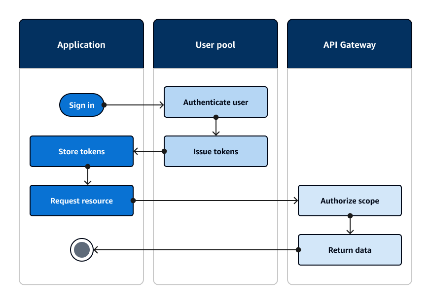

# Accessing resources

with API Gateway after sign-in

A common use of Amazon Cognito user pools tokens is to authorize requests to an [API Gateway REST
API](../../../apigateway/latest/developerguide/apigateway-integrate-with-cognito.md "../../../apigateway/latest/developerguide/apigateway-integrate-with-cognito.md"). The OAuth 2.0 scopes in access tokens can authorize a method and path, like
`HTTP GET` for `/app_assets`. ID tokens can serve as generic
authentication to an API and can pass user attributes to the backend service. API Gateway has
additional custom authorization options like [JWT authorizers for HTTP
APIs](../../../apigateway/latest/developerguide/http-api-jwt-authorizer.md "../../../apigateway/latest/developerguide/http-api-jwt-authorizer.md") and [Lambda
authorizers](../../../apigateway/latest/developerguide/apigateway-use-lambda-authorizer.md "../../../apigateway/latest/developerguide/apigateway-use-lambda-authorizer.md") that can apply more fine-grained logic.

The following diagram illustrates an application that is gaining access to a REST API with
the OAuth 2.0 scopes in an access token.

Your
app must collect the tokens from authenticated sessions and add them as bearer tokens to an
`Authorization` header in the request. Configure the authorizer that you
configured for the API, path, and method to evaluate token contents. API Gateway returns data only
if the request matches the conditions that you set up for your authorizer.

Some potential ways that API Gateway API can approve access from an application are:

- The access token is valid, isn't expired, and contains the correct OAuth 2.0 scope.
  The [Amazon Cognito user pools
  authorizer for a REST API](../../../apigateway/latest/developerguide/apigateway-integrate-with-cognito.md "../../../apigateway/latest/developerguide/apigateway-integrate-with-cognito.md") is a common implementation with a low barrier to
  entry. You can also evaluate the body, query string parameters, and headers of a request
  to this type of authorizer.
- The ID token is valid and isn't expired. When you pass an ID token to an Amazon Cognito
  authorizer, you can perform additional validation of the ID token contents on your
  application server.
- A group, claim, attribute, or role in an access or ID token meets the requirements
  that you define in a Lambda function. A [Lambda
  authorizer](../../../apigateway/latest/developerguide/apigateway-use-lambda-authorizer.md "../../../apigateway/latest/developerguide/apigateway-use-lambda-authorizer.md") parses the token in the request header and evaluates it for an
  authorization decision. You can construct custom logic in your function or make an API
  request to [Amazon Verified Permissions](../../../verifiedpermissions/latest/userguide/what-is-avp.md "../../../verifiedpermissions/latest/userguide/what-is-avp.md").
  You can also authorize requests to an [AWS AppSync GraphQL API](../../../appsync/latest/devguide/security-authz.md#amazon-cognito-user-pools-authorization "../../../appsync/latest/devguide/security-authz.md#amazon-cognito-user-pools-authorization") with tokens from a user pool.
