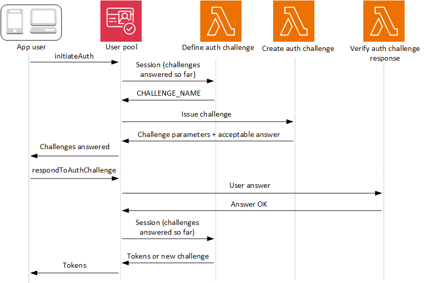

# Custom authentication challenge Lambda

triggers

As you build out your authentication flows for your Amazon Cognito user pool, you might find that
you want to extend your authentication model beyond the built-in flows. One common use case
for the custom challenge triggers is to implement additional security checks beyond
username, password, and multi-factor authentication (MFA). A custom challenge is any
question and response you can generate in a Lambda-supported programming language. For
example, you might want to require users to solve a CAPTCHA or answer a security question
before being allowed to authenticate. Another potential need is to integrate with
specialized authentication factors or devices. Or you might have already developed software
that authenticates users with a hardware security key or a biometric device. The definition
of authentication success for a custom challenge is whatever answer your Lambda function
accepts as correct: a fixed string, for example, or a satisfactory response from an external
API.

You can start authentication with your custom challenge and control the authentication
process entirely, or you can perform username-password authentication before your
application receives your custom challenge.

The custom authentication challenge Lambda trigger:

**[Defines](user-pool-lambda-define-auth-challenge.md "user-pool-lambda-define-auth-challenge.md")**

Initiates a challenge sequence. Determines whether you want to initiate a new
challenge, mark authentication as complete, or halt the authentication
attempt.

**[Creates](user-pool-lambda-create-auth-challenge.md "user-pool-lambda-create-auth-challenge.md")**

Issues the question to your application that the user must answer. This
function might present a security question or a link to a CAPTCHA that your
application should display to your user.

**[Verifies](user-pool-lambda-verify-auth-challenge-response.md "user-pool-lambda-verify-auth-challenge-response.md")**

Knows the expected answer and compares it to the answer your application
provides in the challenge response. The function might call the API of your
CAPTCHA service to retrieve the expected results of your user's attempted
solution.

These three Lambda functions chain together to present an authentication mechanism that is
completely within your control and of your own design. Because custom authentication
requires application logic in your client and in the Lambda functions, you can't process
custom authentication within managed login. This authentication system requires additional
developer effort. Your application must perform the authentication flow with the user pools
API and handle the resulting challenge with a custom-built login interface that renders the
question at the center of the custom authentication challenge.


For more information about implementing custom authentication, see [Custom authentication flow and
challenges](amazon-cognito-user-pools-authentication-flow-methods.md#Custom-authentication-flow-and-challenges "amazon-cognito-user-pools-authentication-flow-methods.md#Custom-authentication-flow-and-challenges")

Authentication between the API operations [InitiateAuth](../../../cognito-user-identity-pools/latest/APIReference/API_InitiateAuth.md "../../../cognito-user-identity-pools/latest/APIReference/API_InitiateAuth.md") or [AdminInitiateAuth](../../../cognito-user-identity-pools/latest/APIReference/API_AdminInitiateAuth.md "../../../cognito-user-identity-pools/latest/APIReference/API_AdminInitiateAuth.md"), and [RespondToAuthChallenge](../../../cognito-user-identity-pools/latest/APIReference/API_RespondToAuthChallenge.md "../../../cognito-user-identity-pools/latest/APIReference/API_RespondToAuthChallenge.md") or [AdminRespondToAuthChallenge](../../../cognito-user-identity-pools/latest/APIReference/API_AdminRespondToAuthChallenge.md "../../../cognito-user-identity-pools/latest/APIReference/API_AdminRespondToAuthChallenge.md"). In this flow, a user authenticates by answering
successive challenges until authentication either fails or the user is issued tokens. A
challenge response might be a new challenge. In this case, your application responds as many
times as necessary to new challenges. Successful authentication happens when the define auth
challenge function analyzes the results so far, determines all challenges have been
answered, and returns `IssueTokens`.

###### Topics

- [SRP authentication in custom challenge flows](#user-pool-lambda-challenge-srp-authentication "#user-pool-lambda-challenge-srp-authentication")
- [Define Auth challenge Lambda
  trigger](user-pool-lambda-define-auth-challenge.md "user-pool-lambda-define-auth-challenge.md")
- [Create Auth challenge Lambda
  trigger](user-pool-lambda-create-auth-challenge.md "user-pool-lambda-create-auth-challenge.md")
- [Verify Auth challenge
  response Lambda trigger](user-pool-lambda-verify-auth-challenge-response.md "user-pool-lambda-verify-auth-challenge-response.md")

## SRP authentication in custom challenge flows

You can have Amazon Cognito verify user passwords before it issues your custom challenges. Any Lambda triggers associated in the Authentication category of [request-rate quotas](quotas.md#category_operations.title "quotas.md#category_operations.title") will run when you perform SRP authentication in a custom challenge flow. Here is an overview of the process:

1. Your app initiates sign-in by calling `InitiateAuth` or `AdminInitiateAuth` with the `AuthParameters` map. Parameters must include `CHALLENGE_NAME: SRP_A,` and values for `SRP_A` and `USERNAME`.
2. Amazon Cognito invokes your define auth challenge Lambda trigger with an initial session that contains `challengeName: SRP_A` and `challengeResult: true`.
3. After receiving those inputs, your Lambda function responds with `challengeName: PASSWORD_VERIFIER`, `issueTokens: false`, `failAuthentication: false`.
4. If the password verification succeeds, Amazon Cognito invokes your Lambda function again with a new session containing `challengeName: PASSWORD_VERIFIER` and `challengeResult: true`.
5. To initiate your custom challenges, your Lambda function responds with `challengeName: CUSTOM_CHALLENGE`, `issueTokens: false`, and `failAuthentication: false`. If you don't want to start your custom auth flow with password verification, you can initiate sign-in with the `AuthParameters` map including `CHALLENGE_NAME: CUSTOM_CHALLENGE`.
6. The challenge loop repeats until all challenges are answered.

The following is an example of a starting `InitiateAuth` request that precedes custom authentication with an SRP flow.

```
{
    "AuthFlow": "CUSTOM_AUTH",
    "ClientId": "1example23456789",
    "AuthParameters": {
        "CHALLENGE_NAME": "SRP_A",
        "USERNAME": "testuser",
        "SRP_A": "[SRP_A]",
        "SECRET_HASH": "[secret hash]"
    }
}
```

### Password reset in

the custom authentication SRP flow

When users are in `FORCE_CHANGE_PASSWORD` status, your custom
authentication flow must integrate the password change step while maintaining the
integrity of your authentication challenges. Amazon Cognito invokes your [define auth challenge](user-pool-lambda-define-auth-challenge.md "user-pool-lambda-define-auth-challenge.md")
Lambda trigger during the `NEW_PASSWORD_REQUIRED` challenge. In this
scenario, a user signing in with a custom challenge flow and SRP authentication can
set a new password if they are in a password-reset state.

When users are in the `RESET_REQUIRED` or
`FORCE_CHANGE_PASSWORD` status, they must [respond](../../../cognito-user-identity-pools/latest/APIReference/API_RespondToAuthChallenge.md#API_RespondToAuthChallenge_RequestParameters "../../../cognito-user-identity-pools/latest/APIReference/API_RespondToAuthChallenge.md#API_RespondToAuthChallenge_RequestParameters") to a `NEW_PASSWORD_REQUIRED` challenge with a
`NEW_PASSWORD`. In custom authentication with SRP, Amazon Cognito returns a
`NEW_PASSWORD_REQUIRED` challenge after users complete the SRP
`PASSWORD_VERIFIER` challenge. Your define auth challenge trigger
receives both challenge results in the `session` array, and can proceed
with additional custom challenges after the user successfully changes their
password.

Your define auth challenge Lambda trigger must manage the challenge sequence
through SRP authentication, password reset, and subsequent custom challenges. The
trigger receives an array of completed challenges in the `session`
parameter, including both `PASSWORD_VERIFIER` and
`NEW_PASSWORD_REQUIRED` results. For an example implementation, see
[Define Auth
challenge example](user-pool-lambda-define-auth-challenge.md#aws-lambda-triggers-define-auth-challenge-example "user-pool-lambda-define-auth-challenge.md#aws-lambda-triggers-define-auth-challenge-example").

#### Authentication flow steps

For users who need to verify their password before custom challenges, the process follows these steps:

1. Your app initiates sign-in by calling `InitiateAuth` or `AdminInitiateAuth` with the `AuthParameters` map. Parameters must include `CHALLENGE_NAME: SRP_A`, and values for `SRP_A` and `USERNAME`.
2. Amazon Cognito invokes your define auth challenge Lambda trigger with an initial session that contains `challengeName: SRP_A` and `challengeResult: true`.
3. After receiving those inputs, your Lambda function responds with `challengeName: PASSWORD_VERIFIER`, `issueTokens: false`, `failAuthentication: false`.
4. If the password verification succeeds, one of two things happens:

**For users in normal status:**

Amazon Cognito invokes your Lambda function again with a new session containing `challengeName: PASSWORD_VERIFIER` and `challengeResult: true`.

To initiate your custom challenges, your Lambda function responds with `challengeName: CUSTOM_CHALLENGE`, `issueTokens: false`, and `failAuthentication: false`.

**For users in `RESET_REQUIRED` or
`FORCE_CHANGE_PASSWORD` status:**

Amazon Cognito invokes your Lambda function with a session containing `challengeName: PASSWORD_VERIFIER` and `challengeResult: true`.

Your Lambda function should respond with `challengeName: NEW_PASSWORD_REQUIRED`, `issueTokens: false`, and `failAuthentication: false`.

After successful password change, Amazon Cognito invokes your Lambda function with a session containing both the `PASSWORD_VERIFIER` and `NEW_PASSWORD_REQUIRED` results.

To initiate your custom challenges, your Lambda function responds with `challengeName: CUSTOM_CHALLENGE`, `issueTokens: false`, and `failAuthentication: false`. 5. The challenge loop repeats until all challenges are answered.

If you don't want to start your custom auth flow with password verification, you can initiate sign-in with the `AuthParameters` map including `CHALLENGE_NAME: CUSTOM_CHALLENGE`.

#### Session management

The authentication flow maintains session continuity through a series of session IDs and challenge results. Each challenge response generates a new session ID to prevent session reuse errors, which is particularly important for multi-factor authentication flows.

Challenge results are stored chronologically in the session array that your Lambda triggers receive. For users in `FORCE_CHANGE_PASSWORD` status, the session array contains:

1. `session[0]` - Initial `SRP_A` challenge
2. `session[1]` - `PASSWORD_VERIFIER` result
3. `session[2]` - `NEW_PASSWORD_REQUIRED` result
4. Subsequent elements - Results of additional custom challenges

#### Example authentication flow

The following example demonstrates a complete custom authentication flow for a user in `FORCE_CHANGE_PASSWORD` status who must complete both password change and a custom CAPTCHA challenge.

1. **InitiateAuth request**

```
{
    "AuthFlow": "CUSTOM_AUTH",
    "ClientId": "`1example23456789`",
    "AuthParameters": {
        "CHALLENGE_NAME": "SRP_A",
        "USERNAME": "`testuser`",
        "SRP_A": "`[SRP_A]`"
    }
}
```

2. **InitiateAuth response**

```
{
    "ChallengeName": "PASSWORD_VERIFIER",
    "ChallengeParameters": {
        "USER_ID_FOR_SRP": "`testuser`"
    },
    "Session": "`[session_id_1]`"
}
```

3. **RespondToAuthChallenge request with
   `PASSWORD_VERIFIER`**

```
{
    "ChallengeName": "PASSWORD_VERIFIER",
    "ClientId": "`1example23456789`",
    "ChallengeResponses": {
        "PASSWORD_CLAIM_SIGNATURE": "`[claim_signature]`",
        "PASSWORD_CLAIM_SECRET_BLOCK": "`[secret_block]`",
        "TIMESTAMP": "`[timestamp]`",
        "USERNAME": "`testuser`"
    },
    "Session": "`[session_id_1]`"
}
```

4. **RespondToAuthChallenge response with
   `NEW_PASSWORD_REQUIRED` challenge**

```
{
    "ChallengeName": "NEW_PASSWORD_REQUIRED",
    "ChallengeParameters": {},
    "Session": "`[session_id_2]`"
}
```

5. **RespondToAuthChallenge request with
   `NEW_PASSWORD_REQUIRED`**

```
{
    "ChallengeName": "NEW_PASSWORD_REQUIRED",
    "ClientId": "`1example23456789`",
    "ChallengeResponses": {
        "NEW_PASSWORD": "`[password]`",
        "USERNAME": "`testuser`"
    },
    "Session": "`[session_id_2]`"
}
```

6. **RespondToAuthChallenge response with CAPTCHA
   custom challenge**

```
{
    "ChallengeName": "CUSTOM_CHALLENGE",
    "ChallengeParameters": {
        "captchaUrl": "url/123.jpg"
    },
    "Session": "`[session_id_3]`"
}
```

7. **RespondToAuthChallenge request with answer to
   CAPTCHA custom challenge**

```
{
    "ChallengeName": "CUSTOM_CHALLENGE",
    "ClientId": "`1example23456789`",
    "ChallengeResponses": {
        "ANSWER": "`123`",
        "USERNAME": "`testuser`"
    },
    "Session": "`[session_id_3]`"
}
```

**6. Final success response**

```
{
    "AuthenticationResult": {
        "AccessToken": "`eyJra456defEXAMPLE`",
        "ExpiresIn": 3600,
        "IdToken": "`eyJra789ghiEXAMPLE`",
        "RefreshToken": "`eyJjd123abcEXAMPLE`",
        "TokenType": "Bearer"
    },
    "ChallengeParameters": {}
}
```
