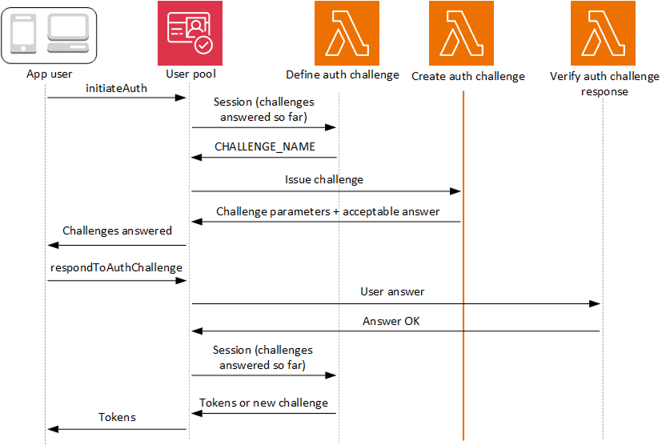

# Create Auth challenge Lambda

trigger

The create auth challenge trigger is a Lambda function that has the details of each
challenge declared by the define auth challenge trigger. It processes the challenge name
declared by the define auth challenge trigger and returns a
`publicChallengeParameters` that your application must present to the user.
This function then provides your user pool with the answer to the challenge,
`privateChallengeParameters`, that your user pool passes to the verify auth
challenge trigger. Where your define auth challenge trigger manages the challenge sequence,
your create auth challenge trigger manages the challenge contents.



**Create auth challenge**

Amazon Cognito invokes this trigger after **Define Auth Challenge** if
a custom challenge has been specified as part of the **Define Auth
Challenge** trigger. It creates a [custom authentication flow](amazon-cognito-user-pools-authentication-flow.md#amazon-cognito-user-pools-custom-authentication-flow "amazon-cognito-user-pools-authentication-flow.md#amazon-cognito-user-pools-custom-authentication-flow").

This Lambda trigger is invoked to create a challenge to present to the user. The request
for this Lambda trigger includes the `challengeName` and `session`. The
`challengeName` is a string and is the name of the next challenge to the
user. The value of this attribute is set in the Define Auth Challenge Lambda trigger.

The challenge loop will repeat until all challenges are answered.

###### Topics

- [Create
  Auth challenge Lambda trigger parameters](#cognito-user-pools-lambda-trigger-syntax-create-auth-challenge "#cognito-user-pools-lambda-trigger-syntax-create-auth-challenge")
- [Create Auth
  challenge example](#aws-lambda-triggers-create-auth-challenge-example "#aws-lambda-triggers-create-auth-challenge-example")

## Create

Auth challenge Lambda trigger parameters

The request that Amazon Cognito passes to this Lambda function is a combination of the parameters below and the
[common parameters](cognito-user-pools-working-with-lambda-triggers.md#cognito-user-pools-lambda-trigger-syntax-shared "cognito-user-pools-working-with-lambda-triggers.md#cognito-user-pools-lambda-trigger-syntax-shared") that Amazon Cognito adds to all requests.

JSON

```
{
    "request": {
        "userAttributes": {
            "string": "string",
            . . .
        },
        "challengeName": "string",
        "session": [
            ChallengeResult,
            . . .
        ],
        "clientMetadata": {
            "string": "string",
            . . .
        },
        "userNotFound": boolean
    },
    "response": {
        "publicChallengeParameters": {
            "string": "string",
            . . .
        },
        "privateChallengeParameters": {
            "string": "string",
            . . .
        },
        "challengeMetadata": "string"
    }
}
```

### Create Auth challenge request parameters

**userAttributes**

One or more name-value pairs representing user attributes.

**userNotFound**

This boolean is populated when `PreventUserExistenceErrors`
is set to `ENABLED` for your User Pool client.

**challengeName**

The name of the new challenge.

**session**

The session element is an array of `ChallengeResult`
elements, each of which contains the following elements:

**challengeName**

The challenge type. One of:
`"CUSTOM_CHALLENGE"`,
`"PASSWORD_VERIFIER"`,
`"SMS_MFA"`, `"DEVICE_SRP_AUTH"`,
`"DEVICE_PASSWORD_VERIFIER"`,
`"NEW_PASSWORD_REQUIRED"`, or
`"ADMIN_NO_SRP_AUTH"`.

**challengeResult**

Set to `true` if the user successfully
completed the challenge, or `false`
otherwise.

**challengeMetadata**

Your name for the custom challenge. Used only if
`challengeName` is
`"CUSTOM_CHALLENGE"`.

**clientMetadata**

One or more key-value pairs that you can provide as custom input to
the Lambda function that you specify for the create auth challenge
trigger. You can use the ClientMetadata parameter in the [AdminRespondToAuthChallenge](../../../cognito-user-identity-pools/latest/APIReference/API_AdminRespondToAuthChallenge.md "../../../cognito-user-identity-pools/latest/APIReference/API_AdminRespondToAuthChallenge.md") and [RespondToAuthChallenge](../../../cognito-user-identity-pools/latest/APIReference/API_RespondToAuthChallenge.md "../../../cognito-user-identity-pools/latest/APIReference/API_RespondToAuthChallenge.md") API actions to pass this data to
your Lambda function. The request that invokes the create auth challenge
function does not include data passed in the ClientMetadata parameter in
[AdminInitiateAuth](../../../cognito-user-identity-pools/latest/APIReference/API_AdminInitiateAuth.md "../../../cognito-user-identity-pools/latest/APIReference/API_AdminInitiateAuth.md") and [InitiateAuth](../../../cognito-user-identity-pools/latest/APIReference/API_InitiateAuth.md "../../../cognito-user-identity-pools/latest/APIReference/API_InitiateAuth.md") API
operations.

### Create Auth challenge response parameters

**publicChallengeParameters**

One or more key-value pairs for the client app to use in the challenge
to be presented to the user. This parameter should contain all of the
necessary information to present the challenge to the user
accurately.

**privateChallengeParameters**

This parameter is only used by the Verify Auth Challenge Response
Lambda trigger. This parameter should contain all of the information that
is required to validate the user's response to the challenge. In other
words, the `publicChallengeParameters` parameter contains the
question that is presented to the user and
`privateChallengeParameters` contains the valid answers
for the question.

**challengeMetadata**

Your name for the custom challenge, if this is a custom
challenge.

## Create Auth

challenge example

This function has two custom challenges that correspond to the challenge sequence in
our [define auth
challenge example](user-pool-lambda-define-auth-challenge.md#aws-lambda-triggers-define-auth-challenge-example "user-pool-lambda-define-auth-challenge.md#aws-lambda-triggers-define-auth-challenge-example"). The first two challenges are SRP authentication. For the
third challenge, this function returns a CAPTCHA URL to your application in the
challenge response. Your application renders the CAPTCHA at the given URL and returns
the user's input. The URL for the CAPTCHA image is added to the public challenge
parameters as "`captchaUrl`", and the expected answer is added to the private
challenge parameters.

For the fourth challenge, this function returns a security question. Your application
renders the question and prompts the user for their answer. After users solve both
custom challenges, the define auth challenge trigger confirms that your user pool can
issue tokens.

Node.js

```
const handler = async (event) => {
  if (event.request.challengeName !== "CUSTOM_CHALLENGE") {
    return event;
  }

  if (event.request.session.length === 2) {
    event.response.publicChallengeParameters = {};
    event.response.privateChallengeParameters = {};
    event.response.publicChallengeParameters.captchaUrl = "url/123.jpg";
    event.response.privateChallengeParameters.answer = "5";
  }

  if (event.request.session.length === 3) {
    event.response.publicChallengeParameters = {};
    event.response.privateChallengeParameters = {};
    event.response.publicChallengeParameters.securityQuestion =
      "Who is your favorite team mascot?";
    event.response.privateChallengeParameters.answer = "Peccy";
  }

  return event;
};

export { handler };

```
