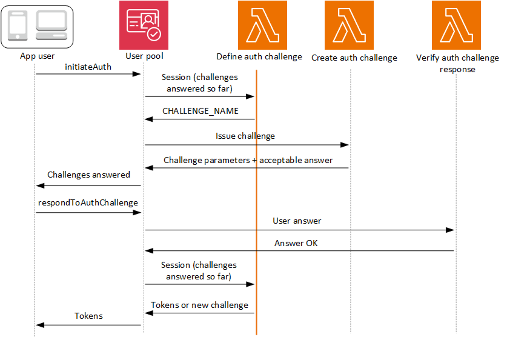

# Define Auth challenge Lambda

trigger

The define auth challenge trigger is a Lambda function that maintains the challenge
sequence in a custom authentication flow. It declares success or failure of the challenge
sequence, and sets the next challenge if the sequence isn't yet complete.



**Define auth challenge**

Amazon Cognito invokes this trigger to initiate the [custom authentication flow](amazon-cognito-user-pools-authentication-flow.md#amazon-cognito-user-pools-custom-authentication-flow "amazon-cognito-user-pools-authentication-flow.md#amazon-cognito-user-pools-custom-authentication-flow").

The request for this Lambda trigger contains `session`. The `session`
parameter is an array that contains all of the challenges that are presented to the user in
the current authentication process. The request also includes the corresponding result. The
`session` array stores challenge details (`ChallengeResult`) in
chronological order. The challenge `session[0]` represents the first challenge
that the user receives.

###### Topics

- [Define
  Auth challenge Lambda trigger parameters](#cognito-user-pools-lambda-trigger-syntax-define-auth-challenge "#cognito-user-pools-lambda-trigger-syntax-define-auth-challenge")
- [Define Auth
  challenge example](#aws-lambda-triggers-define-auth-challenge-example "#aws-lambda-triggers-define-auth-challenge-example")

## Define

Auth challenge Lambda trigger parameters

The request that Amazon Cognito passes to this Lambda function is a combination of the parameters below and the
[common parameters](cognito-user-pools-working-with-lambda-triggers.md#cognito-user-pools-lambda-trigger-syntax-shared "cognito-user-pools-working-with-lambda-triggers.md#cognito-user-pools-lambda-trigger-syntax-shared") that Amazon Cognito adds to all requests.

JSON

```
{
    "request": {
        "userAttributes": {
            "string": "string",
                . . .
        },
        "session": [
            ChallengeResult,
            . . .
        ],
        "clientMetadata": {
            "string": "string",
            . . .
        },
        "userNotFound": boolean
    },
    "response": {
        "challengeName": "string",
        "issueTokens": boolean,
        "failAuthentication": boolean
    }
}
```

### Define Auth challenge request parameters

When Amazon Cognito invokes your Lambda function, Amazon Cognito provides the following
parameters:

**userAttributes**

One or more name-value pairs that represent user attributes.

**userNotFound**

A Boolean that Amazon Cognito populates when
`PreventUserExistenceErrors` is set to
`ENABLED` for your user pool client. A value of
`true` means that the user id (username, email address,
and other details) did not match any existing users. When
`PreventUserExistenceErrors` is set to
`ENABLED`, the service doesn't inform the app of
nonexistent users. We recommend that your Lambda functions maintain the
same user experience and account for latency. This way, the caller can't
detect different behavior when the user exists or doesn’t exist.

**session**

An array of `ChallengeResult` elements. Each contains the
following elements:

**challengeName**

One of the following challenge types:
`CUSTOM_CHALLENGE`, `SRP_A`,
`PASSWORD_VERIFIER`, `SMS_MFA`,
`EMAIL_OTP`,
`SOFTWARE_TOKEN_MFA`,
`DEVICE_SRP_AUTH`,
`DEVICE_PASSWORD_VERIFIER`, or
`ADMIN_NO_SRP_AUTH`.

When your define auth challenge function issues a
`PASSWORD_VERIFIER` challenge for a user who
has set up multifactor authentication, Amazon Cognito follows it up
with an
`SMS_MFA`,
`EMAIL_OTP`, or
`SOFTWARE_TOKEN_MFA` challenge. These are the
prompts for a multi-factor authentication code. In your
function, include handling for input events from
`SMS_MFA`,
`EMAIL_OTP`, and
`SOFTWARE_TOKEN_MFA` challenges. You don't
need to invoke any MFA challenges in your define auth
challenge function.

###### Important

When your function is determining whether a user has
successfully authenticated and you should issue them
tokens, always check `challengeName` in your
define auth challenge function and verify that it
matches the expected value.

**challengeResult**

Set to `true` if the user successfully
completed the challenge, or `false`
otherwise.

**challengeMetadata**

Your name for the custom challenge. Used only if
`challengeName` is
`CUSTOM_CHALLENGE`.

**clientMetadata**

One or more key-value pairs that you can provide as custom input to
the Lambda function that you specify for the define auth challenge
trigger. To pass this data to your Lambda function, you can use the
`ClientMetadata` parameter in the [AdminRespondToAuthChallenge](../../../cognito-user-identity-pools/latest/APIReference/API_AdminRespondToAuthChallenge.md "../../../cognito-user-identity-pools/latest/APIReference/API_AdminRespondToAuthChallenge.md") and [RespondToAuthChallenge](../../../cognito-user-identity-pools/latest/APIReference/API_RespondToAuthChallenge.md "../../../cognito-user-identity-pools/latest/APIReference/API_RespondToAuthChallenge.md") API operations. The request that
invokes the define auth challenge function doesn't include data passed
in the ClientMetadata parameter in [AdminInitiateAuth](../../../cognito-user-identity-pools/latest/APIReference/API_AdminInitiateAuth.md "../../../cognito-user-identity-pools/latest/APIReference/API_AdminInitiateAuth.md") and [InitiateAuth](../../../cognito-user-identity-pools/latest/APIReference/API_InitiateAuth.md "../../../cognito-user-identity-pools/latest/APIReference/API_InitiateAuth.md") API
operations.

### Define Auth challenge response parameters

In the response, you can return the next stage of the authentication
process.

**challengeName**

A string that contains the name of the next challenge. If you want to
present a new challenge to your user, specify the challenge name
here.

**issueTokens**

If you determine that the user has completed the authentication
challenges sufficiently, set to `true`. If the user has not
met the challenges sufficiently, set to `false`.

**failAuthentication**

If you want to end the current authentication process, set to
`true`. To continue the current authentication process,
set to `false`.

## Define Auth

challenge example

This example defines a series of challenges for authentication and issues tokens only
if the user has completed all of the challenges successfully. When users complete SRP
authentication with the `SRP_A` and `PASSWORD_VERIFIER`
challenges, this function passes them a `CUSTOM_CHALLENGE` that invokes the
create auth challenge trigger. In combination with our [create auth challenge
example](user-pool-lambda-create-auth-challenge.md#aws-lambda-triggers-create-auth-challenge-example "user-pool-lambda-create-auth-challenge.md#aws-lambda-triggers-create-auth-challenge-example"), this sequence delivers a CAPTCHA challenge for challenge three and a
security question for challenge four.

After the user solves the CAPTCHA and answers the security question, this function
confirms that your user pool can issue tokens. SRP authentication isn't required; you
can also set the CAPTCHA and security question as challenges one & two. In the case
where your define auth challenge function doesn't declare SRP challenges, your users'
success is determined entirely by their responses to your custom prompts.

Node.js

```
const handler = async (event) => {
  if (
    event.request.session.length === 1 &&
    event.request.session[0].challengeName === "SRP_A"
  ) {
    event.response.issueTokens = false;
    event.response.failAuthentication = false;
    event.response.challengeName = "PASSWORD_VERIFIER";
  } else if (
    event.request.session.length === 2 &&
    event.request.session[1].challengeName === "PASSWORD_VERIFIER" &&
    event.request.session[1].challengeResult === true
  ) {
    event.response.issueTokens = false;
    event.response.failAuthentication = false;
    event.response.challengeName = "CUSTOM_CHALLENGE";
  } else if (
    event.request.session.length === 3 &&
    event.request.session[2].challengeName === "CUSTOM_CHALLENGE" &&
    event.request.session[2].challengeResult === true
  ) {
    event.response.issueTokens = false;
    event.response.failAuthentication = false;
    event.response.challengeName = "CUSTOM_CHALLENGE";
  } else if (
    event.request.session.length === 4 &&
    event.request.session[3].challengeName === "CUSTOM_CHALLENGE" &&
    event.request.session[3].challengeResult === true
  ) {
    event.response.issueTokens = true;
    event.response.failAuthentication = false;
  } else {
    event.response.issueTokens = false;
    event.response.failAuthentication = true;
  }

  return event;
};

export { handler };

```
