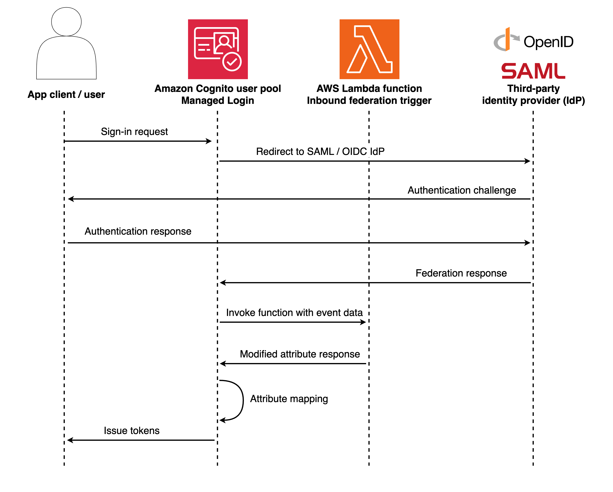

# Inbound federation Lambda trigger

The inbound federation trigger transforms federated user attributes during the
authentication process with external identity providers. When users authenticate through
configured identity providers, this trigger allows you to modify responses from external
SAML and OIDC providers by intercepting and transforming data in the authentication process,
providing programmatic control over how Amazon Cognito user pools handle federated users and their
attributes.

Use this trigger to add, override, or suppress attributes before creating new users or
updating existing federated user profiles. This trigger receives raw identity provider
attributes as input and returns modified attributes that Amazon Cognito applies to the user
profile.

###### Topics

- [Flow
  overview](#cognito-user-pools-lambda-trigger-inbound-federation-flow "#cognito-user-pools-lambda-trigger-inbound-federation-flow")
- [Inbound
  federation Lambda trigger parameters](#cognito-user-pools-lambda-trigger-syntax-inbound-federation "#cognito-user-pools-lambda-trigger-syntax-inbound-federation")
- [Inbound
  federation example: Group membership management](#aws-lambda-triggers-inbound-federation-example-groups "#aws-lambda-triggers-inbound-federation-example-groups")
- [Inbound
  federation example: Truncate large attributes](#aws-lambda-triggers-inbound-federation-example-truncate "#aws-lambda-triggers-inbound-federation-example-truncate")
- [Inbound
  federation example: Logging federation events](#aws-lambda-triggers-inbound-federation-example-logging "#aws-lambda-triggers-inbound-federation-example-logging")

## Flow

overview

When a user authenticates with an external identity provider, Amazon Cognito invokes the
inbound federation trigger before creating or updating the user profile. The trigger
receives the raw attributes from the identity provider and can transform them before
Amazon Cognito stores them. This flow occurs for both new federated users and existing users who
sign in again through federation.



## Inbound

federation Lambda trigger parameters

The request that Amazon Cognito passes to this Lambda function is a combination of the parameters below and the
[common parameters](cognito-user-pools-working-with-lambda-triggers.md#cognito-user-pools-lambda-trigger-syntax-shared "cognito-user-pools-working-with-lambda-triggers.md#cognito-user-pools-lambda-trigger-syntax-shared") that Amazon Cognito adds to all requests.

JSON

```
{
    "version": "string",
    "triggerSource": "InboundFederation_ExternalProvider",
    "region": `AWSRegion`,
    "userPoolId": "string",
    "userName": "string",
    "callerContext": {
        "awsSdkVersion": "string",
        "clientId": "string"
    },
    "request": {
        "providerName": "string",
        "providerType": "string",
        "attributes": {
            "tokenResponse": {
                "access_token": "string",
                "token_type": "string",
                "expires_in": "string"
            },
            "idToken": {
                "sub": "string",
                "email": "string",
                "email_verified": "string"
            },
            "userInfo": {
                "email": "string",
                "given_name": "string",
                "family_name": "string"
            },
            "samlResponse": {
                "string": "string"
            }
        }
    },
    "response": {
        "userAttributesToMap": {
            "string": "string"
        }
    }
}
```

### Inbound federation request parameters

**providerName**

The name of the external identity provider.

**providerType**

The type of the external identity provider. Valid values:
`OIDC`, `SAML`, `Facebook`,
`Google`, `SignInWithApple`,
`LoginWithAmazon`.

**attributes**

The raw attributes received from the identity provider before
processing. The structure varies based on provider type.

**attributes.tokenResponse**

OAuth token response data from the `/token` endpoint.
Available for OIDC and social providers only. Contains
`access_token`, `id_token`,
`refresh_token`, `token_type`,
`expires_in`, and `scope`.

**attributes.idToken**

Decoded and validated ID token JWT claims. Available for OIDC and
social providers only. Contains verified user identity information
including `sub` (unique user identifier), `email`,
`name`, `iss` (issuer), `aud`
(audience), `exp` (expiration), and `iat` (issued
time).

**attributes.userInfo**

Extended user profile information from the UserInfo endpoint.
Available for OIDC and social providers only. Contains detailed profile
attributes such as `given_name`, `family_name`,
`picture`, `address`, and other
provider-specific fields. May be empty if the IdP doesn't support the
UserInfo endpoint or if the endpoint call fails.

**attributes.samlResponse**

SAML assertion attributes. Available for SAML providers only. Contains
attributes from the SAML response.

### Inbound federation response parameters

**userAttributesToMap**

The user attributes to apply to the user profile.

###### Important

You must include ALL user attributes you want to retain in the response,
including attributes you are not modifying. Any attributes not included in the
`userAttributesToMap` response will be dropped and not stored in
the user profile. This applies to both modified and unmodified
attributes.

###### Empty response behavior

If you return an empty object `{}` for
`userAttributesToMap`, all original attributes from the identity
provider are retained unchanged. This acts as a no-op, as if the Lambda function
was never executed. This is different from omitting attributes, which drops
them.

###### Provider-specific attributes

The structure of `request.attributes` varies based on the
`providerType`. OIDC and social providers include
`tokenResponse`, `idToken`, and `userInfo`
objects. SAML providers include only the `samlResponse`
object.

## Inbound

federation example: Group membership management

This example shows how to map federated identity provider groups to Amazon Cognito user pools groups.
This function extracts group membership from the federated response and automatically
adds users to corresponding Amazon Cognito groups, eliminating the need for post-authentication
triggers.

Node.js

```
exports.handler = async (event) => {
    const { providerType, attributes } = event.request;

    // Extract user attributes based on provider type
    let userAttributesFromIdp = {};
    if (providerType === 'SAML') {
        userAttributesFromIdp = attributes.samlResponse || {};
    } else {
        // For OIDC and Social providers, merge userInfo and idToken
        userAttributesFromIdp = {
            ...(attributes.userInfo || {}),
            ...(attributes.idToken || {})
        };
    }

    // Extract groups from federated response
    const federatedGroups = userAttributesFromIdp.groups?.split(',') || [];

    // Map federated groups to Cognito groups
    const groupMapping = {
        'Domain Admins': 'Administrators',
        'Engineering': 'Developers',
        'Sales': 'SalesTeam'
    };

    // Filter to only in-scope groups
    const mappedGroups = federatedGroups
        .map(group => groupMapping[group.trim()])
        .filter(group => group); // Remove undefined values

    // Pass through attributes with mapped groups as custom attribute
    const attributesToMap = {
        ...userAttributesFromIdp,
        'custom:user_groups': mappedGroups.join(',')
    };

    // Remove original groups attribute
    delete attributesToMap.groups;

    event.response.userAttributesToMap = attributesToMap;
    return event;
};
```

Amazon Cognito passes event information to your Lambda function. The function then returns the same event
object to Amazon Cognito, with any changes in the response. In the Lambda console, you can set up a test
event with data that is relevant to your Lambda trigger. The following is a test event for this code sample:

JSON

```
{
    "userPoolId": "us-east-1_XXXXXXXXX",
    "request": {
        "providerName": "CorporateAD",
        "providerType": "SAML",
        "attributes": {
            "samlResponse": {
                "email": "jane.smith@company.com",
                "given_name": "Jane",
                "family_name": "Smith",
                "groups": "Engineering,Domain Admins",
                "department": "Engineering"
            }
        }
    },
    "response": {
        "userAttributesToMap": {}
    }
}
```

## Inbound

federation example: Truncate large attributes

This example shows how to truncate attribute values that exceed Amazon Cognito's storage
limits. This function checks each attribute from the identity provider. If an attribute
value exceeds 2048 characters, it truncates the value and adds ellipsis to indicate
truncation. All other attributes pass through unchanged.

Node.js

```
exports.handler = async (event) => {
    const MAX_ATTRIBUTE_LENGTH = 2048;

    // Get the identity provider attributes based on provider type
    const { providerType, attributes } = event.request;
    let idpAttributes = {};

    if (providerType === 'SAML') {
        idpAttributes = attributes.samlResponse || {};
    } else {
        // For OIDC and Social providers, merge userInfo and idToken
        idpAttributes = {
            ...(attributes.userInfo || {}),
            ...(attributes.idToken || {})
        };
    }

    const userAttributes = {};

    // Process each attribute
    for (const [key, value] of Object.entries(idpAttributes)) {
        if (typeof value === 'string' && value.length > MAX_ATTRIBUTE_LENGTH) {
            // Truncate the value and add ellipsis
            userAttributes[key] = value.substring(0, MAX_ATTRIBUTE_LENGTH - 3) + '...';
            console.log(`Truncated attribute ${key} from ${value.length} to ${userAttributes[key].length} characters`);
        } else {
            // Keep the original value
            userAttributes[key] = value;
        }
    }

    // Return the modified attributes
    event.response.userAttributesToMap = userAttributes;
    return event;
};
```

Amazon Cognito passes event information to your Lambda function. The function then returns the same event
object to Amazon Cognito, with any changes in the response. In the Lambda console, you can set up a test
event with data that is relevant to your Lambda trigger. The following is a test event for this code sample:

JSON

```
{
    "version": "string",
    "triggerSource": "InboundFederation_ExternalProvider",
    "region": "us-east-1",
    "userPoolId": "us-east-1_XXXXXXXXX",
    "userName": "ExampleProvider_12345",
    "callerContext": {
        "awsSdkVersion": "string",
        "clientId": "string"
    },
    "request": {
        "providerName": "ExampleProvider",
        "providerType": "OIDC",
        "attributes": {
            "tokenResponse": {
                "access_token": "abcDE...",
                "token_type": "Bearer",
                "expires_in": "3600"
            },
            "idToken": {
                "sub": "12345",
                "email": "user@example.com"
            },
            "userInfo": {
                "email": "user@example.com",
                "given_name": "Example",
                "family_name": "User",
                "bio": "This is a very long biography that contains more than 2048 characters..."
            }
        }
    },
    "response": {
        "userAttributesToMap": {}
    }
}
```

## Inbound

federation example: Logging federation events

This example shows how to log federated authentication events for monitoring and
debugging. This example function captures detailed information about federated users and
their attributes, providing visibility into the authentication process.

Node.js

```
exports.handler = async (event) => {
    const { providerName, providerType, attributes } = event.request;

    // Extract user attributes based on provider type
    let userAttributesFromIdp = {};
    if (providerType === 'SAML') {
        userAttributesFromIdp = attributes.samlResponse || {};
    } else {
        // For OIDC and Social providers, merge userInfo and idToken
        userAttributesFromIdp = {
            ...(attributes.userInfo || {}),
            ...(attributes.idToken || {})
        };
    }

    // Log federated authentication details
    console.log(JSON.stringify({
        timestamp: new Date().toISOString(),
        providerName,
        providerType,
        userEmail: userAttributesFromIdp.email,
        attributeCount: Object.keys(userAttributesFromIdp).length,
        attributes: userAttributesFromIdp
    }));

    // Pass through all attributes unchanged
    event.response.userAttributesToMap = userAttributesFromIdp;
    return event;
};
```

Amazon Cognito passes event information to your Lambda function. The function then returns the same event
object to Amazon Cognito, with any changes in the response. In the Lambda console, you can set up a test
event with data that is relevant to your Lambda trigger. The following is a test event for this code sample:

JSON

```
{
    "version": "string",
    "triggerSource": "InboundFederation_ExternalProvider",
    "region": "us-east-1",
    "userPoolId": "us-east-1_XXXXXXXXX",
    "userName": "CorporateAD_john.doe",
    "callerContext": {
        "awsSdkVersion": "string",
        "clientId": "string"
    },
    "request": {
        "providerName": "CorporateAD",
        "providerType": "SAML",
        "attributes": {
            "samlResponse": {
                "email": "john.doe@company.com",
                "given_name": "John",
                "family_name": "Doe",
                "department": "Engineering",
                "employee_id": "EMP12345"
            }
        }
    },
    "response": {
        "userAttributesToMap": {}
    }
}
```

Expected CloudWatch Logs output:

JSON

```
{
    "timestamp": "2025-01-14T21:17:40.153Z",
    "providerName": "CorporateAD",
    "providerType": "SAML",
    "userEmail": "john.doe@company.com",
    "attributeCount": 5,
    "attributes": {
        "email": "john.doe@company.com",
        "given_name": "John",
        "family_name": "Doe",
        "department": "Engineering",
        "employee_id": "EMP12345"
    }
}
```
