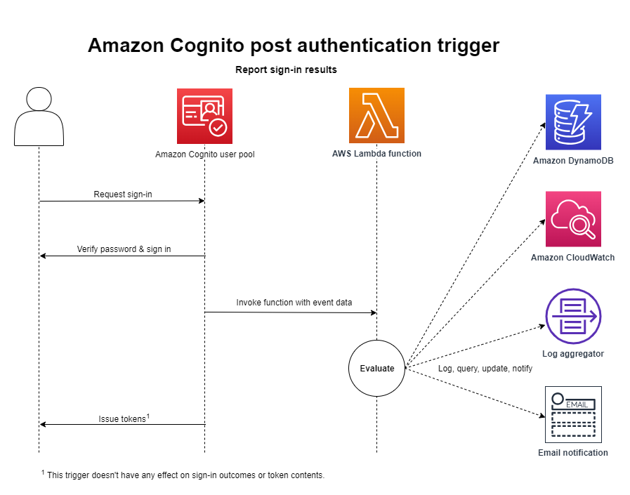

# Post authentication Lambda

trigger

The post authentication trigger doesn't change the authentication flow for a user. Amazon Cognito
invokes this Lambda after authentication is complete, before a user has received tokens. Add
a post authentication trigger when you want to add custom post-processing of authentication
events, for example logging or user profile adjustments that will be reflected on the next
sign-in.

A post authentication Lambda that doesn't return the request body to Amazon Cognito can still cause
authentication to fail to complete. For more information, see [Things to know about Lambda
triggers](cognito-user-pools-working-with-lambda-triggers.md#important-lambda-considerations "cognito-user-pools-working-with-lambda-triggers.md#important-lambda-considerations").

###### Topics

- [Authentication flow
  overview](#user-pool-lambda-post-authentication-1 "#user-pool-lambda-post-authentication-1")
- [Post authentication
  Lambda trigger parameters](#cognito-user-pools-lambda-trigger-syntax-post-auth "#cognito-user-pools-lambda-trigger-syntax-post-auth")
- [Post authentication
  example](#aws-lambda-triggers-post-authentication-example "#aws-lambda-triggers-post-authentication-example")

## Authentication flow

overview



For more information, see [An example authentication
session](authentication.md#amazon-cognito-user-pools-authentication-flow "authentication.md#amazon-cognito-user-pools-authentication-flow").

## Post authentication

Lambda trigger parameters

The request that Amazon Cognito passes to this Lambda function is a combination of the parameters below and the
[common parameters](cognito-user-pools-working-with-lambda-triggers.md#cognito-user-pools-lambda-trigger-syntax-shared "cognito-user-pools-working-with-lambda-triggers.md#cognito-user-pools-lambda-trigger-syntax-shared") that Amazon Cognito adds to all requests.

JSON

```
{
    "request": {
        "userAttributes": {
             "`string`": "`string`",
             . . .
         },
         "newDeviceUsed": `boolean`,
         "clientMetadata": {
             "`string`": "`string`",
             . . .
            }
        },
    "response": {}
}
```

### Post

authentication request parameters

**newDeviceUsed**

This flag indicates if the user has signed in on a new device. Amazon Cognito
only sets this flag if the remembered devices value of the user pool is
`Always` or `User Opt-In`.

**userAttributes**

One or more name-value pairs representing user attributes.

**clientMetadata**

One or more key-value pairs that you can provide as custom input to
the Lambda function that you specify for the post authentication trigger.
To pass this data to your Lambda function, you can use the ClientMetadata
parameter in the [AdminRespondToAuthChallenge](../../../cognito-user-identity-pools/latest/APIReference/API_AdminRespondToAuthChallenge.md "../../../cognito-user-identity-pools/latest/APIReference/API_AdminRespondToAuthChallenge.md") and [RespondToAuthChallenge](../../../cognito-user-identity-pools/latest/APIReference/API_RespondToAuthChallenge.md "../../../cognito-user-identity-pools/latest/APIReference/API_RespondToAuthChallenge.md") API actions. Amazon Cognito doesn't include
data from the ClientMetadata parameter in [AdminInitiateAuth](../../../cognito-user-identity-pools/latest/APIReference/API_AdminInitiateAuth.md "../../../cognito-user-identity-pools/latest/APIReference/API_AdminInitiateAuth.md") and [InitiateAuth](../../../cognito-user-identity-pools/latest/APIReference/API_InitiateAuth.md "../../../cognito-user-identity-pools/latest/APIReference/API_InitiateAuth.md") API
operations in the request that it passes to the post authentication
function.

### Post

authentication response parameters

Amazon Cognito doesn't expect any additional return information in the response. Your
function can use API operations to query and modify your resources, or record event
metadata to an external system.

## Post authentication

example

This post authentication sample Lambda function sends data from a successful sign-in to
CloudWatch Logs.

Node.js

```
const handler = async (event) => {
  // Send post authentication data to Amazon CloudWatch logs
  console.log("Authentication successful");
  console.log("Trigger function =", event.triggerSource);
  console.log("User pool = ", event.userPoolId);
  console.log("App client ID = ", event.callerContext.clientId);
  console.log("User ID = ", event.userName);

  return event;
};

export { handler };

```

Python

```
import os
def lambda_handler(event, context):

    # Send post authentication data to Cloudwatch logs
    print ("Authentication successful")
    print ("Trigger function =", event['triggerSource'])
    print ("User pool = ", event['userPoolId'])
    print ("App client ID = ", event['callerContext']['clientId'])
    print ("User ID = ", event['userName'])

    # Return to Amazon Cognito
    return event
```

Amazon Cognito passes event information to your Lambda function. The function then returns the same event
object to Amazon Cognito, with any changes in the response. In the Lambda console, you can set up a test
event with data that is relevant to your Lambda trigger. The following is a test event for this code sample:

JSON

```
{
  "triggerSource": "testTrigger",
  "userPoolId": "testPool",
  "userName": "testName",
  "callerContext": {
      "clientId": "12345"
  },
  "response": {}
}
```
