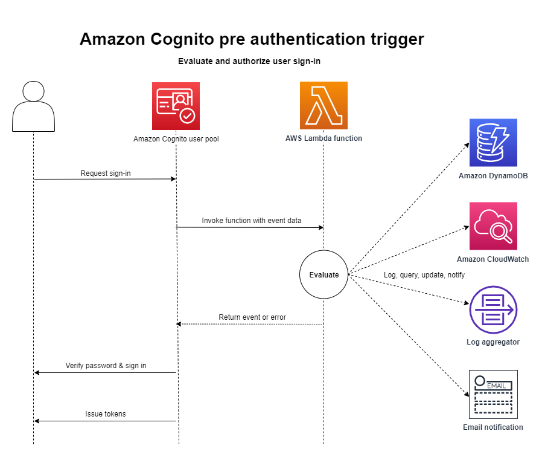

# Pre authentication Lambda

trigger

Amazon Cognito invokes this trigger when a user attempts to sign in so that you can create custom
validation that performs preparatory actions. For example, you can deny the authentication
request or record session data to an external system.

###### Note

This Lambda trigger doesn't activate when a user doesn't exist unless the
`PreventUserExistenceErrors` setting of a user pool app client is set to
`ENABLED`. Renewal of an existing authentication session also doesn't
activate this trigger.

###### Topics

- [Flow overview](#user-pool-lambda-pre-authentication-1 "#user-pool-lambda-pre-authentication-1")
- [Pre authentication
  Lambda trigger parameters](#cognito-user-pools-lambda-trigger-syntax-pre-auth "#cognito-user-pools-lambda-trigger-syntax-pre-auth")
- [Pre authentication
  example](#aws-lambda-triggers-pre-authentication-example "#aws-lambda-triggers-pre-authentication-example")

## Flow overview



The request includes client validation data from the `ClientMetadata`
values that your app passes to the user pool `InitiateAuth` and
`AdminInitiateAuth` API operations.

For more information, see [An example authentication
session](authentication.md#amazon-cognito-user-pools-authentication-flow "authentication.md#amazon-cognito-user-pools-authentication-flow").

## Pre authentication

Lambda trigger parameters

The request that Amazon Cognito passes to this Lambda function is a combination of the parameters below and the
[common parameters](cognito-user-pools-working-with-lambda-triggers.md#cognito-user-pools-lambda-trigger-syntax-shared "cognito-user-pools-working-with-lambda-triggers.md#cognito-user-pools-lambda-trigger-syntax-shared") that Amazon Cognito adds to all requests.

JSON

```
{
    "request": {
        "userAttributes": {
            "string": "string",
            . . .
        },
        "validationData": {
            "string": "string",
            . . .
        },
        "userNotFound": boolean
    },
    "response": {}
}
```

### Pre

authentication request parameters

**userAttributes**

One or more name-value pairs that represent user attributes.

**userNotFound**

When you set `PreventUserExistenceErrors` to
`ENABLED` for your user pool client, Amazon Cognito populates this
Boolean.

**validationData**

One or more key-value pairs that contain the validation data in the
user's sign-in request. To pass this data to your Lambda function, use
the ClientMetadata parameter in the [InitiateAuth](../../../cognito-user-identity-pools/latest/APIReference/API_InitiateAuth.md "../../../cognito-user-identity-pools/latest/APIReference/API_InitiateAuth.md") and [AdminInitiateAuth](../../../cognito-user-identity-pools/latest/APIReference/API_AdminInitiateAuth.md "../../../cognito-user-identity-pools/latest/APIReference/API_AdminInitiateAuth.md") API actions.

### Pre

authentication response parameters

Amazon Cognito doesn't process any added information that your function returns in the
response. Your function can return an error to reject the sign-in attempt, or use
API operations to query and modify your resources.

## Pre authentication

example

This example function prevents users from signing in to your user pool with a specific
app client. Because the pre authentication Lambda function doesn't invoke when your user
has an existing session, this function only prevents _new_ sessions with the app client ID that you want to block.

Node.js

```
const handler = async (event) => {
  if (
    event.callerContext.clientId === "user-pool-app-client-id-to-be-blocked"
  ) {
    throw new Error("Cannot authenticate users from this user pool app client");
  }

  return event;
};

export { handler };

```

Python

```
def lambda_handler(event, context):
    if event['callerContext']['clientId'] == "`<user pool app client id to be blocked>`":
        raise Exception("Cannot authenticate users from this user pool app client")

    # Return to Amazon Cognito
    return event
```

Amazon Cognito passes event information to your Lambda function. The function then returns the same event
object to Amazon Cognito, with any changes in the response. In the Lambda console, you can set up a test
event with data that is relevant to your Lambda trigger. The following is a test event for this code sample:

JSON

```
{
    "callerContext": {
        "clientId": "`<user pool app client id to be blocked>`"
    },
    "response": {}
}
```
