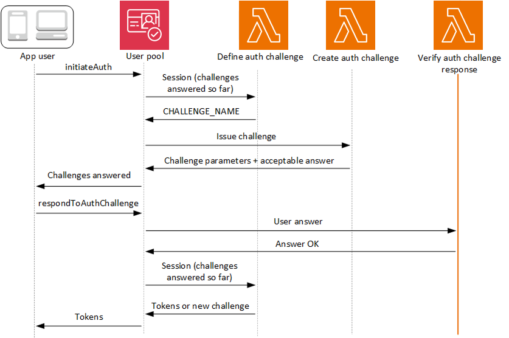

# Verify Auth challenge

response Lambda trigger

The verify auth challenge trigger is a Lambda function that compares a user's provided
response to a known answer. This function tells your user pool whether the user answered the
challenge correctly. When the verify auth challenge trigger responds with an
`answerCorrect` of `true`, the authentication sequence can
continue.



**Verify auth challenge response**

Amazon Cognito invokes this trigger to verify if the response from the user for a
custom Auth Challenge is valid or not. It is part of a user pool [custom authentication flow](amazon-cognito-user-pools-authentication-flow.md#amazon-cognito-user-pools-custom-authentication-flow "amazon-cognito-user-pools-authentication-flow.md#amazon-cognito-user-pools-custom-authentication-flow").

The request for this trigger contains the `privateChallengeParameters` and
`challengeAnswer` parameters. The Create Auth Challenge Lambda trigger returns
`privateChallengeParameters` values, and contains the expected response from
the user. The `challengeAnswer` parameter contains the user's response for the
challenge.

The response contains the `answerCorrect` attribute. If the user successfully
completes the challenge, Amazon Cognito sets the attribute value to `true`. If the user
doesn't successfully complete the challenge, Amazon Cognito sets the value to
`false`.

The challenge loop repeats until the users answers all challenges.

###### Topics

- [Verify
  Auth challenge Lambda trigger parameters](#cognito-user-pools-lambda-trigger-syntax-verify-auth-challenge "#cognito-user-pools-lambda-trigger-syntax-verify-auth-challenge")
- [Verify Auth
  challenge response example](#aws-lambda-triggers-verify-auth-challenge-response-example "#aws-lambda-triggers-verify-auth-challenge-response-example")

## Verify

Auth challenge Lambda trigger parameters

The request that Amazon Cognito passes to this Lambda function is a combination of the parameters below and the
[common parameters](cognito-user-pools-working-with-lambda-triggers.md#cognito-user-pools-lambda-trigger-syntax-shared "cognito-user-pools-working-with-lambda-triggers.md#cognito-user-pools-lambda-trigger-syntax-shared") that Amazon Cognito adds to all requests.

JSON

```
{
    "request": {
        "userAttributes": {
            "string": "string",
            . . .
        },
        "privateChallengeParameters": {
            "string": "string",
            . . .
        },
        "challengeAnswer": "string",
        "clientMetadata": {
            "string": "string",
            . . .
        },
        "userNotFound": boolean
    },
    "response": {
        "answerCorrect": boolean
    }
}
```

### Verify Auth challenge request parameters

**userAttributes**

This parameter contains one or more name-value pairs that represent
user attributes.

**userNotFound**

When Amazon Cognito sets `PreventUserExistenceErrors` to
`ENABLED` for your user pool client, Amazon Cognito populates this
Boolean .

**privateChallengeParameters**

This parameter comes from the Create Auth Challenge trigger. To
determine whether the user passed a challenge, Amazon Cognito compares the
parameters against a user’s **challengeAnswer**.

This parameter contains all of the information that is required to
validate the user's response to the challenge. That information includes
the question that Amazon Cognito presents to the user
(`publicChallengeParameters`), and the valid answers for
the question (`privateChallengeParameters`). Only the Verify
Auth Challenge Response Lambda trigger uses this parameter.

**challengeAnswer**

This parameter value is the answer from the user's response to the
challenge.

**clientMetadata**

This parameter contains one or more key-value pairs that you can
provide as custom input to the Lambda function for the verify auth
challenge trigger. To pass this data to your Lambda function, use the
ClientMetadata parameter in the [AdminRespondToAuthChallenge](../../../cognito-user-identity-pools/latest/APIReference/API_AdminRespondToAuthChallenge.md "../../../cognito-user-identity-pools/latest/APIReference/API_AdminRespondToAuthChallenge.md") and [RespondToAuthChallenge](../../../cognito-user-identity-pools/latest/APIReference/API_RespondToAuthChallenge.md "../../../cognito-user-identity-pools/latest/APIReference/API_RespondToAuthChallenge.md") API operations. Amazon Cognito doesn't
include data from the ClientMetadata parameter in [AdminInitiateAuth](../../../cognito-user-identity-pools/latest/APIReference/API_AdminInitiateAuth.md "../../../cognito-user-identity-pools/latest/APIReference/API_AdminInitiateAuth.md") and [InitiateAuth](../../../cognito-user-identity-pools/latest/APIReference/API_InitiateAuth.md "../../../cognito-user-identity-pools/latest/APIReference/API_InitiateAuth.md") API
operations in the request that it passes to the verify auth challenge
function.

### Verify Auth challenge response parameters

**answerCorrect**

If the user successfully completes the challenge, Amazon Cognito sets this
parameter to `true`. If the user doesn't successfully
complete the challenge, Amazon Cognito sets the parameter to `false`.

## Verify Auth

challenge response example

This verify auth challenge function checks whether the user's response to a challenge
matches the expected response. The user's answer is defined by input from your
application and the preferred answer is defined by
`privateChallengeParameters.answer` in the response from the [create auth challenge
trigger response](user-pool-lambda-create-auth-challenge.md#aws-lambda-triggers-create-auth-challenge-example "user-pool-lambda-create-auth-challenge.md#aws-lambda-triggers-create-auth-challenge-example"). Both the correct answer and the given answer are part of
the input event to this function.

In this example, if the user's response matches the expected response, Amazon Cognito sets the
`answerCorrect` parameter to `true`.

Node.js

```
const handler = async (event) => {
  if (
    event.request.privateChallengeParameters.answer ===
    event.request.challengeAnswer
  ) {
    event.response.answerCorrect = true;
  } else {
    event.response.answerCorrect = false;
  }

  return event;
};

export { handler };

```
