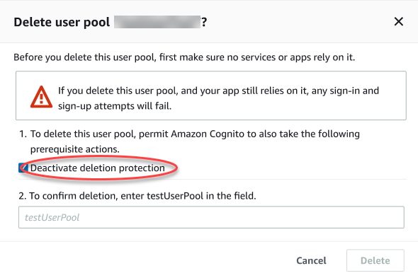

# User pool deletion protection

To make it so that your administrators don't accidentally delete your user pool, activate
deletion protection. With deletion protection active, you must confirm that you want to delete
your user pool before you delete it. When you delete a user pool in the AWS Management Console, you can
deactivate deletion protection at the same time. When you accept the prompt to deactivate
deletion protection and confirm your intention to delete, as shown in the following image,
Amazon Cognito deletes your user pool.

When you want to delete a user pool with an Amazon Cognito API request, you must first change
`DeletionProtection` to `Inactive` in an [UpdateUserPool](../../../cognito-user-identity-pools/latest/APIReference/API_UpdateUserPool.md "../../../cognito-user-identity-pools/latest/APIReference/API_UpdateUserPool.md") request. If you don't deactivate deletion protection, Amazon Cognito returns an
`InvalidParameterException` error. After you deactivate deletion protection, you
can delete the user pool in a [DeleteUserPool](../../../cognito-user-identity-pools/latest/APIReference/API_DeleteUserPool.md "../../../cognito-user-identity-pools/latest/APIReference/API_DeleteUserPool.md") request.

Amazon Cognito activates **Deletion protection** by default when you create a new
user pool in the AWS Management Console. When you create a user pool with the `CreateUserPool`
API, deletion protection is inactive by default. To use this feature in user pools that you
create with the AWS CLI or an AWS SDK, set the `DeletionProtection` parameter to
`True`.

You can activate or deactivate deletion protection status in the **Deletion
protection** container in the **Settings** menu in the
Amazon Cognito console.

# To configure

deletion protection

1. Go to the [Amazon Cognito console](https://console.aws.amazon.com/cognito/home "https://console.aws.amazon.com/cognito/home"). You might
   be prompted for your AWS credentials.
2. Choose **User Pools**.
3. Choose an existing user pool from the list, or [create a user
   pool](cognito-user-pool-as-user-directory.md "cognito-user-pool-as-user-directory.md").
4. Choose the **Settings** menu and navigate to the **Deletion
   Protection** tab. Select **Activate** or
   **Deactivate**.
5. Confirm your choice in the next dialogue.
