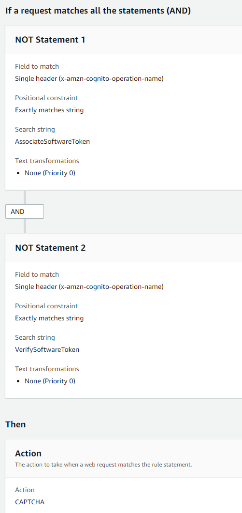

# TOTP software token MFA

When you set up TOTP software token MFA in your user pool, your user signs in with a
username and password, then uses a TOTP to complete authentication. After your user sets and
verifies a username and password, they can activate a TOTP software token for MFA. If your
app uses the Amazon Cognito managed login to sign in users, your user submits their username and
password, and then submits the TOTP password on an additional sign-in page.

You can activate TOTP MFA for your user pool in the Amazon Cognito console, or you can use Amazon Cognito
API operations. At the user pool level, you can call [SetUserPoolMfaConfig](../../../cognito-user-identity-pools/latest/APIReference/API_SetUserPoolMfaConfig.md "../../../cognito-user-identity-pools/latest/APIReference/API_SetUserPoolMfaConfig.md") to configure MFA and enable TOTP MFA.

###### Note

If you haven't activated TOTP software token MFA for the user pool, Amazon Cognito can't use
the token to associate or verify users. In this case, users receive a
`SoftwareTokenMFANotFoundException` exception with the description
`Software Token MFA has not been enabled by the userPool`. If you deactivate
software token MFA for the user pool later, users who previously associated and verified a
TOTP token can continue to use it for MFA.

Configuring TOTP for your user is a multi-step process where your user receives a secret
code that they validate by entering a one-time password. Next, you can enable TOTP MFA for
your user or set TOTP as the preferred MFA method for your user.

When you configure your user pool to require TOTP MFA and your users sign up for your
app in managed login, Amazon Cognito automates the user process. Amazon Cognito prompts your user to choose an
MFA method, displays a QR code to set up their authenticator app, and verifies their MFA
registration. In user pools where you have allowed users to choose between SMS and TOTP MFA,
Amazon Cognito also presents your user with a choice of
method.

###### Important

When you have an AWS WAF web ACL associated with a user pool, and a rule in your web
ACL presents a CAPTCHA, this can cause an unrecoverable error in managed login TOTP
registration. To create a rule that has a CAPTCHA action and doesn't affect managed login
TOTP, see [Configuring your AWS WAF web ACL for managed login TOTP
MFA](#totp-waf "#totp-waf"). For more information about
AWS WAF web ACLs and Amazon Cognito, see [Associate an AWS WAF web ACL with a user pool](user-pool-waf.md "user-pool-waf.md").

To implement TOTP MFA in a custom-built UI with an AWS SDK and the [Amazon Cognito user pools API](../../../cognito-user-identity-pools/latest/APIReference/Welcome.md "../../../cognito-user-identity-pools/latest/APIReference/Welcome.md"), see [Configuring TOTP MFA for a user](#totp-mfa-set-up-api "#totp-mfa-set-up-api").

To add MFA to your user pool, see [Adding MFA to a user pool](user-pool-settings-mfa.md "user-pool-settings-mfa.md").

**TOTP MFA considerations and limitations**

1. Amazon Cognito supports software token MFA through an authenticator app that generates TOTP
   codes. Amazon Cognito doesn't support hardware-based MFA.
2. When your user pool requires TOTP for a user who has not configured it, your user
   receives a one-time access token that your app can use to activate TOTP MFA for the
   user. Subsequent sign-in attempts fail until your user has registered an additional TOTP
   sign-in factor.
   - A user who signs up in your user pool with the `SignUp` API operation
     or through managed login receives one-time tokens when the user completes
     sign-up.
   - After you create a user, and the user sets their initial password, Amazon Cognito issues
     one-time tokens from managed login to the user. If you set a permanent password for
     the user, Amazon Cognito issues one-time tokens when the user first signs in.
   - Amazon Cognito doesn't issue one-time tokens to an administrator-created user who signs
     in with the [InitiateAuth](../../../cognito-user-identity-pools/latest/APIReference/API_InitiateAuth.md "../../../cognito-user-identity-pools/latest/APIReference/API_InitiateAuth.md") or [AdminInitiateAuth](../../../cognito-user-identity-pools/latest/APIReference/API_AdminInitiateAuth.md "../../../cognito-user-identity-pools/latest/APIReference/API_AdminInitiateAuth.md") API operations. After your user
     succeeds in the challenge to set their initial password, or if you set a permanent
     password for the user, Amazon Cognito immediately challenges the user to set up MFA.

3. If a user in a user pool that requires MFA has already received a one-time access
   token but hasn't set up TOTP MFA, the user can't sign in with managed login until they
   have set up MFA. Instead of the access token, you can use the `session`
   response value from an `MFA_SETUP` challenge to [InitiateAuth](../../../cognito-user-identity-pools/latest/APIReference/API_InitiateAuth.md "../../../cognito-user-identity-pools/latest/APIReference/API_InitiateAuth.md") or [AdminInitiateAuth](../../../cognito-user-identity-pools/latest/APIReference/API_AdminInitiateAuth.md "../../../cognito-user-identity-pools/latest/APIReference/API_AdminInitiateAuth.md") in an [AssociateSoftwareToken](../../../cognito-user-identity-pools/latest/APIReference/API_AssociateSoftwareToken.md "../../../cognito-user-identity-pools/latest/APIReference/API_AssociateSoftwareToken.md") request.
4. If your users have set up TOTP, they can use it for MFA, even if you deactivate TOTP
   for the user pool later.
5. Amazon Cognito only accepts TOTPs from authenticator apps that generate codes with the
   HMAC-SHA1 hash function. Codes generated with SHA-256 hashing return a `Code
mismatch` error.

## Configuring TOTP MFA for a user

When a user first signs in, your app uses their one-time access token to generate the
TOTP private key and present it to your user in text or QR code format. Your user
configures their authenticator app and provides a TOTP for subsequent sign-in attempts.
Your app or managed login presents the TOTP to Amazon Cognito in MFA challenge responses.

Under some circumstances, managed login prompts new users to set up a TOTP
authenticator. for more information, see [Details of MFA logic at user
runtime](user-pool-settings-mfa.md#user-pool-settings-mfa-user-outcomes "user-pool-settings-mfa.md#user-pool-settings-mfa-user-outcomes").

###### Topics

- [Associate the TOTP
  software token](#user-pool-settings-mfa-totp-associate-token "#user-pool-settings-mfa-totp-associate-token")
- [Verify the TOTP token](#user-pool-settings-mfa-totp-verification "#user-pool-settings-mfa-totp-verification")
- [Sign in with TOTP MFA](#user-pool-settings-mfa-totp-sign-in "#user-pool-settings-mfa-totp-sign-in")
- [Remove the TOTP token](#user-pool-settings-mfa-totp-remove "#user-pool-settings-mfa-totp-remove")

### Associate the TOTP

software token

To associate the TOTP token, send your user a secret code that they must validate
with a one-time password. Associating the token requires three steps.

1. When your user chooses TOTP software token MFA, call [AssociateSoftwareToken](../../../cognito-user-identity-pools/latest/APIReference/API_AssociateSoftwareToken.md "../../../cognito-user-identity-pools/latest/APIReference/API_AssociateSoftwareToken.md") to return a unique generated shared secret key
   code for the user account. You can authorize AssociateSoftwareToken with either an
   access token or a session string.
2. Your app presents the user with the private key, or a QR code that you generate
   from the private key. Your user must enter the key into a TOTP-generating app like
   Google Authenticator, either by scanning the QR code that your application generates
   from the private key or by manually entering the key.
3. Your user enters the key, or scans the QR code into a authenticator app such as
   Google Authenticator, and the app begins generating codes.

### Verify the TOTP token

Next, verify the TOTP token. Request sample codes from your user and provide them to
the Amazon Cognito service to confirm that the user is successfully generating TOTP codes, as
follows.

1. Your app prompts your user for a code to demonstrate that they have set up their
   authenticator app properly.
2. The user's authenticator app displays a temporary password. The authenticator
   app bases the password on the secret key you gave to the user.
3. Your user enters their temporary password. Your app passes the temporary
   password to Amazon Cognito in a `VerifySoftwareToken` API request.
4. Amazon Cognito has retained the secret key associated with the user, and generates a
   TOTP and compares it with the one that your user provided. If they match,
   `VerifySoftwareToken` returns a `SUCCESS` response.
5. Amazon Cognito associates the TOTP factor with the user.
6. If the `VerifySoftwareToken` operation returns an `ERROR`
   response, make sure that the user's clock is correct and that they have not exceeded
   the maximum number of retries. Amazon Cognito accepts TOTP tokens that are within 30 seconds
   before or after the attempt, to account for minor clock skew. When you have resolved
   the issue, try the VerifySoftwareToken operation again.

### Sign in with TOTP MFA

At this point, your user signs in with the time-based one-time password. The process
is as follows.

1. Your user enters their username and password to sign in to your client
   app.
2. The TOTP MFA challenge is invoked, and your user is prompted by your app to
   enter a temporary password.
3. Your user gets the temporary password from an associated TOTP-generating
   app.
4. Your user enters the TOTP code into your client app. Your app notifies the Amazon Cognito
   service to verify it. For each sign-in, [RespondToAuthChallenge](../../../cognito-user-identity-pools/latest/APIReference/API_RespondToAuthChallenge.md "../../../cognito-user-identity-pools/latest/APIReference/API_RespondToAuthChallenge.md") should be called to get a response to the new TOTP
   authentication challenge.
5. If the token is verified by Amazon Cognito, the sign-in is successful and your user
   continues with the authentication flow.

### Remove the TOTP token

Finally, your app should allow your user to deactivate their TOTP configuration.
Currently, you can't delete a user's TOTP software token. To replace your user's
software token, associate and verify a new software token. To deactivate TOTP MFA for a
user, call [SetUserMFAPreference](../../../cognito-user-identity-pools/latest/APIReference/API_SetUserMFAPreference.md "../../../cognito-user-identity-pools/latest/APIReference/API_SetUserMFAPreference.md") to modify your user to use no MFA, or only SMS
MFA.

1. Create an interface in your app for users who want to reset MFA. Prompt a user
   in this interface to enter their password.
2. If Amazon Cognito returns a TOTP MFA challenge, update your user's MFA preference with
   [SetUserMFAPreference](../../../cognito-user-identity-pools/latest/APIReference/API_SetUserMFAPreference.md "../../../cognito-user-identity-pools/latest/APIReference/API_SetUserMFAPreference.md").
3. In your app, communicate to your user that they have deactivated MFA and prompt
   them to sign in again.

## Configuring your AWS WAF web ACL for managed login TOTP

MFA

When you have an AWS WAF web ACL associated with a user pool, and a rule in your web
ACL presents a CAPTCHA, this can cause an unrecoverable error in managed login TOTP
registration. AWS WAF CAPTCHA rules _only_ have this effect
on TOTP MFA in managed login and the classic hosted UI. SMS MFA is unaffected.

Amazon Cognito displays the following error when your CAPTCHA rule doesn't let a user complete
TOTP MFA setup.

**`Request not allowed due to WAF captcha.`**

This error results when AWS WAF prompts for a CAPTCHA in response to [AssociateSoftwareToken](../../../cognito-user-identity-pools/latest/APIReference/API_AssociateSoftwareToken.md "../../../cognito-user-identity-pools/latest/APIReference/API_AssociateSoftwareToken.md") and [VerifySoftwareToken](../../../cognito-user-identity-pools/latest/APIReference/API_VerifySoftwareToken.md "../../../cognito-user-identity-pools/latest/APIReference/API_VerifySoftwareToken.md") API requests that your user pool makes in the background.
To create a rule that has a CAPTCHA action and doesn't affect TOTP in managed login pages,
exclude the `x-amzn-cognito-operation-name` header values of
`AssociateSoftwareToken` and `VerifySoftwareToken` from the
CAPTCHA action in your rule.

The following screenshot shows an example AWS WAF rule that applies a CAPTCHA action to
all requests that don't have a `x-amzn-cognito-operation-name` header value of
`AssociateSoftwareToken` or `VerifySoftwareToken`.

For more information about AWS WAF web ACLs and Amazon Cognito, see [Associate an AWS WAF web ACL with a user pool](user-pool-waf.md "user-pool-waf.md").
