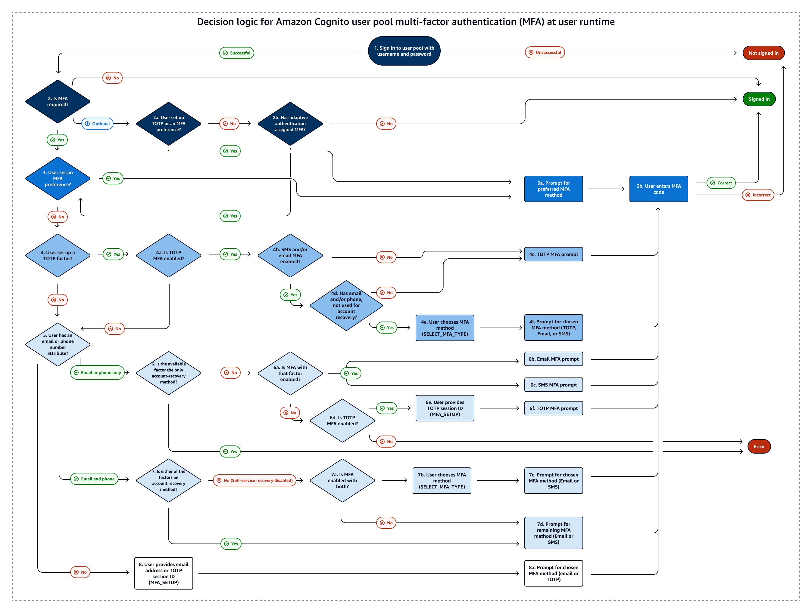
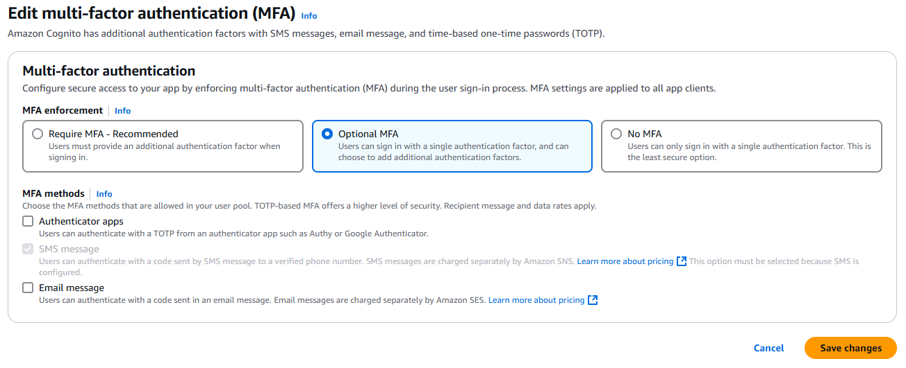

# Adding MFA to a user pool

MFA adds a _something you have_ authentication factor to
the initial _something you know_ factor that is typically a
username and password. You can choose SMS text messages, email messages, or time-based
one-time passwords (TOTP) as additional factors to sign in your users who have passwords as
their primary authentication factor.

Multi-factor authentication (MFA) increases security for the [local users](cognito-terms.md#terms-localuser "cognito-terms.md#terms-localuser") in your application. In the case of [federated users](cognito-terms.md#terms-federateduser "cognito-terms.md#terms-federateduser"), Amazon Cognito delegates all authentication
processes to the IdP and doesn't offer them additional authentication factors.

###### Note

The first time that a new user signs in to your app, Amazon Cognito issues OAuth 2.0 tokens,
even if your user pool requires MFA. The second authentication factor when your user signs
in for the first time is their confirmation of the verification message that Amazon Cognito sends to
them. If your user pool requires MFA, Amazon Cognito prompts your user to register an additional
sign-in factor to use during each sign-in attempt after the first.

With adaptive authentication, you can configure your user pool to require an additional
authentication factor in response to an increased risk level. To add adaptive authentication
to your user pool, see [Advanced security with threat
protection](cognito-user-pool-settings-threat-protection.md "cognito-user-pool-settings-threat-protection.md").

When you set MFA to `required` for a user pool, all users must complete MFA to
sign in. To sign in, each user must set up at least one MFA factor. When MFA is required, you
must include the MFA setup in user onboarding so that your user pool permits them to sign
in.

Managed login prompts users to set up MFA when you set MFA to be required. When you set
MFA to be optional in your user pool, managed login doesn't prompt users. To work with
optional MFA, you must build an interface in your app that prompts your users to select that
they want to set up MFA, then guides them through the API inputs to verify their additional
sign-in factor.

###### Topics

- [Things to know about user pool
  MFA](#user-pool-settings-mfa-prerequisites "#user-pool-settings-mfa-prerequisites")
- [User MFA preferences](#user-pool-settings-mfa-preferences "#user-pool-settings-mfa-preferences")
- [Details of MFA logic at user
  runtime](#user-pool-settings-mfa-user-outcomes "#user-pool-settings-mfa-user-outcomes")
- [Configure a user pool for multi-factor
  authentication](#user-pool-configuring-mfa "#user-pool-configuring-mfa")
- [SMS and email message
  MFA](user-pool-settings-mfa-sms-email-message.md "user-pool-settings-mfa-sms-email-message.md")
- [TOTP software token MFA](user-pool-settings-mfa-totp.md "user-pool-settings-mfa-totp.md")

## Things to know about user pool

MFA

Before you set up MFA, consider the following:

- Users can either have MFA _or_ sign in with
  passwordless factors.

      + You can't set MFA to required in user pools that support [one-time passwords](amazon-cognito-user-pools-authentication-flow-methods.md#amazon-cognito-user-pools-authentication-flow-methods-passwordless "amazon-cognito-user-pools-authentication-flow-methods.md#amazon-cognito-user-pools-authentication-flow-methods-passwordless") or [passkeys](amazon-cognito-user-pools-authentication-flow-methods.md#amazon-cognito-user-pools-authentication-flow-methods-passkey "amazon-cognito-user-pools-authentication-flow-methods.md#amazon-cognito-user-pools-authentication-flow-methods-passkey").
      + You can't add `WEB_AUTHN`, `EMAIL_OTP`, or
       `SMS_OTP` to `AllowedFirstAuthFactors` when MFA is required
       in your user pool. In the Amazon Cognito console, you can't edit **Options for
       choice-based sign-in** to include passwordless factors.
      + [Choice-based
       sign-in](authentication-flows-selection-sdk.md#authentication-flows-selection-choice "authentication-flows-selection-sdk.md#authentication-flows-selection-choice") only offers `PASSWORD` and `PASSWORD_SRP`
       factors in all app clients when MFA is required in the user pool. For more
       information about username-password flows, see [Sign-in
       with persistent passwords](amazon-cognito-user-pools-authentication-flow-methods.md#amazon-cognito-user-pools-authentication-flow-methods-password "amazon-cognito-user-pools-authentication-flow-methods.md#amazon-cognito-user-pools-authentication-flow-methods-password") and
       [Sign-in with
       persistent passwords and secure payload](amazon-cognito-user-pools-authentication-flow-methods.md#amazon-cognito-user-pools-authentication-flow-methods-srp "amazon-cognito-user-pools-authentication-flow-methods.md#amazon-cognito-user-pools-authentication-flow-methods-srp") in the
       **Authentication** chapter of this guide.
      + In user pools where MFA is optional, users who have configured an MFA factor can
       only sign in with username-password authentication flows in choice-based sign-in.
       These users are eligible for all [client-based sign-in](authentication-flows-selection-sdk.md#authentication-flows-selection-client "authentication-flows-selection-sdk.md#authentication-flows-selection-client")
       flows.

  The following table describes the effect of user pool MFA settings and user
  configuration of MFA factors on users' ability to sign in with passwordless
  factors.

| User pool MFA setting | User MFA status | Webauthn/OTP available                             | Prompted for MFA after password sign-in | Can sign in with WebAuthn/OTP |
| --------------------- | --------------- | -------------------------------------------------- | --------------------------------------- | ----------------------------- |
| Required              | Configured      | No                                                 | Yes                                     | No                            |
| Required              | Not configured  | No                                                 | No (can't sign in)                      | No                            |
| Optional              | Configured      | Can set up WebAuthn but can't sign in with passkey | Yes                                     | No                            |
| Optional              | Not configured  | Yes                                                | No                                      | Yes                           |
| Off                   | Any             | Yes                                                | No                                      | Yes                           |

- A user's preferred MFA method influences the methods they can use to recover their
  password. Users whose preferred MFA is by email message can't receive a password-reset
  code by email. Users whose preferred MFA is by SMS message can't receive a
  password-reset code by SMS.

Your [password recovery](managing-users-passwords.md#user-pool-password-reset-and-recovery "managing-users-passwords.md#user-pool-password-reset-and-recovery")
settings must provide an alternative option when users aren't eligible for your
preferred password-reset method. For example, your recovery mechanisms might have email
as first priority and email MFA might be an option in your user pool. In this case, add
SMS-message account recovery as a second option or use administrative API operations to
reset passwords for those users.

Amazon Cognito replies to password-reset requests from users who don't have a valid
recovery method with an `InvalidParameterException` error response.

The example request body for [UpdateUserPool](../../../cognito-user-identity-pools/latest/APIReference/API_UpdateUserPool.md#API_UpdateUserPool_Examples "../../../cognito-user-identity-pools/latest/APIReference/API_UpdateUserPool.md#API_UpdateUserPool_Examples") illustrates an `AccountRecoverySetting` where users
can fall back to recovery by SMS message when email-message password reset is
unavailable.

- Users can't receive MFA and password reset codes at the same email address or phone
  number. If they use one-time passwords (OTPs) from email messages for MFA, they must use SMS
  messages for account recovery. If they use OTPs from SMS messages for MFA, they must use
  email messages for account recovery. In user pools with MFA, users might be unable to
  complete self-service password recovery if they have attributes for their email address
  but no phone number, or their phone number but no email address.

To prevent the state where users can't reset their passwords in user pools with this
configuration, set the `email` and `phone_number`
[attributes as required](user-pool-settings-attributes.md "user-pool-settings-attributes.md"). As an
alternative, you can set up processes that always collect and set those attributes when
users sign up or when your administrators create user profiles. When users have both
attributes, Amazon Cognito automatically sends password-reset codes to the destination that is
_not_ the user's MFA factor.

- When you activate MFA in your user pool and choose **SMS message**
  or **Email message** as a second factor, you can send messages to a
  phone number or email attribute that you haven't verified in Amazon Cognito. After your user
  completes MFA, Amazon Cognito sets their `phone_number_verified` or
  `email_verified` attribute to `true`.
- After five unsuccessful attempts to present an MFA code, Amazon Cognito begins the
  exponential-timeout lockout process described at [Lockout behavior for failed sign-in
  attempts](authentication.md#authentication-flow-lockout-behavior "authentication.md#authentication-flow-lockout-behavior").
- If your account is in the SMS sandbox in the AWS Region that contains the
  Amazon Simple Notification Service (Amazon SNS) resources for your user pool, you must verify phone numbers in Amazon SNS
  before you can send an SMS message. For more information, see [SMS message settings for Amazon Cognito user pools](user-pool-sms-settings.md "user-pool-sms-settings.md").
- To change the MFA status of users in response to detected events with threat
  protection, activate MFA and set it as optional in the Amazon Cognito user pool console. For more
  information, see [Advanced security with threat
  protection](cognito-user-pool-settings-threat-protection.md "cognito-user-pool-settings-threat-protection.md").
- Email and SMS messages require that your users have email address and phone number
  attributes respectively. You can set `email` or `phone_number` as
  required attributes in your user pool. In this case, users can't complete sign-up unless
  they provide a phone number. If you don't set these attributes as required but want to
  do email or SMS message MFA, you prompt users for their email address or phone number
  when they sign up. As a best practice, configure your user pool to automatically message
  users to [verify these
  attributes](signing-up-users-in-your-app.md "signing-up-users-in-your-app.md").

Amazon Cognito counts a phone number or email address as verified if a user has successfully
received a temporary code by SMS or email message and returned that code in a [VerifyUserAttribute](../../../cognito-user-identity-pools/latest/APIReference/API_VerifyUserAttribute.md "../../../cognito-user-identity-pools/latest/APIReference/API_VerifyUserAttribute.md") API request. As an alternative, your team can set phone
numbers and mark them as verified with an administrative application that performs
[AdminUpdateUserAttributes](../../../cognito-user-identity-pools/latest/APIReference/API_AdminUpdateUserAttributes.md "../../../cognito-user-identity-pools/latest/APIReference/API_AdminUpdateUserAttributes.md") API requests.

- If you have set MFA to be required and you activated more than one authentication
  factor, Amazon Cognito prompts new users to select an MFA factor that they want to use. Users
  must have a phone number to set up SMS message MFA, and an email address to set up email
  message MFA. If a user doesn't have the attribute defined for any available
  message-based MFA, Amazon Cognito prompts them to set up TOTP MFA. The prompt to choose an MFA
  factor (`SELECT_MFA_TYPE`) and to set up a chosen factor
  (`MFA_SETUP`) comes in as a challenge response to [InitiateAuth](../../../cognito-user-identity-pools/latest/APIReference/API_InitiateAuth.md "../../../cognito-user-identity-pools/latest/APIReference/API_InitiateAuth.md") and [AdminInitiateAuth](../../../cognito-user-identity-pools/latest/APIReference/API_AdminInitiateAuth.md "../../../cognito-user-identity-pools/latest/APIReference/API_AdminInitiateAuth.md") API
  operations.

## User MFA preferences

Users can set up multiple MFA factors. Only one can be active. You can choose the
effective MFA preference for your users in user pool settings or from user prompts. A user
pools prompts a user for MFA codes when user pool settings and their own user-level settings
meet the following conditions:

1. You set MFA to optional or required in your user pool.
2. The user has a valid `email` or `phone_number`attribute, or
   has set up an authenticator app for TOTP.
3. At least one MFA factor is active.
4. One MFA factor is set as preferred.

### Prevent the use of the

same factor for sign-in and MFA

It's possible to configure your user pool in a way that makes one sign-in factor the
only available sign-in and MFA option for some or all users. This result can happen when
your primary sign-in use case is email-message or SMS-message one-time passwords (OTPs). A
user's preferred MFA might be the same type of factor as their sign-in under the following
conditions:

- MFA is required in the user pool.
- Email and SMS OTP are available sign-in _and_ MFA
  options in the user pool.
- The user signs in with email or SMS message OTP.
- They have an email-address attribute but no phone-number attribute, or a
  phone-number attribute but no email-address attribute.

In this scenario, the user can sign in with an email OTP and complete MFA with an
email OTP. This option cancels out the essential function of MFA. Users who sign in with
one-time passwords must be able to use different delivery methods for sign-in than for
MFA. When users have both SMS and email options, Amazon Cognito automatically assigns a different
factor. For example, when a user signs in with email OTP, their preferred MFA is SMS
OTP.

Take the following steps to address same-factor authentication when your user pool
supports OTP authentication for both sign-in and MFA.

1. Enable both email and SMS OTP as sign-in factors.
2. Enable both email and SMS OTP as MFA factors.
3. Collect

### User pool settings and

their effect on MFA options

The configuration of your user pool influences the MFA methods that users can choose.
The following are some user pool settings that influence users’ ability to set up
MFA.

- In the **Multi-factor authentication** configuration in the
  **Sign-in** menu of the Amazon Cognito console, you can set MFA to optional
  or required, or turn it off. The API equivalent of this setting is the [MfaConfiguration](../../../cognito-user-identity-pools/latest/APIReference/API_CreateUserPool.md#CognitoUserPools-CreateUserPool-request-MfaConfiguration "../../../cognito-user-identity-pools/latest/APIReference/API_CreateUserPool.md#CognitoUserPools-CreateUserPool-request-MfaConfiguration") parameter of
  `CreateUserPool`, `UpdateUserPool`, and
  `SetUserPoolMfaConfig`.

Also in the **Multi-factor authentication** configuration, the
**MFA methods** setting determines the MFA factors that
users can set up. The API equivalent of this setting is the [SetUserPoolMfaConfig](../../../cognito-user-identity-pools/latest/APIReference/API_SetUserPoolMfaConfig.md "../../../cognito-user-identity-pools/latest/APIReference/API_SetUserPoolMfaConfig.md") operation.

- In the **Sign-in** menu, under **User account
  recovery**, you can configure the way that your user pool sends messages to
  users who forget their password. A user's MFA method can’t have the same MFA delivery
  method as the user pool delivery method for forgot-password codes. The API parameter
  for the forgot-password delivery method is the [AccountRecoverySetting](../../../cognito-user-identity-pools/latest/APIReference/API_CreateUserPool.md#CognitoUserPools-CreateUserPool-request-AccountRecoverySetting "../../../cognito-user-identity-pools/latest/APIReference/API_CreateUserPool.md#CognitoUserPools-CreateUserPool-request-AccountRecoverySetting") parameter of
  `CreateUserPool` and `UpdateUserPool`.

For example, users can’t set up email MFA when your recovery option is
**Email only**. This is because you can't enable email MFA and set
the recovery option to **Email only** in the same user pool. When you
set this option to **Email if available, otherwise SMS**, email is
the priority recovery option but your user pool can fall back to SMS message when a
user isn't eligible for email-message recovery. In this scenario, users can set email
MFA as preferred and can only receive an SMS message when they attempt to reset their
password.

- If you set only one MFA method as available, you don’t need to manage user MFA
  preferences.
- An active SMS configuration automatically makes SMS messages an available MFA
  method in your user pool.

An active [email configuration](user-pool-email.md "user-pool-email.md") with your own
Amazon SES resources in a user pool, and the Essentials or Plus feature plan, automatically
makes email messages an available MFA method in your user pool.

- When you set MFA to required in a user pool, users can’t enable or disable any MFA
  methods. You can only set a preferred method.
- When you set MFA to optional in a user pool, managed login doesn’t prompt users to
  set up MFA, but it does prompt users for an MFA code when they have a preferred MFA
  method.
- When you activate [threat protection](cognito-user-pool-settings-threat-protection.md "cognito-user-pool-settings-threat-protection.md") and configure adaptive-authentication responses in
  full-function mode, MFA must be optional in your user pool. One of the response
  options with adaptive authentication is to require MFA for a user whose sign-in
  attempt is evaluated to contain a level of risk.

The **Required attributes** setting in the
**Sign-up** menu of the console determines whether users must
provide an email address or phone number to sign up in your application. Email and SMS
messages become eligible MFA factors when a user has the corresponding attribute. The
[Schema](../../../cognito-user-identity-pools/latest/APIReference/API_CreateUserPool.md#CognitoUserPools-CreateUserPool-request-Schema "../../../cognito-user-identity-pools/latest/APIReference/API_CreateUserPool.md#CognitoUserPools-CreateUserPool-request-Schema") parameter of `CreateUserPool` sets
attributes as required.

- When you set MFA to required in a user pool and a user signs in with managed
  login, Amazon Cognito prompts them to select an MFA method from the available methods for your
  user pool. Managed login handles the collection of an email address or phone number
  and the setup of TOTP. The diagram that follows demonstrates the logic behind the
  options that Amazon Cognito presents to users.

### Configure MFA preferences

for users

You can configure MFA preferences for users in a self-service model with access-token
authorization, or in an administrator-managed model with administrative API operations.
These operations enable or disable MFA methods and set one of multiple methods as the
preferred option. After your user has set an MFA preference, Amazon Cognito prompts them
at sign-in to provide a code from their preferred MFA method. Users who have not set a
preference receive a prompt to choose a preferred method in a `SELECT_MFA_TYPE`
challenge.

- In a user self-service model or public application, [SetUserMfaPreference](../../../cognito-user-identity-pools/latest/APIReference/API_SetUserMFAPreference.md "../../../cognito-user-identity-pools/latest/APIReference/API_SetUserMFAPreference.md"), authorized with a signed-in user’s access token, sets
  MFA configuration.
- In an administrator-managed or confidential application, [AdminSetUserPreference](../../../cognito-user-identity-pools/latest/APIReference/API_AdminSetUserMFAPreference.md "../../../cognito-user-identity-pools/latest/APIReference/API_AdminSetUserMFAPreference.md"), authorized with administrative AWS credentials,
  sets MFA configuration.

You can also set user MFA preferences from the **Users** menu of the
Amazon Cognito console. For more information about the public and confidential authentication
models in the Amazon Cognito user pools API, see [Understanding API, OIDC, and managed login pages
authentication](authentication-flows-public-server-side.md#user-pools-API-operations "authentication-flows-public-server-side.md#user-pools-API-operations").

## Details of MFA logic at user

runtime

To determine the steps to take when users sign in, your user pool evaluates user MFA
preferences, [user attributes](user-pool-settings-attributes.md "user-pool-settings-attributes.md"), the [user pool MFA setting](#user-pool-configuring-mfa "#user-pool-configuring-mfa"), [threat protection](cognito-user-pool-settings-adaptive-authentication.md "cognito-user-pool-settings-adaptive-authentication.md")
actions, and [self-service account
recovery](managing-users-passwords.md#user-pool-password-reset-and-recovery "managing-users-passwords.md#user-pool-password-reset-and-recovery") settings. It then signs users in, prompts them to choose an MFA method,
prompts them to set up an MFA method, or prompts them for MFA. To set up an MFA method,
users must provide an [email address
or phone number](user-pool-settings-mfa-sms-email-message.md "user-pool-settings-mfa-sms-email-message.md") or [register a TOTP
authenticator](user-pool-settings-mfa-totp.md#totp-mfa-set-up-api "user-pool-settings-mfa-totp.md#totp-mfa-set-up-api"). They can also set up MFA options and [register a preferred option](#user-pool-settings-mfa-preferences-configure "#user-pool-settings-mfa-preferences-configure")
in advance. The following diagram lists the detailed effects of user pool configuration on
sign-in attempts immediately after initial sign-up.

The logic illustrated here applies to SDK-based applications and [managed login](cognito-user-pools-managed-login.md "cognito-user-pools-managed-login.md") sign-in, but is less
visible in managed login. When you troubleshoot MFA, work backward from your users' outcomes
to the user-profile and user-pool configurations that contributed to the decision.

The following list corresponds to the numbering in the decision logic diagram and
describes each step in detail. A

indicates a successful authentication and the conclusion of the flow. A

indicates unsuccessful authentication.

1.  A user presents their username or username and password at your sign-in screen. If
    they don't present valid credentials, their sign-in request is denied.
2.  If they succeed username-password authentication, determine whether MFA is required,
    optional, or off. If it is off, the correct username and password results in successful
    authentication.
    

        1. If MFA is optional, determine if the user has previously set up a TOTP
         authenticator. If they have set up TOTP, prompt for TOTP MFA. If they successfully
         respond to the MFA challenge, they're signed in.
        
        2. Determine if the adaptive authentication feature of threat protection has
         required the user to set up MFA. If it hasn't assigned MFA, the user is signed in.
        

3.  If MFA is required or adaptive authentication has assigned MFA, determine if the
    user has set an MFA factor as enabled and preferred. If they have, prompt for MFA with
    that factor. If they successfully respond to the MFA challenge, they're signed in.
    
4.  If the user hasn't set an MFA preference, determine if the user has registered a
    TOTP authenticator.
    1. If the user has registered a TOTP authenticator, determine if TOTP MFA is
       available in the user pool (TOTP MFA can be disabled after users have previously set
       up authenticators).
    2. Determine whether email-message or SMS-message MFA is also available in the user
       pool.
    3. If neither email nor SMS MFA is available, prompt the user for TOTP MFA. If
       they successfully respond to the MFA challenge, they're signed in.
       
    4. If email or SMS MFA are available, determine whether the user has the
       corresponding `email` or `phone_number` attribute. If so, any
       attribute that isn't the primary method for self-service account recovery and is
       enabled for MFA is available to them.
    5. Prompt the user with a `SELECT_MFA_TYPE` challenge with
       `MFAS_CAN_SELECT` options that include TOTP and the available SMS or
       email MFA factors.
    6. Prompt the user for the factor that they select in response to the
       `SELECT_MFA_TYPE` challenge. If they successfully respond to the MFA
       challenge, they're signed in.
       

5.  If the user hasn't registered a TOTP authenticator, or if they have but TOTP MFA is
    currently disabled, determine whether the user has an `email` or
    `phone_number` attribute.
6.  If the user has only an email address or only a phone number, determine whether
    that attribute is also the method the user pool implements to send account-recovery
    messages for password reset. If true, they can't complete sign-in with MFA required and
    Amazon Cognito returns an error. To activate sign-in for this user, you must add a non-recovery
    attribute or register a TOTP authenticator for them.
    

        1. If they have an available non-recovery email address or phone number, determine
         whether the corresponding email or SMS MFA factor is enabled.
        2. If they have a non-recovery email address attribute and email MFA is enabled,
         prompt them with an `EMAIL_OTP` challenge. If they successfully respond
         to the MFA challenge, they're signed in.
        
        3. If they have a non-recovery phone number attribute and SMS MFA is enabled,
         prompt them with an `SMS_MFA` challenge. If they successfully respond to
         the MFA challenge, they're signed in.
        
        4. If they don't have an attribute that's eligible for an enabled email or SMS MFA
         factor, determine whether TOTP MFA is enabled. If TOTP MFA is disabled, they can't
         complete sign-in with MFA required and Amazon Cognito returns an error. To activate sign-in
         for this user, you must add a non-recovery attribute or register a TOTP
         authenticator for them.
        

        ###### Note

        This step has already been evaluated as **No** if the user
         has a TOTP authenticator but TOTP MFA is disabled.
        5. If TOTP MFA is enabled, present the user with a `MFA_SETUP` challenge
         with `SOFTWARE_TOKEN_MFA` in the `MFAS_CAN_SETUP` options. To
         complete this challenge, you must separately register a TOTP authenticator for the
         user and respond with `"ChallengeName": "MFA_SETUP", "ChallengeResponses":
         {"USERNAME": "[username]", "SESSION": "[Session ID from
         VerifySoftwareToken]}"`.
        6. After the user responds to the `MFA_SETUP` challenge with the session
         token from a [VerifySoftwareToken](../../../cognito-user-identity-pools/latest/APIReference/API_VerifySoftwareToken.md "../../../cognito-user-identity-pools/latest/APIReference/API_VerifySoftwareToken.md") request, prompt them with an
         `SOFTWARE_TOKEN_MFA` challenge. If they successfully respond to the MFA
         challenge, they're signed in.
        

7.  If the user has both an email address and phone number, determine which attribute,
    if any, is the primary method for account-recovery messages for password reset.
    1. If self-service account recovery is disabled, either attribute can be used for
       MFA. Determine whether one or both of the email and SMS MFA factors are
       enabled.
    2. If both attributes are enabled as an MFA factor, prompt the user with a
       `SELECT_MFA_TYPE` challenge with `MFAS_CAN_SELECT` options
       `SMS_MFA` and `EMAIL_OTP`.
    3. Prompt them for the factor that they select in response to the
       `SELECT_MFA_TYPE` challenge. If they successfully respond to the MFA
       challenge, they're signed in.
       
    4. If only one attribute is an eligible MFA factor, prompt them with a challenge
       for the remaining factor. If they successfully respond to the MFA challenge, they're
       signed in.
       

    This outcome happens in the following scenarios.

        1. When they have `email` and `phone_number` attributes,
         SMS and email MFA are enabled, and the primary account-recovery method is by
         email or SMS message.
        2. When they have `email` and `phone_number` attributes,
         only SMS MFA or email MFA is enabled, and self-service account recovery is
         disabled.

8.  If the user hasn't registered a TOTP authenticator and has neither an
    `email` nor `phone_number` attribute, prompt them with an
    `MFA_SETUP` challenge. The list in `MFAS_CAN_SETUP` includes all
    enabled MFA factors in the user pool that aren't the primary account-recovery option.
    They can respond to this challenge with `ChallengeResponses` for email or
    TOTP MFA. To set up SMS MFA, add a phone number attribute separately and restart
    authentication.

For TOTP MFA, respond with `"ChallengeName": "MFA_SETUP", "ChallengeResponses":
 {"USERNAME": "[username]", "SESSION": "[Session ID from
 VerifySoftwareToken]"}`.

For email MFA, respond with `"ChallengeName": "MFA_SETUP",
 "ChallengeResponses": {"USERNAME": "[username]", "email": "[user's email
 address]"}`.

    1. Prompt them for the factor that they select in response to the
     `SELECT_MFA_TYPE` challenge. If they successfully respond to the MFA
     challenge, they're signed in.
    

## Configure a user pool for multi-factor

authentication

You can configure MFA in the Amazon Cognito console or with the [SetUserPoolMfaConfig](../../../cognito-user-identity-pools/latest/APIReference/API_SetUserPoolMfaConfig.md "../../../cognito-user-identity-pools/latest/APIReference/API_SetUserPoolMfaConfig.md") API operation and SDK methods.

###### To configure MFA in the Amazon Cognito console

1. Sign in to the [Amazon Cognito
   console](https://console.aws.amazon.com/cognito/home "https://console.aws.amazon.com/cognito/home").
2. Choose **User Pools**.
3. Choose an existing user pool from the list, or [create a user
   pool](cognito-user-pool-as-user-directory.md "cognito-user-pool-as-user-directory.md").
4. Choose the **Sign-in** menu. Locate **Multi-factor
   authentication** and choose **Edit**.
5. Choose the **MFA enforcement** method that you want to use with
   your user pool.

    1. **Require MFA**. All users in your user pool must sign in with
     an additional SMS, email, or time-based one-time password (TOTP) code as an
     additional authentication factor.
    2. **Optional MFA**. You can give your users the option to
     register an additional sign-in factor but still permit users who haven't configured
     MFA to sign in. If you use adaptive authentication, choose this option. For more
     information about adaptive authentication, see [Advanced security with threat
     protection](cognito-user-pool-settings-threat-protection.md "cognito-user-pool-settings-threat-protection.md").
    3. **No MFA**. Your users can't register an additional sign-in
     factor.

6. Choose the **MFA methods** that you support in your app. You can
   set **Email message**, **SMS message** or
   TOTP-generating **Authenticator apps** as a second factor.
7. If you use SMS text messages as a second factor and you haven't configured an IAM
   role to use with Amazon Simple Notification Service (Amazon SNS) for SMS messages, create one in the console. In the
   **Authentication methods** menu for your user pool, locate
   **SMS** and choose **Edit**. You can also use an
   existing role that allows Amazon Cognito to send SMS messages to your users for you. For more
   information, see [IAM Roles](../../../IAM/latest/UserGuide/id_roles.md "../../../IAM/latest/UserGuide/id_roles.md").

If you use email messages as a second factor and you haven't configured an
originating identity to use with Amazon Simple Email Service (Amazon SES) for email messages, create one in the
console. You must choose the **Send email with SES** option. In the
**Authentication methods** menu for your user pool, locate
**Email** and choose **Edit**. Select a
**FROM email address** from the available verified identities in the
list. If you choose a verified domain, for example `example.com`, you must
also configure a **FROM sender name** in the verified domain, for
example `admin-noreply@example.com`. 8. Choose **Save changes**.
