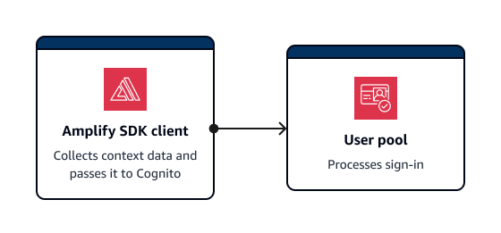
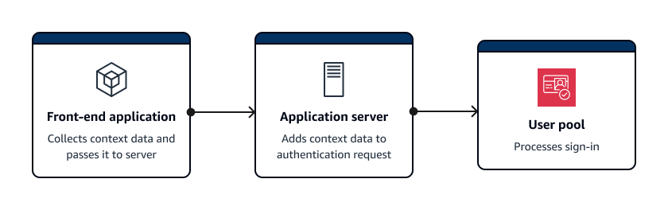

# Collecting data for

threat protection in applications

Amazon Cognito [adaptive
authentication](cognito-user-pool-settings-adaptive-authentication.md "cognito-user-pool-settings-adaptive-authentication.md") evaluates risk levels for attempted account takeover from contextual
details of users' sign-in attempts. Your application must add _context data_ to API requests so that Amazon Cognito threat protection can more
accurately evaluate risk. Context data is information like IP address, browser agent, device
information, and request headers that provides contextual information about how a user
connected to your user pool.

The central responsibility of an application that submits this context to Amazon Cognito is an
`EncodedData` parameter in authentication requests to user pools. To add this
data to your requests, you can implement Amazon Cognito with an SDK that automatically generates this
information for you, or you can implement a module for JavaScript, iOS, or Android that
collects this data. _Client-only_ applications that make
direct requests to Amazon Cognito must implement AWS Amplify SDKs. _Client-server_ applications that have an intermediate server or API component
must implement a separate SDK module.

In the following scenarios, your authentication front end manages user context data
collection without any additional configuration:

- Managed login automatically collects and submits context data to threat
  protection.
- All AWS Amplify libraries have context-data collection built into their
  authentication methods.

## Submitting user

context data in client-only applications with Amplify



Amplify SDKs support mobile clients that authenticate with Amazon Cognito directly. Clients
of this kind make direct API requests to Amazon Cognito public API operations. Amplify clients
automatically collect context data for threat protection by default.

Amplify applications with JavaScript are an exception. They require the addition of
a [JavaScript module](#user-pool-settings-viewing-threat-protection-app-additional-resources-js "#user-pool-settings-viewing-threat-protection-app-additional-resources-js") that collects user context data.

Typically, an application in this configuration uses unauthenticated API operations
like [InitiateAuth](../../../cognito-user-identity-pools/latest/APIReference/API_InitiateAuth.md "../../../cognito-user-identity-pools/latest/APIReference/API_InitiateAuth.md") and [RespondToAuthChallenge](../../../cognito-user-identity-pools/latest/APIReference/API_RespondToAuthChallenge.md "../../../cognito-user-identity-pools/latest/APIReference/API_RespondToAuthChallenge.md"). The [UserContextData](../../../cognito-user-identity-pools/latest/APIReference/API_UserContextDataType.md "../../../cognito-user-identity-pools/latest/APIReference/API_UserContextDataType.md") object helps evaluate risks more accurately for these
operations. The Amplify SDKs add device and session information to an
`EncodedData`parameter of `UserContextData`.

## Collecting

context data in client-server applications

Some applications have a front-end tier that collects user authentication data and an
application back-end tier that submits authentication requests to Amazon Cognito. This is a common
architecture in webservers and applications backed by microservices. In these
applications, you must import a public context-data collection library.



Typically, an application server in this configuration uses authenticated API
operations like [AdminInitiateAuth](../../../cognito-user-identity-pools/latest/APIReference/API_AdminInitiateAuth.md "../../../cognito-user-identity-pools/latest/APIReference/API_AdminInitiateAuth.md") and [AdminRespondToAuthChallenge](../../../cognito-user-identity-pools/latest/APIReference/API_AdminRespondToAuthChallenge.md "../../../cognito-user-identity-pools/latest/APIReference/API_AdminRespondToAuthChallenge.md"). The [ContextData](../../../cognito-user-identity-pools/latest/APIReference/API_AdminInitiateAuth.md#CognitoUserPools-AdminInitiateAuth-request-ContextData "../../../cognito-user-identity-pools/latest/APIReference/API_AdminInitiateAuth.md#CognitoUserPools-AdminInitiateAuth-request-ContextData") object helps Amazon Cognito evaluate risks more accurately for these
operations. . The contents of `ContextData` are the encoded data that your
front end passed to your server, and additional details from the user's HTTP request to
your server. These additional context details, like the HTTP headers and IP address,
provide your application server with the characteristics of the user's environment.

Your application server might also do sign-in with unauthenticated API operations like
[InitiateAuth](../../../cognito-user-identity-pools/latest/APIReference/API_InitiateAuth.md "../../../cognito-user-identity-pools/latest/APIReference/API_InitiateAuth.md") and [RespondToAuthChallenge](../../../cognito-user-identity-pools/latest/APIReference/API_RespondToAuthChallenge.md "../../../cognito-user-identity-pools/latest/APIReference/API_RespondToAuthChallenge.md"). The [UserContextData](../../../cognito-user-identity-pools/latest/APIReference/API_InitiateAuth.md#CognitoUserPools-InitiateAuth-request-UserContextData "../../../cognito-user-identity-pools/latest/APIReference/API_InitiateAuth.md#CognitoUserPools-InitiateAuth-request-UserContextData") object informs threat protection risk analysis in these
operations. The operations in the available public context data collection libraries add
security information to the `EncodedData` parameter in authentication requests.
Additionally, configure your user pool to accept additional context data and add the
user’s source IP to the `IpAddress` parameter of
`UserContextData`.

###### To add context data to client-server applications

1. In your front-end application, collect encoded context data from the client with
   an [iOS,
   Android, or JavaScript module](#user-pool-settings-viewing-threat-protection-app-additional-resources "#user-pool-settings-viewing-threat-protection-app-additional-resources").
2. Pass the encoded data and the details of the authentication request to your
   application server.
3. In your application server, extract the user's IP address, relevant HTTP headers,
   requested server name, and requested path from the HTTP request. Populate these values
   to the [ContextData](../../../cognito-user-identity-pools/latest/APIReference/API_AdminInitiateAuth.md#CognitoUserPools-AdminInitiateAuth-request-ContextData "../../../cognito-user-identity-pools/latest/APIReference/API_AdminInitiateAuth.md#CognitoUserPools-AdminInitiateAuth-request-ContextData") parameter of your API request to Amazon Cognito.
4. Populate the `EncodedData` parameter of `ContextData` in
   your API request with the encoded device data that your SDK module collected. Add this
   context data to the authentication request.

## Context data libraries for client-server applications

### JavaScript

The `amazon-cognito-advanced-security-data.min.js` module collects
`EncodedData` that you can pass to your application server.

Add the `amazon-cognito-advanced-security-data.min.js` module to your
JavaScript configuration. Replace `<region>` with an AWS Region from the
following list: `us-east-1`, `us-east-2`, `us-west-2`,
`eu-west-1`, `eu-west-2`, or `eu-central-1`.

```
<script src="https://amazon-cognito-assets.<region>.amazoncognito.com/amazon-cognito-advanced-security-data.min.js"></script>
```

To generate an `encodedContextData` object that you can use in the
`EncodedData` parameter, add the following to your JavaScript application
source:

```
var encodedContextData = AmazonCognitoAdvancedSecurityData.getData(_username, _userpoolId, _userPoolClientId);
```

### iOS/Swift

To generate context data, iOS applications can integrate the [Mobile SDK for iOS](https://github.com/aws-amplify/aws-sdk-ios/tree/main "https://github.com/aws-amplify/aws-sdk-ios/tree/main")
module [AWSCognitoIdentityProviderASF](https://github.com/aws-amplify/aws-sdk-ios/tree/main/AWSCognitoIdentityProviderASF "https://github.com/aws-amplify/aws-sdk-ios/tree/main/AWSCognitoIdentityProviderASF").

To collect encoded context data for threat protection, add the following snippet to
your application:

```
import AWSCognitoIdentityProviderASF

let deviceId = getDeviceId()
let encodedContextData = AWSCognitoIdentityProviderASF.userContextData(
                            userPoolId,
                            username: username,
                            deviceId: deviceId,
                            userPoolClientId: userPoolClientId)

/**
 * Reuse DeviceId from keychain or generate one for the first time.
 */
func getDeviceId() -> String {
    let deviceIdKey = getKeyChainKey(namespace: userPoolId, key: "AWSCognitoAuthAsfDeviceId")

   if let existingDeviceId = self.keychain.string(forKey: deviceIdKey) {
        return existingDeviceId
    }

    let newDeviceId = UUID().uuidString
    self.keychain.setString(newDeviceId, forKey: deviceIdKey)
    return newDeviceId
}

/**
 * Get a namespaced keychain key given a namespace and key
 */
func getKeyChainKey(namespace: String, key: String) -> String {
    return "\(namespace).\(key)"
}
```

### Android

To generate context data, Android applications can integrate the [Mobile SDK for Android](https://github.com/aws-amplify/aws-sdk-android/tree/main "https://github.com/aws-amplify/aws-sdk-android/tree/main")
module [aws-android-sdk-cognitoidentityprovider-asf](https://github.com/aws-amplify/aws-sdk-android/tree/main/aws-android-sdk-cognitoidentityprovider-asf "https://github.com/aws-amplify/aws-sdk-android/tree/main/aws-android-sdk-cognitoidentityprovider-asf").

To collect encoded context data for threat protection, add the following snippet to
your application:

```
UserContextDataProvider provider = UserContextDataProvider.getInstance();
// context here is android application context.
String encodedContextData = provider.getEncodedContextData(context, username, userPoolId, userPoolClientId);
```
