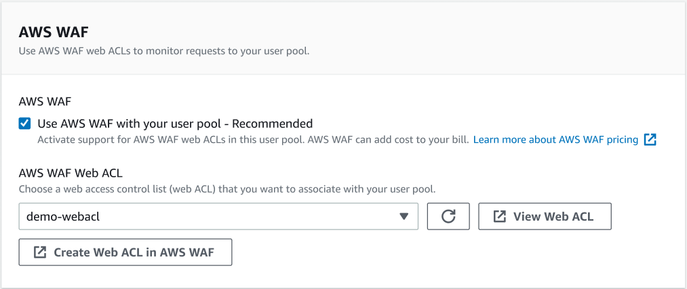

# Associate an AWS WAF web ACL with a user pool

AWS WAF is a web application firewall. With an AWS WAF web access control list (web ACL),
you can protect your user pool from unwanted requests to your classic hosted UI, managed
login, and Amazon Cognito API service endpoints. A web ACL gives you fine-grained control over all
of the HTTPS web requests that your user pool responds to. For more information about AWS WAF
web ACLs, see [Managing and using a web access control list (web ACL)](../../../waf/latest/developerguide/web-acl.md "../../../waf/latest/developerguide/web-acl.md") in the _AWS WAF Developer Guide_.

When you have an AWS WAF web ACL associated with a user pool, Amazon Cognito forwards selected
non-confidential headers and contents of requests from your users to AWS WAF. AWS WAF inspects the
contents of the request, compares it to the rules that you specified in your web ACL, and
returns a response to Amazon Cognito.

## Things to know about AWS WAF web ACLs and

Amazon Cognito

- You can't configure web ACL rules to match on personally identifiable information
  (PII) in user pool requests, for example usernames, passwords, phone numbers, or email
  addresses. This data won't be available to AWS WAF. Instead, configure your web ACL rules
  to match on session data in the headers, path, and body like IP addresses, browser
  agents, and requested API operations.
- Web ACL rule conditions can only return custom block responses to users' **first** request to a user-interactive managed login page. When
  subsequent connections match a custom block response condition, they return your custom
  status code, header, and redirect responses, but a default block message.
- Requests blocked by AWS WAF do not count towards the request rate quota for any
  request type. The AWS WAF handler is called before the API-level throttling
  handlers.
- When you create a web ACL, a small amount of time passes before the web ACL has
  fully propagated and is available to Amazon Cognito. The propagation time can be from a few
  seconds to a number of minutes. AWS WAF returns a [`WAFUnavailableEntityException`](../../../waf/latest/APIReference/API_AssociateWebACL.md#API_AssociateWebACL_Errors "../../../waf/latest/APIReference/API_AssociateWebACL.md#API_AssociateWebACL_Errors") when you attempt to associate a
  web ACL before it has fully propagated.
- You can associate one web ACL with each user pool.
- Your request might result in a payload that is larger than the limits of what AWS WAF
  can inspect. See [Oversize
  request component handling](../../../waf/latest/developerguide/waf-rule-statement-oversize-handling.md "../../../waf/latest/developerguide/waf-rule-statement-oversize-handling.md") in the _AWS WAF Developer
  Guide_ to learn how to configure how AWS WAF handles oversize requests from
  Amazon Cognito.
- You can’t associate a web ACL that uses AWS WAF [Fraud Control
  account takeover prevention (ATP)](../../../waf/latest/developerguide/waf-atp.md "../../../waf/latest/developerguide/waf-atp.md") with an Amazon Cognito user pool. The ATP feature is
  in the `AWS-AWSManagedRulesATPRuleSet` managed rule group. Before you
  associate a web ACL with a user pool, be sure that it doesn’t use this managed rule
  group.
- When you have an AWS WAF web ACL associated with a user pool, and a rule in your
  web ACL presents a CAPTCHA, this can cause an unrecoverable error in managed login TOTP
  registration. To create a rule that has a CAPTCHA action and doesn't affect managed
  login TOTP, see [Configuring your AWS WAF web ACL for managed login TOTP
  MFA](user-pool-settings-mfa-totp.md#totp-waf "user-pool-settings-mfa-totp.md#totp-waf").

AWS WAF inspects requests to the following endpoints.

**Managed login and the classic hosted UI**

Requests to all endpoints in the [User pool endpoints and
managed login reference](cognito-userpools-server-contract-reference.md "cognito-userpools-server-contract-reference.md").

**Public API operations**

Requests from your app to the Amazon Cognito API that don't use AWS credentials to
authorize. This includes API operations like [InitiateAuth](../../../cognito-user-identity-pools/latest/APIReference/API_InitiateAuth.md "../../../cognito-user-identity-pools/latest/APIReference/API_InitiateAuth.md"), [RespondToAuthChallenge](../../../cognito-user-identity-pools/latest/APIReference/API_RespondToAuthChallenge.md "../../../cognito-user-identity-pools/latest/APIReference/API_RespondToAuthChallenge.md"), and [GetUser](../../../cognito-user-identity-pools/latest/APIReference/API_GetUser.md "../../../cognito-user-identity-pools/latest/APIReference/API_GetUser.md"). The API operations that are in scope of AWS WAF don't require
authentication with AWS credentials. They are unauthenticated, or authorized with a
session string or access token. For more information, see [List of API operations grouped by authorization
model](authentication-flows-public-server-side.md#user-pool-apis-auth-unauth "authentication-flows-public-server-side.md#user-pool-apis-auth-unauth").

You can configure the rules in your web ACL with rule actions that
**Count**, **Allow**, **Block**, or
present a **CAPTCHA** in response to a request that matches a rule. For more
information, see [AWS WAF rules](../../../waf/latest/developerguide/waf-rules.md "../../../waf/latest/developerguide/waf-rules.md") in the _AWS WAF Developer Guide_.
Depending on the rule action, you can customize the response that Amazon Cognito returns to your
users.

###### Important

Your options to customize the error response depends on the way you make an API
request.

- You can customize the error code and response body of managed login requests. You
  can only present a CAPTCHA for your user to solve in managed login.
- For requests that you make with the Amazon Cognito [user pools
  API](../../../cognito-user-identity-pools/latest/APIReference/Welcome.md "../../../cognito-user-identity-pools/latest/APIReference/Welcome.md"), you can customize the response body of a request that receives a
  **Block** response. You can also specify a custom error code in the
  range 400–499.
- The AWS Command Line Interface (AWS CLI) and the AWS SDKs return a `ForbiddenException`
  error to requests that produce a **Block** or **CAPTCHA** response.

## Associating a web ACL with your user pool

To work with a web ACL in your user pool, your AWS Identity and Access Management (IAM) principal must have the
following Amazon Cognito and AWS WAF permissions. For information about AWS WAF permissions, see [AWS WAF
API permissions](../../../waf/latest/developerguide/waf-api-permissions-ref.md "../../../waf/latest/developerguide/waf-api-permissions-ref.md") in the _AWS WAF Developer
Guide_.

JSON

```
`{
 "Version":"2012-10-17",
 "Statement": [
 {
 "Sid": "AllowWebACLUserPool",
 "Effect": "Allow",
 "Action": [
 "cognito-idp:ListResourcesForWebACL",
 "cognito-idp:GetWebACLForResource",
 "cognito-idp:AssociateWebACL"
 ],
 "Resource": [
 "arn:aws:cognito-idp:*:`123456789012`:userpool/*"
 ]
 },
 {
 "Sid": "AllowWebACLUserPoolWAFv2",
 "Effect": "Allow",
 "Action": [
 "wafv2:ListResourcesForWebACL",
 "wafv2:AssociateWebACL",
 "wafv2:DisassociateWebACL",
 "wafv2:GetWebACLForResource"
 ],
 "Resource": "arn:aws:wafv2:*:`123456789012`:*/webacl/*/*"
 },
 {
 "Sid": "DisassociateWebACL1",
 "Effect": "Allow",
 "Action": "wafv2:DisassociateWebACL",
 "Resource": "*"
 },
 {
 "Sid": "DisassociateWebACL2",
 "Effect": "Allow",
 "Action": [
 "cognito-idp:DisassociateWebACL"
 ],
 "Resource": [
 "arn:aws:cognito-idp:*:`123456789012`:userpool/*"
 ]
 }
 ]
}`

```

Though you must grant IAM permissions, the listed actions are permission-only and
don't correspond to any [API
operation](../../../cognito-user-identity-pools/latest/APIReference/Welcome.md "../../../cognito-user-identity-pools/latest/APIReference/Welcome.md").

###### To activate AWS WAF for your user pool and associate

a web ACL

1. Sign in to the [Amazon Cognito console](https://console.aws.amazon.com/cognito/home "https://console.aws.amazon.com/cognito/home") .
2. In the navigation pane, choose **User Pools**, and choose the user
   pool you want to edit.
3. Choose the **AWS WAF** tab in the **Security**
   section.
4. Choose **Edit**.
5. Select **Use AWS WAF with your user pool**.

 6. Choose an **AWS WAF Web ACL** that you already created, or choose
**Create web ACL in AWS WAF** to create one in a new AWS WAF session in
the AWS Management Console. 7. Choose **Save changes**.

To programmatically associate a web ACL with your user pool in the AWS Command Line Interface or an SDK,
use [AssociateWebACL](../../../waf/latest/APIReference/API_AssociateWebACL.md "../../../waf/latest/APIReference/API_AssociateWebACL.md") from the AWS WAF API. Amazon Cognito doesn't have a separate API operation
that associates a web ACL.

## Testing and logging AWS WAF web

ACLs

When you set a rule action to **Count** in your web ACL, AWS WAF adds the
request to a count of requests that match the rule. To test a web ACL with your user pool,
set rule actions to **Count** and consider the volume of requests that
match each rule. For example, if a rule that you want to set to a **Block**
action matches a large number of requests that you determine to be normal user traffic, you
might need to reconfigure your rule. For more information, see [Testing and tuning your AWS WAF
protections](../../../waf/latest/developerguide/web-acl-testing.md "../../../waf/latest/developerguide/web-acl-testing.md") in the _AWS WAF Developer
Guide._

You can also configure AWS WAF to log request headers to an Amazon CloudWatch Logs log group, an
Amazon Simple Storage Service (Amazon S3) bucket, or an Amazon Data Firehose. You can identify the Amazon Cognito requests that you make
with the user pools API by the `x-amzn-cognito-client-id` and
`x-amzn-cognito-operation-name`. Managed login requests only include the
`x-amzn-cognito-client-id` header. For more information, see [Logging web ACL
traffic](../../../waf/latest/developerguide/logging.md "../../../waf/latest/developerguide/logging.md") in the _AWS WAF Developer Guide_.

AWS WAF web ACLs are available in all user pool [feature plans](cognito-sign-in-feature-plans.md "cognito-sign-in-feature-plans.md"). The security features of
AWS WAF complement Amazon Cognito threat protection. You can activate both features in a user pool.
AWS WAF bills separately for the inspection of user pool requests. For more information, see
[AWS WAF Pricing](https://aws.amazon.com/waf/pricing "https://aws.amazon.com/waf/pricing").

Logging AWS WAF request data is subject to additional billing by the service where you
target your logs. For more information, see [Pricing for logging web ACL
traffic information](../../../waf/latest/developerguide/logging.md#logging-pricing "../../../waf/latest/developerguide/logging.md#logging-pricing") in the _AWS WAF Developer
Guide_.
